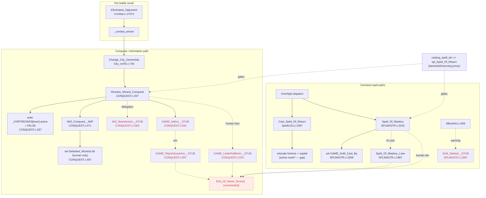

# BRA — Endgame (Win/Lose) Testing Architecture Decision

**Status:** Decided (scaffolding-first) — working record, open questions flagged inline
**Date:** 2026-07-17
**Author role:** Business Requirements Analyst (decision record)
**Related:** `BRA-Combat-Testing.md`, `PRD-Combat-Testing.md`, `PLAN-Combat-Testing.md`

This document works through *what is involved* in finishing and testing the game's win/lose paths —
banishment, defeat, Spell of Return, Spell of Mastery — for both the human player and the AI. It
records the goal, the current-state finding that reshaped the effort, the criteria weighed, the options
for reaching each transition, and the decision to build test scaffolding first. It is a decision record
and a working scratchpad for open questions, not an implementation plan (that will be a follow-on
`PLAN-Endgame-Testing.md`).

It inherits one principle wholesale from `BRA-Combat-Testing.md`: **test code on the substrate it was
designed for.** State-transition logic is screen-free → headless/assertable; cutscenes render →
windowed/observed.

---

## 1. The ultimate goal

"Win/lose testing" is not one deliverable. Like combat, the endgame has **two natures**:

- **Endgame logic** — the state transitions: a wizard's fortress going inactive on banishment, the
  `Defeated_Wizards` bitfield recording an elimination, Spell of Return relocating a fortress, Spell of
  Mastery flagging the caster and branching to win-or-lose. Deterministic given (game state, RNG seed);
  *assertable*.
- **Endgame presentation** — the cutscenes: the limbo-fall banishment animation, the victory animation,
  the Spell-of-Mastery sphere sequence, the "you have been defeated / you are triumphant" battle
  scrolls, the game-over/Hall-of-Fame transition. *Visual*; verified by watching, not by asserting
  field values.

The goal is therefore threefold, mirroring the combat decision:

1. **Detect regressions in endgame outcomes** automatically, deterministically, on every build.
2. **Provide a harness to set up and observe a specific endgame** — to develop, debug, and visually
   verify the banishment/victory/defeat sequences.
3. **Localize which transition changed** when an outcome regression fires.

---

## 2. Current-state finding (the fact that reshaped the effort)

> **SUPERSEDED 2026-07-20 — the blocker below is gone.** `EOG_HACK` (see §10) landed after this section
> was written: `End_Of_Game_Score()` is live on the Spell-of-Mastery paths, `Respawn`/`GAME_EXE_Swap` is
> commented out at every exit, and `magic_master_idx` + `Get_Winner()` carry the ending back to
> `Screen_Control`. Terminal transitions **are** now reachable on the SoM win and SoM lose paths. The
> conquest paths still need their own pass. Line references in this section predate `EOG_HACK` and are
> stale (e.g. `Spell_Of_Mastery` is now [SPLMASTR.c:2016](../../MoM/src/SPLMASTR.c#L2016),
> `Spell_Of_Mastery_Lose` [:1824](../../MoM/src/SPLMASTR.c#L1824)). Retained as the historical finding
> that shaped the scaffolding-first decision.

**The state-tracking layer is implemented and testable today. The terminal transitions are not — every
`End_Of_Game_Score()` call is commented out, so no code path currently ends the game.** Verified in-source
2026-07-17:

### Implemented (assertable now)

| Piece | Location | Notes |
|---|---|---|
| `Change_City_Ownership` → conquest bridge | [City_ovr55.c:730](../../MoM/src/City_ovr55.c#L730) → [:780](../../MoM/src/City_ovr55.c#L780) | calls `Resolve_Wizard_Conquest` |
| `Resolve_Wizard_Conquest` — counts loser cities, drives banish path | [CONQUEST.c:207](../../MoM/src/CONQUEST.c#L207) | WIP but functional for state |
| `_FORTRESSES[loser].active = ST_FALSE` on banishment | [CONQUEST.c:267](../../MoM/src/CONQUEST.c#L267) | the concrete "wizard out" mutation |
| `Defeated_Wizards` bit set when **human** conquers | [CONQUEST.c:497](../../MoM/src/CONQUEST.c#L497) | AI-conqueror path does NOT set it — see §7 |
| "banishes" vs "defeats" message by city count | [CONQUEST.c:551](../../MoM/src/CONQUEST.c#L551) / [:555](../../MoM/src/CONQUEST.c#L555) | `cnst_Conquest_Msg3` / `_Msg4` |
| `Cast_Spell_Of_Return` relocates fortress + capital | [Spells132.c:1697](../../MoM/src/Spells132.c#L1697) | dispatched from [OverSpel.c:1423](../../MoM/src/OverSpel.c#L1423) |
| `Spell_Of_Mastery` sets `GAME_SoM_Cast_By`, branches | [SPLMASTR.c:2202](../../MoM/src/SPLMASTR.c#L2202) / [:2209](../../MoM/src/SPLMASTR.c#L2209) | dispatched from [OverSpel.c:811](../../MoM/src/OverSpel.c#L811) |
| `Spell_Of_Mastery_Lose` (AI cast SoM → human loses) | [SPLMASTR.c:1887](../../MoM/src/SPLMASTR.c#L1887) | entered at [SPLMASTR.c:2217](../../MoM/src/SPLMASTR.c#L2217) |
| `Eliminated_Opponent` (per-battle wipe check) | [Combat.c:17074](../../MoM/src/Combat.c#L17074) | feeds `_combat_winner` |
| Battle scroll "defeated" / "triumphant" | [Combat.c:22452](../../MoM/src/Combat.c#L22452) / [:22446](../../MoM/src/Combat.c#L22446) | presentation |

### Stubbed / commented (blocked — cannot assert a terminal ending yet)

| Function | Location | State |
|---|---|---|
| `GAME_IsWon__STUB` — "no active AI left" | [CONQUEST.c:942](../../MoM/src/CONQUEST.c#L942) | body is `return ST_FALSE;` |
| `WIZ_Banishment__STUB` — banish/return decision, spell awards | [CONQUEST.c:1003](../../MoM/src/CONQUEST.c#L1003) | body is `return ST_FALSE;` |
| `GAME_PlayVictoryAnim__STUB` | [CONQUEST.c:957](../../MoM/src/CONQUEST.c#L957) | empty |
| `GAME_LimboFallAnim__STUB` | [CONQUEST.c:976](../../MoM/src/CONQUEST.c#L976) | empty |
| `SoM_Started__STUB` — "X has started casting SoM" warning | [SPLMASTR.c:1987](../../MoM/src/SPLMASTR.c#L1987) | partial (draw loop empty) |
| `End_Of_Game_Score()` call sites | CONQUEST.c:430 / :445, SPLMASTR.c:1946 / :2340 | all `// End_Of_Game_Score();` / `// SPELLY` |

**Consequence for testing:** we can pin the *intermediate* state the game moves through (fortress
active flag, `Defeated_Wizards`, `casting_spell_idx`, fortress relocation, `GAME_SoM_Cast_By`), but we
cannot yet assert "the game ended and player X won" because the code never reaches that. The tests we
build now characterize the implemented layer and stand as **red markers** the eventual stub-finishing
work will turn green.

---

## 3. Criteria considered

| Criterion | Why it matters |
|---|---|
| **Determinism** | A win/lose test that varies run-to-run under a fixed seed is not a regression test. Endgame paths draw RNG (banishment forfeit rolls, spell awards) — seed pinning is mandatory. |
| **Automatability** | Can it run pass/fail in CI / pre-push without a human? |
| **Substrate fidelity** | Logic headless, cutscenes windowed. Do not force a victory animation through `Platform_Headless` (the exact mistake `BRA-Combat-Testing.md` records). |
| **Reachability** | *New for endgame:* how do you get the game into a near-defeat / mid-banishment / about-to-win state cheaply and deterministically? This is the crux (§4). |
| **Reuse** | HeMoM fixtures, `savedump` + `check_save_fields`, `.hms`/`.RMR`, `refresh_asserts.py`. |
| **Observability** | Can a developer *watch* the banishment/victory sequence, not just read a field diff? |
| **Maintenance cost** | Seed-stream sensitivity; golden churn; brittleness to unrelated RNG-draw changes. |

### Criteria excluded

- **Pixel-exact cutscene comparison** — out of scope; observed, optionally replay-log compared.
- **Exhaustive per-spell coverage** — structural coverage of the 8 endgame cells first.

---

## 4. The reachability question (the crux)

The decisive new question versus combat testing: **how do we drive the game to each endgame transition,
headlessly and deterministically, without playing (or rendering) a full game?**

### Option A — Patch-and-observe
Binary-patch a save into the *post-condition* (fortress already inactive, `Defeated_Wizards` bit
already set), load it, and assert the consumers behave (Magic screen draws a grey gem, next-turn skips
the wizard, etc.).

- **Pros:** trivial, fully headless, deterministic, no combat needed.
- **Cons:** tests the *readers* of the state, not the *transition that produces it*. Won't catch a
  regression in `Resolve_Wizard_Conquest` itself.

### Option B — Patch-to-brink + drive a real capture
Patch a wizard down to one city, then script an actual combat that captures it, letting
`Change_City_Ownership → Resolve_Wizard_Conquest` fire naturally.

- **Pros:** exercises the real transition end-to-end.
- **Cons:** needs the tactical/strategic combat substrate (windowed per `BRA-Combat-Testing.md`);
  brittle; slow; couples endgame tests to combat determinism.

### Option C — HeMoM direct-invoke hook (recommended for the logic layer)
Add a headless entry mode to `HeMoM.c`, **exactly analogous to the existing `--combat` mode**
([HeMoM.c `--combat`](../../src/HeMoM.c)), that loads a patched save and calls one endgame entry point
directly — `Resolve_Wizard_Conquest`, `Cast_Spell_Of_Return`, `Spell_Of_Mastery`, or `GAME_IsWon__STUB` — then
dumps the resulting save for `check_save_fields`.

- **Pros:** exercises the real transition function on the correct (screen-free) substrate;
  deterministic; reuses `g_load_save_gam_name_override`, `--dump-save`, `--seed1`; no combat coupling.
- **Cons:** invokes the function out of its normal call context — must patch a *self-consistent*
  precondition (e.g. the loser genuinely owns the city being lost) or the function reads stale state.
  Functions that branch into cutscene draws must be entered with rendering guarded/skipped.
- **Verdict:** the right harness for the logic layer. Cutscenes stay in the windowed layer (Option-B-ish
  observation), never asserted headlessly.

**Chosen:** **C for the state-transition layer, patch-and-observe (A) where a transition's normal call
context is too entangled to synthesize, windowed observation for cutscenes.** B is available but not a
default.

---

## 5. Decision — three layers

| Layer | Nature tested | Substrate | Harness | Determinism / mode | When run |
|---|---|---|---|---|---|
| **Endgame-state regression** | Transition *logic* (banish, defeat, return, mastery flags) | Headless | HeMoM endgame direct-invoke hook + patched save + dump + `check_save_fields` | Seeded, pass/fail | Every build / pre-push / CI |
| **Endgame-cutscene harness** | *Presentation* (limbo fall, victory anim, SoM sphere, scrolls) | Windowed (real `Platform`) | `demo_vga`-style target / `ReMoMber --scenario` | Observed; `.RMR` replay for repro | Development, debugging, visual verification |
| **Endgame predicates** | Individual decisions (`GAME_IsWon`, banish-vs-defeat) | None (unit test) | GTest, synthesized wizard/city state | Seeded, pass/fail | Every build — *after* the stubs are reconstructed |

Guiding principle (inherited): **test code on the substrate it was designed for.**

---

## 6. Scenario matrix (8 cells)

Subject × condition. "Blocked-by-stub" names what the cell *cannot* yet assert.

| # | Subject | Condition | Trigger (layer) | Assert now (implemented) | Blocked-by-stub |
|---|---|---|---|---|---|
| 1 | Human | Banished (non-last city lost) | `Resolve_Wizard_Conquest` (C) | `fortress[H].active=0`; human still owns ≥1 city | `GAME_LimboFallAnim`, `End_Of_Game_Score` |
| 2 | AI | Banished | `Resolve_Wizard_Conquest` (C) | `fortress[AI].active=0`; human `Defeated_Wizards` bit set | `WIZ_Banishment` decision |
| 3 | Human | Defeated (last city lost) | `Resolve_Wizard_Conquest` (C) | `fortress[H].active=0`; human owns 0 cities | `End_Of_Game_Score` (human loss) |
| 4 | AI | Defeated (last AI) → **elimination win** | `Resolve_Wizard_Conquest` + `GAME_IsWon` (C) | AI `active=0`; last-AI precondition | `GAME_IsWon__STUB`, `GAME_PlayVictoryAnim`, `End_Of_Game_Score` |
| 5 | Human | Spell of Return | `Cast_Spell_Of_Return` (C) | fortress/capital relocated to target; **verify `active` reset** (§7 bug) | — |
| 6 | AI | Spell of Return | `Cast_Spell_Of_Return` (C, AI path) | AI fortress relocated | — |
| 7 | Human | Spell of Mastery (win) | `Spell_Of_Mastery` (C) | `GAME_SoM_Cast_By=H`; SoM enchantment/relations set | victory finalize, `End_Of_Game_Score` |
| 8 | AI | Spell of Mastery (human loses) | `Spell_Of_Mastery` (C) | `GAME_SoM_Cast_By=AI`; `Spell_Of_Mastery_Lose` reached | `GAME_LimboFallAnim`, `End_Of_Game_Score` |

State fields and their save offsets (player *i* base `P = 2536 + 1224*i`, all little-endian; from
[Game_Save_Dump.c](../../src/Game_Save_Dump.c)): `casting_spell_idx` `P+0x52` (Return=214, Mastery=213),
`Defeated_Wizards` `P+0x354`, gold `P+0x356`, mana `P+0x25C`; fortress *i* `26104+4*i` byte `+3`
(`active`); unit *k* `46900+32*k` byte `+3` (`owner_idx`); city *k* `35500+114*k` byte `+0x12`.

---

## 7. Open questions / gaps (need user input or verification)

1. **Spell of Return does not reappear to reset `_FORTRESSES[player_idx].active = ST_TRUE`.** A wizard
   who returns may remain flagged inactive. Is this an OGBUG (preserve, characterize) or a
   reconstruction gap (the reset was in the disassembly and got dropped)? Scenario 5 is designed to
   surface it. **Decision needed before finishing the stubs**, not before scaffolding.
2. **`Defeated_Wizards` bit is set only for the human conqueror** ([CONQUEST.c:497](../../MoM/src/CONQUEST.c#L497)).
   Is the AI-conqueror omission OG-faithful, or does the bit belong on every conqueror? Affects
   scenario 2's assertion and any future `GAME_IsWon` reconstruction.
3. **Sequencing of the stub-finishing follow-on.** Reconstructing `GAME_IsWon__STUB` is the smallest
   unblock that makes the *elimination win* (scenario 4) assertable end-to-end. Worth doing first in the
   follow-on `PLAN`, or leave all stubs for one batch?
4. **Base fixture per scenario.** Reuse `assets/SAVECMBT.GAM`, or capture a purpose-built multi-wizard
   near-endgame seed so the last-city / last-AI preconditions are natural rather than heavily patched?
5. **Cutscene observation scope.** Do we want `.RMR` captures of the victory / limbo-fall sequences now
   (as observe-only assets), or defer until the finalizers are reconstructed and there is something to
   watch past the current stub?

---

## 8. What did and did not fit the goal

**Fit:**
- Endgame-state transitions via a HeMoM direct-invoke hook: deterministic, headless, reuses the whole
  save-dump/assert pipeline. Clean fit for regression detection of the implemented layer.
- Windowed cutscene observation modeled on `demo_vga` / `ReMoMber --scenario`: clean fit for watching
  the sequences once their finalizers exist.

**Did not fit:**
- Asserting a terminal "game won/lost" headlessly *today* — blocked by the `End_Of_Game_Score` stubs. Recorded
  as blocked, not forced.
- Driving every endgame via full scripted playthroughs — too slow/brittle; reachability is solved by
  patching + direct-invoke, not by playing the whole game.

---

## 9. Lesson carried from BRA-Combat-Testing

Match each nature to its designed substrate; don't collapse them into one mold. The endgame adds a
second trap beyond the combat one: because the terminal transitions are stubbed, it is tempting to
"just finish them" to have something to test. The scaffolding-first decision resists that — it builds
the deterministic rig against the implemented layer, so that when the stubs *are* reconstructed the
regression net already exists and the finishing work is validated as it lands, not after.

---

## 10. `EOG_HACK` decisions (2026-07-20)

Supersedes §2's blocker. `Respawn`/`GAME_EXE_Swap` is commented out at every endgame exit; the ending is
carried to `Screen_Control` by `magic_master_idx` + `Get_Winner()`. Spec: `PRD-Endgame-Return-To-Menu-Screen-State.md`.
Recorded here so these are not re-derived.

### 10.1 The governing principle — what `Respawn` used to do for free

`GAME_EXE_Swap` replaced the process. **Everything below an endgame exit was dead code, and every global the
endgame dirtied was cleaned by process death.** Removing the swap threatens both halves — but only one has
produced a confirmed defect:

- **Control flow — CONFIRMED, one instance.** Code below the exit now runs. `Spell_Of_Mastery_Lose()` used
  to never return, so the defeat path fell straight into the victory parade, `Win_Animation`, and a second
  `End_Of_Game_Score`. Fixed by restoring one-way-door semantics: `return;` at
  [SPLMASTR.c:2029](../../MoM/src/SPLMASTR.c#L2029). (The asm proves the never-return: IDA renders
  `Spell_Of_Mastery`'s whole epilogue as unreachable raw bytes, `Spell_Of_Mastery.asm:239-247`.) Same root
  cause as the `¿ OGBUG unreachable code ?` note at [OverSpel.c:812](../../MoM/src/OverSpel.c#L812), which
  `EOG_HACK` made reachable.
- **State teardown — NO CONFIRMED INSTANCE.** The theory is sound but has not produced a real defect, and
  the one case that looked like it did was a mis-diagnosis (see §10.3). The endgame presenters clean up
  after themselves, which is why: `End_Of_Game_Score` ends its audio handling with
  `Stop_All_Sounds__STUB()` ([SCORE.c:521](../../MoM/src/SCORE.c#L521), nothing restarts before the function
  ends at :562), and `Conquest_Animation` (384 → 525/540), `Win_Animation` (831 → 914/929) and
  `Lose_Animation` (983 → 1043/1058) each stop their music and restore background music before returning.
  Because every endgame path terminates through those, audio in particular is already settled before
  control reaches a commented `Respawn`.

**Audit method for each remaining exit** — ask (a) what now executes below it, and (b) what global stays
dirty. **Answering (b) requires reading the callees, not just the exit function.** That is the step that was
skipped in §10.3.

**Audited 2026-07-20 — `Resolve_Wizard_Conquest` ([CONQUEST.c:191](../../MoM/src/CONQUEST.c#L191)): clean.**
Both commented `Respawn` sites ([:335](../../MoM/src/CONQUEST.c#L335), [:344](../../MoM/src/CONQUEST.c#L344))
are the last statement in their block at the end of the function, so nothing runs below them in-function;
and the audio is self-managed by the three animations above. The remaining exposure — the caller continuing
after the return — is the PRD's deliberate **let-the-turn-finish** design, already tracked as the PRD open
item at :149, not a defect of this class.

**Audited 2026-07-20 — the remaining two sites are not endgame exits.** Both are clean for different reasons:

- [LoadScr.c:463](../../MoM/src/LoadScr.c#L463) — the load-screen **Quit** button, not an ending. Its
  replacement sits directly below it (`current_screen = scr_Main_Menu_Screen; leave_screen_flag = ST_TRUE;`).
- [NewGame.c:1619](../../MoM/src/NewGame.c#L1619) — `GAME_WizardsLaunch__WIP` is reachable only under
  `#if (PLATFORM == DOS16)` ([NewGame.c:1576](../../MoM/src/NewGame.c#L1576)); the SDL2/LIN64 branches set
  `current_screen = scr_Main_Screen` instead, and a `/* HACK */ return ST_TRUE;` at :1573 short-circuits the
  block regardless. Dead on this platform.

**All six commented `Respawn` sites are now accounted for**: two in SPLMASTR (SoM win/lose), two in CONQUEST
(conquest win/lose), and these two non-endgame sites. `EXIT.c:140` is the function definition itself.

### 10.2 GUARD triage — which guards are load-bearing

The PRD prescribed guarding every entry that could re-run an endgame path. Applied uniformly without
checking reachability, which produced one dead guard:

| Guard | Verdict |
|---|---|
| [AIDUDES.c:218](../../MoM/src/AIDUDES.c#L218), [:339](../../MoM/src/AIDUDES.c#L339), [:381](../../MoM/src/AIDUDES.c#L381), [SETTLE.c:165](../../MoM/src/SETTLE.c#L165) | **Load-bearing.** Loop-level; stop the *next player's turn* before it can start. |
| [CONQUEST.c:206](../../MoM/src/CONQUEST.c#L206) | **Required — re-verified 2026-07-20.** `AI_Next_Turn()` ([NEXTTURN.c:698](../../MoM/src/NEXTTURN.c#L698)) and `Event_Twiddle()` ([:772](../../MoM/src/NEXTTURN.c#L772)) sit in the same function with **no `magic_master_idx` check between them** — the AIDUDES guards are *inside* `AI_Next_Turn` and only stop remaining AI players. The rebellion path then calls `Change_City_Ownership` ([EVENTS.c:995](../../MoM/src/EVENTS.c#L995)) *before* its own SET at :996, so it reaches `Resolve_Wizard_Conquest` regardless. This guard is the only thing preventing a second Win/Lose animation. |
| [SPLMASTR.c:2022](../../MoM/src/SPLMASTR.c#L2022) | **Unreachable.** AIDUDES:218 breaks the AI loop before a second player reaches `Cast_Spell_Overland`, and the human casts once per turn. Harmless dead branch; left in place. |

Decision: **leave SPLMASTR:2022 alone.** It costs nothing and churn risks more than it fixes. If a tripwire
is ever wanted there, an `assert` is the right shape — a silent `return` would swallow a broken invariant
(SoM cast, no cutscene) rather than surface it.

### 10.3 Retracted — the "defeat-path audio leak" (2026-07-20)

**There was no audio leak. The finding was wrong and the fix it produced has been reverted.**

Claimed: with `Respawn` gone, `Spell_Of_Mastery_Lose`'s "Losing Magic" track would play on into the Main
Menu, because `_Lose`'s own `Stop_All_Sounds__STUB()` is at the *top* ([SPLMASTR.c:1827](../../MoM/src/SPLMASTR.c#L1827))
and the `EOG_HACK` return at :2029 skips the teardown pair at :2087-2088. A
`Stop_All_Sounds__STUB()` was added at SPLMASTR.c:1860 on that basis, then **removed** once the claim
collapsed.

Why it was wrong: `_Lose` calls `Lose_Animation` ([:1856](../../MoM/src/SPLMASTR.c#L1856)) and then
`End_Of_Game_Score` ([:1857](../../MoM/src/SPLMASTR.c#L1857)). `Lose_Animation` stops the SoM track, plays
"Losing Military", stops it, and restores background music ([CONQUEST.c:983/1043/1058](../../MoM/src/CONQUEST.c#L983)).
`End_Of_Game_Score` then calls `Stop_All_Sounds__STUB()` at [SCORE.c:521](../../MoM/src/SCORE.c#L521) with
nothing restarting audio before it ends at :562. **Audio is already silent two calls before the commented
`Respawn` is reached.** The added line was a redundant second stop — phantom code, no asm counterpart, no
function.

**Process cause: the exit function's own calls were traced, but its callees were never opened.** `Lose_Animation`
and `End_Of_Game_Score` were treated as opaque. Any claim of the form "global X stays dirty" is unsound
without reading every function on the path to the exit.

Salvage — one sub-conclusion survives independently and is worth keeping:

- **If a defeat exit ever does need audio teardown, restore only `Stop_All_Sounds__STUB()`, never
  `Play_Background_Music()`.** The latter loads *in-game* music (`Get_Background_Music()` →
  `LBX_Reload(music_lbx_file__ovr058, …)`, [MainScr.c:2557-2561](../../MoM/src/MainScr.c#L2557-L2561)) and
  would put overland music over the Main Menu; `Respawn` left the reloaded process silent, so silence is
  the faithful outcome. `MainMenu.c` never touches audio, so nothing downstream would correct it. Note also
  that the win-path pair runs *before* `Win_Animation`/`End_Of_Game_Score` — it scores those screens —
  whereas on a defeat path both have already run.

### 10.4 Not-a-bug verdicts (do not re-litigate)

- **Unbounded parade-cursor walk**, [SPLMASTR.c:2066](../../MoM/src/SPLMASTR.c#L2066). Recorded as B1 in
  `SPLMASTR-Spell_Of_Mastery.md`. Mechanism was already in this document's edge table
  (`casting_spell_idx == Return` gates `Spell_Of_Mastery`). Verdict: **a sub-second cosmetic flicker, in a
  rare state, in a cutscene that plays once at the end of a won game, and it's faithful — and it can't be
  fixed**, since the asm has no bound either. Overshoot lands on `NEUTRAL_PLAYER_IDX` (5), in bounds.
- **`_screen_seg` 900-paragraph block never released** on the defeat path ([SPLMASTR.c:1733](../../MoM/src/SPLMASTR.c#L1733)).
  OG never released it either (`Spell_Of_Mastery_Lose_Load.asm:97` allocates with no `Mark_Block`/`Release_Block`),
  so production is faithful. Leaks ~14 KB per completed game only if the player returns to menu and replays.
  A fix belongs at the session boundary (mark the arena at game start, release beside
  `magic_master_idx = ST_UNDEFINED` at [MOM_SCR.c:176](../../MoM/src/MOM_SCR.c#L176)/[:207](../../MoM/src/MOM_SCR.c#L207)),
  **not** in `_Lose`. Deferred.

### 10.5 New open questions

6. **Teardown audit at the remaining `EOG_HACK` exits — answered 2026-07-20: all clean.** Every commented
   `Respawn` site has now been walked; results in §10.1. No teardown defect was found at any of them, and
   the one that appeared to be a defect was a mis-diagnosis (§10.3).
   *(This closes PRD open item :149 — "verify nothing after a SET assumes the eliminated player still
   exists." It found a defect, which is now fixed; see §10.6.)*
7. **[CONQUEST.c:206](../../MoM/src/CONQUEST.c#L206) reachability — answered 2026-07-20: still required.**
   The loop-level guards do not cover the rebellion path, so unlike SPLMASTR:2022 this guard is
   load-bearing. Evidence in §10.2.

### 10.6 Post-endgame tail on the rebellion path — FOUND AND FIXED 2026-07-20

**Defect.** On the rebellion path OG *did* terminate: `Event_Twiddle` → `Change_City_Ownership` →
`Resolve_Wizard_Conquest` → `Respawn` ([CONQUEST.c:335](../../MoM/src/CONQUEST.c#L335)/[:344](../../MoM/src/CONQUEST.c#L344)).
`Get_Winner()` returns a winner in exactly those two conditions (human lost, or all AIs dead), so **whenever
`magic_master_idx` is set at [EVENTS.c:996](../../MoM/src/EVENTS.c#L996), OG's process was already dead** and
none of the ~25 remaining phases of `Next_Turn_Calc` ran.

`EOG_HACK` ran all of them. The damaging one is `Do_Autosave()` ([NEXTTURN.c:4729](../../MoM/src/NEXTTURN.c#L4729)):
it returns early unless `_turn % 4 == 0`, then calls `Save_SAVE_GAM(8)` — the **Continue** slot. So on a
deciding rebellion turn that is a multiple of 4, the player's Continue save was overwritten with an
already-finished game. Loading it resumes a decided game with no ending, because `magic_master_idx` is
runtime-only and is reset at [MOM_SCR.c:176](../../MoM/src/MOM_SCR.c#L176)/[:207](../../MoM/src/MOM_SCR.c#L207).

**Fix.** [NEXTTURN.c:772](../../MoM/src/NEXTTURN.c#L772), immediately after `PHASE(Event_Twiddle())`:

```c
/* EOG_HACK */  if(magic_master_idx != ST_UNDEFINED) { return; }  /* OG-MoM: rebellion Respawned here; skip the post-endgame tail */
```

`Next_Turn_Calc` is called from `Next_Turn_Proc` at [:332](../../MoM/src/NEXTTURN.c#L332), so the early return
still reaches the REACT at [:465](../../MoM/src/NEXTTURN.c#L465). Same class as the `return` at
[SPLMASTR.c:2029](../../MoM/src/SPLMASTR.c#L2029) — restoring a one-way door `Respawn` used to provide.
Builds clean (MSVC-debug, 2026-07-20).

**Correction to the PRD.** This guard was filed under "Optional prompt-stop (UX latency, not correctness)".
That classification is **wrong for this site** — skipping the tail is required for correctness, not latency.
The general lesson: a prompt-stop guard is latency-only when the skipped work is merely *redundant*, but
becomes correctness-critical when the skipped work has **side effects OG never performed** — here, a disk
write. The remaining prompt-stop sites should be re-checked against that test.

---

## Addendum — Knowledge graph

### Mermaid



### Node table

| id | kind | file:line | status |
|---|---|---|---|
| `Change_City_Ownership` | function | [City_ovr55.c:730](../../MoM/src/City_ovr55.c#L730) | impl |
| `Resolve_Wizard_Conquest` | function | [CONQUEST.c:207](../../MoM/src/CONQUEST.c#L207) | WIP (functional for state) |
| `WIZ_Conquest__WIP` | function | [CONQUEST.c:471](../../MoM/src/CONQUEST.c#L471) | WIP |
| `_FORTRESSES[].active` | field (`s_FORTRESS` +0x03) | [MOM_DAT.h:2062](../../MoX/src/MOM_DAT.h#L2062) | impl (alive/in-game flag) |
| `Defeated_Wizards` | field (`s_WIZARD` +0x354) | [MOM_DAT.h:1522](../../MoX/src/MOM_DAT.h#L1522) | impl (elimination bitfield) |
| `casting_spell_idx` | field (`s_WIZARD` +0x52) | [MOM_DAT.h:1477](../../MoX/src/MOM_DAT.h#L1477) | impl (banished/returning proxy) |
| `WIZ_Banishment__STUB` | function | [CONQUEST.c:1003](../../MoM/src/CONQUEST.c#L1003) | stub (`return ST_FALSE`) |
| `GAME_IsWon__STUB` | function | [CONQUEST.c:942](../../MoM/src/CONQUEST.c#L942) | stub (`return ST_FALSE`) |
| `GAME_PlayVictoryAnim__STUB` | function | [CONQUEST.c:957](../../MoM/src/CONQUEST.c#L957) | stub (empty) |
| `GAME_LimboFallAnim__STUB` | function | [CONQUEST.c:976](../../MoM/src/CONQUEST.c#L976) | stub (empty) |
| `End_Of_Game_Score()` | function | CONQUEST.c:430/445, SPLMASTR.c:1946/2340 | commented at all call sites |
| `Eliminated_Opponent` | function | [Combat.c:17074](../../MoM/src/Combat.c#L17074) | impl |
| `OverSpel` dispatch | function | [OverSpel.c:811](../../MoM/src/OverSpel.c#L811) / [:1423](../../MoM/src/OverSpel.c#L1423) | impl |
| `Cast_Spell_Of_Return` | function | [Spells132.c:1697](../../MoM/src/Spells132.c#L1697) | impl (active-reset gap) |
| `Spell_Of_Mastery` | function | [SPLMASTR.c:2202](../../MoM/src/SPLMASTR.c#L2202) | impl (cutscene); finalize commented |
| `Spell_Of_Mastery_Lose` | function | [SPLMASTR.c:1887](../../MoM/src/SPLMASTR.c#L1887) | impl; finalize commented |
| `SoM_Started__STUB` | function | [SPLMASTR.c:1987](../../MoM/src/SPLMASTR.c#L1987) | stub (partial) |
| `GAME_SoM_Cast_By` | global | [SPLMASTR.h:34](../../MoM/src/SPLMASTR.h#L34) | impl |
| `spl_Spell_Of_Mastery` = 213 | spell id | [Spellbook.h:239](../../MoM/src/Spellbook.h#L239) | impl |
| `spl_Spell_Of_Return` = 214 | spell id | [Spellbook.h:240](../../MoM/src/Spellbook.h#L240) | impl |

### Edge table

| from | to | relation |
|---|---|---|
| `Eliminated_Opponent` | `_combat_winner` → `Change_City_Ownership` | produces / triggers |
| `Change_City_Ownership` | `Resolve_Wizard_Conquest` | calls |
| `Resolve_Wizard_Conquest` | `_FORTRESSES[].active` | writes FALSE (banish) |
| `Resolve_Wizard_Conquest` | `WIZ_Conquest__WIP` | calls (message + bit) |
| `WIZ_Conquest__WIP` | `Defeated_Wizards` | writes bit (human conqueror only) |
| `Resolve_Wizard_Conquest` | `WIZ_Banishment__STUB` | delegates (blocked) |
| `Resolve_Wizard_Conquest` | `GAME_IsWon__STUB` | calls (blocked) |
| `GAME_IsWon__STUB` | `GAME_PlayVictoryAnim__STUB` → `End_Of_Game_Score()` | dispatches-to (blocked/commented) |
| `Resolve_Wizard_Conquest` | `GAME_LimboFallAnim__STUB` → `End_Of_Game_Score()` | dispatches-to (blocked/commented) |
| `OverSpel` dispatch | `Cast_Spell_Of_Return` | dispatches-to |
| `OverSpel` dispatch | `Spell_Of_Mastery` | dispatches-to |
| `Cast_Spell_Of_Return` | fortress/capital fields | writes (relocate; active-reset gap) |
| `Spell_Of_Mastery` | `GAME_SoM_Cast_By` | writes |
| `Spell_Of_Mastery` | `Spell_Of_Mastery_Lose` | calls when caster is AI |
| `Spell_Of_Mastery` / `Spell_Of_Mastery_Lose` | `End_Of_Game_Score()` | dispatches-to (commented) |
| `casting_spell_idx == Return` | `Resolve_Wizard_Conquest`, `Spell_Of_Mastery` | gates (skip banished/returning wizard) |
