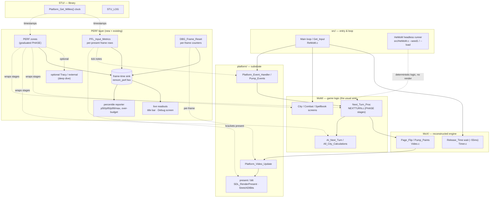

# PLAN — Software Performance Management System (build-out + diagram)

**Status:** Draft
**Owner:** TBD
**Date:** 2026-07-25
**Companion:** [`PRD-Performance-Management.md`](PRD-Performance-Management.md) (requirements), [`BRA-Performance-Management.md`](BRA-Performance-Management.md) (decision), [`GUIDE-Frame-Rate-Performance.md`](GUIDE-Frame-Rate-Performance.md) (playbook). Addenda: [`ADDENDUM-Performance-Danger-Zones.md`](ADDENDUM-Performance-Danger-Zones.md), [`ADDENDUM-Performance-Common-Mistakes.md`](ADDENDUM-Performance-Common-Mistakes.md).

---

## Goal

Turn the scattered timing pieces into one always-on, deterministic, CI-gated performance layer, reusing the clock, the `.fwv` sink, `DBG_Frame_Reset`, `PHASE`, HeMoM, and `.RMR` rather than building a parallel system — and keep a clean on-ramp to external profilers. Deliver the ruler and the regression gate; optimizations are a separate, measurement-gated effort.

## The perf code slice through the codebase

Where a frame's time is spent, and where instrumentation taps in. Solid arrows = call/data flow of one frame; dotted arrows = timing taps feeding the perf sink.



Reading it: **logic** time accrues in the `MoM` subgraph (wrapped by zones, isolatable headless via HeMoM); **render** time accrues in `PAGE → VUP → PRES` (bracketed by `PFL_Input_Metrics`); the **55 ms budget** is enforced by `Release_Time`; everything timestamps off the one `STU` clock and lands in one sink that feeds the reporter, the live readouts, and (optionally) an external profiler.

## What already exists (reuse, don't rebuild)

- **Clock:** `Platform_Get_Millies()`.
- **Frame/present rows → `.fwv`:** `PFL_Input_Metrics` (`REMOM_INPUT_METRICS=1`).
- **Per-frame counters:** `DBG_Frame_Reset` (Debug, TRACE, every 60 frames).
- **Zone timing (ad-hoc):** `PHASE(CALL)` in `MoM/src/NEXTTURN.c:681`.
- **Deterministic runners:** HeMoM (`--seed1`/`--load`/`--continue`), `.RMR` replay.
- **Budget:** `PLATFORM_MILLISECONDS_PER_FRAME = 55`.
- **On-screen surface:** `DBG_Main_Screen_Draw_Summary_Window`.
- **CTest fixtures + pre-push Release-symbol check** (the `dbg_prn`/`trc_prn` leak gate) — the template for the "no zone code in Release" check.

## Decisions

1. **No new subsystem — unify what exists.** One clock, one `.fwv` sink, one gate (`REMOM_PERF`, `REMOM_INPUT_METRICS` kept as alias), one reporter.
2. **`PHASE` graduates to a build-gated zone primitive**; the hand-toggled two-`#define` scheme is deleted. See below.
3. **Logic vs render reported separately**; HeMoM isolates logic, replay measures render.
4. **Percentiles, never means**; every report is p50/p95/p99/max + count-over-budget. **Amended 2026-07-29:** that stands for *reporting* — but for *gating*, only `p50` survived measurement. `total` and `max` are outlier-dominated on a live desktop (`max` varied 0.12×..24.46× between identical runs) and produce false failures. See PRD FR14a.
5. **Off and stripped in Release**; the hot path is one branch when off; zones vanish at compile time.
6. **External profilers documented, not depended on**; optional Tracy behind its own flag.
7. **Perf accounts in logical ticks, not present intervals.** `Release_Time` reports its `N` so a multi-tick hold reads as N on-budget frames; **over-budget = a single tick's *work* > 55 ms**, not "an interval was long." Fixes the `dt_ms` wait-vs-overrun conflation the first capture exposed (PRD FR5a). **Implemented 2026-07-29** — the hook reports `N` **and the measured wait**, and subtracts the measured value, because on an overrun `Release_Time` waits nothing while `N` is unchanged (PRD FR5b). Measured: naive 30% of intervals over budget vs **1.5% of ticks** by work, with 38% of ticks being intentional holds. The present-per-tick refactor (Option B) is **deferred** — a measured decision, not part of this system.

## The `PHASE` → zone migration (the ergonomics fix)

Current (manual, per-file, build-blind):
```c
/* CLAUDE */ #define PHASE(CALL) do { uint64_t _s=Platform_Get_Millies(); CALL; \
    LOG_INFO(LOG_CAT_NEXTTURN,"[NEXTTURN] phase %-48s = %llu ms",#CALL, ...); } while(0)
/* CLAUDE */ #define PHASE(CALL) CALL   // <- hand-uncomment to disable
...
/* CLAUDE */ PHASE(AI_Next_Turn());     // one wrapper per call, everywhere
```

Target (one build option, scope-based, structured sink, zero Release cost):
```c
// perf.h — compiled to nothing unless PERF_INSTRUMENT
#ifdef PERF_INSTRUMENT
  #define PERF_ZONE(name)  Perf_Zone _pz##__LINE__ = Perf_Zone_Open(name)   // C++ RAII, or
  #define PERF_BEGIN(name) Perf_Zone_Begin(name)
  #define PERF_END()       Perf_Zone_End()
#else
  #define PERF_ZONE(name)  ((void)0)
  #define PERF_BEGIN(name) ((void)0)
  #define PERF_END()       ((void)0)
#endif
```
- **Scope-based over per-call** — bracket a stage once, not wrap every line (the readability fix, PRD §ergonomics). In C, a `__attribute__((cleanup))` scoped timer gives the same "open once, auto-close" without a matching `PERF_END`.
- **Gated by one CMake/Autotools option** (`-DPERF_INSTRUMENT=ON`, default OFF, never in Release preset). Switching Debug/Release needs **no source edit** — the compiler strips it.
- **Feeds the shared `.fwv` sink**, not `LOG_INFO`; no formatting/allocation in the zone body (observer effect).
- **Verified stripped in Release** by extending the existing Release-symbol pre-push check to assert no `Perf_Zone_*` symbols leak.
- `NEXTTURN.c` migrates first as the reference adopter, preserving its stage names.

## Build-out order (tracer bullets)

1. **Confirm-with-what-exists (zero code). ✅ DONE (first capture 2026-07-28).** SDL2 release, ~12.6 min / 13,435 frames: median `dt_ms` = 55 ms (on budget) but tail **p95 = 111, p99 = 166, max = 1280 ms**; **47% of intervals > 55 ms**; **`block_ms` p50 = 1 → only 6% of frame time is vsync, 94% is work.** Verdict: **work/logic-bound, not render-bound** — render optimizations would be wasted. Caveat that drove FR5a: `dt_ms` conflates `Release_Time(N)` holds with real overruns, so the raw "47% over budget" over-counts; the tick-aware metric + Mode A (headless, no waits) give the honest logic number. *Next: attribute the tail to a stage via Mode A + the existing `NEXTTURN` `PHASE` zones.*
2. **Unify the sink + reporter.** Fold frame rows and a percentile reporter into one module and one gate (`REMOM_PERF`). Emit a shutdown summary.
3. **Live readouts.** `Platform_Set_Window_Title()` (both backends) with rolling+worst-frame; percentile block on the Debug screen; time-based summary log from `DBG_Frame_Reset`.
4. **Zone primitive.** Land `perf.h`, the build option, and the scoped-zone mechanism; migrate `NEXTTURN.c`; strip-in-Release check.
5. **Mode A — headless logic perf.** Deterministic HeMoM scenario (committed late-game save, N turns), zones on the turn pipeline, per-stage ms out. Commit a reference baseline; wire a CTest test with relative thresholds.
6. **Mode B — windowed render perf.** Deterministic `.RMR` replay + capture, frame-time `.fwv`, p95/max vs. committed baseline; CTest test gated to display-capable runners.
7. **External-profiler on-ramp.** Document the recommended tool per platform (PRD §external) and the exact HeMoM workload to attach; optional `PERF_TRACY` emission.

Steps 1–4 are days and mostly wiring; 5–6 are the durable investment; 7 is documentation + a thin optional hook.

## CTest & build wiring

- **Mode A** as a headless CTest test (runs in the existing HeMoM/CTest suite): `Perf_LogicA_Run` (HeMoM `--seed1 N --load <ref.GAM>` N turns, perf on) → `Perf_LogicA_Assert` (reporter vs. committed baseline, non-zero exit on regression). No display needed.
- **Mode B** as a windowed CTest test (display-capable runners only), mirroring the input Layer-2 fixture chain: setup `sweep.RMR` → run replay+capture → assert frame-time percentiles vs. baseline.
- **Build option** `PERF_INSTRUMENT` in `CMakePresets.json` (a `*-perf` preset) and `Makefile.am`; **off** in the release presets. Extend the pre-push Release check to assert no perf-zone symbols in Release binaries.
- Baseline `.fwv`/summary files committed under `doc/PlatformLayer/perf-baselines/` (or similar), each tagged with the reference machine + build.

## Open risks

- **ms resolution for sub-frame zones.** A 55 ms frame is fine in ms, but a 2 ms zone rounds coarsely. Add `Platform_Get_Micros()` if zone timing needs it; keep frame rows in ms.
- **Zone blind spots.** Manual zones miss unwrapped time; cover the "what did I forget" gap with a sampling profiler (VS/perf/Superluminal), not more zones.
- **Reference-hardware dependence.** Absolute numbers vary by CPU/GPU/OS; thresholds are relative to a *named* baseline; cross-machine comparison is invalid.
- **Determinism of Mode A. RESOLVED 2026-07-29 — and the answer was "half".** Verified with five captures of the same scenario (`SAVE6.GAM` + `--seed1 12345` + `assets/perf_modea_lategame.hms`). **Work is exactly deterministic**: 66 zones, 1450 rows, 12 turns, zero instance-count mismatches, every run. **Stage times are not**: `p50` within 2.46× (1.55× once zones with < 12 samples are excluded), `max` within 0.12×..24.46×. So the gate keys on structure plus a loose `p50` ceiling; the risk was real and the mitigation is PRD FR14a.
- **Fidelity friction on fixes.** Measurement is additive/neutral; the eventual fixes to `Release_Time`/`Get_Input` are marked, justified divergences (see the danger-zones addendum).
- **Observer effect creeping back.** Any `LOG_`/format inside a zone re-introduces the very cost being measured; enforce "timestamp-only zone bodies" in review.
