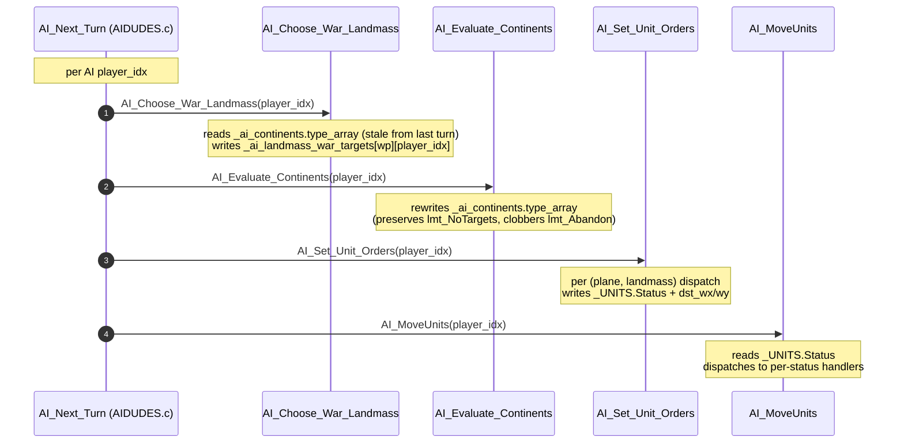
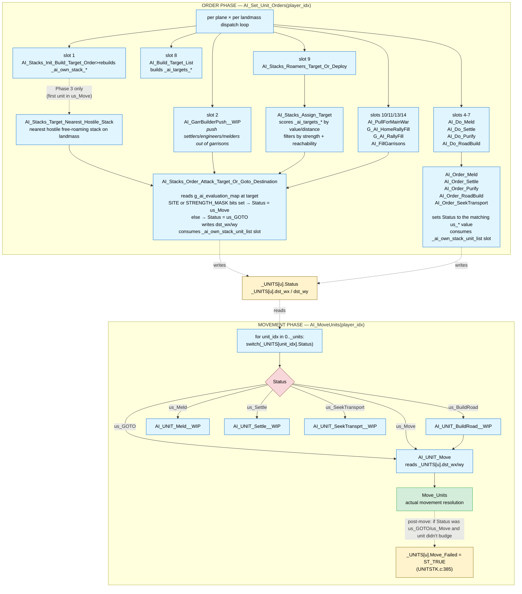
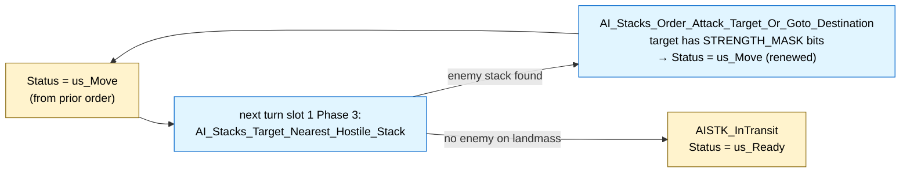

# AI Turn Diagrams

Mermaid PoC. Renders inline in GitHub-flavored markdown, VS Code's preview (with the **Markdown Preview Mermaid Support** extension), and most other markdown renderers. Falls back to a code-fenced block in raw / unrendered views.

If a diagram doesn't render in your viewer, look at the inline source — the relationships are intended to be readable as text too.

---

## Per-turn driver (per AI player)

Where `AI_Set_Unit_Orders` and `AI_MoveUnits` fit in `AI_Next_Turn`:

The order is strict: `Orders` writes Status + dst, then `Move` reads Status + dst. No interleaving. (See `AIDUDES.c:241/284/285/327` for the call sites.)

---

## Order phase → Movement phase: how unit assignments reach `AI_UNIT_Move`

### How to read this diagram

- **Boxes in blue (`func`)** are functions. Boxes in yellow (`state`) are persistent state fields on `_UNITS`. The green box (`terminal`) is the final movement resolver.
- **Solid arrows** are direct calls. **Dotted arrows** are data flow (reads/writes to module-scope state).
- **The two phases are strictly sequential** within a single AI player's turn. Everything in the Order phase completes before the Movement phase begins.
- **The convergence point** is `_UNITS[u].Status` and `_UNITS[u].dst_wx/wy`. Six different order-issuing paths in the Order phase all write these two fields; the Movement phase reads them and dispatches.

### Where the Status-classification happens

Two of the order-setters classify the target via `g_ai_evaluation_map`:

- **`AI_Stacks_Order_Attack_Target_Or_Goto_Destination`** — reads the target square's eval value. If SITE flag set OR STRENGTH_MASK bits non-zero → `us_Move` (target has a site or units). Else → `us_GOTO` (empty travel destination). This is why opportunistic ambush retargeting in slot 1 keeps the unit in `us_Move` — the new target (free-roaming enemy stack) has STRENGTH_MASK bits set.
- **`AI_Order_*` family** — each sets its own dedicated status (`us_Settle`, `us_BuildRoad`, etc.) directly without consulting `g_ai_evaluation_map`. The Status determines which `AI_UNIT_*__WIP` handler `AI_MoveUnits` dispatches to.

### `us_Move` vs `us_GOTO` at the execution level

Both dispatch to the same `AI_UNIT_Move` handler. The distinction matters only for downstream consumers that gate on Status:

- **Next turn's slot 1 (`AI_Stacks_Init_Build_Target_Order 3)** uses `Status == us_Move` to detect mid-attack-run stacks for the opportunistic ambush re-check.
- **Post-move bookkeeping in `UNITSTK.c:385`** sets `Move_Failed = TRUE` if Status was `us_GOTO` or `us_Move` and the unit didn't actually move. (Cleared at the start of each AI turn per `AIDUDES.c:297-303`.)

### Cross-turn loop: how `us_Move` re-renews

The mid-attack-run state persists across turns by a re-checking loop:

The loop terminates only when no hostile free-roaming stack remains on the landmass, OR when between-turn movement resolution actually engages the target.

---

## Notes on the diagram approach

What worked well here:
- **Subgraph framing** for the two-phase structure — phases are visually distinct without needing prose to spell it out.
- **Convergence node** (`UnitFields`) made the order-issuer fan-in / status-reader fan-out immediately visible. Hard to do in ASCII without losing alignment.
- **Color-coding via classDef** distinguished functions from state from gates from terminals at a glance.

What didn't translate:
- Mermaid auto-layout sometimes places nodes in surprising spots. For the cross-turn loop diagram, the LR (left-right) layout reads better than TD (top-down).
- Embedded markdown (`<i>`, `<b>`) renders in most viewers but not all. The fallback is plain text.

Suggested use for the project: mermaid for **branching dispatch graphs and state machines**; keep ASCII for **short linear call chains** that need to render in any context (raw file, grep output, terminal).
