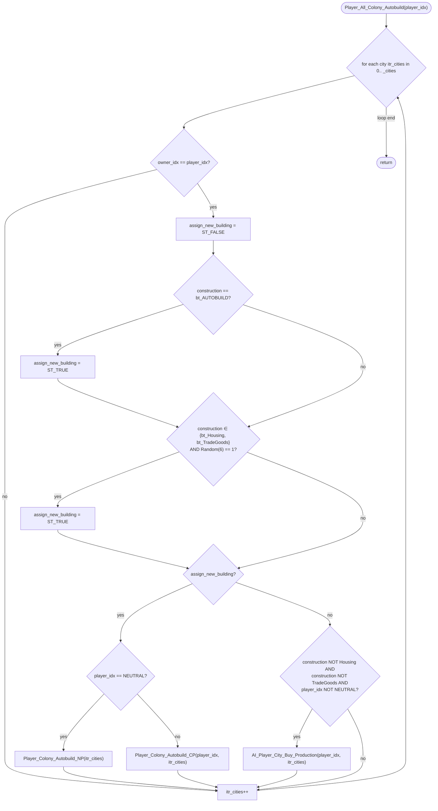

AIBUILD-Player_All_Colony_Autobuild.md

C:\STU\devel\STU-Extras\Piethawn\Piethawn\out\WIZARDS\ovr157\Player_All_Colony_Autobuild.asm
C:\STU\devel\STU-Extras\Piethawn\Piethawn\out\WIZARDS\ovr157\Player_All_Colony_Autobuild.c

AI_Next_Turn()
    |-> Player_All_Colony_Autobuild()

---

# `Player_All_Colony_Autobuild` — Walkthrough

| Function | Location | Role |
|---|---|---|
| `Player_All_Colony_Autobuild` | [AIBUILD.c:45-120](../../MoM/src/AIBUILD.c#L45-L120) | Per-player: iterate every city the player owns and (a) if construction is `bt_AUTOBUILD` OR (b) if construction is `bt_Housing`/`bt_TradeGoods` and a 1-in-6 Random roll lands, hand off to the per-city auto-assigner (`Player_Colony_Autobuild_NP` for the neutral player, `Player_Colony_Autobuild_CP` for AI wizards). Otherwise, if construction is neither Housing nor TradeGoods AND the player isn't neutral, call `AI_Player_City_Buy_Production` to try buying the current project. |

Verified faithful to the disassembly `Player_All_Colony_Autobuild.asm` throughout (structure 1:1).

## Purpose

The build-order automation driver, called once per AI player per turn plus once for the neutral player. For each owned city:

- **`bt_AUTOBUILD`** (value `-4`, per [MOM_DAT.h:593](../../MoX/src/MOM_DAT.h#L593)) is the "auto-assign" placeholder — the city's current construction slot is empty / awaiting decision, so hand off to the per-city auto-assigner immediately.
- **`bt_Housing`** or **`bt_TradeGoods`** — the city is currently producing "no building" (Housing = passive population growth, TradeGoods = gold conversion). Roll `Random(6)`; on `1` (16.67% chance), re-decide the build order. On the other 5-in-6, leave the city alone.
- **Anything else** (a real building or a unit) — leave the construction alone, but if the player is AI (not neutral), try to buy the current project via `AI_Player_City_Buy_Production`.

The file-header comment in `AIBUILD.c` labels this module as *"AI - Build / 'Grand Vizier'"* — the file's own framing, matching MoM's human-side automation feature name. The function-block comment carries an OG author warning: *"WARNING: can't produce settlers or engineers in more than one city simultaneously"* — a known cross-city constraint the auto-assigner enforces, mentioned here as documentation but not enforced by this dispatcher (the check lives in `Player_Colony_Autobuild_CP`).

## How it's reached

| Caller | Site | Notes |
|---|---|---|
| `AI_Next_Turn` per-AI loop | [AIDUDES.c:299](../../MoM/src/AIDUDES.c#L299) `PHASE(Player_All_Colony_Autobuild(player_idx))` | Once per AI player per turn (Phase 3 pre-orders setup). |
| `AI_Next_Turn` neutral pass | [AIDUDES.c:354](../../MoM/src/AIDUDES.c#L354) `PHASE(Player_All_Colony_Autobuild(NEUTRAL_PLAYER_IDX))` | Once per turn for the neutral player after the per-AI loop finishes. |

## Globals / external state

| Symbol | Definition | Effect |
|---|---|---|
| `_CITIES[]`, `_cities` | city records + count | Read (`owner_idx`, `construction`); mutated indirectly via the three called auto-assigners. |
| `Random(n)` | RNG | `Random(6)` called once per owned city whose construction is `bt_Housing` or `bt_TradeGoods`. Critical for PRNG parity. |

## Signature and locals

```c
void Player_All_Colony_Autobuild(int16_t player_idx)
```

OG stack locals (asm:4): `assign_new_building`. Production preserves the name at [AIBUILD.c:47](../../MoM/src/AIBUILD.c#L47). Second local `itr_cities` at line 48 is the loop counter (OG uses `si` register).

## Structure



## Code walk

Line refs are production [AIBUILD.c](../../MoM/src/AIBUILD.c); cross-checked against `Player_All_Colony_Autobuild.asm` (the authority).

### Phase 1 — Owner filter ([50-58](../../MoM/src/AIBUILD.c#L50-L58))

```c
for(itr_cities = 0; itr_cities < _cities; itr_cities++)
{
    if(_CITIES[itr_cities].owner_idx != player_idx)
    {
        continue;
    }
    ...
```

Maps 1:1 onto asm `loc_EAB10` (lines 19-29). Owner check: `cmp [es:bx+s_CITY.owner_idx], player_idx; jz proceed; else jmp continue`. Production's `!= player_idx → continue` matches the OG's `jz-to-proceed, jmp-to-continue` inversion.

### Phase 2 — assign_new_building = FALSE + bt_AUTOBUILD check ([60-67](../../MoM/src/AIBUILD.c#L60-L67))

```c
assign_new_building = ST_FALSE;

if(_CITIES[itr_cities].construction == bt_AUTOBUILD)
{
    assign_new_building = ST_TRUE;
}
```

Maps onto asm lines 32-40:

```asm
mov [bp+assign_new_building], e_ST_FALSE
cmp [es:bx+s_CITY.construction], bt_AUTOBUILD
jnz short loc_EAB47
mov [bp+assign_new_building], e_ST_TRUE
loc_EAB47:
```

Same constant on both sides. Faithful.

### Phase 3 — bt_Housing/bt_TradeGoods + Random(6) check ([69-78](../../MoM/src/AIBUILD.c#L69-L78))

```c
if(
    ((_CITIES[itr_cities].construction == bt_Housing) || (_CITIES[itr_cities].construction == bt_TradeGoods))
    &&
    (Random(6) == 1)  // 1:6  1/6  16.67% chance
)
{
    assign_new_building = ST_TRUE;
}
```

Maps onto asm lines 41-63:

```asm
cmp [es:bx+s_CITY.construction], bt_Housing
jz  short loc_EAB6F                          ; == Housing → Random check
cmp [es:bx+s_CITY.construction], bt_TradeGoods
jnz short loc_EAB83                          ; != TradeGoods → skip
loc_EAB6F:
mov ax, 6
push ax
call Random
pop cx
cmp ax, 1
jnz short loc_EAB83                          ; != 1 → skip
mov [bp+assign_new_building], e_ST_TRUE
```

OR shape (jz-to-continue on Housing OR jnz-to-skip on Not-TradeGoods) matches production's `||` in the C source. The `Random(6) == 1` gate matches asm `cmp ax, 1; jnz skip`.

Critical for PRNG parity: `Random(6)` is called exactly once per owned city whose current construction is Housing or TradeGoods. Every re-run with the same city state must produce identical RNG consumption at this site.

### Phase 4 — Dispatch: assigner or buy-production ([81-116](../../MoM/src/AIBUILD.c#L81-L116))

```c
if(assign_new_building == ST_TRUE)
{
    if(player_idx == NEUTRAL_PLAYER_IDX)
    {
        Player_Colony_Autobuild_NP(itr_cities);
    }
    else
    {
        Player_Colony_Autobuild_CP(player_idx, itr_cities);
    }
}
else
{
    if(
        (_CITIES[itr_cities].construction != bt_Housing)
        && (_CITIES[itr_cities].construction != bt_TradeGoods)
        && (player_idx != NEUTRAL_PLAYER_IDX)
    )
    {
        AI_Player_City_Buy_Production(player_idx, itr_cities);
    }
}
```

Maps onto asm lines 65-110:

```asm
cmp [bp+assign_new_building], e_ST_TRUE
jnz short loc_EABA2                          ; != TRUE → jump to buy-production block
cmp player_idx, e_NEUTRAL_PLAYER_IDX
jnz short loc_EAB97                          ; != NEUTRAL → CP branch
push itr; call Player_Colony_Autobuild_NP    ; NEUTRAL branch
jmp short loc_EABA0
loc_EAB97:
push itr; push player_idx; call Player_Colony_Autobuild_CP
loc_EABA0:
jmp short loc_EABD8                          ; skip the buy-production block
loc_EABA2:                                    ; buy-production block
cmp [es:bx+s_CITY.construction], bt_Housing
jz short loc_EABD8                            ; == Housing → skip
cmp [es:bx+s_CITY.construction], bt_TradeGoods
jz short loc_EABD8                            ; == TradeGoods → skip
cmp player_idx, e_NEUTRAL_PLAYER_IDX
jz short loc_EABD8                            ; == NEUTRAL → skip
push itr; push player_idx; call AI_Player_City_Buy_Production
```

Structural mapping:
- `assign_new_building == ST_TRUE` if-branch ↔ asm `jnz loc_EABA2` skipped when equal.
- `player_idx == NEUTRAL_PLAYER_IDX` inner-if ↔ asm `cmp player_idx, e_NEUTRAL; jnz loc_EAB97` — Borland's natural emission for `if (x == N) { A } else { B }` when both bodies are hoisted.
- Neutral path calls `Player_Colony_Autobuild_NP(itr_cities)` (one arg).
- Non-neutral path calls `Player_Colony_Autobuild_CP(player_idx, itr_cities)` (two args).
- After the assigner returns, `jmp short loc_EABD8` skips the buy-production block — production's `else` structure produces the same skip.
- Buy-production block's three `jz-to-skip` guards on `!= Housing && != TradeGoods && != NEUTRAL` match production's `&& !=` chain.

Faithful.

## OG quirks preserved (faithful — do not "fix")

- **`Random(6)` gate on Housing/TradeGoods construction** — 16.67% chance per owned Housing/TradeGoods city to force a re-assign. The other 5-in-6 leave the city alone. If the AI has 10 Housing/TradeGoods cities, expected re-assigns per turn ≈ 10/6 ≈ 1.67. Preserved from OG (asm:57-60).
- **Buy-production only fires for real projects on non-neutral players** — the three guards (`!= Housing`, `!= TradeGoods`, `!= NEUTRAL`) exclude the "passive" projects and the neutral player. Faithful (asm:93, 100, 102).
- **The dispatch skip after auto-assigner** — after calling `Player_Colony_Autobuild_NP` or `_CP`, the buy-production block is unconditionally skipped for that city this turn (asm `jmp short loc_EABD8` at line 85). Production's `if/else` produces the same skip. Preserved.
- **No self-throttle** — fires every turn for every player. The re-decide gate is entirely determined by the current construction and RNG.

## Sub-functions / external calls

- **`Player_Colony_Autobuild_NP(city_idx)`** ([AIBUILD.c later](../../MoM/src/AIBUILD.c)) — neutral-player auto-assigner. Single-argument (city index only, since player is implicitly NEUTRAL).
- **`Player_Colony_Autobuild_CP(player_idx, city_idx)`** ([AIBUILD.c:138](../../MoM/src/AIBUILD.c#L138)) — AI-wizard auto-assigner. Includes the "settlers/engineers only one at a time across all cities" constraint mentioned in the header WARNING. Complex — has its own weights/probabilities logic (see the `Weights[]` and `product_array[]` declarations at that function's entry).
- **`AI_Player_City_Buy_Production(player_idx, city_idx)`** — attempts to spend gold to complete the city's current construction faster. Only called when the city already has a real project (not Housing/TradeGoods) AND the player is a wizard (not neutral).
- **`Random(n)`** — RNG returning `1..n`. Called at most once per city iteration.

No I/O. No `EMM_Map_CONTXXX__WIP`.

## Related references

- `C:\STU\devel\STU-Extras\Piethawn\Piethawn\out\WIZARDS\ovr157\Player_All_Colony_Autobuild.asm` — IDA Pro 5.5 disassembly (the authority).
- [AIBUILD.c](../../MoM/src/AIBUILD.c) — this function is the entry point of the file; `Player_Colony_Autobuild_CP` follows at [AIBUILD.c:138](../../MoM/src/AIBUILD.c#L138); `Player_Colony_Autobuild_NP` further down.
- `s_CITY` fields read/written: `owner_idx` (read), `construction` (read; mutated by the callee auto-assigners).
- `bt_AUTOBUILD = -4` (`0xFFFC`) at [MOM_DAT.h:593](../../MoX/src/MOM_DAT.h#L593).
- `bt_Housing`, `bt_TradeGoods` — the two "passive" construction placeholders that get the 1-in-6 re-decide roll.
