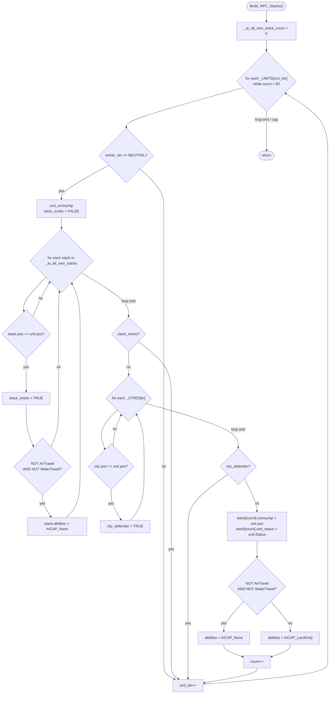

AIDATA-Build_NPC_Stacks.md

C:\STU\devel\STU-Extras\Piethawn\Piethawn\out\WIZARDS\ovr164\Build_NPC_Stacks.asm
C:\STU\devel\STU-Extras\Piethawn\Piethawn\out\WIZARDS\ovr164\Build_NPC_Stacks.c

AI_Next_Turn()
    |-> NPC_Destinations()
        |-> Build_NPC_Stacks()

---

# `Build_NPC_Stacks` — Walkthrough

| Function | Location | Role |
|---|---|---|
| `Build_NPC_Stacks` | [AIDATA.c:1161-1250](../../MoM/src/AIDATA.c#L1161-L1250) | Rebuild `_ai_all_own_stacks[]` with one entry per occupied map square containing neutral-player units — coalescing multiple neutral units on the same tile into a single stack entry, and excluding neutral units stationed inside cities (city defenders). For each new stack, records position and `unit_status`, and sets `abilities` to `AICAP_LandOnly` if the founding unit has air OR water travel, `AICAP_None` otherwise. Caps the buffer at 80 entries. |

Verified faithful to the disassembly `Build_NPC_Stacks.asm` throughout (structure 1:1).

## Purpose

The neutral-player stack compiler, called once from `NPC_Destinations` at the top of the per-turn NPC targeting pass. `_ai_all_own_stacks[]` is a shared buffer that normally holds an AI wizard's own-stack list; for the neutral-player pass, this function repurposes it to hold *roaming neutral stacks* — the wandering monsters/raiders that need destinations assigned.

The compilation:

1. **Reset** `_ai_all_own_stack_count = 0`.
2. **Scan `_UNITS[]`** for neutral-owned units. For each:
3. **Check if a stack entry already exists** at the unit's `(wx, wy, wp)`. If yes, mark `stack_exists = TRUE` and possibly downgrade the existing entry's abilities (if the unit lacks both air and water travel, force `abilities = AICAP_None`).
4. **If no existing stack**, check whether the unit is inside a city (city defenders don't count as roaming stacks). If not in a city, record a new entry.
5. **Cap at 80** entries (matches the buffer's allocation).

The function is **hard-coded for `NEUTRAL_PLAYER_IDX`** — the OG signature is void; the owner filter uses the neutral constant directly. See the [caller-side OGBUG](#og-quirks-preserved-faithful--do-not-fix) note.

## How it's reached

| Caller | Site | Notes |
|---|---|---|
| `NPC_Destinations` | [AIDATA.c:603](../../MoM/src/AIDATA.c#L603) `Build_NPC_Stacks();` | Called once per turn at the top of the NPC targeting pass. |

The header declaration at [AIDATA.h:54](../../MoM/src/AIDATA.h#L54) makes the symbol externally visible but grep confirms only the one call site.

## Globals / external state

| Symbol | Definition | Effect |
|---|---|---|
| `_UNITS[]` (count `_units`) | per-unit records | Read (`owner_idx`, `wx`, `wy`, `wp`, `Status`). |
| `_CITIES[]` (count `_cities`) | city records | Read (`wx`, `wy`, `wp`) for the city-defender exclusion. |
| `_ai_all_own_stacks[]` | shared stack buffer | Written (all fields) up to 80 entries. |
| `_ai_all_own_stack_count` | shared stack count | Written (reset to 0, then incremented per new entry). |
| `NEUTRAL_PLAYER_IDX` | constant | Owner filter (hard-coded, not a parameter). |

## Signature and locals

```c
void Build_NPC_Stacks(void)
```

OG stack locals (asm:4-8): `unit_wp`, `unit_wy`, `unit_wx`, `city_defender`, `stack_exists`. Production matches at [1163-1167](../../MoM/src/AIDATA.c#L1163-L1167). Plus loop counters `unit_idx`, `itr` (OG uses `DI` and `SI` registers) and three typed cursor pointers `stack_ptr`, `curr_unit`, `curr_city` at lines 1170-1172 (production readability hoists; OG re-computes offsets via `imul dx` each time).

## Structure



## Code walk

Line refs are production [AIDATA.c](../../MoM/src/AIDATA.c); cross-checked against `Build_NPC_Stacks.asm` (the authority).

### Phase 1 — Reset ([1174](../../MoM/src/AIDATA.c#L1174))

```c
_ai_all_own_stack_count = 0;
```

Maps 1:1 onto asm:16 (`mov [AI_Own_Stack_Count], 0`). Faithful.

### Phase 2 — Per-unit scan with dual exit ([1176-1181](../../MoM/src/AIDATA.c#L1176-L1181))

```c
for(unit_idx = 0; unit_idx < _units; unit_idx++)
{
    if(_ai_all_own_stack_count >= 80)
    {
        break;
    }
    ...
```

Maps onto asm's dual-exit test at `loc_FAEF3` (asm:222-226):

```asm
cmp unit_idx, [_units]
jge short @@Done
cmp [AI_Own_Stack_Count], 80
jge short @@Done
```

OG checks both conditions at loop-tail. Production splits into the for-condition (`unit_idx < _units`) and an explicit `break` on the count cap. Both compile to the same asm shape. Faithful.

### Phase 3 — Owner filter + read unit position ([1186-1194](../../MoM/src/AIDATA.c#L1186-L1194))

```c
if(curr_unit->owner_idx != NEUTRAL_PLAYER_IDX)
{
    continue;
}

unit_wx = curr_unit->wx;
unit_wy = curr_unit->wy;
unit_wp = curr_unit->wp;
stack_exists = 0;
```

Owner filter (asm:20-28): `cmp [es:bx+s_UNIT.owner_idx], e_NEUTRAL_PLAYER_IDX; jz proceed; jmp continue`. Production's `!= NEUTRAL → continue` matches the OG's `jz-to-proceed, jmp-to-continue` inversion.

Position reads (asm:31-54): three identical `imul (size s_UNIT) → mov al, [es:bx+field]; cbw; mov [bp+field], ax` sequences for wx, wy, wp. Production lines 1191-1193 match order.

`stack_exists = FALSE` (asm:55) ↔ production line 1194. Note: production stores `0` (integer literal); the OG asm store is `e_ST_FALSE`. `ST_FALSE == 0`; same value.

### Phase 4 — Existing-stack search + possible ability downgrade ([1197-1213](../../MoM/src/AIDATA.c#L1197-L1213))

```c
for(itr = 0; itr < _ai_all_own_stack_count; itr++)
{
    stack_ptr = &_ai_all_own_stacks[itr];

    if(stack_ptr->wx == (uint8_t)unit_wx &&
        stack_ptr->wy == (uint8_t)unit_wy &&
        stack_ptr->wp == (uint8_t)unit_wp)
    {
        stack_exists = 1;

        if(!Unit_Has_AirTravel(unit_idx) && !Unit_Has_WaterTravel(unit_idx))
        {
            stack_ptr->abilities = AICAP_None;
        }
    }
}
```

Maps onto asm `loc_FAD74`-`loc_FADE2` (lines 59-108). Structure:

- Three `cmp; jnz skip` position checks in order wx, wy, wp (asm:60-86) ↔ production line 1201-1203 `&&` chain.
- `stack_exists = TRUE` on all-match (asm:87) ↔ production line 1205.
- `Unit_Has_AirTravel` call, `or ax, ax; jnz skip` (asm:88-92) — if HAS air, skip the downgrade ↔ production `!Unit_Has_AirTravel(unit_idx) &&` (line 1208).
- `Unit_Has_WaterTravel` call, `or ax, ax; jnz skip` (asm:93-97) — if HAS water, skip the downgrade ↔ production `&& !Unit_Has_WaterTravel(unit_idx)`.
- On fall-through (no air AND no water), set `stack.abilities = AICAP_None` (asm:98-103) ↔ production line 1210.

Loop-exit is a single test (unlike Phase 2's dual test): `cmp itr, [AI_Own_Stack_Count]; jl short loc_FAD74` (asm:106-108). Faithful.

Note: production stores `stack_exists = 1` (integer literal) on match but tests `stack_exists == ST_FALSE` later. `ST_TRUE == 1`, `ST_FALSE == 0`; the comparison still works. Not flagged as a deviation because the OG uses `e_ST_TRUE` / `e_ST_FALSE` explicitly for both.

### Phase 5 — City-defender check ([1215-1228](../../MoM/src/AIDATA.c#L1215-L1228))

```c
if(stack_exists == ST_FALSE)
{
    city_defender = ST_FALSE;
    for(itr = 0; itr < _cities; itr++)
    {
        curr_city = &_CITIES[itr];
        if(curr_city->wx == (uint8_t)unit_wx &&
            curr_city->wy == (uint8_t)unit_wy &&
            curr_city->wp == (uint8_t)unit_wp)
        {
            city_defender = ST_TRUE;
        }
    }
    ...
```

`stack_exists == FALSE` gate: asm `cmp stack_exists, e_ST_FALSE; jz proceed; jmp continue` (asm:109-111) ↔ production line 1215.

City-check loop (asm `loc_FADFA`-`loc_FAE45`, lines 118-151): iterates cities, sets `city_defender = TRUE` on position match. Structure matches production lines 1219-1228.

Note the loop does NOT break early on match — both OG and production complete the full scan even after finding a match. Faithful (asm:147 `loc_FAE44: inc itr` falls through unconditionally).

### Phase 6 — Record new stack ([1230-1247](../../MoM/src/AIDATA.c#L1230-L1247))

```c
if(city_defender == ST_FALSE)
{
    stack_ptr = &_ai_all_own_stacks[_ai_all_own_stack_count];
    stack_ptr->wx = (uint8_t)unit_wx;
    stack_ptr->wy = (uint8_t)unit_wy;
    stack_ptr->wp = (uint8_t)unit_wp;
    stack_ptr->unit_status = curr_unit->Status;

    if(!Unit_Has_AirTravel(unit_idx) && !Unit_Has_WaterTravel(unit_idx))
    {
        stack_ptr->abilities = AICAP_None;
    }
    else
    {
        stack_ptr->abilities = AICAP_LandOnly;
    }
    _ai_all_own_stack_count++;
}
```

Gate (asm:152-154): `cmp city_defender, e_ST_FALSE; jz proceed; jmp continue`. Production line 1230 matches.

Store wx, wy, wp (asm:156-177): three `imul (size s_AI_STACK_DATA) → mov ...` sequences. Production lines 1233-1235 match.

Store `unit_status` from unit's `Status` field (asm:178-191): reads `_UNITS[unit_idx].Status` and stores to `stack.unit_status`. Production line 1236 matches.

Abilities determination (asm:192-217):

```asm
call j_Unit_Has_AirTravel
or ax, ax
jnz short loc_FAEC8               ; has air → LandOnly

call j_Unit_Has_WaterTravel
or ax, ax
jz short loc_FAEDC                 ; no water → None (else fall through to LandOnly)

loc_FAEC8:                         ; has air OR (no air AND has water) → LandOnly
mov [...].abilities, AICAP_LandOnly
jmp short loc_FAEEE

loc_FAEDC:                         ; no air AND no water → None
mov [...].abilities, AICAP_None

loc_FAEEE:
inc [AI_Own_Stack_Count]
```

OG semantic: `(has_air OR has_water) → LandOnly`, `(no_air AND no_water) → None`. Same as production's `!AirTravel && !WaterTravel → None, else LandOnly` at lines 1238-1245.

Counter increment (asm:218-219) ↔ production line 1246.

## OG quirks preserved (faithful — do not "fix")

- **Caller passes NEUTRAL_PLAYER_IDX but callee takes no parameter** — the OG asm for `NPC_Destinations` pushes `e_NEUTRAL_PLAYER_IDX` before `call near ptr Build_NPC_Stacks; pop cx` (see [AIDATA.c:603](../../MoM/src/AIDATA.c#L603) inline OGBUG note). The `Build_NPC_Stacks` callee (asm:3-16) declares no parameter and uses `e_NEUTRAL_PLAYER_IDX` as a hard-coded literal at asm:26. Wasted push/pop in the OG binary. Production `Build_NPC_Stacks()` has a void signature matching the OG's actual behavior; the NPC_Destinations caller doesn't pass an argument. Faithful to OG semantics.
- **`AICAP_LandOnly` name is semantically confusing** — units with air OR water travel get labeled as `LandOnly`, while units with neither get `None`. The name suggests "constrained to land movement," but the assignment logic uses it as "has additional movement modes." Preserved as-is from OG naming.
- **City-defender scan doesn't early-break on match** — both loops (existing-stack search AND city-defender search) iterate all entries even after a match. For stack search this is required (must scan every existing stack to check for downgrades); for city search, it's over-scanning but faithful.
- **80-entry cap on `_ai_all_own_stacks`** — dual loop-exit at `loc_FAEF3` (asm:222-226) enforces the buffer size. Neutral units beyond the 80th accepted stack are silently dropped. Preserved.
- **Multiple units at the same tile collapse into one stack entry** — the position-match check on existing stacks (Phase 4) causes the second, third, ... units at the same tile to set `stack_exists = TRUE` without adding new entries. Only the FIRST unit at each tile determines the stack's `unit_status`. The abilities field can still be *downgraded* to `AICAP_None` by later units with no air/water travel. Preserved.

## Sub-functions / external calls

- **`Unit_Has_AirTravel(unit_idx)`** — returns non-zero if the unit type has air-travel ability. Called twice per unit: once in the existing-stack downgrade check, once in the new-stack abilities determination.
- **`Unit_Has_WaterTravel(unit_idx)`** — same for water travel.

No RNG. No I/O. No `EMM_Map_CONTXXX__WIP` (the caller `NPC_Destinations` handles EMM setup).

## Related references

- `C:\STU\devel\STU-Extras\Piethawn\Piethawn\out\WIZARDS\ovr164\Build_NPC_Stacks.asm` — IDA Pro 5.5 disassembly (the authority).
- [AIDATA-NPC_Destinations.md](AIDATA-NPC_Destinations.md) — sole caller. This function feeds the buffer that NPC_Destinations then iterates.
- `s_AI_STACK_DATA` fields written: `wx`, `wy`, `wp`, `unit_status`, `abilities`.
- `AICAP_None`, `AICAP_LandOnly` — ability flag values.
- `NEUTRAL_PLAYER_IDX` — hard-coded owner filter.
- `Unit_Has_AirTravel`, `Unit_Has_WaterTravel` — unit-capability helpers, declared elsewhere.
