AIDATA-Make_Monsters.md

C:\STU\devel\STU-Extras\Piethawn\Piethawn\out\WIZARDS\ovr164\Make_Monsters.asm
C:\STU\devel\STU-Extras\Piethawn\Piethawn\out\WIZARDS\ovr164\Make_Monsters.c

AI_Next_Turn()
    |-> Make_Monsters()

---

# `Make_Monsters` — Walkthrough

| Function | Location | Role |
|---|---|---|
| `Make_Monsters` | [AIDATA.c:124-317](../../MoM/src/AIDATA.c#L124-L317) | Per-turn "monsters rampage from a lair" event. Accumulates `Random(_difficulty + 1)` into `_players[NEUTRAL].average_unit_cost` each turn; when the accumulator reaches `(50 - _difficulty * 5)`, resets it, requires `_turn >= 50`, then makes up to 1000 tries at picking an eligible lair (intact, non-Life guard1) on the same landmass as a non-neutral city. If the chosen lair passes a random plane-match test, spawns a rampage stack via `Make_Monster_List` with budget `((Random(diff+1) + Random(diff+1)) * turn) / 5` (halved if any AI wizard shares the landmass), sized by lair's guard1 race (mapped to Death if below `rt_Arcane`). |

Verified faithful to the disassembly `Make_Monsters.asm` throughout (structure 1:1, 497-line asm).

## Purpose

The neutral player's monster-rampage scheduler — the sibling of [`Make_Raiders`](AIDATA-Make_Raiders.md). Where `Make_Raiders` spawns unit stacks from *neutral cities*, `Make_Monsters` spawns rampage stacks from *lairs/towers/nodes* (the 102 pre-placed encounter zones).

- **Every turn**: `average_unit_cost` (repurposed as monster accumulator) += `Random(_difficulty + 1)`. On Intro, zero pressure; on Impossible, 1-5 per turn.
- **When accumulator ≥ (50 - difficulty*5)**: reset to 0. Threshold sliding scale: Intro=50, Easy=45, Normal=40, Hard=35, Impossible=30.
- **Turn gate**: only fires if `_turn >= 50`. Early game is safe.
- **Lair selection**: 1000-try loop rolls `Random(NUM_LAIRS) - 1`. Candidate must be intact, have a non-zero `guard1_unit_type`, guard1 race must NOT be `rt_Life`, and must share a landmass with any non-neutral city.
- **Plane-match gate**: after each search-loop iteration exits (via `lair_idx SET OR tries >= 1000`), roll `Random(3)`. If `<= 1` (⅓, matching OG's `jle short loc_F9B76`), accept the lair unconditionally. Otherwise, check `_FORTRESSES[HUMAN_PLAYER_IDX].wp == _LAIRS[lair_idx].wp`; on match, accept; on mismatch, spin (re-roll Random(3), keep `lair_idx`, do NOT increment `tries`).
- **Race determination**: `guard1_unit_type.race_type`, or forced to `rt_Death` if the race enum is below `rt_Arcane`.
- **Budget**: `((Random(diff+1) + Random(diff+1)) * _turn) / 5`. Halved if any AI wizard's fortress is on the same landmass (`ai_home_continent` flag).
- **Spawn**: `Make_Monster_List` fills up to `MAX_STACK` unit types; `Create_Unit__WIP` places them at an `Adjacent_Free_Square` of the lair. Level-neg hard-coded to `-1`.

## How it's reached

| Caller | Site | Notes |
|---|---|---|
| `AI_Next_Turn` NPC event phase | [AIDUDES.c:373](../../MoM/src/AIDUDES.c#L373) `PHASE(Make_Monsters())` | Once per turn, immediately after `Make_Raiders`. |

## Globals / external state

| Symbol | Definition | Effect |
|---|---|---|
| `_players[NEUTRAL_PLAYER_IDX]` (`s_WIZARD`) | neutral player's wizard record | Read + mutated: `average_unit_cost` (monster accumulator). |
| `_LAIRS[]` (count `NUM_LAIRS = 102`) | lair records | Read (intact, guard1_unit_type, guard1_count, wx, wy, wp). |
| `_CITIES[]` (count `_cities`) | city records | Read (owner_idx, wx, wy, wp) for the same-landmass search. |
| `_FORTRESSES[0.._num_players)` | per-wizard fortress records | Read (wx, wy, wp) for the plane-match gate (idx 0 = human) and AI-home-continent check. |
| `_landmasses[]` | landmass-index bitmap | Read multiple times per attempt (city, human fortress, each AI fortress, lair). |
| `_unit_type_table[]` | per-unit-type data | Read (`race_type`) for eligibility and rampage-race determination. |
| `_difficulty`, `_turn` | game globals | Read for RNG scaling, threshold, gate, budget. |
| `Random(n)` | RNG | Multiple sites — critical for PRNG parity. |

## Signature and locals

```c
void Make_Monsters(void)
```

OG stack locals (asm:4-19): `monster_type_list[9]`, `uu_bogus`, `ai_home_continent`, `n_monsters`, `lair_race`, `rolled_idx`, `tries`, `adjacent_wy`, `adjacent_wx`, `lair_landmass_idx`, `lair_wp`, `lair_wy`, `lair_wx`, `lair_idx`, `valid_zone_count`, `rampage_budget`, plus `itr` in DI.

Production adds: `city_match_found`, `landmass_ptr`. Renames: none — production preserves OG names. Note `uu_bogus` — OG-declared but unused; production preserves it as commented dead storage.

## Structure

```mermaid
flowchart TD
    Entry(["Make_Monsters()"])
    ScanLairs["count intact lairs with non-Life guard1<br/>→ valid_zone_count"]
    ZoneGate{"valid_zone_count &gt; 0?"}
    Accum["average_unit_cost += Random(_difficulty + 1)"]
    Threshold{"avg_unit_cost &gt;= 50 - diff*5?"}
    Reset["avg_unit_cost = 0"]
    TurnGate{"_turn &gt;= 50?"}
    InitSearch["tries = 0, lair_idx = UNDEFINED"]
    SearchLoop{"lair_idx == UNDEFINED<br/>AND tries &lt; 1000?"}
    Roll["rolled_idx = Random(NUM_LAIRS) - 1"]
    LairFilters{"intact AND guard1 != 0<br/>AND guard1 non-Life?"}
    CityScan["scan _CITIES: non-neutral<br/>on lair.wp AND same landmass?"]
    CityFound{"match found?"}
    SetLair["lair_idx = rolled_idx"]
    IncrTries["tries++"]
    PlaneGate{"Random(3) &lt;= 1?"}
    PlaneMatch{"human fortress.wp<br/>== lair.wp?"}
    TriesMax{"tries &gt;= 1000?"}
    ReadLair["lair_wx/wy/wp<br/>lair_landmass_idx"]
    HumanCheck{"human fortress<br/>on lair landmass?"}
    AIScan["scan _FORTRESSES[1..):<br/>ai_home_continent = TRUE if match"]
    RaceCheck{"guard1_count &gt; 0?"}
    SetRace["lair_race = guard1.race_type<br/>if &lt; rt_Arcane: lair_race = rt_Death"]
    RaceGate{"lair_race set?"}
    AdjGate{"Adjacent_Free_Square?"}
    Budget["budget = (2 Randoms sum * turn) / 5"]
    AIReduce{"ai_home_continent?"}
    Halve["budget /= 2"]
    MakeList["n_monsters = Make_Monster_List(budget, race, list)"]
    Spawn["for i in 0..n_monsters:<br/>Create_Unit__WIP(list[i], NEUTRAL, adj, wp, -1)"]
    Done(["return"])

    Entry --> ScanLairs --> ZoneGate
    ZoneGate -->|no| Done
    ZoneGate -->|yes| Accum --> Threshold
    Threshold -->|no| Done
    Threshold -->|yes| Reset --> TurnGate
    TurnGate -->|no| Done
    TurnGate -->|yes| InitSearch --> SearchLoop
    SearchLoop -->|yes: search phase| Roll --> LairFilters
    LairFilters -->|no| IncrTries
    LairFilters -->|yes| CityScan --> CityFound
    CityFound -->|no| IncrTries
    CityFound -->|yes| SetLair --> IncrTries
    IncrTries --> SearchLoop
    SearchLoop -->|no: plane-check phase| PlaneGate
    PlaneGate -->|yes| TriesMax
    PlaneGate -->|no| PlaneMatch
    PlaneMatch -->|yes| TriesMax
    PlaneMatch -->|no: spin| SearchLoop
    TriesMax -->|yes| Done
    TriesMax -->|no| ReadLair --> HumanCheck
    HumanCheck -->|yes| RaceCheck
    HumanCheck -->|no| AIScan --> RaceCheck
    RaceCheck -->|no| RaceGate
    RaceCheck -->|yes| SetRace --> RaceGate
    RaceGate -->|no| Done
    RaceGate -->|yes| AdjGate
    AdjGate -->|no| Done
    AdjGate -->|yes| Budget --> AIReduce
    AIReduce -->|yes| Halve --> MakeList
    AIReduce -->|no| MakeList
    MakeList --> Spawn --> Done
```



## Code walk

Line refs are production [AIDATA.c](../../MoM/src/AIDATA.c); cross-checked against `Make_Monsters.asm` (497 lines).

### Phase 1 — Eligible-lair count ([146-164](../../MoM/src/AIDATA.c#L146-L164))

```c
valid_zone_count = 0;
for(itr = 0; itr < NUM_LAIRS; itr++)
{
    if(_LAIRS[itr].intact == ST_TRUE && _LAIRS[itr].guard1_unit_type != 0)
    {
        if(_unit_type_table[_LAIRS[itr].guard1_unit_type].race_type != rt_Life)
        {
            valid_zone_count++;
        }
    }
}

if(valid_zone_count == 0)
{
    return;
}
```

Maps 1:1 onto asm:26-67. Loop iterates `NUM_LAIRS = 102` records; skips destroyed lairs (`intact == FALSE`), empty guard slots (`guard1_unit_type == 0`), and Life-guarded lairs (Nature/Death/Chaos/Sorcery/Arcane pass).

Note asm:50: `mov al, [es:bx+s_UNIT.type]` — IDA labels the offset as `s_UNIT.type`, but the base is a `s_LAIR` record. IDA picked the equally-valued struct-field label (`s_UNIT.type_offset == s_LAIR.guard1_unit_type_offset` numerically). Not a bug; IDA label noise.

Zero-return path uses `xor ax, ax; jmp @@Done` (asm:66-67) — the shared early-exit target for the void function.

### Phase 2 — Accumulator update + threshold ([166-176](../../MoM/src/AIDATA.c#L166-L176))

```c
_players[NEUTRAL_PLAYER_IDX].average_unit_cost += Random(_difficulty + 1);

if(_players[NEUTRAL_PLAYER_IDX].average_unit_cost < (50 - (_difficulty * 5)))
{
    ...
    return;
}
```

Maps onto asm:69-83. Threshold sliding scale: `50 - difficulty * 5` — Intro=50, Easy=45, Normal=40, Hard=35, Impossible=30. As difficulty rises, monster events fire more frequently (lower threshold + higher `Random(diff+1)` per turn).

Asm computes threshold with `imul 5; sub 50, ax`, then `cmp threshold, avg_unit_cost; jle proceed; jmp early_return`. Production's `< threshold → return` matches (inverted branch).

### Phase 3 — Threshold reset + turn gate ([182-189](../../MoM/src/AIDATA.c#L182-L189))

```c
_players[NEUTRAL_PLAYER_IDX].average_unit_cost = 0;
if(_turn < 50)
{
    ...
    return;
}
```

Maps 1:1 onto asm:85-89. The accumulator resets even when the turn gate rejects — one bump per threshold pass, regardless of whether the event fires.

### Phase 4 — Lair search + plane-check unified loop ([191-242](../../MoM/src/AIDATA.c#L191-L242))

The OG has a two-block state machine — a search body that finds an eligible lair, and a plane-check block that either accepts the found lair or spins on `Random(3)` until it does. Both blocks share a common loop-exit test. Production models this as a single `while(1)` with an `if/else`: the `if` branch runs the search body (search phase); the `else` branch runs the plane-check block (post-search phase or spin).

```c
tries = 0;
lair_idx = ST_UNDEFINED;
while(1)
{
    if((lair_idx == ST_UNDEFINED) && (tries < 1000))
    {
        rolled_idx = (Random(NUM_LAIRS) - 1);
        if(_LAIRS[rolled_idx].intact == ST_TRUE && _LAIRS[rolled_idx].guard1_unit_type != 0)
        {
            if(_unit_type_table[_LAIRS[rolled_idx].guard1_unit_type].race_type != rt_Life)
            {
                city_match_found = 0;
                for(itr = 0; itr < _cities; itr++)
                {
                    if(_CITIES[itr].owner_idx != NEUTRAL_PLAYER_IDX)
                    {
                        if(_CITIES[itr].wp == _LAIRS[rolled_idx].wp)
                        {
                            if(_landmasses[...city...] == _landmasses[...lair...])
                            {
                                lair_idx = rolled_idx;
                                break;
                            }
                        }
                    }
                }
            }
        }
        tries++;
    }
    else
    {
        /* loc_F9B46 */
        if(Random(3) <= 1)
        {
            break;
        }
        /* OGBUG  OOB AVRL  lair_idx can be -1 at _LAIRS[lair_idx] */
        if(_FORTRESSES[HUMAN_PLAYER_IDX].wp == _LAIRS[lair_idx].wp)
        {
            break;
        }
    }
}
```

State-machine mapping (production `if/else` predicate is the inverse of OG's loop-exit test at `loc_F9B36`):

| OG state | OG label | Production branch |
|---|---|---|
| Init | `loc_F99C3` | `tries = 0; lair_idx = ST_UNDEFINED;` |
| Loop-exit test | `loc_F9B36` — `if lair_idx SET OR tries >= 1000 → plane-check, else → search body` | Top of `while(1)` — `if((lair_idx == ST_UNDEFINED) && (tries < 1000))` (De Morgan's inverse) |
| Search body | `loc_F99D0..F9B33` | The `if` branch (production lines 197-228) |
| Plane-check block | `loc_F9B46` — Random(3), maybe accept, maybe re-loop | The `else` branch (production lines 229-241) |

**Search-body branch** (`if` at line 197-228 → asm:97-247):

- Random-lair roll: `Random(102) - 1` (asm:98-103) — production line 203. `NUM_LAIRS = 102` verified at [MOM_DEF.h:113](../../MoX/src/MOM_DEF.h#L113).
- Three filters: `intact == TRUE` (asm:109), `guard1_unit_type != 0` (asm:119), `race_type != rt_Life` (asm:134) — production lines 204, 204, 206. ✓
- City-scan (asm:139-247): iterates `_cities`, checks `owner_idx != NEUTRAL` (asm:148), `city.wp == lair.wp` (asm:158-167), and landmass-idx match (asm:170-236). On match, sets `lair_idx = rolled_idx` (asm:238-239) and breaks inner loop. Early-exit condition on outer city-scan at asm:243-246 → production `break;` on line 220.
- `tries++` at line 227 → asm:250 `inc [bp+tries]` at loc_F9B33.

**Plane-check-block branch** (`else` at line 229-241 → asm:258-276 loc_F9B46):

- `Random(3) <= 1` → break (asm:263 `cmp ax, 1; jle short loc_F9B76`, matching production line 232). Since `Random` returns `1..n`, this fires only on `Random(3) == 1` (⅓ chance). Accepts the lair without checking plane.
- Plane match (asm:264-274 `cmp al, [es:bx+s_LAIR.wp]; jz short loc_F9B76`) — production line 237. On match, break.
- Mismatch → no break; `while(1)` re-evaluates the `if` predicate. `lair_idx` is set and `tries` is not maxed → `else` branch runs again → **spin**. Matches OG's `jmp loc_F99CD → jmp loc_F9B36 → jnz loc_F9B46` spin (asm:276).

**Preserved OGBUG at line 236** — the OG plane-match test reads `_LAIRS[lair_idx].wp` even on the tries-maxed-with-UNDEFINED path (where `lair_idx == -1`), producing an OOB read of `_LAIRS[-1].wp`. The spin still exits on this path via the `Random(3) <= 1` break after ~3 spins on average. The `/* OGBUG  OOB AVRL */` comment marks the read; the behavior is preserved OG-as-written.

### Phase 5 — Search-fail exit ([244-251](../../MoM/src/AIDATA.c#L244-L251))

```c
if(tries >= 1000)
{
    ...
    return;
}
```

Maps onto asm:278-281 (loc_F9B76):

```asm
loc_F9B76:
cmp [bp+tries], 1000
jl short loc_F9B80
jmp loc_F998B                  ; early return
```

The while-loop's `else` branch is the only exit; both breaks require the `if` predicate to be false, i.e., `lair_idx SET OR tries >= 1000`. So post-loop, if `tries < 1000` then `lair_idx SET` is guaranteed — the `|| lair_idx == ST_UNDEFINED` clause OG omits is not needed here either.

### Phase 6 — Read lair position + landmass ([258-261](../../MoM/src/AIDATA.c#L258-L261))

Reads wx, wy, wp, then computes `lair_landmass_idx`. Maps onto asm:283-320. Note asm:305 has `mov al, [es:bx+s_UNIT.wp]` — same IDA-label noise as Phase 1 (`s_UNIT.wp_offset == s_LAIR.wp_offset` numerically). Not a bug.

### Phase 8 — AI home continent check ([253-269](../../MoM/src/AIDATA.c#L253-L269))

```c
ai_home_continent = 0;

/* BUG: The code compares the human landmass (Player 0) without checking the plane first */
if(_landmasses[HUMAN's fortress] != lair_landmass_idx)
{
    for(itr = 1; itr < _num_players; itr++)
    {
        if(_landmasses[fortress[itr]] == lair_landmass_idx)
        {
            ai_home_continent = ST_TRUE;
            break;
        }
    }
}
```

Maps onto asm:321-389. Two-stage logic:

1. **Human short-circuit** (asm:322-344): if the human's fortress IS on the lair's landmass, `ai_home_continent` stays FALSE and the AI-fortress scan is skipped entirely. Rationale (per production line 258 inline comment): "here, means we a flag for whether the rampage is on a continent the human is sharing with an AI" — the halving reduction is meant to punish the *human specifically when they've isolated themselves from AI wizards*, so if the human is ALREADY sharing the landmass, no halving.

2. **AI-fortress scan** (asm:345-389): iterates `itr = 1.._num_players`, checks each AI fortress's landmass. Note `itr = 1` start (asm:345) — skips index 0 = human. On any match, `ai_home_continent = TRUE; break`.

Preserved inline `BUG:` comment at line 255 — landmass_idx comparison across planes can false-match (same OG design flaw as [`Make_Raiders`](AIDATA-Make_Raiders.md)).

### Phase 9 — Race determination ([272-285](../../MoM/src/AIDATA.c#L272-L285))

```c
lair_race = ST_UNDEFINED;
if(_LAIRS[lair_idx].guard1_count > 0)
{
    lair_race = _unit_type_table[_LAIRS[lair_idx].guard1_unit_type].race_type;
    if(lair_race < rt_Arcane)
    {
        lair_race = rt_Death;
    }
}

if(lair_race == ST_UNDEFINED)
{
    return;
}
```

Maps 1:1 onto asm:390-418. `guard1_count > 0` check: `cmp ..., 0; jbe short skip` (asm:397) — `jbe` (unsigned <=) matches `> 0` inverted. ✓

`race < rt_Arcane → rt_Death` remap: any low-enum race (barbarian tribes, generic monsters etc.) becomes Death for the purposes of monster-list generation. Preserved OG semantic.

### Phase 10 — Adjacent square check ([288-291](../../MoM/src/AIDATA.c#L288-L291))

`Adjacent_Free_Square(lair_wx, lair_wy, lair_wp, &adjacent_wx, &adjacent_wy) == 0 → return`. Maps onto asm:420-432. Args right-to-left; `or ax, ax; jnz proceed` inverted to production's `== 0 → return`. ✓

### Phase 11 — Budget computation ([294-301](../../MoM/src/AIDATA.c#L294-L301))

```c
rampage_budget = (Random(_difficulty + 1) + Random(_difficulty + 1));
rampage_budget = (rampage_budget * _turn) / 5;

if(ai_home_continent == 1)
{
    rampage_budget /= 2;
}
```

Maps onto asm:434-460. Two `Random(diff+1)` calls summed → multiply by `_turn` → divide by 5. If AI shares the landmass, halve (`cwd; sub ax, dx; sar ax, 1` signed /2 idiom).

Budget scales with both difficulty (each Random contributes 0-diff) and turn number (linear growth). On Impossible at turn 200: expected budget = `2 * 2 * 200 / 5 = 160`.

### Phase 12 — Make_Monster_List + spawn loop ([304-315](../../MoM/src/AIDATA.c#L304-L315))

```c
n_monsters = Make_Monster_List(rampage_budget, lair_race, &monster_type_list[0]);
...
for(itr = 0; itr < n_monsters; itr++)
{
    Create_Unit__WIP(monster_type_list[itr], NEUTRAL_PLAYER_IDX, adjacent_wx, adjacent_wy, lair_wp, -1);
}
```

Maps onto asm:461-490.

- `Make_Monster_List` args right-to-left: `monster_type_list&, lair_race, rampage_budget` (asm:462-466). C call order: `(rampage_budget, lair_race, &monster_type_list[0])`. ✓
- Return value → `n_monsters` (asm:468). ✓
- `Create_Unit__WIP` args right-to-left: `-1, lair_wp, adjacent_wy, adjacent_wx, NEUTRAL_PLAYER_IDX, monster_type_list[itr]` (asm:472-485). C call: `(monster_type_list[itr], NEUTRAL, adjacent_wx, adjacent_wy, lair_wp, -1)`. ✓
- Hard-coded `-1` for `raiders_level_neg` param (asm:473). Monsters don't get level-neg scaling by turn (unlike [`Make_Raiders`](AIDATA-Make_Raiders.md)).

## OG quirks preserved (faithful — do not "fix")

- **`_players[NEUTRAL].average_unit_cost` repurposed as monster accumulator** — sibling of `casting_cost_original` in [`Make_Raiders`](AIDATA-Make_Raiders.md). Field means "average unit cost" for real wizards but is repurposed here.
- **Life-guarded lairs never rampage** ([154, 206](../../MoM/src/AIDATA.c#L154)) — `race_type != rt_Life` filter. Presumably Life-aligned encounter zones (Angels etc.) are thematically peaceful.
- **`rt_Death` fallback for below-`rt_Arcane` races** ([289](../../MoM/src/AIDATA.c#L289)) — any low-enum race maps to Death for the monster list. Preserves the OG's `guard1.race_type` → `rt_Death` remap.
- **Human-fortress-on-lair-landmass disables AI-home-continent flag** ([270](../../MoM/src/AIDATA.c#L270)) — the AI-fortress scan is only entered if the human isn't already sharing the lair's landmass. Preserves OG's intent to halve budget only when an AI shares the landmass WITHOUT the human.
- **Cross-plane landmass_idx false match** ([266-267](../../MoM/src/AIDATA.c#L266-L267)) — landmass_idx values are byte-compared without plane verification. Real OG design flaw; preserved.
- **`Random(NUM_LAIRS) - 1` inline BUG comment** — `Random` returns `1..n`, so the `- 1` never underflows. Preserved OG-as-written; comment kept for reference.
- **Plane-check OOB read at line 236** — the plane-match test reads `_LAIRS[lair_idx].wp` on the tries-maxed-with-UNDEFINED spin path, where `lair_idx == -1` produces an OOB read of `_LAIRS[-1].wp`. Marked with `/* OGBUG  OOB AVRL */` in-code. Spin still exits via `Random(3) <= 1` break after ~3 rolls on average. Preserved OG-as-written.
- **IDA label noise** — `s_UNIT.type` and `s_UNIT.wp` labels used for `s_LAIR` fields because the numeric offsets match. Not a bug, but explains why the asm mentions unit-type-related symbols in a lair-focused function.
- **`uu_bogus` declared and unused** (asm:5) — OG allocates a stack slot that no code reads or writes. Production keeps it in the local list (`int16_t uu_bogus = 0;`) with the "uu_" prefix marking it as an unused OG local. Do not remove.
- **`raiders_level_neg = -1` hard-coded for monsters** ([325](../../MoM/src/AIDATA.c#L325)) — monsters don't scale their experience level by turn (unlike raiders' `-4/-3/-2/-1` scale). Preserved.
- **Threshold reset on turn-gate rejection** ([182](../../MoM/src/AIDATA.c#L182) + [183-189](../../MoM/src/AIDATA.c#L183-L189)) — the accumulator resets BEFORE the `_turn < 50` gate. Even in early game, the accumulator is drained on every threshold pass. Preserved.
- **STU_DEBUG / AI_Metrics instrumentation** — ReMoM additions wrapped in `#ifdef STU_DEBUG` or as `AI_Metrics_Emit_NPC_Event` calls. Not in OG. Preserved as ReMoM tooling.

## Sub-functions / external calls

- **`Random(n)`** — RNG returning `1..n`. Call sites: accumulator update, lair roll, plane-check gate, budget (2x).
- **`Adjacent_Free_Square(wx, wy, wp, &adj_wx, &adj_wy)`** — finds an empty tile adjacent to the lair. Returns non-zero on success.
- **`Make_Monster_List(budget, race, list_out)`** — separate function; fills up to `MAX_STACK` unit types for the given budget/race. Returns count.
- **`Create_Unit__WIP(type, owner, wx, wy, wp, level)`** — creates a new unit. Called once per monster. Same `__WIP`-pending signature as [`Make_Raiders`](AIDATA-Make_Raiders.md).
- **`AI_Metrics_Emit_NPC_Event(...)`** — ReMoM STU_LOG instrumentation. Not in OG.

No `EMM_Map_CONTXXX__WIP` in this function.

## Related references

- `C:\STU\devel\STU-Extras\Piethawn\Piethawn\out\WIZARDS\ovr164\Make_Monsters.asm` — IDA Pro 5.5 disassembly (the authority, 497 lines).
- [`AIDATA-Make_Raiders.md`](AIDATA-Make_Raiders.md) — sibling event driver. `Make_Raiders` bumps `Make_Monsters`' accumulator on 1000-try failure (`average_unit_cost += 15`).
- `Make_Monster_List` — sub-helper, separate walkthrough scope.
- `s_WIZARD` fields read/written: `average_unit_cost` (monster accumulator).
- `s_LAIR` fields: `intact`, `guard1_unit_type`, `guard1_count`, `wx`, `wy`, `wp`.
- `s_CITY` fields: `owner_idx`, `wx`, `wy`, `wp`.
- `s_FORTRESS` fields: `wx`, `wy`, `wp`.
- `NUM_LAIRS = 102`, `NEUTRAL_PLAYER_IDX = 5`, `HUMAN_PLAYER_IDX = 0`, `WORLD_SIZE`, `WORLD_WIDTH`, `MAX_STACK = 9` — constants.
- `rt_Life`, `rt_Arcane`, `rt_Death` — race_type enum values.
