AIDATA-Make_Raiders.md

C:\STU\devel\STU-Extras\Piethawn\Piethawn\out\WIZARDS\ovr164\Make_Raiders.asm
C:\STU\devel\STU-Extras\Piethawn\Piethawn\out\WIZARDS\ovr164\Make_Raiders.c

AI_Next_Turn()
    |-> Make_Raiders()

---

# `Make_Raiders` — Walkthrough

| Function | Location | Role |
|---|---|---|
| `Make_Raiders` | [AIDATA.c:353-576](../../MoM/src/AIDATA.c#L353-L576) | Per-turn "raiders from a neutral city" event. Accumulates `Random(_difficulty + 1)` into `_players[NEUTRAL].casting_cost_original` each turn; when the accumulator reaches 30, resets it and makes up to 1000 tries at spawning a raider party from a random neutral city. Filters candidates by same-landmass non-neutral presence, requires an `Adjacent_Free_Square` for spawn, then creates `(troop_count * difficulty) / 6` raider units (with AI-fortress and Myrror/early-turn reductions) and kills 1/3 of the source city's garrison. If all 1000 tries fail, bumps a separate "monster accumulator" (`average_unit_cost`) by 15 as a fallback pressure valve. |

Verified faithful to the disassembly `Make_Raiders.asm` throughout (structure 1:1). Production body carries a `/* GEMINI */` marker at [AIDATA.c:352](../../MoM/src/AIDATA.c#L352) — the C source was seeded from a GEMINI translation and then reviewed against the OG asm bytes here.

## Purpose

The neutral player's raider-spawn scheduler. Neutral cities occasionally launch raiding parties against real wizards' cities. The mechanic:

- **Every turn**: `casting_cost_original` (repurposed as raider accumulator) += `Random(_difficulty + 1)`. On Intro (diff 0), zero pressure; on Impossible (diff 4), 1-5 per turn.
- **When accumulator ≥ 30**: reset to 0, try 1000 times to spawn from a random neutral city. Each attempt filters on: neutral owner, at least one non-neutral city on the same landmass (something to raid), `Adjacent_Free_Square` for the spawn tile, `troop_count > 0` (city has a garrison to draw from).
- **On successful attempt**: spawn `(garrison * difficulty) / 6` units (capped at min 1), reduce by 1/3 if any AI wizard fortress is on the same landmass (mercy toward the human? see the OG inline comment questioning intent at [AIDATA.c:484-486](../../MoM/src/AIDATA.c#L484-L486)), halve if the city is on Myrror and `_turn < 200` (Myrror is meant to be a late-game challenge tier). Level-neg (experience-cap) scales with turn: `-1` early, `-2` after turn 40, `-3` after turn 120, `-4` after turn 250. Then kill `units_created / 3` of the source garrison to represent the raid.
- **On all 1000 tries failing**: `_players[NEUTRAL].average_unit_cost += 15` (repurposed as monster accumulator) — bumps the sibling `Make_Monsters` pressure so *something* happens next turn.

## How it's reached

| Caller | Site | Notes |
|---|---|---|
| `AI_Next_Turn` NPC event phase | [AIDUDES.c:369](../../MoM/src/AIDUDES.c#L369) `PHASE(Make_Raiders())` | Once per turn, in the events phase. |

## Globals / external state

| Symbol | Definition | Effect |
|---|---|---|
| `_players[NEUTRAL_PLAYER_IDX]` (`s_WIZARD`) | neutral player's wizard record | Read + mutated: `casting_cost_original` (raider accumulator), `average_unit_cost` (monster-accumulator fallback). |
| `_CITIES[]` (count `_cities`) | city records | Read (owner_idx, wx, wy, wp). |
| `_UNITS[]` (via `Army_At_Square_2`) | per-unit records | Read (type via `troops[]`); mutated via `Kill_Unit` on 1/3 of the garrison. |
| `_FORTRESSES[1.._num_players)` | per-wizard fortress records | Read (wx, wy, wp) for the same-landmass check. Iterates from index 1 to skip the human at index 0. |
| `_landmasses[]` | landmass-index bitmap | Read three times per attempt (city, each fortress, each other city). |
| `_difficulty`, `_turn` | game globals | Read for RNG scaling, spawn count, level-neg, Myrror gate. |
| `Random(n)` | RNG | Multiple sites: accumulator update, city roll, per-raider unit picker. Critical for PRNG parity. |

## Signature and locals

```c
void Make_Raiders(void)
```

OG stack locals (asm:4-25): `troops[9]` (word array; asm labels the array start as `var_3A` at bp-3Ah, one word before `troops` at bp-38h — see below), `Have_AI_Fortress`, `units_created`, `unit_type`, `Have_Non_Neutral`, `rolled_city`, `tries`, `did_create`, `Have_Neutral_City`, `n_raiders`, `troop_count`, `city_landmass_idx`, `raiders_level_neg`, `adjacent_wy`, `adjacent_wx`, `Unused_Local`, `city_wp`, `city_wy`, `city_wx`, `itr`, plus `itr2` in the DI register.

Production renames:

| OG asm name | Production C name |
|---|---|
| `n_raiders` | `raiders_count` |
| `Have_AI_Fortress` | `have_ai_fortress` |
| `Have_Non_Neutral` | `have_non_neutral` |
| `Have_Neutral_City` | `have_neutral_city` |
| `Unused_Local` | `unused_local` |
| `adjacent_wx`, `adjacent_wy` | `empty_adjacent_x`, `empty_adjacent_y` |
| all others | unchanged |

Plus three typed cursor pointers (`city_ptr`, `fortress_ptr`, `unit_ptr`) at [376-378](../../MoM/src/AIDATA.c#L376-L378) — production readability hoists; OG re-computes offsets each time via `imul dx`.

**`var_3A` clever trick**: the OG's raider loop reads `troops[Random(troop_count) - 1]` via `[bp+var_3A + 2*Random(troop_count)]` (asm:322-325). Because `var_3A = troops - 2` in stack offsets, this effectively computes `troops - 2 + 2 * Random(troop_count) = troops + 2*(Random-1)`, saving the `dec ax` that would otherwise be needed. Production line 526 spells it out as `troops[(Random(troop_count) - 1)]` — same result.

## Structure

```mermaid
flowchart TD
    Entry(["Make_Raiders()"])
    CheckNeutral["scan _CITIES for any neutral-owned<br/>have_neutral_city = TRUE if found"]
    NeutralGate{"have_neutral_city?"}
    Accum["casting_cost_original += Random(_difficulty + 1)"]
    Threshold{"casting_cost_original &gt;= 30?"}
    Reset["casting_cost_original = 0<br/>did_create = 0, tries = 0"]
    TriesLoop{"tries &lt; 1000<br/>AND did_create == 0?"}
    Roll["rolled_city = Random(_cities) - 1"]
    OwnerGate{"city owner == NEUTRAL?"}
    ReadCity["city_wx/wy/wp<br/>city_landmass_idx"]
    FortressScan["scan _FORTRESSES[1.._num_players):<br/>same landmass → have_ai_fortress = TRUE"]
    NonNeutralScan["scan _CITIES: non-neutral on<br/>same landmass? → have_non_neutral"]
    NonNeutralGate{"have_non_neutral?"}
    AdjGate{"Adjacent_Free_Square?"}
    GarrisonGate{"troop_count &gt; 0?"}
    Count["raiders_count = troop_count * difficulty / 6"]
    FortReduce{"have_ai_fortress?"}
    ReduceAI["raiders_count = raiders_count * 2 / 3"]
    MyrrorGate{"MYRROR AND turn &lt; 200?"}
    ReduceMyr["raiders_count /= 2"]
    Min1{"raiders_count &lt; 1?"}
    Set1["raiders_count = 1"]
    Level["raiders_level_neg by turn:<br/>&gt;250→-4, &gt;120→-3, &gt;40→-2, else -1"]
    Spawn["for i in 0..raiders_count:<br/>pick random unit_type from troops<br/>skip if &lt;= BarbSwordsmen OR Transport OR CreateOutpost<br/>Create_UnitRAL, adj, level)"]
    KillGarr["kill troops[0..units_created/3]"]
    Done(["return"])
    Fallback["average_unit_cost += 15"]

    Entry --> CheckNeutral --> NeutralGate
    NeutralGate -->|no| Done
    NeutralGate -->|yes| Accum --> Threshold
    Threshold -->|no| Done
    Threshold -->|yes| Reset --> TriesLoop
    TriesLoop -->|no| Fallback --> Done
    TriesLoop -->|yes| Roll --> OwnerGate
    OwnerGate -->|no| TriesLoop
    OwnerGate -->|yes| ReadCity --> FortressScan --> NonNeutralScan --> NonNeutralGate
    NonNeutralGate -->|no| TriesLoop
    NonNeutralGate -->|yes| AdjGate
    AdjGate -->|no| TriesLoop
    AdjGate -->|yes| GarrisonGate
    GarrisonGate -->|no| TriesLoop
    GarrisonGate -->|yes| Count --> FortReduce
    FortReduce -->|yes| ReduceAI --> MyrrorGate
    FortReduce -->|no| MyrrorGate
    MyrrorGate -->|yes| ReduceMyr --> Min1
    MyrrorGate -->|no| Min1
    Min1 -->|yes| Set1 --> Level
    Min1 -->|no| Level
    Level --> Spawn --> KillGarr --> Done
```



## Code walk

Line refs are production [AIDATA.c](../../MoM/src/AIDATA.c); cross-checked against `Make_Raiders.asm` (the authority, 404 lines).

### Phase 1 — Neutral-city presence check ([380-395](../../MoM/src/AIDATA.c#L380-L395))

Maps 1:1 onto asm:31-54. Both scan `_CITIES[]` and set `have_neutral_city = TRUE` on any neutral match; neither early-breaks. Then `have_neutral_city == FALSE → return`. On zero-return, OG uses `xor ax, ax; jmp @@Done` (asm:53-54) — void C function returning 0 in AX is standard Borland behavior. Faithful.

### Phase 2 — Accumulator update + threshold ([397-406](../../MoM/src/AIDATA.c#L397-L406))

```c
_players[NEUTRAL_PLAYER_IDX].casting_cost_original += Random(_difficulty + 1);

if(_players[NEUTRAL_PLAYER_IDX].casting_cost_original < 30)
{
    return;
}
```

Maps onto asm:57-65:

```asm
mov ax, [_difficulty]
inc ax
push ax
call Random
pop cx
add [_players.casting_cost_original+17E8h], ax    ; +17E8h = NEUTRAL_PLAYER_IDX * sizeof(s_WIZARD)
cmp [_players.casting_cost_original+17E8h], 30
jge short loc_F9DD7
jmp short @@JmpDone
```

Threshold direction: `jge proceed; else return`. Production's `< 30 → return` matches (the jump-when-fails-test inversion). Faithful.

### Phase 3 — Reset + init tries loop ([412-416](../../MoM/src/AIDATA.c#L412-L416))

```c
_players[NEUTRAL_PLAYER_IDX].casting_cost_original = 0;
unused_local = 0;
did_create = 0;

for(tries = 0; tries < 1000 && did_create == 0; tries++)
{
```

Maps onto asm:68-73:

```asm
mov [_players.casting_cost_original+17E8h], 0
mov [bp+Unused_Local], 0
mov [bp+did_create], 0
mov [bp+tries], 0                                   ; asm:71
mov [bp+tries], 0                                   ; asm:72 — DUPLICATE store, compiler artifact
```

The OG asm has a **duplicate `mov [bp+tries], 0`** at asm:71-72 — likely a Borland C compiler artifact from the source `tries = 0` being both a `for`-loop initializer AND a prior explicit assignment. Production has a single init. Behavior-identical; not flagged.

Loop test at `loc_FA0E6` (asm:387-391): `cmp tries, 1000; jge exit; cmp did_create, ST_FALSE; jnz exit; jmp back`. Production's `tries < 1000 && did_create == 0` matches.

### Phase 4 — Random-city roll + owner filter ([419-425](../../MoM/src/AIDATA.c#L419-L425))

```c
/* BUG: Random(cities) - 1 can result in index -1 */
rolled_city = Random(_cities) - 1;

city_ptr = &_CITIES[rolled_city];
if(city_ptr->owner_idx != NEUTRAL_PLAYER_IDX)
{
    continue;
}
```

Maps 1:1 onto asm:75-88. `Random` returns `1..n`; `- 1` shifts to `0..n-1`. The inline `BUG:` comment is a false alarm for the normal case — Phase 1 already guaranteed `_cities > 0`, so `Random(_cities) - 1 ∈ [0, _cities)`. Preserved OG-as-written.

### Phase 5 — Read city position + landmass ([427-432](../../MoM/src/AIDATA.c#L427-L432))

Three reads (wx, wy, wp) followed by the landmass lookup. Maps onto asm:90-127. Faithful.

### Phase 6 — Same-landmass AI fortress scan ([435-444](../../MoM/src/AIDATA.c#L435-L444))

```c
have_ai_fortress = 0;
for(itr = 1; itr < _num_players; itr++)
{
    fortress_ptr = &_FORTRESSES[itr];
    /* BUG: Uses wp/wy/wx to index landmasses but doesn't strictly verify wp matches city_wp */
    if(_landmasses[(fortress_ptr->wp * WORLD_SIZE) + (fortress_ptr->wy * WORLD_WIDTH) + fortress_ptr->wx] == city_landmass_idx)
    {
        have_ai_fortress = ST_TRUE;
    }
}
```

Maps 1:1 onto asm:128-174. Note `itr = 1` start (asm:129) — skips index 0 = human player. Fortress-landmass-index computation matches production line 440.

The inline `BUG:` comment observes that comparing `landmass_idx` values alone doesn't verify that the fortress and city are on the *same plane* — two landmasses with the same index byte on different planes could accidentally match. Preserved OG-as-written; this is a real OG design issue.

### Phase 7 — Same-landmass non-neutral city scan ([447-464](../../MoM/src/AIDATA.c#L447-L464))

```c
have_non_neutral = 0;
for(itr = 0; itr < _cities; itr++)
{
    city_ptr = &_CITIES[itr];
    if(city_ptr->owner_idx != NEUTRAL_PLAYER_IDX)
    {
        if(_landmasses[(city_ptr->wp * WORLD_SIZE) + (city_ptr->wy * WORLD_WIDTH) + city_ptr->wx] == city_landmass_idx)
        {
            have_non_neutral = ST_TRUE;
            break;
        }
    }
}

if(have_non_neutral == ST_FALSE)
{
    continue;
}
```

Maps onto asm:175-233. Both OG and production **early-break on match** — asm:226-229 has `cmp itr2, [_cities]; jge exit; cmp Have_Non_Neutral, ST_FALSE; jz continue` (i.e., loop continues only if not found). Production uses explicit `break;`. Same semantic.

Gate: `have_non_neutral == FALSE → continue` (production line 461) ↔ asm:231-233 `cmp Have_Non_Neutral, ST_TRUE; jz proceed; jmp continue`. Faithful.

### Phase 8 — Adjacent_Free_Square + garrison lookup ([467-478](../../MoM/src/AIDATA.c#L467-L478))

```c
if(Adjacent_Free_Square(city_wx, city_wy, city_wp, &empty_adjacent_x, &empty_adjacent_y) != ST_TRUE)
{
    continue;
}

Army_At_Square_2(city_wx, city_wy, city_wp, &troop_count, troops);

if(troop_count <= 0)
{
    continue;
}
```

Maps onto asm:236-261. Both calls push args right-to-left:

- `Adjacent_Free_Square`: asm:236-243 pushes `&adjacent_wy, &adjacent_wx, city_wp, city_wy, city_wx` → C `(city_wx, city_wy, city_wp, &empty_adjacent_x, &empty_adjacent_y)`. Matches production line 467.
- `Army_At_Square_2`: asm:250-257 pushes `troops, &troop_count, city_wp, city_wy, city_wx` → C `(city_wx, city_wy, city_wp, &troop_count, troops)`. Matches production line 473.

Garrison check: `cmp troop_count, 0; jg proceed; else continue` (asm:259-261) ↔ production line 475 `<= 0 → continue`.

### Phase 9 — `raiders_count` computation ([481-502](../../MoM/src/AIDATA.c#L481-L502))

```c
raiders_count = (troop_count * _difficulty) / 6;

if(have_ai_fortress == ST_TRUE)
{
    raiders_count = (raiders_count * 2) / 3;
}

if(city_wp == MYRROR_PLANE && _turn < 200)
{
    raiders_count /= 2;
}

if(raiders_count < 1)
{
    raiders_count = 1;
}
```

Maps 1:1 onto asm:263-291. Formula: `(troop_count * _difficulty) / 6` (asm:264-269), then `× 2/3` if AI fortress present (asm:270-277), then `/ 2` for Myrror-early (asm:278-287), then min 1 (asm:288-291).

Myrror-halve uses OG's `cwd; sub ax, dx; sar ax, 1` signed-divide-by-2 idiom (asm:283-286); production uses `/= 2`. Same for non-negative values.

### Phase 10 — Level-neg by turn ([505-520](../../MoM/src/AIDATA.c#L505-L520))

```c
if(_turn > 250)
{
    raiders_level_neg = -4;
}
else if(_turn > 120)
{
    raiders_level_neg = -3;
}
else if(_turn > 40)
{
    raiders_level_neg = -2;
}
else
{
    raiders_level_neg = -1;
}
```

Maps 1:1 onto asm:293-311. Four cascading `cmp _turn, N; jle next-check; mov raiders_level_neg, -X; jmp end` blocks. Faithful.

### Phase 11 — Raider spawn loop with filters ([522-551](../../MoM/src/AIDATA.c#L522-L551))

```c
units_created = 0;
for(itr = 0; itr < raiders_count; itr++)
{
    unit_type = _UNITS[troops[(Random(troop_count) - 1)]].type;

    /* OGBUG: This comparison excludes barbarian spearmen and swordsmen from raiding */
    if(unit_type <= ut_BarbSwordsmen)
    {
        continue;
    }

    if(_unit_type_table[unit_type].Transport != 0)
    {
        continue;
    }

    if(_unit_type_table[unit_type].Abilities & UA_CREATEOUTPOST)
    {
        continue;
    }

    Create_Unit_type, NEUTRAL_PLAYER_IDX, empty_adjacent_x, empty_adjacent_y, city_wp, raiders_level_neg);
    units_created++;
}
```

Maps onto asm `loc_FA043`-`loc_FA0B1` (lines 317-361). Verifications:

- Random unit-type pick: asm:318-332 uses the `var_3A` trick (`shl ax, 1; lea dx, [bp+var_3A]; add ax, dx` — see [Signature and locals](#signature-and-locals)) ↔ production `troops[(Random(troop_count) - 1)]` at line 526.
- Filter 1 — `unit_type <= ut_BarbSwordsmen`: asm:333-334 `cmp unit_type, ut_BarbSwordsmen; jle skip` ↔ production line 529. The inline `OGBUG` comment observes this incorrectly filters barbarian Spearmen and Swordsmen from raiding — presumably the OG intended `<` (skip Settlers only, which sits at value 0) or the enum ordering doesn't match intent. Preserved OG-as-written.
- Filter 2 — `Transport != 0`: asm:335-340 ↔ production line 535.
- Filter 3 — `UA_CREATEOUTPOST`: asm:341-346 ↔ production line 540. Note asm:342 has `mov dx, s_CITYSCAPE_R.row2.field_y2` — IDA picked a struct-field offset label whose numeric value happens to equal `sizeof(s_UNIT_TYPE)`. Production uses standard indexing; the OG oddity is IDA-label noise, not an actual byte mismatch.
- `Create_Unitl: asm:347-354 pushes `raiders_level_neg, city_wp, adjacent_wy, adjacent_wx, 5 (=NEUTRAL_PLAYER_IDX), unit_type` → C `(unit_type, NEUTRAL_PLAYER_IDX, empty_adjacent_x, empty_adjacent_y, city_wp, raiders_level_neg)`. Matches production line 549.
- `units_created++`: asm:356 ↔ production line 550.

Loop-exit: asm:359-361 `cmp itr2, [bp+n_raiders]; jl continue` ↔ production `for(itr = 0; itr < raiders_count; itr++)` at line 523.

### Phase 12 — Kill garrison + mark success ([554-563](../../MoM/src/AIDATA.c#L554-L563))

```c
for(itr2 = 0; itr2 < (units_created / 3); itr2++)
{
    Kill_Unit(troops[itr2], kt_Normal);
}
...
did_create = ST_TRUE;
```

Maps onto asm:362-384. Kill loop `xor ax, ax; push ax; push troops[itr2]; call j_Kill_Unit` (asm:366-373) ↔ production `Kill_Unit(troops[itr2], kt_Normal)` (`kt_Normal == 0`). Loop-count computed at loop-tail: `units_created / 3` (asm:378-381).

`did_create = TRUE` at asm:384 ↔ production line 563.

### Phase 13 — Failure fallback ([567-574](../../MoM/src/AIDATA.c#L567-L574))

```c
if(did_create == ST_FALSE)
{
    _players[NEUTRAL_PLAYER_IDX].average_unit_cost += 15;
}
```

Maps onto asm:394-397: after the tries loop exits, `cmp did_create, ST_FALSE; jnz done; add [_players.average_unit_cost+17E8h], 15`. Faithful. The bump pressures `Make_Monsters` to fire more often next turn — the two accumulators (`casting_cost_original` for raiders, `average_unit_cost` for monsters) balance each other.

## OG quirks preserved (faithful — do not "fix")

- **`s_WIZARD` fields repurposed as accumulators** — `casting_cost_original` (raider accumulator) and `average_unit_cost` (monster accumulator) are neutral-player-only repurposings of fields that mean something else for real wizards. Preserved.
- **`ut_BarbSwordsmen` filter excludes Barbarian Spearmen AND Swordsmen** ([529](../../MoM/src/AIDATA.c#L529)) — the `<=` should probably be `<` (exclude only Settlers at enum value 0), but the OG has `<=`. Preserved as OGBUG.
- **Same-landmass-index doesn't verify same-plane** ([440](../../MoM/src/AIDATA.c#L440)) — the AI-fortress check compares landmass indices as bytes, which can accidentally match across planes if two landmasses on different planes have the same byte value. Real OG design flaw; preserved.
- **`Random(_cities) - 1` inline BUG comment is a false positive** ([418-419](../../MoM/src/AIDATA.c#L418-L419)) — `Random` returns `1..n`, so `Random(_cities) - 1 ∈ [0, _cities-1]`. Phase 1 already guaranteed `_cities > 0`. The comment is over-cautious but the code is fine; preserved.
- **Duplicate `tries = 0` in OG asm** (asm:71-72) — compiler artifact from the C source likely having `tries = 0;` followed by `for (tries = 0; ...`. Production has a single init.
- **`var_3A` trick for `Random - 1` array indexing** (asm:4, 322-325) — the OG's stack frame places a dummy `var_3A` word one slot before `troops[]` so that `[bp+var_3A + 2*Random(n)]` computes `troops[Random(n) - 1]` without a subtract. Production spells it out; same runtime behavior.
- **Neutral city scan does NOT early-break** — Phase 1's scan runs to completion even after finding a neutral city. Phase 7's non-neutral scan DOES early-break. Both preserved.
- **Fortress scan starts at `itr = 1`** — index 0 is the human player, whose fortress is skipped. Preserved.
- **AI-fortress reduction to 2/3** — the OG cuts raiders by 1/3 when any wizard fortress is on the same landmass. The [inline comments at 484-486](../../MoM/src/AIDATA.c#L484-L486) question the intent (mercy toward human, or unfair advantage for AI wizards?). Preserved as-written.
- **Myrror early-turn halving** — `_turn < 200` on MYRROR_PLANE halves raider count. Presumably to make Myrror gentler until the mid-game. Preserved.
- **STU_DEBUG / AI_Metrics instrumentation** — ReMoM additions wrapped in `#ifdef STU_DEBUG` or as `AI_Metrics_Emit_NPC_Event` calls. Not in OG. Preserved as ReMoM tooling.

## Sub-functions / external calls

- **`Random(n)`** — RNG returning `1..n`. Multiple call sites: accumulator update, city roll, per-raider unit-type roll. Critical for PRNG parity.
- **`Adjacent_Free_Square(wx, wy, wp, &adj_wx, &adj_wy)`** — finds an empty adjacent tile to spawn the raider party. Returns `ST_TRUE` on success.
- **`Army_At_Square_2(wx, wy, wp, &troop_count, troops)`** — populates the source city's garrison list. Same right-to-left cdecl pattern as sibling helpers.
- **`Create_Unit, owner, wx, wy, wp, level)`** ([AIDATA.c called]) — creates a new unit. Still `__WIP`-suffixed pending finalization. Called per raider spawned.
- **`Kill_Unit(unit_idx, kt_Normal)`** — deletes a unit. Called on the source garrison's leading `units_created / 3` units to represent "the raid parties took them from the city."
- **`AI_Metrics_Emit_NPC_Event(...)`** — ReMoM STU_LOG instrumentation. Not in OG.

No `CONTXXX_Map` in this function.

## Related references

- `C:\STU\devel\STU-Extras\Piethawn\Piethawn\out\WIZARDS\ovr164\Make_Raiders.asm` — IDA Pro 5.5 disassembly (the authority, 404 lines).
- Sibling `Make_Monsters` — the other neutral-player event driver. When `Make_Raiders` fails all 1000 tries, it bumps `Make_Monsters`' accumulator (`average_unit_cost += 15`).
- [AIDATA-NPC_Destinations.md](AIDATA-NPC_Destinations.md), [AIDATA-Build_NPC_Stacks.md](AIDATA-Build_NPC_Stacks.md) — related NPC-turn functions that operate on the raiders after they're spawned.
- `s_WIZARD` fields read/written: `casting_cost_original` (raider accumulator), `average_unit_cost` (monster accumulator fallback).
- `s_CITY` fields: `owner_idx`, `wx`, `wy`, `wp`.
- `s_FORTRESS` fields: `wx`, `wy`, `wp`.
- `s_UNIT_TYPE.Transport`, `s_UNIT_TYPE.Abilities` — filter fields.
- `ut_BarbSwordsmen` — unit-type enum value at the filter boundary.
- `NEUTRAL_PLAYER_IDX = 5`, `MYRROR_PLANE = 1`, `WORLD_SIZE`, `WORLD_WIDTH`, `MAX_STACK = 9` — constants.
- `feedback_gemini_is_not_ground_truth` (memory) — this walkthrough's verification step re-checked the GEMINI-translated C against the OG asm bytes.
