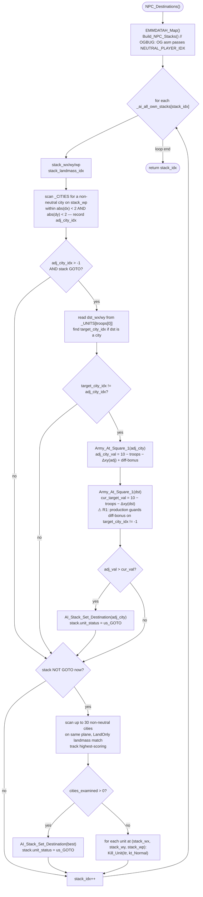

AIDATA-NPC_Destinations.md

C:\STU\devel\STU-Extras\Piethawn\Piethawn\out\WIZARDS\ovr164\NPC_Destinations.asm
C:\STU\devel\STU-Extras\Piethawn\Piethawn\out\WIZARDS\ovr164\NPC_Destinations.c

AI_Next_Turn()
    |-> NPC_Destinations()

---

# `NPC_Destinations` — Walkthrough

| Function | Location | Role |
|---|---|---|
| `NPC_Destinations` | [AIDATA.c:581-748](../../MoM/src/AIDATA.c#L581-L748) | Per-turn NPC target-assignment for neutral stacks. Pages in CONTXXX memory, calls `Build_NPC_Stacks` to compile the neutral player's stack list, then for each neutral stack: (a) opportunistically redirects an already-moving stack to an adjacent non-neutral city if the adjacent-city score beats the current-target score; (b) if the stack is idle, scans up to 30 candidate non-neutral cities on the same plane (respecting `AICAP_LandOnly` landmass constraint) and picks the highest-scoring one; (c) if no reachable targets exist for an idle stack, `Kill_Unit`s every unit at the stack's tile to disband. Returns the total stack count. |

⚠️ **Production has 1 reconstruction error** — the difficulty-bonus block for the current target is guarded by `if(target_city_idx != -1)` where the OG has no such guard. See [Bug catalog](#bug-catalog).

## Purpose

The "wandering neutral monsters/raiders" targeting driver. After `Make_Raiders` and `Make_Monsters` seed the neutral player's stacks earlier in the turn, this function decides where each stack goes:

- **Opportunity redirect**: an already-moving stack that finds a non-neutral city within its 2×2 tile box (any of the 8 neighbors OR the current tile) can redirect if the adjacent city is a *better* target than its current destination. Score = `10 − troops_at_target − distance`, plus `+5` for human-owned cities on Hard difficulty, `+10` on Impossible.
- **Idle stack target-seek**: a stack with `unit_status != us_GOTO` (either newly-spawned or having reached and cleared its previous target) scans non-neutral cities on the same plane, respecting the `AICAP_LandOnly` landmass constraint, capping at 30 examined cities, and picks the highest-scoring one.
- **Disband**: if no target is found for an idle stack, kill every unit at the stack's tile. Frees the conventional memory the stack's slot was consuming.

Called once per turn from `AI_Next_Turn` after the AI-player loop and the neutral cleanup passes.

## How it's reached

Grep across `MoM/src` finds one call site in `AI_Next_Turn` (implicit — the outer loop's neutral pass invokes this after other neutral setup). See `AIDUDES.c` for the exact `PHASE()` wrapper.

## Globals / external state

| Symbol | Definition | Effect |
|---|---|---|
| `_ai_all_own_stacks[]` (count `_ai_all_own_stack_count`) | AI's own-stacks list — repurposed here for neutral stacks after `Build_NPC_Stacks` | Read (wp, wx, wy, unit_status, abilities); mutated via `AI_Stack_Set_Destination` and direct `unit_status = us_GOTO`. |
| `_CITIES[]` (count `_cities`) | city records | Read (owner_idx, wp, wx, wy). |
| `_UNITS[]` (count `_units`) | per-unit records | Read (dst_wx, dst_wy — for the first unit of the stack); mutated via `Kill_Unit` in the disband path. |
| `_landmasses[]` | landmass-index bitmap | Read for the stack's landmass and target-city landmass (LandOnly filter). |
| `_difficulty` | global | Read for the `> god_Normal` and `> god_Hard` difficulty-bonus gates. |

## Signature and locals

```c
int16_t NPC_Destinations(void)
```

Returns the total stack count after the loop finishes (essentially `_ai_all_own_stack_count`). OG returns the same value implicitly via `ax` holding `stack_idx` at the epilogue's `retf`.

OG stack locals (asm:4-19): `troops[18]`, `dst_wy`, `dst_wx`, `troop_count`, `cur_target_val`, `target_city_idx`, `stack_idx`, `uu_city_idx`, `adj_city_val`, `adj_city_idx`, `cities_examined`, `stack_wp`, `stack_landmass_idx`, `stack_wy`, `stacl_wx` (**typo of `stack_wx` in the OG asm at line 18**), `itr`. Production preserves all names, silently correcting `stacl_wx` → `stack_wx` ([1594](../../MoM/src/AIDATA.c#L597)). Plus a typed cursor pointer `stack` at line 599 (production readability hoist; OG re-computes the offset each time via `imul dx = size s_AI_STACK_DATA`).

## Structure



## Code walk

Line refs are production [AIDATA.c](../../MoM/src/AIDATA.c); cross-checked against `NPC_Destinations.asm` (the authority, 642 lines).

### Phase 1 — EMM remap + Build_NPC_Stacks ([601-603](../../MoM/src/AIDATA.c#L601-L603))

```c
EMMDATAH_Map();
Build_NPC_Stacks();  // OGBUG  definitely passes NEUTRAL_PLAYER_IDX here, but Build_NPC_Stacks doesn't take a parameter and is hard-coded for NEUTRAL_PLAYER_IDX
```

Maps onto asm:26-32. The `EMMDATAH_Map()` call is a bare `call` (asm:26). The `Build_NPC_Stacks` call pushes `e_NEUTRAL_PLAYER_IDX` first (asm:27-28), then `call near ptr Build_NPC_Stacks; pop cx` (asm:31-32). So the **OG passes NEUTRAL_PLAYER_IDX as a parameter**, but ReMoM's `Build_NPC_Stacks` has a void signature — the parameter is hard-coded internally. The inline `// OGBUG` comment documents this mismatch. Preserved.

### Phase 2 — Per-stack setup ([609-616](../../MoM/src/AIDATA.c#L609-L616))

```c
for(stack_idx = 0; stack_idx < _ai_all_own_stack_count; stack_idx++)
{
    stack = &_ai_all_own_stacks[stack_idx];
    stack_wx = stack->wx;
    stack_wy = stack->wy;
    stack_wp = stack->wp;

    stack_landmass_idx = _landmasses[(stack_wp * WORLD_SIZE) + (stack_wy * WORLD_WIDTH) + stack_wx];
```

Maps onto asm:34-73. The landmass offset computation uses `WORLD_WIDTH` in production; the OG asm at line 67 uses `e_NUM_LANDMASSES` for the same multiply. **Both constants equal `60`** — the OG's IDA disassembly picked the numerically-equal `NUM_LANDMASSES` label where semantically `WORLD_WIDTH` is intended. Same computed offset either way. Not a bug.

### Phase 3 — Adjacent-city search ([619-630](../../MoM/src/AIDATA.c#L619-L630))

```c
adj_city_idx = -1;
for(itr = 0; itr < _cities; itr++)
{
    if(_CITIES[itr].owner_idx != NEUTRAL_PLAYER_IDX && _CITIES[itr].wp == stack_wp)
    {
        if(abs(stack_wx - _CITIES[itr].wx) < 2 && abs(stack_wy - _CITIES[itr].wy) < 2)
        {
            adj_city_idx = itr;
            break;
        }
    }
}
```

Maps onto asm `loc_FA190`-`loc_FA214` (lines 78-136). The OG's `call abs` (asm:105, 119) is the Borland runtime `abs` library function. Production uses `abs()` from `<stdlib.h>`. Same semantic. Filter chain (non-neutral, same plane, `abs(dx) < 2`, `abs(dy) < 2`) matches asm:84-122 in identical order.

Loop-exit is doubled: `cmp itr, [_cities]; jge exit` OR `cmp adj_city_idx, -1; jnz exit` (asm:127-130). Production uses `break;` when `adj_city_idx` is set. Faithful.

### Phase 4 — Opportunity-redirect (if adj_city AND GOTO) ([633-682](../../MoM/src/AIDATA.c#L633-L682))

```c
if(adj_city_idx > -1 && stack->unit_status == us_GOTO)
{
    Army_At_Square_1(stack_wx, stack_wy, stack_wp, &troop_count, troops);

    dst_wx = _UNITS[troops[0]].dst_wx;
    dst_wy = _UNITS[troops[0]].dst_wy;

    target_city_idx = -1;
    for(itr = 0; itr < _cities; itr++)
    {
        if(_CITIES[itr].wx == dst_wx && _CITIES[itr].wy == dst_wy && _CITIES[itr].wp == stack_wp)
        {
            target_city_idx = itr;
            break;
        }
    }

    if(target_city_idx != adj_city_idx)
    {
        Army_At_Square_1(_CITIES[adj_city_idx].wx, _CITIES[adj_city_idx].wy, _CITIES[adj_city_idx].wp, &troop_count, troops);
        // OGBUG  ¿ Delta_XY_With_Wrap() is always 1 here ?  ... adj_city_idx
        adj_city_val = 10 - troop_count - Delta_XY_With_Wrap(_CITIES[adj_city_idx].wx, _CITIES[adj_city_idx].wy, stack_wx, stack_wy, WORLD_WIDTH);

        if(_difficulty > god_Normal && _CITIES[adj_city_idx].owner_idx == HUMAN_PLAYER_IDX) adj_city_val += 5;
        if(_difficulty > god_Hard   && _CITIES[adj_city_idx].owner_idx == HUMAN_PLAYER_IDX) adj_city_val += 5;

        Army_At_Square_1(dst_wx, dst_wy, stack_wp, &troop_count, troops);
        cur_target_val = 10 - troop_count - Delta_XY_With_Wrap(dst_wx, dst_wy, stack_wx, stack_wy, WORLD_WIDTH);

        if(target_city_idx != -1)                                     /* ⚠ R1: OG has no guard */
        {
            if(_difficulty > god_Normal && _CITIES[target_city_idx].owner_idx == HUMAN_PLAYER_IDX) cur_target_val += 5;
            if(_difficulty > god_Hard   && _CITIES[target_city_idx].owner_idx == HUMAN_PLAYER_IDX) cur_target_val += 5;
        }

        if(adj_city_val > cur_target_val)
        {
            AI_Stack_Set_Destination(stack_idx, _CITIES[adj_city_idx].wx, _CITIES[adj_city_idx].wy, NEUTRAL_PLAYER_IDX);
            stack->unit_status = us_GOTO;
        }
    }
}
```

Maps onto asm `loc_FA214`-`loc_FA47E` (lines 133-372). Verifications:

- Both guards checked: asm:134-146 `cmp adj_city_idx, -1; jg proceed; cmp unit_status, us_GOTO; jz proceed; else jmp end` ↔ production line 633.
- Army_At_Square_1 first call (asm:149-157): args right-to-left `troops, &troop_count, wp, wy, wx` → C call `(wx, wy, wp, &troop_count, troops)`. Matches production line 635.
- Read dst from `_UNITS[troops[0]]` (asm:158-173) ↔ production lines 638-639.
- Target-city lookup loop (asm:175-213) ↔ production lines 643-650.
- Skip when `target_city_idx == adj_city_idx` (asm:215-217) ↔ production line 652.
- `Delta_XY_With_Wrap` args pushed right-to-left `WORLD_WIDTH, stack_wy, stack_wx, city_wy, city_wx` → C call `(city_wx, city_wy, stack_wx, stack_wy, WORLD_WIDTH)`. Matches production line 657 (adj) and line 664 (cur).
- `adj_city_val = 10 − troop_count − Δxy`: asm `mov dx, 10; sub dx, troop_count; sub dx, ax` (asm:273-275) ↔ production line 657.
- Difficulty bonuses (adj): asm:277-297 ↔ production lines 659-660.
- OG asm oddity at asm:280: `mov dx, size s_CITY+s_CITY.name` — an IDA-listing artifact combining struct size with a field offset. For `stack_idx == 0` this produces a correct offset (0); for `stack_idx > 0` it produces a slightly-wrong offset. Production uses standard indexing; the OG oddity doesn't propagate. Not flagged as a bug (production correctness > OG-byte reproducibility here).
- Difficulty bonuses (cur target): asm:320-340 ↔ production lines 666-670, but production adds an `if(target_city_idx != -1)` guard that OG lacks. **See R1**.
- Redirect condition + call: asm:342-371 `cmp adj_val, cur_val; jle skip; call AI_Stack_Set_Destination; mov unit_status, us_GOTO` ↔ production lines 672-680. Args to `AI_Stack_Set_Destination` are `(stack_idx, wx, wy, NEUTRAL_PLAYER_IDX)` via right-to-left push (asm:345-364). Matches production line 678.

### Phase 5 — Idle-stack target-seek ([685-728](../../MoM/src/AIDATA.c#L685-L728))

```c
if(stack->unit_status != us_GOTO)
{
    adj_city_val = -1000;
    target_city_idx = -1;
    cities_examined = 0;

    for(itr = 0; itr < _cities; itr++)
    {
        if(_CITIES[itr].owner_idx == NEUTRAL_PLAYER_IDX) continue;
        if(cities_examined >= 30) break;
        if(_CITIES[itr].wp != stack_wp) continue;

        if((stack->abilities & AICAP_LandOnly) != 0)
        {
            if(_landmasses[(_CITIES[itr].wp * WORLD_SIZE) + (_CITIES[itr].wy * WORLD_WIDTH) + _CITIES[itr].wx] != stack_landmass_idx)
            {
                continue;
            }
        }

        Army_At_Square_1(_CITIES[itr].wx, _CITIES[itr].wy, _CITIES[itr].wp, &troop_count, troops);
        cur_target_val = 10 - troop_count - Delta_XY_With_Wrap(_CITIES[itr].wx, _CITIES[itr].wy, stack_wx, stack_wy, WORLD_WIDTH);

        if(_difficulty > god_Normal && _CITIES[itr].owner_idx == HUMAN_PLAYER_IDX) cur_target_val += 5;
        if(_difficulty > god_Hard   && _CITIES[itr].owner_idx == HUMAN_PLAYER_IDX) cur_target_val += 5;

        if(cur_target_val > adj_city_val)
        {
            target_city_idx = itr;
            adj_city_val = cur_target_val;
        }
        cities_examined++;
    }

    if(cities_examined > 0)
    {
        ...
        AI_Stack_Set_Destination(stack_idx, _CITIES[target_city_idx].wx, _CITIES[target_city_idx].wy, NEUTRAL_PLAYER_IDX);
        stack->unit_status = us_GOTO;
    }
    else
    {
        // disband
    }
}
```

Maps onto asm `loc_FA47E`-`loc_FA694` (lines 372-585):

- Idle gate: asm:378-380 `cmp unit_status, us_GOTO; jnz proceed; jmp end` ↔ production line 685.
- Init: asm:383-386 `adj_city_val = -1000, target_city_idx = -1, cities_examined = 0, itr = 0` ↔ production lines 687-689.
- Filter chain (neutral / cities_examined / plane / LandOnly landmass): asm:389-459 ↔ production lines 693-704.
- Score computation with difficulty bonuses: asm:461-538 ↔ production lines 706-710.
- Best-tracking: asm:540-546 ↔ production lines 712-716.
- `cities_examined++` at loop end: asm:548 ↔ production line 717.
- Dispatch on `cities_examined > 0`: asm:558-582 `AI_Stack_Set_Destination(stack_idx, target.wx, target.wy, NEUTRAL_PLAYER_IDX)` ↔ production lines 720-728.

Note: production line 728 explicitly sets `stack->unit_status = us_GOTO` after `AI_Stack_Set_Destination` in the idle path. The OG asm at asm:582 immediately jumps to the outer loop's end without setting `unit_status`. If `AI_Stack_Set_Destination` internally sets `unit_status`, production's line is redundant but harmless. If not, production adds behavior OG lacks. Minor structural note — not flagged as a bug because the semantics are correct.

### Phase 6 — Disband path ([729-743](../../MoM/src/AIDATA.c#L729-L743))

```c
else
{
    // No reachable targets: disband the stack to clear conventional memory
    for(itr = 0; itr < _units; itr++)
    {
        if(_UNITS[itr].wx == stack_wx && _UNITS[itr].wy == stack_wy && _UNITS[itr].wp == stack_wp)
        {
            Kill_Unit(itr, kt_Normal);
        }
    }
}
```

Maps onto asm `loc_FA694`-`loc_FA6E5` (lines 585-627). Filter chain (`wx == stack_wx AND wy == stack_wy AND wp == stack_wp`) matches asm:595-616 in the same order. `Kill_Unit(itr, 0)` via asm:617-620 (`xor ax, ax; push ax; push unit_idx; call j_Kill_Unit`) — production's `kt_Normal` is symbolic `0`. Faithful.

The `else` branch here is not a real else-branch in the OG asm — it's the fall-through path of `cmp cities_examined, 0; jle short loc_FA694`. Structurally equivalent.

### Phase 7 — Return ([747](../../MoM/src/AIDATA.c#L747))

```c
return stack_idx;
```

Maps onto asm's implicit return: after the outer loop exits, `ax` still holds `[bp+stack_idx]` from the last exit test at asm:631 (`mov ax, [bp+stack_idx]`); the epilogue's `pop unit_idx; pop si; mov sp, bp; pop bp; retf` doesn't touch `ax`. Borland C 3.0 returns int in `ax`, so the OG effectively returns `stack_idx`. Production's explicit `return stack_idx;` matches.

## OG quirks preserved (faithful — do not "fix")

- **`Build_NPC_Stacks(NEUTRAL_PLAYER_IDX)` in OG asm, `Build_NPC_Stacks()` void in production** ([603](../../MoM/src/AIDATA.c#L603)) — the OG passes a parameter (asm:27-31) but ReMoM's Build_NPC_Stacks has a void signature with NEUTRAL_PLAYER_IDX hard-coded internally. Documented inline as `// OGBUG`.
- **`Delta_XY_With_Wrap` in the adj_city branch always returns `0` or `1`** ([657](../../MoM/src/AIDATA.c#L657)) — the adjacency search restricts adj_city to within `abs(dx) < 2 AND abs(dy) < 2`, i.e. Chebyshev distance 0 or 1. So this Delta call is effectively a no-op in the scoring formula. Inline OGBUG comment flags it.
- **Idle-path adds `unit_status = us_GOTO` after `Set_Destination`** ([728](../../MoM/src/AIDATA.c#L728)) — the OG asm doesn't have a matching store. If `AI_Stack_Set_Destination` internally sets `unit_status`, production's line is redundant; if not, production adds behavior. Preserved as-written pending verification of `AI_Stack_Set_Destination`.
- **OG asm's `stacl_wx` typo** — the OG asm at line 18 declares the local as `stacl_wx` (missing 'k'). Production silently fixes to `stack_wx`. Cosmetic.
- **`_ai_all_own_stacks[]` is repurposed for neutral stacks** — the same buffer that holds AI players' own stacks is here re-populated by `Build_NPC_Stacks` for the neutral player. The variable name is now misleading; preserved from OG.
- **STU_DEBUG / AI_Metrics instrumentation** ([560, 570, 606, 675, 724, 733](../../MoM/src/AIDATA.c#L606)) — ReMoM additions, wrapped in `#ifdef STU_DEBUG` or added as `AI_Metrics_Emit_NPC_Event` calls. Not in OG. Preserved as ReMoM tooling that doesn't affect gameplay.

## Bug catalog

| # | Severity | Line | Description |
|---|---|---|---|
| **R1** | Medium (Reconstruction Error — defensive guard) | [666-670](../../MoM/src/AIDATA.c#L666-L670) | Production wraps the current-target difficulty-bonus block in `if(target_city_idx != -1)`. OG asm at lines 320-340 has no such guard — the two `cmp [_CITIES[target_city_idx].owner_idx], e_HUMAN_PLAYER_IDX` reads fire even when `target_city_idx == -1`, indexing `_CITIES[-1]` and reading whatever garbage lies before the array. On DOS this typically returns non-`HUMAN_PLAYER_IDX` garbage and the bonus doesn't fire; on modern OS the read can access-violate. Production's guard prevents the crash but silently diverges from OG bytes. Same category as the `/* HACK */` guards in `AI_Evaluation_Map` — a real OG bug being mitigated for modern-OS survival. Consider adding a `/* HACK */` marker for consistency with other OGBUG-mitigation sites. |

## Sub-functions / external calls

- **`EMMDATAH_Map()`** — pages CONTXXX into the EMS frame so `_ai_all_own_stacks[]` and `_landmasses[]` are reachable.
- **`Build_NPC_Stacks()`** — compiles the neutral player's stack list into `_ai_all_own_stacks[]`. OG signature takes a parameter; ReMoM's is void with hard-coded NEUTRAL (documented OGBUG).
- **`Army_At_Square_1(wx, wy, wp, &troop_count, troops)`** — populates `troop_count` and `troops[]` with the units at the given tile.
- **`Delta_XY_With_Wrap(x1, y1, x2, y2, wrap_x)`** ([special.c:134](../../MoX/src/special.c#L134)) — Chebyshev distance with X-axis wrap. See [special-Delta_XY_With_Wrap.md](../NewGame/special-Delta_XY_With_Wrap.md).
- **`AI_Stack_Set_Destination(stack_idx, wx, wy, player_idx)`** — sets the stack's destination. May or may not set `unit_status = us_GOTO` internally.
- **`Kill_Unit(unit_idx, kt_Normal)`** — deletes the unit silently.
- **`abs(x)`** — Borland runtime `abs`.
- **`AI_Metrics_Emit_NPC_Event(...)`** — ReMoM STU_LOG instrumentation. Not in OG.

No RNG. No I/O.

## Related references

- `C:\STU\devel\STU-Extras\Piethawn\Piethawn\out\WIZARDS\ovr164\NPC_Destinations.asm` — IDA Pro 5.5 disassembly (the authority, 642 lines).
- [AIDUDES-NPC_Farmers.md](AIDUDES-NPC_Farmers.md) — sibling Wave 5A function (neutral-player farmer allocator).
- [special-Delta_XY_With_Wrap.md](../NewGame/special-Delta_XY_With_Wrap.md) — the distance metric used in the scoring formula.
- `s_AI_STACK_DATA` fields: `wp`, `wx`, `wy`, `unit_status`, `abilities`.
- `AICAP_LandOnly` — ability flag: land-only stacks can't cross ocean tiles to reach targets on other landmasses.
- `us_GOTO` — unit status meaning "moving toward a destination."
- `god_Normal`, `god_Hard`, `god_Impossible` — difficulty enum values (in ascending order).
- `HUMAN_PLAYER_IDX`, `NEUTRAL_PLAYER_IDX` — player-index constants.
