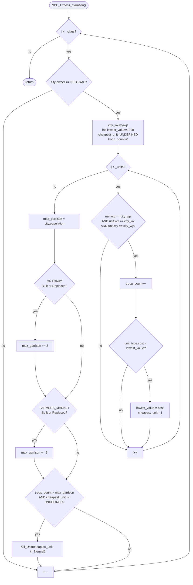

AIDATA-NPC_Excess_Garrison.md

C:\STU\devel\STU-Extras\Piethawn\Piethawn\out\WIZARDS\ovr164\NPC_Excess_Garrison.asm
C:\STU\devel\STU-Extras\Piethawn\Piethawn\out\WIZARDS\ovr164\NPC_Excess_Garrison.c

AI_Next_Turn()
    |-> NPC_Excess_Garrison()

---

# `NPC_Excess_Garrison` — Walkthrough

| Function | Location | Role |
|---|---|---|
| `NPC_Excess_Garrison` | [AIDATA.c:53-120](../../MoM/src/AIDATA.c#L53-L120) | Per-turn NPC garrison cap enforcer. For each neutral-owned city, count units currently on the city tile (exact `wp/wx/wy` triple match) and track the single cheapest one by `_unit_type_table[type].cost`. Compare the count against `population + 2*(has_Granary) + 2*(has_FarmersMarket)`; if exceeded AND a cheapest was found, `Kill_Unit(cheapest, kt_Normal)`. Removes exactly one unit per over-capacity city per turn. |

Verified faithful to the disassembly `NPC_Excess_Garrison.asm` throughout (structure 1:1, 193-line asm).

## Purpose

Prevents neutral cities from accumulating unbounded garrisons over long games. Neutral players don't build units directly, but they receive units via `Make_Raiders` fallback increments and stray unit-transfers; without a cap, mid-to-late game neutral cities would stack indefinitely.

- **Scope**: neutral player only (`owner_idx == NEUTRAL_PLAYER_IDX`). AI wizards and the human manage their own garrisons.
- **Garrison definition**: any unit whose `(wp, wx, wy)` triple exactly matches the city's `(wp, wx, wy)`. Adjacent squares don't count. Stacks on the city tile do.
- **Cap formula**: `population + 2*(Granary in {Built, Replaced}) + 2*(FarmersMarket in {Built, Replaced})`. Base scales with city size; +2 per food-improving building.
- **Cull target**: the *cheapest* unit in the garrison, chosen by `_unit_type_table[type].cost`. Ties broken by first-seen (later units at the same cost don't replace). Init `lowest_value = 1000` acts as the ceiling — any real unit type is under 1000 cost.
- **Cull rate**: exactly one unit per city per turn. If the garrison is 5 over cap, this function takes 5 turns to drain it.

## How it's reached

| Caller | Site | Notes |
|---|---|---|
| `AI_Next_Turn` NPC event phase | [AIDUDES.c:379](../../MoM/src/AIDUDES.c#L379) `PHASE(NPC_Excess_Garrison())` | Once per turn. |

## Globals / external state

| Symbol | Definition | Effect |
|---|---|---|
| `_CITIES[]` (count `_cities`) | city records | Read (`owner_idx`, `wx`, `wy`, `wp`, `population`, `bldg_status[GRANARY / FARMERS_MARKET]`). |
| `_UNITS[]` (count `_units`) | unit records | Read (`wx`, `wy`, `wp`, `type`) for the garrison scan. |
| `_unit_type_table[]` | per-unit-type data | Read (`cost`) to identify the cheapest garrison unit. |
| `Kill_Unit(unit_idx, kt_Normal)` | unit removal | Called at most once per city per invocation. |

## Signature and locals

```c
void NPC_Excess_Garrison(void)
```

OG stack locals (asm:4-10) + register locals (asm:11-12):

| OG name | Production name | Register/slot |
|---|---|---|
| `Max_Garrison_Count` | `max_garrison` | bp-0Eh |
| `city_wp` | `city_wp` | bp-0Ch |
| `city_wy` | `city_wy` | bp-0Ah |
| `city_wx` | `city_wx` | bp-8 |
| `unit_idx` | `cheapest_unit` | bp-6 |
| `lowest_unit_type_cost` | `lowest_value` | bp-4 |
| `Garrison_Count` | `troop_count` | bp-2 |
| `itr_cities` | `i` | SI register |
| `itr_units` | `j` | DI register |

Production shortens several OG names (`unit_idx` → `cheapest_unit`, `lowest_unit_type_cost` → `lowest_value`, `Garrison_Count` → `troop_count`, `itr_cities` → `i`, `itr_units` → `j`). Semantics preserved. A future naming pass could restore the OG-descriptive names per project convention; not tracked as an R error.

## Structure



## Code walk

Line refs are production [AIDATA.c](../../MoM/src/AIDATA.c); cross-checked against `NPC_Excess_Garrison.asm` (193 lines).

### Phase 1 — Outer city loop + neutral filter ([65-67](../../MoM/src/AIDATA.c#L65-L67))

```c
for(i = 0; i < _cities; i++)
{
    if(_CITIES[i].owner_idx == NEUTRAL_PLAYER_IDX)
    {
```

Maps onto asm:19-31. `xor itr_cities, itr_cities; jmp loc_F9913` (asm:20-21) → init to 0 and jump to loop-exit test at `loc_F9913` (asm:182-185). Loop-exit test: `cmp itr_cities, [_cities]; jge exit; else jmp loc_F978D`. Non-neutral cities skip via `jmp loc_F9912` (asm:31) → the `inc itr_cities` at asm:181.

`NEUTRAL_PLAYER_IDX = 5` (asm:29 `cmp ..., 5`). ✓

### Phase 2 — Read city position + init inner-loop trackers ([69-77](../../MoM/src/AIDATA.c#L69-L77))

```c
city_wx = _CITIES[i].wx;
city_wy = _CITIES[i].wy;
city_wp = _CITIES[i].wp;

lowest_value = 1000;
cheapest_unit = ST_UNDEFINED;
troop_count = 0;

for(j = 0; j < _units; j++)
```

Maps onto asm:33-62. Position reads use `mov al, [byte]; cbw` (asm:39-40, 47-48, 55-56) to sign-extend byte fields to word — production `int16_t` assignments from `int8_t` city fields do the same. `lowest_value = 1000` is a genuine ceiling — every unit type's cost is well under 1000.

### Phase 3 — Inner unit-scan with position + cost filter ([79-92](../../MoM/src/AIDATA.c#L79-L92))

```c
for(j = 0; j < _units; j++)
{
    if(_UNITS[j].wp == city_wp && 
        _UNITS[j].wx == city_wx && 
        _UNITS[j].wy == city_wy)
    {
        troop_count++;

        /* Check cost of unit to find the cheapest in the garrison */
        if(_unit_type_table[_UNITS[j].type].cost < lowest_value)
        {
            lowest_value = _unit_type_table[_UNITS[j].type].cost;
            cheapest_unit = j;
        }
    }
}
```

Maps onto asm:64-124. Position filters (asm:64-91) run in `wp → wx → wy` order — same as production's short-circuit `&&` chain.

Cost comparison at asm:104-105: `cmp ax, [bp+lowest_unit_type_cost]; jge short loc_F9880` — skip if cost >= lowest. Production's `< lowest_value` matches (jge-to-skip inverts to `<` at the language level). ✓

**OG cost re-lookup quirk** (asm:106-116) — the OG re-reads `_UNITS[itr].type` and `_unit_type_table[type].cost` a second time when storing to `lowest_unit_type_cost`, even though the value is already in AX from the compare. Compiler artifact from Borland C not hoisting the value across the `jge` branch. Production's single expression `lowest_value = _unit_type_table[_UNITS[j].type].cost;` produces the same result. ✓

**Tie-break**: `<` (strict less-than) means the first unit at any given minimum cost wins; later units at the same cost don't replace. Preserved.

### Phase 4 — Max garrison computation ([94-107](../../MoM/src/AIDATA.c#L94-L107))

```c
max_garrison = _CITIES[i].population;

if(_CITIES[i].bldg_status[GRANARY] == bs_Built || 
    _CITIES[i].bldg_status[GRANARY] == bs_Replaced)
{
    max_garrison += 2;
}

if(_CITIES[i].bldg_status[FARMERS_MARKET] == bs_Built || 
    _CITIES[i].bldg_status[FARMERS_MARKET] == bs_Replaced)
{
    max_garrison += 2;
}
```

Maps onto asm:126-167. Base is city population (asm:132 `mov al, [es:bx+s_CITY.population]; cbw`). Then two independent `Built OR Replaced → +2` checks.

Building offsets verified:
- `bldg_status+1Dh` (asm:140, 147) — offset 29 == `GRANARY` per [MOM_DEF.h:611](../../MoX/src/MOM_DEF.h#L611) (`GRANARY = 0x1D`). ✓
- `bldg_status+1Eh` (asm:157, 164) — offset 30 == `FARMERS_MARKET` per [MOM_DEF.h:612](../../MoX/src/MOM_DEF.h#L612) (`FARMERS_MARKET = 0x1E`). ✓

Both use `jz proceed; else check Replaced; jnz skip` — the standard "Built OR Replaced" pattern. Production `||` chain matches. ✓

### Phase 5 — Excess check + cull ([110-117](../../MoM/src/AIDATA.c#L110-L117))

```c
if(troop_count > max_garrison && cheapest_unit != ST_UNDEFINED)
{
#ifdef STU_DEBUG
    LOG_DEBUG(LOG_CAT_AIMOVE, "AI_NPC: Excess garrison at city %d (%d/%d), removing unit %d (type %d)", i, troop_count, max_garrison, cheapest_unit, _UNITS[cheapest_unit].type);
#endif
    AI_Metrics_Emit_NPC_Event(_turn, "GARRISON_CULL", i, city_wx, city_wy, city_wp, 1, 0, 0, 0, troop_count, max_garrison);
    Kill_Unit(cheapest_unit, kt_Normal);
}
```

Maps onto asm:168-179:

```asm
loc_F98F7:
mov ax, [bp+Garrison_Count]
cmp ax, [bp+Max_Garrison_Count]
jle short loc_F9912                 ; troop_count <= max → skip
cmp [bp+unit_idx], e_ST_UNDEFINED
jz short loc_F9912                   ; cheapest == UNDEFINED → skip
xor ax, ax                           ; kt_Normal (0)
push ax
push [bp+unit_idx]
call j_Kill_Unit
pop cx
pop cx
```

- Gate 1: `jle skip` — production `troop_count > max_garrison` matches (inverted). ✓
- Gate 2: `jz skip` — production `cheapest_unit != ST_UNDEFINED` matches. ✓
- `Kill_Unit` args right-to-left: `0 (=kt_Normal), unit_idx` → C `Kill_Unit(cheapest_unit, kt_Normal)`. ✓

STU_DEBUG `LOG_DEBUG` and `AI_Metrics_Emit_NPC_Event` are ReMoM additions between the gate and the `Kill_Unit` call — not in OG.

**One-cull-per-city semantic**: `Kill_Unit` fires at most once per city per invocation. If the garrison is 5 over cap, this function only trims 1; the remaining 4 wait for next turn. Preserved OG behavior.

## OG quirks preserved (faithful — do not "fix")

- **Position match is exact-triple (`wp` AND `wx` AND `wy`)** ([79-81](../../MoM/src/AIDATA.c#L79-L81)) — no adjacent-square counting. Units one tile away from the city do NOT count against the garrison cap. Preserved.
- **`lowest_value = 1000` ceiling** ([73](../../MoM/src/AIDATA.c#L73)) — every unit type's `cost` is under 1000, so any real unit displaces the sentinel. Preserved.
- **Strict-less-than tie-break** ([86](../../MoM/src/AIDATA.c#L86)) — first unit at any given minimum cost wins; the second-cheapest at same cost is not tracked as a fallback. Preserved.
- **Cull rate: 1 per city per invocation** — the excess check + Kill_Unit are outside any inner loop. Draining a heavily-overcapped garrison takes N turns for N-over. Preserved.
- **`population` used as raw count**, not scaled to `Pop_10s × 10` — population field in OG is a small integer (typical range 1-25 for MoM city sizes). Base cap is small; buildings add 2 each. Preserved.
- **Only Granary and Farmers Market grant garrison bonuses** — Marketplace, Bank, Merchants' Guild, etc. do NOT. Only food-improving buildings scale the cap. Preserved OG semantic.
- **`Building = Built OR Replaced`** ([97-98](../../MoM/src/AIDATA.c#L97-L98), [103-104](../../MoM/src/AIDATA.c#L103-L104)) — `bs_Replaced` is the state for a building superseded by an upgrade. Treated as still present. Preserved.
- **Cost-lookup re-computed after compare** (asm:106-116) — OG's Borland C artifact; production's cleaner single-expression assignment gives identical results.
- **`itr_cities` in SI, `itr_units` in DI** (asm:11-12) — both loop counters live in registers, not stack slots. Compiler layout choice; preserved as-is by production `i`/`j` locals (the compiler will re-decide register allocation).
- **STU_DEBUG / AI_Metrics instrumentation** — ReMoM addition. Not in OG.

## Sub-functions / external calls

- **`Kill_Unit(unit_idx, kt_Normal)`** — removes the target unit. `kt_Normal == 0`. Same signature used across `Make_Raiders`, `AI_Kill_Excess_Settlers_And_Engineers`, and here.
- **`AI_Metrics_Emit_NPC_Event(...)`** — ReMoM STU_LOG instrumentation. Not in OG.

No RNG in this function. No EMM paging. No table lookups outside `_unit_type_table[type].cost`.

## Related references

- `C:\STU\devel\STU-Extras\Piethawn\Piethawn\out\WIZARDS\ovr164\NPC_Excess_Garrison.asm` — IDA Pro 5.5 disassembly (the authority, 193 lines).
- [`AIDUDES-AI_Kill_Excess_Settlers_And_Engineers.md`](AIDUDES-AI_Kill_Excess_Settlers_And_Engineers.md) — sibling cap-enforcer for owned settlers and engineers by landmass. Different scope (per-landmass ownership rather than per-city neutral tile match) but same "one cull per pass" cadence.
- [`AIDATA-Make_Raiders.md`](AIDATA-Make_Raiders.md), [`AIDATA-Make_Monsters.md`](AIDATA-Make_Monsters.md) — the neutral-player spawn drivers whose output populates the garrisons this function trims.
- `s_CITY` fields: `owner_idx`, `wx`, `wy`, `wp`, `population`, `bldg_status[GRANARY]`, `bldg_status[FARMERS_MARKET]`.
- `s_UNIT` fields: `wx`, `wy`, `wp`, `type`.
- `s_UNIT_TYPE` fields: `cost`.
- Constants: `NEUTRAL_PLAYER_IDX = 5`, `GRANARY = 0x1D`, `FARMERS_MARKET = 0x1E`, `bs_Built`, `bs_Replaced`, `kt_Normal = 0`, `ST_UNDEFINED = -1`.
