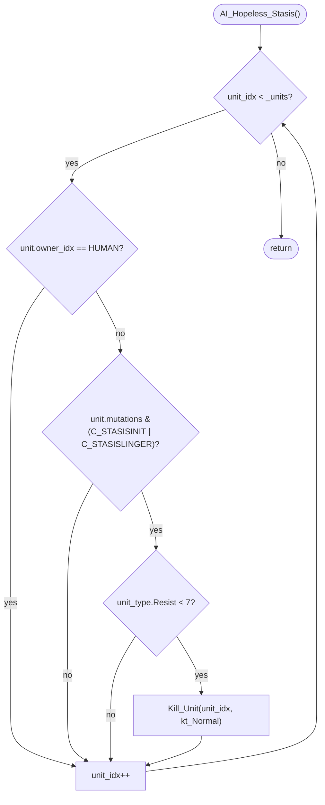

AIDUDES-AI_Hopeless_Stasis.md

C:\STU\devel\STU-Extras\Piethawn\Piethawn\out\WIZARDS\ovr145\AI_Hopeless_Stasis.asm
C:\STU\devel\STU-Extras\Piethawn\Piethawn\out\WIZARDS\ovr145\AI_Hopeless_Stasis.c

AI_Next_Turn()
    |-> AI_Hopeless_Stasis()

---

# `AI_Hopeless_Stasis` — Walkthrough

| Function | Location | Role |
|---|---|---|
| `AI_Hopeless_Stasis` | [AIDUDES.c:1994-2012](../../MoM/src/AIDUDES.c#L1994-L2012) | Per-turn AI garbage-collect for units that are permanently trapped in Stasis. For each non-HUMAN unit whose `mutations` bit-field has `C_STASISINIT` or `C_STASISLINGER` set AND whose `_unit_type_table[type].Resist < 7`, calls `Kill_Unit(unit_idx, kt_Normal)`. Frees unit slots for stasis-locked units that will (almost) never break free. |

Verified faithful to the disassembly `AI_Hopeless_Stasis.asm` throughout (structure 1:1, 53-line asm — one of the smallest reconstructed functions in the AI subsystem).

## Purpose

The Stasis spell (Sorcery, overland target-single-unit) locks an enemy unit into a two-phase frozen state:

- **`C_STASISINIT`** (`0x40`) — the initiation turn; unit is frozen and cannot act.
- **`C_STASISLINGER`** (`0x80`) — subsequent turns; unit is still frozen. To break free, the unit must pass a Resist check each turn.

A unit with low `Resist` (< 7) has a very low probability of ever breaking free from Lingering Stasis. Rather than letting these effectively-dead units occupy slots in `_UNITS[]` (which is capped at `MAX_UNIT_COUNT = 1000`), this function pre-emptively kills them. Applies to **AI wizards' AND neutrals'** units — anything non-HUMAN. The human's stasis-locked units are left alone (so the player can watch them slowly rot away, or use their own dispel/purify to save them).

- **Scope**: any unit with `owner_idx != HUMAN_PLAYER_IDX`. Includes NEUTRAL_PLAYER_IDX.
- **Trigger bits**: `mutations & (C_STASISINIT | C_STASISLINGER)` — bitwise OR, either bit qualifies.
- **Resist threshold**: `_unit_type_table[type].Resist < 7`. Units with base Resist 7+ get a real chance to break out, so they're kept. Low-Resist units (Spearmen at Resist 4, most Normal-tier units) are hopeless.
- **Cull rate**: one pass over all `_units`. Every qualifying unit dies in a single invocation — no cap on kills per turn (unlike the sibling [`NPC_Excess_Garrison`](AIDATA-NPC_Excess_Garrison.md) which caps at 1 per city).

## How it's reached

| Caller | Site | Notes |
|---|---|---|
| `AI_Next_Turn` NPC event phase | [AIDUDES.c:380](../../MoM/src/AIDUDES.c#L380) `PHASE(AI_Hopeless_Stasis())` | Once per turn, in the NPC events phase alongside `Make_Raiders`, `Make_Monsters`, `NPC_Excess_Garrison`. |

## Globals / external state

| Symbol | Definition | Effect |
|---|---|---|
| `_UNITS[]` (count `_units`) | unit records | Read (`owner_idx`, `mutations`, `type`) for every unit; targets are killed via `Kill_Unit`. |
| `_unit_type_table[]` | per-unit-type data | Read (`Resist`) to gate the kill. |
| `Kill_Unit(unit_idx, kt_Normal)` | unit removal | Called once per qualifying unit. `kt_Normal == 0`. |

## Signature and locals

```c
void AI_Hopeless_Stasis(void)
```

OG local (asm:4): just `unit_idx` in the SI register. No stack locals — the function is small enough that the compiler used a register-only frame.

Production local: `int16_t unit_idx = 0;` at [line 1996](../../MoM/src/AIDUDES.c#L1996). Name matches OG's `unit_idx`. No shortening.

## Structure



## Code walk

Line refs are production [AIDUDES.c](../../MoM/src/AIDUDES.c); cross-checked against `AI_Hopeless_Stasis.asm` (53 lines).

### Phase 1 — Loop init ([1996-1997](../../MoM/src/AIDUDES.c#L1996-L1997))

```c
int16_t unit_idx = 0;
for (unit_idx = 0; unit_idx < _units; unit_idx++)
```

Maps onto asm:8-9 + asm:46-48:

```asm
xor unit_idx, unit_idx         ; unit_idx = 0
jmp short loc_D4B14             ; to loop-exit test
...
loc_D4B14:
cmp unit_idx, [_units]
jl short loc_D4AC2              ; unit_idx < _units → loop body
```

Standard "jump into loop-exit test" pattern. ✓

### Phase 2 — HUMAN filter ([1999-2002](../../MoM/src/AIDUDES.c#L1999-L2002))

```c
if(_UNITS[unit_idx].owner_idx == HUMAN_PLAYER_IDX)
{
    continue;
}
```

Maps onto asm:11-18:

```asm
loc_D4AC2:
[read owner_idx via s_UNIT.owner_idx byte]
cmp [es:bx+s_UNIT.owner_idx], e_HUMAN_PLAYER_IDX
jz short loc_D4B13              ; == HUMAN → skip to next iter
```

`HUMAN_PLAYER_IDX = 0` (asm:17 `cmp ..., 0` implicitly). Production `continue` corresponds to `jz loc_D4B13` where `loc_D4B13` is the `inc unit_idx` label at asm:44. ✓

### Phase 3 — Stasis mutations filter ([2003-2006](../../MoM/src/AIDUDES.c#L2003-L2006))

```c
if(!(_UNITS[unit_idx].mutations & (C_STASISINIT | C_STASISLINGER)))
{
    continue;
}
```

Maps onto asm:19-25:

```asm
[read mutations byte]
test [es:bx+s_UNIT.mutations], C_STASISINIT or C_STASISLINGER
jz short loc_D4B13              ; no stasis bits → skip
```

The `or` in asm:24 is the assembler's OR-combining directive — `C_STASISINIT or C_STASISLINGER` = `0x40 | 0x80` = `0xC0`. `test AL, 0xC0; jz skip` — jump if none of the target bits are set. Production's `!(mutations & mask) → continue` matches. ✓

Constants verified at [MOM_DEF.h:762-763](../../MoX/src/MOM_DEF.h#L762-L763): `C_STASISINIT = 0x40`, `C_STASISLINGER = 0x80`.

### Phase 4 — Resist gate + Kill_Unit ([2007-2010](../../MoM/src/AIDUDES.c#L2007-L2010))

```c
if(_unit_type_table[_UNITS[unit_idx].type].Resist < 7)
{
    Kill_Unit(unit_idx, kt_Normal);
}
```

Maps onto asm:26-43:

```asm
[read _UNITS[unit_idx].type, index _unit_type_table]
cmp [_unit_type_table.Resist+bx], 7
jge short loc_D4B13             ; Resist >= 7 → skip (not hopeless)
xor ax, ax                       ; kt_Normal (0)
push ax
push unit_idx
call j_Kill_Unit
pop cx
pop cx
```

- `jge skip` inverts to production's `< 7`. ✓
- `Kill_Unit` args right-to-left: `0 (=kt_Normal), unit_idx` → C `Kill_Unit(unit_idx, kt_Normal)`. ✓

Resist threshold of 7 is hardcoded — no reference to any constant. Design intent: units at Resist 7 have roughly a 50/50 chance to break free per turn (assuming standard MoM Resist mechanics), so keeping them is worth the slot. Below 7, the expected number of turns to break free is exponentially long.

### Phase 5 — Loop tail (asm:44-48)

```asm
loc_D4B13:
inc unit_idx
loc_D4B14:
cmp unit_idx, [_units]
jl short loc_D4AC2
```

Production `for(...)` loop increment + test. ✓

## OG quirks preserved (faithful — do not "fix")

- **HUMAN unit exempt** ([1999](../../MoM/src/AIDUDES.c#L1999)) — the human's stasis-locked units are left alone. Player agency: they can dispel-magic their own units, or wait. Only AI wizards and neutrals get the auto-cull. Preserved.
- **Resist threshold hardcoded at 7** ([2007](../../MoM/src/AIDUDES.c#L2007)) — no `#define STASIS_HOPELESS_RESIST` constant. Magic number in the OG. Preserved.
- **Both stasis bits treated identically** ([2003](../../MoM/src/AIDUDES.c#L2003)) — the OG uses `or` in asm:24 to combine `C_STASISINIT` and `C_STASISLINGER` into a single test mask. Production's `|` operator matches. First-turn Stasis (`INIT`) triggers the cull just as reliably as Lingering Stasis. Preserved.
- **No cull cap** — every qualifying unit dies in one pass. If Cast_Spell_Overland's Stasis just hit a big AI stack, the whole stack can vanish this turn. Preserved.
- **No AI-team check** — the killing is indiscriminate across ALL non-HUMAN owners. Wizard-A's Stasis on Wizard-B's unit results in Wizard-B's unit being culled. Wizard-B's own units in Stasis (from another wizard casting on them, or from Wizard-B's own miscast) also get culled. Preserved.
- **SI-register-only frame** (asm:4) — no stack locals besides saved BP/SI. Function is trivial enough that the Borland compiler kept `unit_idx` in a register throughout.
- **`Kill_Unit(unit_idx, kt_Normal)`** — normal-death kill type, not disintegration. Same signature used in `NPC_Excess_Garrison`, `Make_Raiders`, `AI_Kill_Excess_Settlers_And_Engineers`.

## Sub-functions / external calls

- **`Kill_Unit(unit_idx, kt_Normal)`** — removes the target unit. `kt_Normal == 0`. The only sub-call in this function.

No RNG. No EMM paging. No table lookups outside `_unit_type_table[type].Resist`. No STU_DEBUG or AI_Metrics instrumentation.

## Related references

- `C:\STU\devel\STU-Extras\Piethawn\Piethawn\out\WIZARDS\ovr145\AI_Hopeless_Stasis.asm` — IDA Pro 5.5 disassembly (the authority, 53 lines).
- [`AIDATA-NPC_Excess_Garrison.md`](AIDATA-NPC_Excess_Garrison.md), [`AIDUDES-AI_Kill_Excess_Settlers_And_Engineers.md`](AIDUDES-AI_Kill_Excess_Settlers_And_Engineers.md) — sibling per-turn `Kill_Unit`-based cullers. Different criteria (garrison overflow, ability-based landmass cap) but same "iterate all `_units`, kill on match" cadence.
- `s_UNIT` fields: `owner_idx`, `mutations`, `type`.
- `s_UNIT_TYPE` fields: `Resist`.
- Constants: `HUMAN_PLAYER_IDX = 0`, `C_STASISINIT = 0x40`, `C_STASISLINGER = 0x80`, `kt_Normal = 0`.
- Stasis spell: Sorcery realm, overland target-single-unit. Locks target for 1 turn (`INIT`), then requires per-turn Resist checks to break free (`LINGER`).
