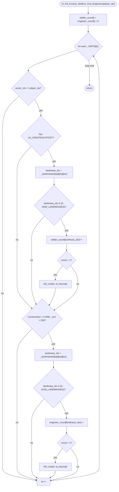

AIDUDES-AI_Kill_Excess_Settlers_And_Engineers.md

C:\STU\devel\STU-Extras\Piethawn\Piethawn\out\WIZARDS\ovr145\AI_Kill_Excess_Settlers_And_Engineers.asm
C:\STU\devel\STU-Extras\Piethawn\Piethawn\out\WIZARDS\ovr145\AI_Kill_Excess_Settlers_And_Engineers.c

AI_Next_Turn()
    |-> AI_Kill_Excess_Settlers_And_Engineers()

---

# `AI_Kill_Excess_Settlers_And_Engineers` — Walkthrough

| Function | Location | Role |
|---|---|---|
| `AI_Kill_Excess_Settlers_And_Engineers` | [AIDUDES.c:1938-2011](../../MoM/src/AIDUDES.c#L1938-L2011) | Per-AI-player: cap excess settlers and engineers to at most one each per landmass. First pass: for every owned unit with the settler-outpost ability, increment a per-landmass counter and `Kill_Unit` any beyond the first. Second pass: for every owned unit with `Construction > 0` after turn 200, do the same for engineers. Per-plane / per-landmass cull; oldest units survive (the loop kills the *later* units it encounters in `_UNITS[]`). |

Verified faithful to the disassembly `AI_Kill_Excess_Settlers_And_Engineers.asm` throughout (structure 1:1).

## Purpose

The AI's population-management guardrail. Human wizards can queue as many settlers/engineers as they like; the AI needs a cap or it accumulates redundant units draining upkeep and clogging city production. The rule:

- **Settlers** (units with the `UA_CREATEOUTPOST` ability — Barbarian/Beastman/... Settlers, one type per race): at most one per landmass per player. Every turn.
- **Engineers** (units with `Construction > 0` — the Engineer unit type, plus any race-specific variant): at most one per landmass per player, but only after turn 200. Before turn 200, unlimited (the AI is still building empires and may need concurrent road/purify projects on the same landmass).

Both caps enforce "at most one per landmass" by counting into per-landmass arrays and killing every unit that would push the count above 1. Kill order: whichever unit the outer loop reaches later in `_UNITS[]` gets killed, so effectively the *oldest* unit on each landmass survives (`_UNITS[]` is append-only).

Kill via `Kill_Unit(itr, kt_Normal)` — the "0" kill-type (`kt_Normal = 0`), meaning "just delete, no death animation or corpse tracking."

## How it's reached

| Caller | Site | Notes |
|---|---|---|
| `AI_Next_Turn` per-AI loop | Called per AI player per turn in `AI_Next_Turn`'s post-orders cleanup phase. | No self-throttle. |

## Globals / external state

| Symbol | Definition | Effect |
|---|---|---|
| `_UNITS[]` (count `_units`) | per-unit records | Read (`owner_idx`, `type`, `wp`, `wy`, `wx`); mutated via `Kill_Unit`. |
| `_unit_type_table[].Abilities` | per-unit-type ability bitmap | Read for the settler filter (`UA_CREATEOUTPOST`). |
| `_unit_type_table[].Construction` | per-unit-type construction value | Read (`> 0`) for the engineer filter. |
| `_landmasses[]` ([MOM_DAT.h:4091](../../MoX/src/MOM_DAT.h#L4091)) | landmass-index bitmap | Read via `_landmasses[(wp * WORLD_SIZE) + (wy * WORLD_WIDTH) + wx]` to identify each unit's landmass. |
| `_turn` | global turn counter | Read (`> 200`) for the engineer-cull gate. |

## Signature and locals

```c
void AI_Kill_Excess_Settlers_And_Engineers(int16_t player_idx)
```

OG stack locals (asm:4-6): `engineer_count[NUM_LANDMASSES]`, `settler_count[NUM_LANDMASSES]`, `landmass_idx`. Production matches at [1940-1942](../../MoM/src/AIDUDES.c#L1940-L1942). Plus loop counter `itr` ([1943](../../MoM/src/AIDUDES.c#L1943), OG uses `_DI_` register).

The two `int16_t X[NUM_LANDMASSES] = { 0, 0, ..., 0 }` declaration-time initializers at lines 1940-1941 duplicate the work of the explicit init loop that follows (lines 1944-1948). The OG has only the explicit loop (asm:14-31) because `sub sp, 0F2h` (asm:11) allocates uninitialized stack space. Production's declaration initializers are redundant but not incorrect; compiler may elide.

## Structure



## Code walk

Line refs are production [AIDUDES.c](../../MoM/src/AIDUDES.c); cross-checked against `AI_Kill_Excess_Settlers_And_Engineers.asm` (the authority).

### Phase 1 — Zero the per-landmass counters ([1944-1948](../../MoM/src/AIDUDES.c#L1944-L1948))

```c
for(itr = 0; itr <NUM_LANDMASSES; itr++)
{
    settler_count[itr] = 0;
    engineer_count[itr] = 0;
}
```

Maps 1:1 onto asm `loc_D4913`-`loc_D492F` (lines 14-31). Both counters cleared per landmass slot before the unit scan. Faithful.

### Phase 2 — Per-unit scan ([1949-2009](../../MoM/src/AIDUDES.c#L1949-L2009))

```c
for(itr = 0; itr < _units; itr++)
{
    if(_UNITS[itr].owner_idx == player_idx)
    {
        // settler branch
        // engineer branch
    }
}
```

Outer loop + owner filter maps onto asm `loc_D4939`-`loc_D4AAB` (lines 33-46, 195-200). `cmp owner_idx, player_idx; jz proceed; jmp next-iteration` matches production's `if (owner_idx == player_idx) { ... }`. Faithful.

#### Sub-phase 2a — Settler branch ([1953-1976](../../MoM/src/AIDUDES.c#L1953-L1976))

```c
if((_unit_type_table[_UNITS[itr].type].Abilities & UA_CREATEOUTPOST) != 0)
{
    landmass_idx = _landmasses[((_UNITS[itr].wp * WORLD_SIZE) + (_UNITS[itr].wy * WORLD_WIDTH) + _UNITS[itr].wx)];

    if(
        (landmass_idx != 0)
        &&
        (landmass_idx < NUM_LANDMASSES)
    )
    {
        settler_count[landmass_idx] += 1;

        if(settler_count[landmass_idx] > 1)
        {
            Kill_Unit(itr, kt_Normal);
        }
    }
}
```

Maps onto asm `loc_D4952`-`loc_D49F8` (lines 48-118). The ability test at asm line 59 is:

```asm
test [_unit_type_table.Abilities+bx], UA_CREATEOUTPOST
```

`UA_CREATEOUTPOST` = `0x0020` at [MOM_DEF.h:705](../../MoX/src/MOM_DEF.h#L705). Production line 1953 matches.

Rest of the branch:
- Landmass index computation from `wp * WORLD_SIZE + wy * WORLD_WIDTH + wx` (asm:63-97 ↔ production line 1956).
- Range guard `!= 0 && < NUM_LANDMASSES` (asm:98-101 ↔ production lines 1958-1962).
- Counter increment (asm:102-106 ↔ production line 1965).
- `> 1` check and `Kill_Unit(itr, 0)` (asm:107-118 ↔ production lines 1967-1972; `kt_Normal` is `0`).

#### Sub-phase 2b — Engineer branch ([1978-2005](../../MoM/src/AIDUDES.c#L1978-L2005))

```c
if(
    (_unit_type_table[_UNITS[itr].type].Construction > 0)
    &&
    (_turn > 200)
)
{
    landmass_idx = _landmasses[((_UNITS[itr].wp * WORLD_SIZE) + (_UNITS[itr].wy * WORLD_WIDTH) + _UNITS[itr].wx)];

    if(
        (landmass_idx != 0)
        &&
        (landmass_idx < NUM_LANDMASSES)
    )
    {
        engineer_count[landmass_idx] += 1;

        if(engineer_count[landmass_idx] > 1)
        {
            Kill_Unit(itr, kt_Normal);
        }
    }
}
```

Maps onto asm `loc_D49F8`-`loc_D4AAA` (lines 119-194). Structurally identical to the settler branch, just with `Construction > 0 && _turn > 200` as the entry filter and `engineer_count[]` as the counter.

- Filter: asm:130-132 `cmp Construction, 0; jg proceed; else jmp next` + asm:134-137 `cmp _turn, 200; jg proceed; else jmp next` ↔ production lines 1979-1982.
- Landmass index computation (asm:139-173) ↔ production line 1985.
- Range guard (asm:174-177) ↔ production lines 1987-1991.
- Counter increment (asm:178-182) ↔ production line 1994.
- `> 1` check and `Kill_Unit(itr, 0)` (asm:183-194) ↔ production lines 1996-2001.

Note: both `Kill_Unit` calls pass `0` (asm:113-116, 189-192). Production uses `kt_Normal` (which equals `0`) — symbolic, same value.

## OG quirks preserved (faithful — do not "fix")

- **The oldest unit per landmass survives** — the loop iterates `_UNITS[]` in index order and kills every unit past the first one it counts on each landmass. Because `_UNITS[]` is append-only (units are added at the tail), the earliest-created unit is the one that survives. Not documented in the OG but a direct consequence of iteration order. Preserved.
- **`landmass_idx == 0` skips** — landmass slot 0 is "no landmass" (ocean or unassigned). Units on ocean squares (e.g., embarked settlers on a transport) skip the cull. Preserved.
- **`landmass_idx >= NUM_LANDMASSES` skips** — defensive upper bound on the `_landmasses[]` byte value. In normal gameplay `_landmasses` values are `< NUM_LANDMASSES = 60`, but the guard exists in OG asm at lines 100 and 176. Preserved.
- **Engineer cull gates on `_turn > 200`, settler cull runs every turn** — settlers are more disruptive to keep around (they consume city population when founded), so the AI caps them earlier. Engineers only matter late-game when roads/purify are mostly done. Preserved.
- **Ability + Construction are independent tests** — a unit that has BOTH `UA_CREATEOUTPOST` (settlers) AND `Construction > 0` (engineers) would go through both branches and be counted twice. No such unit exists in stock MoM, but the code doesn't guard against it. OG-faithful; not an actual issue.

## Sub-functions / external calls

- **`Kill_Unit(unit_idx, death_type)`** — removes the unit from `_UNITS[]`. Called with `kt_Normal` (= `0`), meaning "silent removal, no death animation." Asm push order confirms `0` is the second argument (asm lines 113-114, 189-190 both `xor ax, ax; push ax; push _DI_itr; call j_Kill_Unit`).

No RNG. No I/O. No `CONTXXX_Map`.

## Related references

- `C:\STU\devel\STU-Extras\Piethawn\Piethawn\out\WIZARDS\ovr145\AI_Kill_Excess_Settlers_And_Engineers.asm` — IDA Pro 5.5 disassembly (the authority).
- [AIDUDES-AI_Update_Magic_Power.md](AIDUDES-AI_Update_Magic_Power.md), [AIDUDES-AI_Update_Gold_And_Mana_Reserves.md](AIDUDES-AI_Update_Gold_And_Mana_Reserves.md), [AIDUDES-AI_Update_Gold_Income_And_Food_Income.md](AIDUDES-AI_Update_Gold_Income_And_Food_Income.md) — sibling per-AI Wave 3 cleanup functions.
- `_UNITS`, `_landmasses`, `_unit_type_table`, `_turn` — declared in `MoX/src/MOM_DAT.h`.
- `UA_CREATEOUTPOST = 0x0020` — [MOM_DEF.h:705](../../MoX/src/MOM_DEF.h#L705).
- `kt_Normal = 0` — the "silent kill" death type used for both branches.
- `NUM_LANDMASSES = 60` — [MOM_DEF.h:110](../../MoX/src/MOM_DEF.h#L110).
