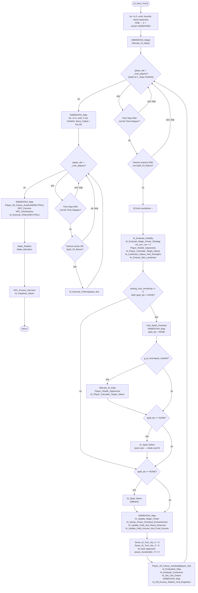

AIDUDES-AI_Next_Turn.md

C:\STU\devel\STU-Extras\Piethawn\Piethawn\out\WIZARDS\ovr145\AI_Next_Turn.asm
C:\STU\devel\STU-Extras\Piethawn\Piethawn\out\WIZARDS\ovr145\AI_Next_Turn.c

Next_Turn_Proc()
    |-> Next_Turn_Calc()
        |-> AI_Next_Turn()

---

# `AI_Next_Turn` — Walkthrough (Capstone)

| Function | Location | Role |
|---|---|---|
| `AI_Next_Turn` | [AIDUDES.c:158-386](../../MoM/src/AIDUDES.c#L158-L386) | The AI turn dispatcher. Runs once per game turn. Sanitizes unit positions, allocates per-turn AI scratch memory (`Allocate_AI_Data`), then dispatches the full AI pipeline for each non-HUMAN wizard (Time Stop and active-fortress gated): strategy → hostility → target values → landmass values → war-target selection → spell casting/selection → resource updates → autobuild → evaluation map → orders → cull → per-wizard movement. Finally runs the NEUTRAL-player pipeline (colony autobuild, farmers, destinations, movement) and events phase (raiders, monsters, garrison cull, hopeless-stasis cull). |

Verified faithful to the disassembly `AI_Next_Turn.asm` throughout (structure 1:1, 380-line asm).

## Purpose

The AI turn dispatcher — every AI-related function in the subsystem is reached from here. Called once per game turn by [`Next_Turn_Calc`](../../MoM/src/NEXTTURN.c). Structured as three sequential phases:

1. **Setup** — unit-position sanity, EMM remap, per-turn allocation.
2. **Per-AI-wizard loop** (player_idx = 1..N) — the full "wizard's turn" pipeline. Time Stop and inactive-wizard gates skip.
3. **Movement + NEUTRAL + events** — a second per-wizard loop for movement (`AI_Execute_Orders`), then the neutral player's autobuild/farmers/destinations/movement, then raider/monster generation, then final cull passes.

Every `PHASE(...)` macro instance is a ReMoM STU_DEBUG timing wrapper — under `STU_DEBUG` it wraps the call with millisecond-precision phase timing logs; otherwise it's a bare pass-through. Not in OG.

## How it's reached

| Caller | Site | Notes |
|---|---|---|
| `Next_Turn_Calc` | [NEXTTURN.c](../../MoM/src/NEXTTURN.c) (end-of-turn processing) | Once per game turn, after human-player actions resolve. |

## Globals / external state

| Symbol | Effect |
|---|---|
| `_units`, `_UNITS[]` | Read (position sanity). Mutated for OOB positions: `wp/wx/wy = 0; owner_idx = ST_UNDEFINED`. |
| `_num_players`, `_players[]` | Read `casting_cost_remaining`, `casting_spell_idx`, `Hostility[]`, `peace_duration[]`. Mutated `casting_spell_idx = spl_NONE` after cast, `peace_duration[itr]--` per turn. |
| `_FORTRESSES[]` | Read (`active` state) to skip eliminated wizards. |
| `_ai_reevaluate_summoning_circle_countdown[]` (`int16_t *`) | Mutated (`--` per player_idx per turn). |
| `g_timestop_player_num` | Read as the Time Stop gate. `0` = no Time Stop; `N` means only player `N-1` may act. |
| `m_niu_ai_turn_eval_var` (OG `CRP_AI_Turn_Var`) | Zeroed per player_idx iteration. Cross-reference (OON) target — hence the `niu_` prefix. |
| `Some_AI_Turn_Var_2`, `Some_AI_Turn_Var_3` | Zeroed per player_idx iteration. Names carried over from OG asm labels; live cross-references unclear. |
| `g_ai_recompute_needed` (OG `AI_Eval_After_Spell`) | Read after Cast_Spell_Overland to gate the mid-turn recompute (`Allocate_AI_Data` + hostility + target-values). |
| `NEUTRAL_PLAYER_IDX`, `HUMAN_PLAYER_IDX` | `5` and `0`. Loop bounds and predicate constants. |
| `_turn`, `_difficulty` | Read for logging. |

## Signature and locals

```c
void AI_Next_Turn(void)
```

OG stack locals (asm:4-9):

| OG name | Production name | Register |
|---|---|---|
| `player_idx` | `player_idx` | SI |
| `itr` | `i` (unit-scan / peace-decrement / Move_Failed reset) — `other_player_idx` (peace-decrement inner) | DI |

Production uses `int` (not `int16_t`) for the three loop counters — a stylistic drift from the rest of the AI subsystem but functionally identical on the DOS-16-bit target (where `int == int16_t`).

## Structure



## Code walk

Line refs are production [AIDUDES.c](../../MoM/src/AIDUDES.c); cross-checked against `AI_Next_Turn.asm` (380 lines).

### Phase 1 — Unit-position sanity ([180-202](../../MoM/src/AIDUDES.c#L180-L202))

```c
for (i = 0; i < _units; i++)
{
    if(_UNITS[i].wp < 0 || _UNITS[i].wp > 1)
    {
        _UNITS[i].wp = 0;
        _UNITS[i].owner_idx = ST_UNDEFINED;
    }
    if(_UNITS[i].wx < 0 || _UNITS[i].wx >= WORLD_WIDTH)
    {
        _UNITS[i].wx = 0;
        _UNITS[i].owner_idx = ST_UNDEFINED;
    }
    if(_UNITS[i].wy < 0 || _UNITS[i].wy >= WORLD_HEIGHT)
    {
        _UNITS[i].wy = 0;
        _UNITS[i].owner_idx = ST_UNDEFINED;
    }
}
```

Maps 1:1 onto asm:11-102. Three independent bounds checks — wp (< 0 OR > 1), wx (< 0 OR >= WORLD_WIDTH), wy (< 0 OR >= WORLD_HEIGHT). Each OOB axis independently resets to 0 AND flips the unit's owner_idx to ST_UNDEFINED (effectively voiding it). Runs before allocation and before the wizard loop — sanitizes state that could have been corrupted by prior code paths.

### Phase 2 — Setup ([208-209](../../MoM/src/AIDUDES.c#L208-L209))

```c
PHASE(EMMDATAH_Map());
PHASE(Allocate_AI_Data());
```

Maps onto asm:105-106. `EMMDATAH_Map` remaps the EMS data window; `Allocate_AI_Data` reserves per-turn scratch buffers for target values, garrison strengths, own/enemy stack tables, spell group flags, and per-plane landmass value arrays.

### Phase 3 — Per-AI-wizard loop init ([212-241](../../MoM/src/AIDUDES.c#L212-L241))

```c
for (player_idx = 1; player_idx < _num_players; player_idx++)
{
    /* Time Stop check */
    if(g_timestop_player_num != 0)
    {
        if((g_timestop_player_num - 1) != player_idx)
        {
            continue;
        }
    }

    /* Active-or-returning check */
    if(_FORTRESSES[player_idx].active != ST_TRUE && _players[player_idx].casting_spell_idx != spl_Spell_Of_Return)
    {
        continue;
    }

    _ai_reevaluate_summoning_circle_countdown[player_idx]--;
```

Maps onto asm:107-140. Three gates:

1. **Player index start = 1** — skips HUMAN_PLAYER_IDX (0). ✓
2. **Time Stop** (asm:110-117): `g_timestop_player_num != 0` means Time Stop is active; only player `(g_timestop_player_num - 1)` may act. All others skip.
3. **Active-or-returning** (asm:119-133): wizard must have `_FORTRESSES[player_idx].active == ST_TRUE` OR be casting `spl_Spell_Of_Return`. Eliminated wizards not currently returning get skipped.

Then `_ai_reevaluate_summoning_circle_countdown[player_idx]--` (asm:135-140). OG stores this as a pointer variable and dereferences (`mov bx, [AI_SCircle_Reevals@]; add bx, ax; dec [word ptr bx]`). Production declares `int16_t * _ai_reevaluate_summoning_circle_countdown` at [MOM_DAT.h:2916](../../MoX/src/MOM_DAT.h#L2916) — same pointer semantics.

### Phase 4 — Strategy dispatch chain ([243-255](../../MoM/src/AIDUDES.c#L243-L255))

```c
PHASE(AI_Evaluate_Hostility(player_idx));
PHASE(AI_Evaluate_Magic_Power_Strategy(player_idx));

m_niu_ai_turn_eval_var = 0;

PHASE(Player_Hostile_Opponents(player_idx));
PHASE(AI_Player_Calculate_Target_Values(player_idx));
PHASE(AI_Landmass_Values_And_Strengths(player_idx));
PHASE(AI_Choose_War_Landmass(player_idx));
```

Maps onto asm:141-165. Seven calls in fixed order. OG asm labels for a few (all `__WIP` variants of drake178 IDA names):

| OG asm call | Production name |
|---|---|
| `j_AI_Evaluate_Hostility` | `AI_Evaluate_Hostility` |
| `j_AI_Magic_Strategy__WIP` | `AI_Evaluate_Magic_Power_Strategy` |
| `[CRP_AI_Turn_Var] = 0` | `m_niu_ai_turn_eval_var = 0` |
| `Player_Hostile_Opponents` | `Player_Hostile_Opponents` |
| `AI_Player_Calculate_Target_Values` | `AI_Player_Calculate_Target_Values` |
| `AI_Continent_Eval__WIP` | `AI_Landmass_Values_And_Strengths` |
| `j_AI_Pick_Action_Conts__WIP` | `AI_Choose_War_Landmass` |

### Phase 5 — Casting completion + spell selection ([258-280](../../MoM/src/AIDUDES.c#L258-L280))

```c
/* Handle Overland Casting Completion */
if(_players[player_idx].casting_cost_remaining <= 0 && _players[player_idx].casting_spell_idx != spl_NONE)
{
    PHASE(Cast_Spell_Overland(player_idx));
    PHASE(EMMDATAH_Map());
    _players[player_idx].casting_spell_idx = spl_NONE;
    if(g_ai_recompute_needed == ST_TRUE)
    {
        PHASE(Allocate_AI_Data());
        PHASE(Player_Hostile_Opponents(player_idx));
        PHASE(AI_Player_Calculate_Target_Values(player_idx));
    }
    /* OGBUG  redundant - will be caught by the next block */
    if(_players[player_idx].casting_spell_idx == spl_NONE)
    {
        PHASE(AI_Spell_Select(player_idx));
    }
}

/* Handle New Spell Selection if wasn't casting or finished casting */
if(_players[player_idx].casting_spell_idx == spl_NONE)
{
    PHASE(AI_Spell_Select(player_idx));
}
```

Maps 1:1 onto asm:166-221. Three-path dispatch:

- **Path A — casting completes** (`casting_cost_remaining <= 0 AND spell_idx != spl_NONE`): enter cast body, run `Cast_Spell_Overland`, remap EMM, set `spell_idx = spl_NONE`, optionally recompute (`Allocate_AI_Data` + hostility + target-values), then hit the OG's inner `if(spell_idx == NONE) AI_Spell_Select` block, then fall through to the outer identical block. Two `AI_Spell_Select` calls — see the OGBUG note below.
- **Path B — casting in progress** (`cost > 0`): OG asm:170-171 `jg loc_D2289` skips the cast body. Production's `&&` short-circuits identically. Outer `if(spell_idx == NONE)` fails (still casting), so no `AI_Spell_Select`.
- **Path C — not casting** (`spell_idx == spl_NONE` on entry): OG asm:178-179 `jz loc_D2289` skips the cast body. Production's second `&&` clause fails identically. Outer `if(spell_idx == NONE)` passes, so `AI_Spell_Select` fires once.

**OGBUG — duplicated `AI_Spell_Select` block preserved OG-as-written** ([AIDUDES.c:269-272](../../MoM/src/AIDUDES.c#L269-L272)):

The OG asm has two consecutive `if(casting_spell_idx == spl_NONE) AI_Spell_Select()` blocks at `loc_D2272` (asm:202-211) and `loc_D2289` (asm:212-221). The inner block sits at the tail of the cast body and would only fire on Path A. The outer block catches Paths A and C. On Path A, both blocks fire — the second is fully redundant (no state changes between the two `spell_idx == spl_NONE` checks would make the first call succeed and the second fail differently, since `AI_Spell_Select` deterministically consumes RNG regardless). Almost certainly a copy-paste or refactoring artifact in the OG C source — a genuine retry mechanic would use a flag or loop, not a duplicated block.

Preserved as-written because the extra `AI_Spell_Select` call still consumes `Random()` cycles on Path A, which matters for PRNG parity even though the game-logic outcome is unaffected. Inline `/* OGBUG  redundant - will be caught by the next block */` comment at [AIDUDES.c:268](../../MoM/src/AIDUDES.c#L268) documents the choice.

### Phase 6 — Resource updates ([277-281](../../MoM/src/AIDUDES.c#L277-L281))

```c
PHASE(EMMDATAH_Map());
PHASE(AI_Update_Magic_Power(player_idx));
PHASE(AI_Sanity_Check_Overland_Enchantments(player_idx));
PHASE(AI_Update_Gold_And_Mana_Reserves(player_idx));
PHASE(AI_Update_Gold_Income_And_Food_Income(player_idx));
```

Maps 1:1 onto asm:223-241. Five calls in fixed order — the magic/gold refresh cluster.

### Phase 7 — Peace duration decrement ([283-293](../../MoM/src/AIDUDES.c#L283-L293))

```c
Some_AI_Turn_Var_2 = 0;
Some_AI_Turn_Var_3 = 0;

for (other_player_idx = 0; other_player_idx < _num_players; other_player_idx++)
{
    if(_players[player_idx].peace_duration[other_player_idx] != 0)
    {
        _players[player_idx].peace_duration[other_player_idx]--;
    }
}
```

Maps onto asm:242-274. Two ghost zero-assignments (names carried from OG; live cross-references unclear — bear the OG names as-is for grep-ability), then the peace-duration decrement loop. Note the OG stores `peace_duration[itr]` as a byte (asm:260-269), read/dec/write; production uses `int8_t` array access with the same semantics.

### Phase 8 — Orders chain ([295-301](../../MoM/src/AIDUDES.c#L295-L301))

```c
PHASE(Player_All_Colony_Autobuild(player_idx));
PHASE(AI_Evaluation_Map(player_idx));
PHASE(AI_Evaluate_Continents(player_idx));
PHASE(AI_Set_Unit_Orders(player_idx));

PHASE(EMMDATAH_Map());
PHASE(AI_Kill_Excess_Settlers_And_Engineers(player_idx));
```

Maps 1:1 onto asm:275-292. OG asm labels:

| OG asm call | Production name |
|---|---|
| `j_Player_All_Colony_Autobuild` | `Player_All_Colony_Autobuild` |
| `j_AI_Evaluation_Map` | `AI_Evaluation_Map` |
| `j_AI_Continent_Reeval__WIP` | `AI_Evaluate_Continents` |
| `j_AI_Set_Unit_Orders` | `AI_Set_Unit_Orders` |
| `AI_Kill_Excess_Settlers_And_Engineers` | `AI_Kill_Excess_Settlers_And_Engineers` |

Note the `EMMDATAH_Map()` interposed between `AI_Set_Unit_Orders` and `AI_Kill_Excess_Settlers_And_Engineers` — the orders pass leaves the EMM window pointed at the CONTXXX handle, so this call restores the default DATAH mapping before the settler cull.

### Phase 9 — Move_Failed reset ([308-317](../../MoM/src/AIDUDES.c#L308-L317))

```c
PHASE(EMMDATAH_Map());

for (i = 0; i < _units; i++)
{
    if(_UNITS[i].owner_idx != HUMAN_PLAYER_IDX)
    {
        _UNITS[i].Move_Failed = ST_FALSE;
    }
}
```

Maps onto asm:301-323. After the strategy-per-wizard loop, remap EMM back and clear `Move_Failed` on every non-HUMAN unit. This prepares for the movement phase — units that were blocked in the previous turn's movement get a fresh chance.

### Phase 10 — Movement phase ([323-342](../../MoM/src/AIDUDES.c#L323-L342))

```c
for (player_idx = 1; player_idx < _num_players; player_idx++)
{
    /* Time Stop check */
    if(g_timestop_player_num != 0)
    {
        if((g_timestop_player_num - 1) != player_idx)
        {
            continue;
        }
    }

    /* Active-or-returning check */
    if(_FORTRESSES[player_idx].active == ST_TRUE || _players[player_idx].casting_spell_idx == spl_Spell_Of_Return)
    {
        PHASE(AI_Execute_Orders(player_idx));
    }
}
```

Maps onto asm:324-356. Second per-wizard loop — same Time Stop and active gates as Phase 3, but with a POSITIVE `active OR Spell_Of_Return` predicate (OG asm:340-347 uses `jz loc_D23AA / jnz loc_D23B1` to combine the two). [`AI_Execute_Orders`](../../MoM/src/SETTLE.c#L114) iterates every unit owned by `player_idx` and switches on its `Status` field (`us_BuildRoad`, `us_GOTO`, `us_Meld`, `us_Settle`, `us_SeekTransport`, `us_Move`), delegating to per-status handlers (`AI_Unit_Army_Do_Road`, `AI_Unit_Army_Do_Move`, etc.). Also carries a preserved inline OGBUG comment at [SETTLE.c:127](../../MoM/src/SETTLE.c#L127) flagging that its internal Time Stop guard is redundant with the caller's — both check the same `g_timestop_player_num` condition.

### Phase 11 — NEUTRAL player phase ([344-359](../../MoM/src/AIDUDES.c#L344-L359))

```c
PHASE(EMMDATAH_Map());

PHASE(Player_All_Colony_Autobuild(NEUTRAL_PLAYER_IDX));
PHASE(NPC_Farmers());
PHASE(NPC_Destinations());
PHASE(AI_Execute_Orders(NEUTRAL_PLAYER_IDX));
```

Maps onto asm:357-369. `NPC_Farmers` rebalances neutral-city farmers to meet minimum food; `NPC_Destinations` assigns targets to neutral stacks via `Build_NPC_Stacks`; `AI_Execute_Orders(NEUTRAL)` runs the same per-unit status dispatch on neutral-owned units (`us_GOTO` etc.).

### Phase 12 — Events + cleanup ([365-379](../../MoM/src/AIDUDES.c#L365-L379))

```c
PHASE(Make_Raiders());
PHASE(Make_Monsters());

PHASE(NPC_Excess_Garrison());
PHASE(AI_Hopeless_Stasis());

AI_Log_Metrics();
AI_Metrics_Emit_Turn_Summary(_turn, _difficulty, _num_players);
```

Maps onto asm:370-375. The NPC-event drivers `Make_Raiders` and `Make_Monsters` run their turn-accumulator checks and spawn raid/rampage stacks. Then two culls: `NPC_Excess_Garrison` trims oversized neutral garrisons; `AI_Hopeless_Stasis` kills stasis-locked units too weak to break free.

Final `AI_Log_Metrics` and `AI_Metrics_Emit_Turn_Summary` are **ReMoM STU_LOG additions, not in OG**. Documented as out-of-scope per the plan.

## OG quirks preserved (faithful — do not "fix")

- **Unit-position sanity resets `owner_idx = ST_UNDEFINED`** ([185, 193, 200](../../MoM/src/AIDUDES.c#L185)) — each OOB axis independently voids the unit. If a unit has multiple OOB axes, `owner_idx` is written to `ST_UNDEFINED` up to three times per unit per turn (asm:34-40, 62-68, 90-96). Idempotent, so no bug — just OG-inefficient. Preserved.
- **Time Stop check nested-if pattern** ([215-224, 326-332](../../MoM/src/AIDUDES.c#L215-L224)) — outer `!= 0` and inner `-1 != player_idx` — matches OG's `cmp; jz; cmp; jz` shape (asm:111-117, 328-333). A single combined predicate would be tighter C, but the nested form preserves the OG structural fidelity.
- **`m_niu_ai_turn_eval_var = 0`** ([247](../../MoM/src/AIDUDES.c#L247)) — the OG asm labels this write's target as `CRP_AI_Turn_Var`. The `niu_` prefix in production marks it as "not in use" — the value is written but no cross-reference reads it. Preserved to keep the OG semantic surface intact.
- **`Some_AI_Turn_Var_2`, `Some_AI_Turn_Var_3` = 0** ([283-284](../../MoM/src/AIDUDES.c#L283-L284)) — same story. OG-labeled symbols with unknown live uses; zero-assignment preserved.
- **`Cast_Spell_Overland` sets `spell_idx = spl_NONE` AFTER the call** ([262](../../MoM/src/AIDUDES.c#L262)) — the reset is explicit in OG asm (asm:184-188), not something `Cast_Spell_Overland` does internally. Preserved.
- **Duplicated `AI_Spell_Select` block** ([269-272 + 277-280](../../MoM/src/AIDUDES.c#L269-L280)) — OG asm has two consecutive `if(spell_idx == NONE) AI_Spell_Select()` checks at `loc_D2272` and `loc_D2289`. On Path A (cast just completed), both fire; on Paths B/C (still casting / not casting), only the outer fires. Looks like a copy-paste artifact in the OG C source, not a designed retry mechanic. Preserved because the extra call still consumes `Random()` cycles on Path A. See [Phase 5](#phase-5--casting-completion--spell-selection-258-280) and inline `/* OGBUG  redundant */` comment.
- **`peace_duration[itr]` is byte-sized** — OG uses `mov al ... dec al ... mov [...], al` (asm:260-269). Production's `int8_t` array access matches. Preserved.
- **Second per-wizard loop for movement uses positive `active OR Spell_Of_Return` gate** ([335](../../MoM/src/AIDUDES.c#L335)) — Phase 3's active check is NEGATIVE (skip if inactive AND not returning), Phase 10's is POSITIVE (execute if active OR returning). Same information, flipped for a `continue` vs `if-body` structural choice. Matches OG asm:340-347 exactly. Preserved.
- **`AI_Execute_Orders` called for NEUTRAL_PLAYER_IDX** ([359](../../MoM/src/AIDUDES.c#L359)) — the same [SETTLE.c:114](../../MoM/src/SETTLE.c#L114) status dispatcher used for AI wizards also drives neutral stack movement. Preserved.
- **`NPC_Excess_Garrison` and `AI_Hopeless_Stasis` run last** ([375-376](../../MoM/src/AIDUDES.c#L375-L376)) — after events. Effect: raider/monster spawns get counted against the garrison cap on the NEXT turn's cull pass, not this turn's. Preserved.

## Sub-functions / external calls (call chain summary)

| Function | Purpose |
|---|---|
| `EMMDATAH_Map` | Remap EMS data window (called 5× per turn: setup, mid-strategy, orders end, movement start, neutral start). |
| `Allocate_AI_Data` | Per-turn AI scratch memory (2× per player if cast completes and recompute needed). |
| `AI_Evaluate_Hostility`, `Player_Hostile_Opponents` | Hostility cluster. |
| `AI_Evaluate_Magic_Power_Strategy` | Per-wizard magic-power strategy pick. |
| `AI_Player_Calculate_Target_Values`, `AI_Landmass_Values_And_Strengths` | Per-target and per-landmass strategic value tables. |
| `AI_Choose_War_Landmass` | Populates `_ai_landmass_war_targets[]`. |
| `Cast_Spell_Overland` | Casting completion — applies the queued overland spell. |
| `AI_Spell_Select` | Spell selection — called up to 2× per player_idx per turn (OG-faithful duplicated block). |
| `AI_Update_Magic_Power`, `AI_Sanity_Check_Overland_Enchantments`, `AI_Update_Gold_And_Mana_Reserves`, `AI_Update_Gold_Income_And_Food_Income` | Resource-update cluster. |
| `Player_All_Colony_Autobuild` | Called 2× per turn — per-AI-wizard, and once for NEUTRAL_PLAYER_IDX. |
| `AI_Evaluation_Map` | Per-wizard evaluation-map build. |
| `AI_Evaluate_Continents` | Per-wizard continent re-evaluation. |
| `AI_Set_Unit_Orders` | Parent order-dispatch — assigns Status to each unit. |
| `AI_Kill_Excess_Settlers_And_Engineers` | Per-landmass settler/engineer cap enforcement. |
| [`AI_Execute_Orders`](../../MoM/src/SETTLE.c#L114) | Per-unit status dispatcher — for each unit owned by `player_idx`, switches on `Status` (BuildRoad, GOTO, Meld, Settle, SeekTransport, Move) and delegates. Called per-wizard + once for NEUTRAL. |
| `NPC_Farmers`, `NPC_Destinations` | Neutral-player farmer rebalance / target selection. |
| `Make_Raiders`, `Make_Monsters` | NPC event drivers — spawn raid stacks from neutral cities / rampage stacks from lairs. |
| `NPC_Excess_Garrison`, `AI_Hopeless_Stasis` | Final cull passes — trim over-cap neutral garrisons, kill stasis-locked low-Resist units. |
| `AI_Log_Metrics`, `AI_Metrics_Emit_Turn_Summary` | **ReMoM-only** STU_LOG instrumentation. Not in OG asm. |

## Related references

- `C:\STU\devel\STU-Extras\Piethawn\Piethawn\out\WIZARDS\ovr145\AI_Next_Turn.asm` — IDA Pro 5.5 disassembly (the authority, 380 lines).
- [`__TODO-AiTurn.md`](../__TODO-AiTurn.md) — the downstream done-done plan; every function above has a per-function walkthrough linked from the TODO.
- `s_UNIT` fields touched: `wp`, `wx`, `wy`, `owner_idx`, `Move_Failed`.
- `s_WIZARD` fields touched: `casting_cost_remaining`, `casting_spell_idx`, `Hostility[]`, `peace_duration[]`.
- `s_FORTRESS` fields touched: `active`.
- Constants: `HUMAN_PLAYER_IDX = 0`, `NEUTRAL_PLAYER_IDX = 5`, `WORLD_WIDTH`, `WORLD_HEIGHT`, `ST_TRUE`, `ST_FALSE`, `ST_UNDEFINED`, `spl_NONE`, `spl_Spell_Of_Return`.
