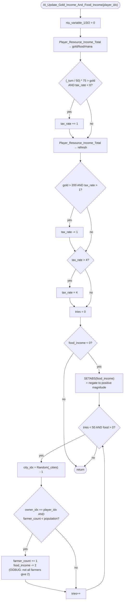

AIDUDES-AI_Update_Gold_Income_And_Food_Income.md

C:\STU\devel\STU-Extras\Piethawn\Piethawn\out\WIZARDS\ovr145\AI_Update_Gold_Income_And_Food_Income.asm
C:\STU\devel\STU-Extras\Piethawn\Piethawn\out\WIZARDS\ovr145\AI_Update_Gold_Income_And_Food_Income.c

AI_Next_Turn()
    |-> AI_Update_Gold_Income_And_Food_Income()

---

# `AI_Update_Gold_Income_And_Food_Income` — Walkthrough

| Function | Location | Role |
|---|---|---|
| `AI_Update_Gold_Income_And_Food_Income` | [AIDUDES.c:1811-1865](../../MoM/src/AIDUDES.c#L1811-L1865) | Per-AI-player: adjust `tax_rate` based on gold income and turn number, then remediate any food deficit by adding farmers to owned cities via random selection (up to 50 tries). Tax nudges up when income is low relative to `(_turn / 50) * 75`, down when income exceeds 200. Final tax is clamped to `[1, 4]` even though the up-nudge allows values up to 5. |

Verified faithful to the disassembly `AI_Update_Gold_Income_And_Food_Income.asm` throughout (structure 1:1).

## Purpose

The AI's tax-and-farmers balancer, called once per AI player per turn:

1. **Tax nudge up**: if the AI's gold income is below a turn-scaled threshold (`(_turn / 50) * 75`) and `tax_rate < 6`, bump `tax_rate` by 1.
2. **Tax nudge down**: recompute incomes with the new tax_rate, then if gold income is now > 200 and `tax_rate > 1`, drop `tax_rate` by 1.
3. **Tax clamp**: if `tax_rate > 4`, force it back to 4. (The up-nudge in step 1 allows reaching 5 briefly; the clamp always brings it back.)
4. **Food deficit remediation**: if food income is negative (a deficit), negate it to work with a positive counter, then for up to 50 iterations: pick a random city, and if the AI owns it and it has spare population, convert one non-farmer worker into a farmer. Assumes each farmer contributes 2 food (see the inline `/* OGBUG */` comment — Halfling and Granary cities produce 3).

The threshold in step 1 grows over time: turns 0-49 → threshold 0 (no up-nudge), turns 50-99 → 75, turns 100-149 → 150, etc. So the AI is encouraged to raise taxes as the game progresses to keep pace with rising unit maintenance and construction costs.

## How it's reached

| Caller | Site | Notes |
|---|---|---|
| `AI_Next_Turn` per-AI loop | Called per AI player per turn within the AI_Next_Turn dispatch. | No self-throttle — fires every turn for every AI player. |

## Globals / external state

| Symbol | Definition | Effect |
|---|---|---|
| `_players[player_idx]` (`s_WIZARD`) | per-player wizard record | Read: `tax_rate`. Mutated: `tax_rate` (up-nudge, down-nudge, or clamp). |
| `_turn` | global turn counter | Read for the up-nudge threshold `(_turn / 50) * 75`. |
| `_CITIES[]`, `_cities` | city records + count | Read (`owner_idx`, `farmer_count`, `population`); mutated (`farmer_count` via `CITIES_FARMER_COUNT` macro). |
| `Random(n)` | RNG | `Random(_cities)` called up to 50 times per food-deficit remediation. Critical for PRNG parity. |
| `Player_Resource_Income_Total(player_idx, &gold, &food, &mana)` | income helper | Called **twice** — once before the up-nudge, once after (to see the updated income for the down-nudge check). |
| `CITIES_FARMER_COUNT(city_idx, value)` | farmer-count store macro | Writes `_CITIES[city_idx].farmer_count = value`. Modder-API wrapper around the direct store. |
| `SETABS(x)` | absolute-value macro at [MOX_DEF.h:92](../../MoX/src/MOX_DEF.h#L92) | `if((x) < 0) { (x) = -(x); }`. Used inside the food-deficit guard to make the deficit magnitude positive for the loop counter. |

## Signature and locals

```c
void AI_Update_Gold_Income_And_Food_Income(int16_t player_idx)
```

OG stack locals (asm:4-10): `food_income`, `mana_income`, `gold_income`, `Tries`, `UU_Local_0_3`, `UU_Local_0_2`, `UU_Local_0_1`. Production names ([1813-1820](../../MoM/src/AIDUDES.c#L1813-L1820)) map:

| OG asm name | Production C name | Note |
|---|---|---|
| `food_income` | `food_income` | Out-param slot for the income helper; then re-signed and used as the deficit counter. |
| `mana_income` | `mana_income` | Out-param slot; never read after the helper call. |
| `gold_income` | `gold_income` | Out-param slot; read for the tax-nudge decisions. |
| `Tries` | `tries` | Loop counter for the food-deficit remediation. |
| `UU_Local_0_1` | `niu_variable_1` | Ghost local at bp-02, set to `0`, never read. Preserved for OG stack-frame fidelity. |
| `UU_Local_0_2` | `niu_variable_2` | Ghost local at bp-04, same. |
| `UU_Local_0_3` | `niu_variable_3` | Ghost local at bp-06, same. |
| `_DI_city_idx` (register) | `city_idx` | Random city index for the remediation loop. |

Init order for the ghost locals in the OG (asm:20-22) is `UU_Local_0_1`, then `UU_Local_0_3`, then `UU_Local_0_2` — NOT numeric order. Production preserves that order at lines 1821-1823.

## Structure



## Code walk

Line refs are production [AIDUDES.c](../../MoM/src/AIDUDES.c); cross-checked against `AI_Update_Gold_Income_And_Food_Income.asm` (the authority).

### Phase 1 — Ghost-local init + first income fetch ([1821-1824](../../MoM/src/AIDUDES.c#L1821-L1824))

```c
niu_variable_1 = 0;
niu_variable_3 = 0;
niu_variable_2 = 0;
Player_Resource_Income_Total(player_idx, &gold_income, &food_income, &mana_income);
```

Maps onto asm:19-31. The three `mov [bp+UU_Local_0_?], 0` in the OG (asm:20-22) preserve the init order `1, 3, 2` — production line 1821-1823 matches. The income helper is called with args pushed in right-to-left cdecl order: mana, food, gold, player (asm:23-30) → C call `(player_idx, &gold_income, &food_income, &mana_income)`.

### Phase 2 — Tax up-nudge ([1825-1832](../../MoM/src/AIDUDES.c#L1825-L1832))

```c
if(
    (((_turn / 50) * 75) > gold_income)
    &&
    (_players[player_idx].tax_rate < 6)
)
{
    _players[player_idx].tax_rate += 1;
}
```

Maps onto asm:32-50. Threshold computation: `mov ax, [_turn]; mov bx, 50; cwd; idiv bx; mov dx, 75; imul dx` — `_turn / 50` then `* 75`. The `cwd`/`idiv` is signed divide; the `imul dx` is 16→32-bit signed multiply, but only the low 16 bits (`ax`) are compared to `gold_income`. For realistic `_turn` values (< 500) the product stays well under `INT16_MAX = 32767`, so the overflow risk is theoretical only.

Gate direction:
- `jle short loc_D4672` skips when `(_turn/50)*75 <= gold_income` — production `>` matches.
- `jge short loc_D4672` skips when `tax_rate >= 6` — production `< 6` matches.

Faithful.

### Phase 3 — Refresh income + tax down-nudge ([1833-1841](../../MoM/src/AIDUDES.c#L1833-L1841))

```c
Player_Resource_Income_Total(player_idx, &gold_income, &food_income, &mana_income);

if(
    (gold_income > 200)
    &&
    (_players[player_idx].tax_rate > 1)
)
{
    _players[player_idx].tax_rate -= 1;
}
```

Second income call (asm:52-60) refreshes `gold_income` / `food_income` / `mana_income` to reflect the tax_rate change from Phase 2. This is necessary because raising the tax rate changes gold income before the "> 200" threshold check — without the refresh the down-nudge would use stale income. Faithful.

Down-nudge (asm:61-73): `cmp gold_income, 200; jle skip; cmp tax_rate, 1; jle skip; dec tax_rate`. Production `> 200` and `> 1` match.

### Phase 4 — Tax clamp ([1842-1845](../../MoM/src/AIDUDES.c#L1842-L1845))

```c
if(_players[player_idx].tax_rate > 4)
{
    _players[player_idx].tax_rate = 4;
}
```

Maps onto asm:75-85. `cmp tax_rate, 4; jle skip; mov tax_rate, 4`.

**Observation**: the up-nudge in Phase 2 allows `tax_rate` up to `5` (via `< 6`), but this clamp caps it at `4`. So the `< 6` in Phase 2 is over-permissive — the effective ceiling is `4`. The gap doesn't cause behavior issues (the clamp corrects it), but the `< 6` gate could just as well have been `< 5`. Preserved faithful-to-Dasm.

### Phase 5 — Food-deficit remediation ([1846-1864](../../MoM/src/AIDUDES.c#L1846-L1864))

```c
tries = 0;
if(food_income < 0)
{
    SETABS(food_income);
    while(((tries < 50) && (food_income > 0)))
    {
        city_idx = (Random(_cities) - 1);
        if(_CITIES[city_idx].owner_idx == player_idx)
        {
            if(_CITIES[city_idx].farmer_count < _CITIES[city_idx].population)
            {
                CITIES_FARMER_COUNT(city_idx, (_CITIES[city_idx].farmer_count + 1));
                food_income -= 2;  /* OGBUG  not all farmers generate 2 food */
            }
        }
        tries++;
    }
}
```

Sets `tries = 0` (asm:87). Then the deficit guard maps onto asm:88-95:

```asm
cmp [bp+food_income], 0
jl  short loc_D46D8       ; food_income < 0 → negate + enter loop
jmp @@Done                ; else (food_income >= 0) → exit function

loc_D46D8:
mov ax, [bp+food_income]
neg ax                    ; food_income = -food_income
mov [bp+food_income], ax
jmp short loc_D4758       ; enter loop test
```

Production's `if (food_income < 0) { SETABS(food_income); ... }` mirrors the OG shape: the `jl loc_D46D8` corresponds to the C `if (food_income < 0)`, the `jmp @@Done` corresponds to the C `else` (implicit — skip everything and exit function), and the `neg` inside `loc_D46D8` corresponds to `SETABS(food_income)` inside the C guard.

Because the guard proves `food_income < 0`, the inner conditional inside `SETABS` (which is `if(x < 0) x = -x;`) always fires — it's semantically equivalent to a plain `food_income = -food_income;` in that context. The compiler may or may not elide the dead check; either way the result is `food_income = |food_income|`.

**Loop body** (asm `loc_D46E2`-`loc_D4755`):

- `Random(_cities) - 1` (asm:99-103) ↔ production line 1852. `Random` returns `1..n`, so subtracting 1 gives `0..n-1` for valid array indexing.
- Owner check (asm:105-112): `cmp owner_idx, player_idx; jnz skip` ↔ production line 1853.
- Farmer < population check (asm:113-127): load farmer_count, load population, `cmp; jge skip` ↔ production line 1855.
- Increment farmer (asm:128-142): load, `inc al`, store back — encapsulated in production's `CITIES_FARMER_COUNT(city_idx, farmer_count + 1)` macro (line 1857).
- `food_income -= 2` (asm:143) ↔ production line 1859 with the inline `/* OGBUG  not all farmers generate 2 food */` comment.

**Loop exit condition** (asm `loc_D4758`):
```asm
cmp [bp+food_income], 0
jle short @@Done
cmp [bp+Tries], 50
jge short @@Done
jmp loc_D46E2
```

OG tests food first, then tries. Production `while (tries < 50 && food_income > 0)` tests tries first. Different clause order at the C source level, but the `&&` short-circuit and side-effect-free operands make this a compiler-choice difference rather than a source-level deviation (similar to the R2/R5 retractions on the sibling function).

## OG quirks preserved (faithful — do not "fix")

- **Ghost locals `niu_variable_1/2/3`** ([1817-1823](../../MoM/src/AIDUDES.c#L1817-L1823)) — declared at OG stack offsets bp-02/-04/-06, set to `0` in the order `1, 3, 2`, never read anywhere. Same pattern as `niu_var_1C` in `AI_Disband_To_Balance_Budget`. Preserved for stack-frame fidelity.
- **Tax up-nudge `< 6` gate is over-permissive vs the `> 4` clamp** ([1828](../../MoM/src/AIDUDES.c#L1828), [1842](../../MoM/src/AIDUDES.c#L1842)) — Phase 2 allows raising `tax_rate` to 5, Phase 4 forces it back to 4. The gap is a preserved OG design choice (perhaps intended to leave headroom for future 5/6 gates). Faithful.
- **Two `Player_Resource_Income_Total` calls per invocation** ([1824, 1833](../../MoM/src/AIDUDES.c#L1824)) — the second call is necessary because Phase 2's up-nudge changed `tax_rate`, so `gold_income` needs to be refreshed before the Phase 3 down-nudge check. Two calls per turn per AI player; not a bug.
- **Farmer counter subtracts 2 even when 3 applies** ([1859](../../MoM/src/AIDUDES.c#L1859)) — Halfling cities and cities with a Granary produce 3 food per farmer, not 2. The OG naively subtracts 2 regardless. Effect: the remediation over-counts farmers-needed for those cities and stops adding once the counter says `<= 0`, even though the actual food deficit may already be resolved. Preserved with the inline `/* OGBUG */` comment.
- **`Random(_cities) - 1` for the city index** — `Random(n)` returns `1..n`; the `-1` shifts to `0..n-1` for valid indexing. If `_cities == 0` the multiplication produces `-1` and indexes `_CITIES[-1]` — OG doesn't guard, but `_cities == 0` shouldn't happen in normal gameplay.
- **Ghost `mana_income` value is fetched but never read** — the income helper populates `mana_income` but this function doesn't use it. Faithful — the helper's out-param signature requires the argument.
- **Deficit guard's `SETABS` is redundant vs a plain negate** — inside `if (food_income < 0) { SETABS(food_income); ... }`, the inner conditional check inside SETABS never fails. Plain `food_income = -(food_income);` would produce identical output with one fewer check. Kept as SETABS for readability (the macro name signals intent); the compiled asm may include the dead check depending on optimizer.

## Sub-functions / external calls

- **`Player_Resource_Income_Total(player_idx, &gold, &food, &mana)`** — populates the three out-params with the player's current-turn resource incomes. Called twice: once at function entry (line 1824) and once after the up-nudge (line 1833).
- **`Random(n)`** — RNG, returns `1..n`. Called up to 50 times per invocation, gated by `tries < 50`. Critical for PRNG parity.
- **`CITIES_FARMER_COUNT(city_idx, value)`** — modder-API macro that stores `value` into `_CITIES[city_idx].farmer_count`. The OG asm does the same store directly (asm:142).
- **`SETABS(x)`** — absolute-value macro at [MOX_DEF.h:92](../../MoX/src/MOX_DEF.h#L92), expands to `if((x) < 0) { (x) = -(x); }`.

No I/O. No `EMM_Map_CONTXXX__WIP`. No PHASE wrapper at the call site (typically).

## Related references

- `C:\STU\devel\STU-Extras\Piethawn\Piethawn\out\WIZARDS\ovr145\AI_Update_Gold_Income_And_Food_Income.asm` — IDA Pro 5.5 disassembly (the authority).
- [AIDUDES-AI_Update_Magic_Power.md](AIDUDES-AI_Update_Magic_Power.md), [AIDUDES-AI_Update_Gold_And_Mana_Reserves.md](AIDUDES-AI_Update_Gold_And_Mana_Reserves.md) — sibling Wave 3F functions (ratios, reserves).
- `s_WIZARD` fields read/written: `tax_rate`.
- `s_CITY` fields read/written: `owner_idx`, `farmer_count`, `population`.
- OSG page 406 (PDF page 403) mentions farmer allocation as part of the AI's tax-and-workers automation.
- `CITIES_FARMER_COUNT` — declared in `MoX/src/MOM_DAT.h` or sibling.
