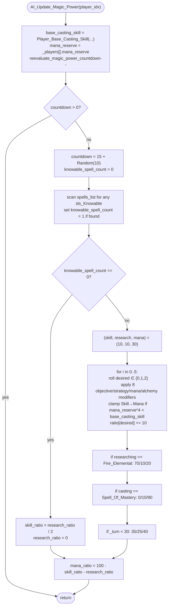

AIDUDES-AI_Update_Magic_Power.md

C:\STU\devel\STU-Extras\Piethawn\Piethawn\out\WIZARDS\ovr145\AI_Update_Magic_Power.asm
C:\STU\devel\STU-Extras\Piethawn\Piethawn\out\WIZARDS\ovr145\AI_Update_Magic_Power.c

AI_Next_Turn()
    |-> AI_Update_Magic_Power()

---

# `AI_Update_Magic_Power` — Walkthrough

| Function | Location | Role |
|---|---|---|
| `AI_Update_Magic_Power` | [AIDUDES.c:571-771](../../MoM/src/AIDUDES.c#L571-L771) | Per-AI-player: re-roll the AI's mana-power split between Skill, Research, and Mana-reserve. Decrements a `reevaluate_magic_power_countdown`; on countdown ≤ 0 it resets the countdown to `15 + Random(10)` and rebuilds the three ratios from objective, magic strategy, mana stockpile, spell-being-researched, spell-being-cast, and turn number. Final `mana_ratio` is computed as `100 - skill_ratio - research_ratio` so the three always sum to 100. |

Verified faithful to the disassembly `AI_Update_Magic_Power.asm` throughout (structure 1:1).

## Purpose

The wizard's "wand-research-skill" slider from OSG page 406, automated for AI players. Each AI player has three ratios stored in its `s_WIZARD` record:

- `mana_ratio` — % of magic income parked in `mana_reserve`.
- `skill_ratio` — % of magic income invested in raising base casting skill.
- `research_ratio` — % invested in researching the next spell.

The three must sum to 100. This function decides what split each AI wizard runs for the next 15-25 turns (the countdown is `15 + Random(10)`), then leaves the slider alone until the next re-roll.

The split is built by:
1. Quick-exit if `knowable_spell_count == 0` (everything is researched) — a special clamp that effectively disables the rest of the function's adjustments.
2. Otherwise: seed `(skill, research, mana) = (10, 10, 30)`, then run a 5-iteration random-roll loop that nudges the ratios based on objective, magic strategy, current skill / mana, spell-being-researched, and mana threshold.
3. Apply special overrides for `researching_spell_idx == spl_Fire_Elemental` (70/10/20), `casting_spell_idx == spl_Spell_Of_Mastery` (0/10/90), and `_turn < 30` (35/25/40).
4. Final balance: `mana_ratio = 100 - skill_ratio - research_ratio`.

## How it's reached

| Caller | Site | Notes |
|---|---|---|
| `AI_Next_Turn` per-AI loop | Called per AI player per turn within the AI_Next_Turn dispatch. | The function self-throttles via `reevaluate_magic_power_countdown` — only the post-decrement, ≤ 0 path actually rebuilds the ratios. Most turns it just decrements and returns. |

## Globals / external state

| Symbol | Definition | Effect |
|---|---|---|
| `_players[player_idx]` (`s_WIZARD`) | per-player wizard record | Read: `mana_reserve`, `Objective`, `magic_power_strategy`, `alchemy`, `researching_spell_idx`, `casting_spell_idx`. Mutated: `reevaluate_magic_power_countdown`, `research_ratio`, `skill_ratio`, `mana_ratio`, plus `spells_list[]` is read (knowable check). |
| `_turn` | global turn counter | Read for the `_turn * 3` mana-threshold check and the `_turn < 30` early-game override. |
| `Player_Base_Casting_Skill(player_idx)` | base-skill helper | Called twice (once at top, once inside the loop). |
| `Random(n)` | RNG | `Random(10)` for countdown reset, `Random(2)` / `Random(3)` per loop iteration for split-roll. |

## Signature and locals

```c
void AI_Update_Magic_Power(int16_t player_idx)
```

OG stack locals (asm:4-9): `Mana_Total`, `Nominal_Skill`, `itr`, `Unresearched_Spells`, `itr_spells`, `itr_realms`. Production names ([573-579](../../MoM/src/AIDUDES.c#L573-L579)) follow the lower_snake_case sweep:

| OG asm name | Production C name | Note |
|---|---|---|
| `Mana_Total` | `mana_reserve` | Shadows the field name; holds the *snapshot* taken at function entry. |
| `Nominal_Skill` | `base_casting_skill` | Holds the `Player_Base_Casting_Skill()` result captured at entry. |
| `Unresearched_Spells` | `knowable_spell_count` | Counts spells in `sls_Knowable` state; named for what it actually counts. |
| `itr` | `itr` | 5-roll-loop counter. |
| `itr_spells` | `itr_spells` | Inner Knowable-scan loop. |
| `itr_realms` | `itr_realms` | Outer Knowable-scan loop. |
| `_DI_IDK` (register only) | `desired_magic_investment_type` | "Next adjustment to apply" (0 = Mana, 1 = Skill, 2 = Research). |

## Structure



## Code walk

Line refs are production [AIDUDES.c](../../MoM/src/AIDUDES.c); cross-checked against `AI_Update_Magic_Power.asm` (the authority).

### Phase 1 — Read state + throttle ([581-590](../../MoM/src/AIDUDES.c#L581-L590))

```c
base_casting_skill = Player_Base_Casting_Skill(player_idx);
mana_reserve = _players[player_idx].mana_reserve;
_players[player_idx].reevaluate_magic_power_countdown -= 1;

if(_players[player_idx].reevaluate_magic_power_countdown > 0)
{
    return;
}
```

Maps onto asm:18-41. `Player_Base_Casting_Skill` call (lines 19-22) ↔ production line 581. `mana_reserve` snapshot (lines 23-28) ↔ production line 583. Decrement (lines 29-33) ↔ production line 585. Early-out test `jle short loc_D292A; xor ax, ax; jmp @@Done` (lines 38-41) — `jle` proceeds when countdown ≤ 0; production `> 0` early-returns matches: skip the rest when still throttled.

### Phase 2 — Reset countdown + Knowable scan ([592-605](../../MoM/src/AIDUDES.c#L592-L605))

```c
_players[player_idx].reevaluate_magic_power_countdown = (15 + Random(10));

/* OGBUG  spells that are already research candidates are ignored by this loop */
knowable_spell_count = 0;
for(itr_realms = 0; ((itr_realms < NUM_MAGIC_REALMS) & (knowable_spell_count == 0)); itr_realms++)
{
    for(itr_spells = 0; ((itr_spells < NUM_SPELLS_PER_MAGIC_REALM) & (knowable_spell_count == 0)); itr_spells++)
    {
        if(_players[player_idx].spells_list[((itr_realms * NUM_SPELLS_PER_MAGIC_REALM) + itr_spells)] == sls_Knowable)
        {
            knowable_spell_count++;
        }
    }
}
```

Maps onto asm `loc_D292A`-`loc_D2997`:

- Countdown reset: `Random(10) + 15` (asm:43-55) ↔ production line 592.
- `knowable_spell_count = 0` (asm:56) ↔ production line 595.
- Realm/spell nested loops with the early-stop guard `knowable_spell_count == 0` (asm:87-91 outer, 80-84 inner) ↔ production lines 596-605. Both loops short-circuit out as soon as any Knowable spell is found.
- Knowable check (asm:75-77): `cmp [_players.spells_list+bx], sls_Knowable; jnz skip; inc Unresearched_Spells` ↔ production lines 600-603.

The `/* OGBUG  spells that are already research candidates are ignored by this loop */` note at line 594 names an OG behavioral quirk — spells the AI has queued as research candidates aren't in `sls_Knowable` state, so they don't count, so the AI can end up in the "all researched" branch while still having queued work.

### Phase 3a — All-researched branch ([608-612](../../MoM/src/AIDUDES.c#L608-L612))

```c
/* OGBUG  branching this here removes the AI's ability to adjust power distribution entirely when all spells have been researched, including the intended modifiers for researching and casting the SoM */
if(knowable_spell_count == 0)
{
    _players[player_idx].skill_ratio = (_players[player_idx].research_ratio / 2);  /* OGBUG  should be added, not replacing */
    _players[player_idx].research_ratio = 0;
}
```

Maps onto asm `loc_D2997` (entered when `Unresearched_Spells == 0`):

```asm
mov     al, [_players.research_ratio+bx]
cbw                       ; sign-extend al → ax
cwd                       ; sign-extend ax → dx:ax
sub     ax, dx            ; round toward zero for negative ax (no-op for positive)
sar     ax, 1             ; arithmetic shift right 1 = signed /2
...
mov     [_players.skill_ratio+bx], al
...
mov     [_players.research_ratio+bx], 0
jmp     loc_D2C9F         ; skip directly to final mana_ratio compute
```

The `cwd; sub ax, dx; sar` sequence is Borland's signed-integer divide-by-2 with round-toward-zero. For the non-negative `research_ratio` values used here, the result is just `research_ratio / 2`. Production `(research_ratio / 2)` matches.

The OG also unconditionally jumps to `loc_D2C9F` after this branch — skipping the Fire_Elemental / SoM / `_turn < 30` overrides and going straight to the final mana_ratio compute. Production matches via the `if/else` structure: Phase 3a is the `if` branch, Phase 3b through Phase 4 are the `else` branch.

### Phase 3b — Else branch: seed + 5-roll loop ([613-743](../../MoM/src/AIDUDES.c#L613-L743))

```c
else
{
    _players[player_idx].research_ratio = 10;
    _players[player_idx].skill_ratio = 10;
    _players[player_idx].mana_ratio = 30;

    for(itr = 0; itr < 5; itr++)
    {
        desired_magic_investment_type = (Random(3) - 1);
        ...
```

OG counterpart `loc_D29D0`-`loc_D2BF9` — 10 conditional rolls per iteration, each `cmp <field>; jnz skip; Random(3); cmp ax, 1; jnz skip; mov _DI_IDK, <value>` (or `xor _DI_IDK, _DI_IDK` for value 0).

Per-conditional verification table:

| Production line | Condition | desired = | OG asm reference |
|---|---|---|---|
| 625-632 | Objective == Theurgist + Random(3)==1 | 2 (Research) | asm:144-156 |
| 634-641 | Objective == Militarist + Random(3)==1 | 1 (Skill) | asm:158-170 |
| 643-650 | Objective == Perfectionist + Random(3)==1 | 0 (Mana) | asm:172-184 |
| 652-659 | Player_Base_Casting_Skill > 100 + Random(3)==1 | 2 (Research) | asm:186-197 |
| 661-668 | alchemy != 0 + Random(3)==1 | 0 (Mana) | asm:199-211 |
| 670-677 | magic_power_strategy == 6 + Random(3)==1 | 0 (Mana) | asm:213-225 |
| 679-686 | magic_power_strategy == 1 + Random(3)==1 | 2 (Research) | asm:227-239 |
| 688-695 | magic_power_strategy == 2 + Random(3)==1 | 1 (Skill) | asm:241-253 |
| 697-704 | mana_reserve_field < `_turn * 3` + Random(2)==1 | 0 (Mana) | asm:254-271 |
| 706-716 | mana_reserve_field > 1000 → Random(2): 1→Research, else→Skill | 2 or 1 | asm:272-289 |
| 718-725 | desired==1 && local mana_reserve*4 < base_casting_skill | 0 (Mana) | asm:291-298 |

Conditions are **sequential, not exclusive** — later conditions can overwrite earlier ones. The final `desired` is whatever the last firing condition set it to. Per-clause `Random(3)` / `Random(2)` calls run regardless of whether the earlier clause set `desired` — critical for PRNG parity.

Note line 721: the clamp uses the local `mana_reserve` (snapshot taken at function entry, line 583), NOT the live `_players[player_idx].mana_reserve` field. The OG matches — `[bp+Mana_Total]` is the stack-local snapshot. The earlier conditions at lines 697 and 706 read the live field directly (asm:263 and asm:277), which is identical here because the loop doesn't mutate `mana_reserve` between iterations — but the distinction is faithful to the OG.

`switch` at production lines 727-741 ↔ asm `loc_D2B7B`-`loc_D2BCD` (lines 299-356), 3-case dispatch on `desired`.

### Phase 4 — Special-spell overrides ([745-765](../../MoM/src/AIDUDES.c#L745-L765))

```c
/* OGBUG  should be spl_Spell_Of_Mastery, not spl_Fire_Elemental */
if(_players[player_idx].researching_spell_idx == spl_Fire_Elemental)
{
    _players[player_idx].research_ratio = 70;
    _players[player_idx].skill_ratio = 10;
    _players[player_idx].mana_ratio = 20;
}

if(_players[player_idx].casting_spell_idx == spl_Spell_Of_Mastery)
{
    _players[player_idx].research_ratio = 0;
    _players[player_idx].skill_ratio = 10;
    _players[player_idx].mana_ratio = 90;
}

if(_turn < 30)
{
    _players[player_idx].research_ratio = 35;
    _players[player_idx].skill_ratio = 25;
    _players[player_idx].mana_ratio = 40;
}
```

Three independent override blocks, evaluated sequentially. Each can overwrite the previous one's ratios.

- **Fire_Elemental override** ([746-751](../../MoM/src/AIDUDES.c#L746-L751)): `researching_spell_idx == spl_Fire_Elemental` → 70/10/20. Maps onto asm:363-384 (`cmp [_players.researching_spell_idx+bx], spl_Fire_Elemental; jnz loc_D2C33; mov research_ratio, 70; mov skill_ratio, 10; mov mana_ratio, 20`). The `/* OGBUG */` comment names a possible OG design issue — checking `Fire_Elemental` here feels wrong for a "researching the win condition" trigger; the OG byte at asm:368 literally compares against `spl_Fire_Elemental`. OG-faithful regardless.
- **Spell of Mastery override** ([753-758](../../MoM/src/AIDUDES.c#L753-L758)): `casting_spell_idx == spl_Spell_Of_Mastery` → 0/10/90. Maps onto asm:385-406 (`cmp [_players.casting_spell_idx+bx], spl_Spell_Of_Mastery; jnz loc_D2C6E; mov research_ratio, 0; mov skill_ratio, 10; mov mana_ratio, 90`). Note: the OG reads `casting_spell_idx`, NOT `researching_spell_idx`. The cast-phase fires when the wizard is grinding mana toward an SoM cast already in the queue.
- **Early-game override** ([760-765](../../MoM/src/AIDUDES.c#L760-L765)): `_turn < 30` → 35/25/40. Maps onto asm:407-424.

### Phase 5 — Final mana_ratio balance ([769](../../MoM/src/AIDUDES.c#L769))

```c
_players[player_idx].mana_ratio = ((100 - _players[player_idx].skill_ratio) - _players[player_idx].research_ratio);
```

Maps onto asm `loc_D2C9F`-`@@Done` (lines 425-445): byte-width `sub` of skill_ratio from 100, then `sub` of research_ratio from the result, then store. The reachable convergence point from both Phase 3a (the all-researched branch jumps here directly via `jmp loc_D2C9F`) and Phase 3b/4 (falls through after the spell-overrides).

## OG quirks preserved (faithful — do not "fix")

- **Branching at "all spells researched" disables the loop entirely** ([607](../../MoM/src/AIDUDES.c#L607)) — the OG `jmp loc_D2C9F` from the Unresearched_Spells == 0 branch skips Phase 3b/4 entirely. Inline `/* OGBUG ... */` comment names it.
- **`skill_ratio = research_ratio / 2` replaces, doesn't add** ([610](../../MoM/src/AIDUDES.c#L610)) — OG asm line 110 is `mov`, not `add`. Inline `/* OGBUG  should be added, not replacing */` comment names it.
- **Spells already queued as research candidates aren't counted as Knowable** ([594](../../MoM/src/AIDUDES.c#L594)) — only `sls_Knowable` (value `2`) counts. OG asm:75 is `cmp [_players.spells_list+bx], sls_Knowable; jnz skip`.
- **`researching_spell_idx == spl_Fire_Elemental` triggers the 70/10/20 split** ([745-751](../../MoM/src/AIDUDES.c#L745-L751)) — the `/* OGBUG  should be spl_Spell_Of_Mastery, not spl_Fire_Elemental */` comment flags the OG-design issue, but the OG asm at line 368 literally compares against `spl_Fire_Elemental`.
- **Per-clause Random rolls run regardless of whether the earlier clause already set `desired`** — each conditional re-rolls its own `Random(3)` or `Random(2)`. Critical for RNG-stream parity.

## Sub-functions / external calls

- **`Player_Base_Casting_Skill(player_idx)`** — base-skill helper. Called twice: once at function entry (line 581) and once inside the 5-roll loop (line 653) for the "skill > 100" check. The OG re-calls per iteration; production preserves the per-iteration call rather than caching.
- **`Random(n)`** — RNG, returns `1..n`. Heavy use: 1 call for countdown reset, then up to 10 calls per loop iteration × 5 iterations = 50 calls per re-roll turn. Critical for PRNG parity.

No I/O. No EMM page-frame ops.

## Related references

- `C:\STU\devel\STU-Extras\Piethawn\Piethawn\out\WIZARDS\ovr145\AI_Update_Magic_Power.asm` — IDA Pro 5.5 disassembly (the authority).
- `Players_Update_Magic_Power` ([CITYCALC.c:116](../../MoM/src/CITYCALC.c#L116)) — sibling that handles the *human* player's magic-power balance per turn. AI uses *this* function.
- `Player_Base_Casting_Skill` — base-skill helper used twice; declared in `MoM/src/AIDUDES.h` or sibling.
- `s_WIZARD` fields read/written: `mana_reserve`, `Objective`, `magic_power_strategy`, `alchemy`, `researching_spell_idx`, `casting_spell_idx`, `reevaluate_magic_power_countdown`, `research_ratio`, `skill_ratio`, `mana_ratio`, `spells_list[]`.
- `OBJ_Theurgist`, `OBJ_Militarist`, `OBJ_Perfectionist` — wizard-objective enum values.
- `spl_Fire_Elemental`, `spl_Spell_Of_Mastery` — spell indices.
- `sls_Knowable` (value `2`) — `spells_list[]` slot state.
- OSG Page 406 (PDF page 403) — "I. Computer Players Prepare ... F. Adjust mana ratios for wand, research, and skill level."
