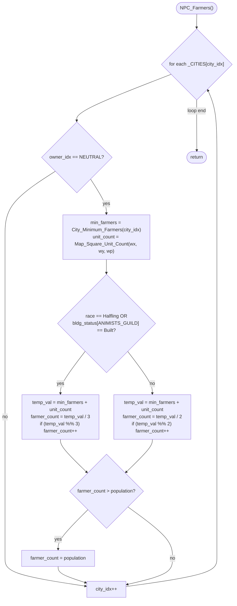

AIDUDES-NPC_Farmers.md

C:\STU\devel\STU-Extras\Piethawn\Piethawn\out\WIZARDS\ovr145\NPC_Farmers.asm
C:\STU\devel\STU-Extras\Piethawn\Piethawn\out\WIZARDS\ovr145\NPC_Farmers.c

AI_Next_Turn()
    |-> NPC_Farmers()

---

# `NPC_Farmers` — Walkthrough

| Function | Location | Role |
|---|---|---|
| `NPC_Farmers` | [AIDUDES.c:1889-1934](../../MoM/src/AIDUDES.c#L1889-L1934) | For every neutral-owned city, recompute `farmer_count = ceil((min_farmers + unit_count) / food_per_farmer)`, then clamp to `population`. Divisor is `3` for Halfling cities OR cities with `bldg_status[ANIMISTS_GUILD] == bs_Built` (the OG's second-clause condition — see the OGBUG note in [OG quirks](#og-quirks-preserved-faithful--do-not-fix)); otherwise `2`. Called once per turn from `AI_Next_Turn`'s neutral-player cleanup. |

Verified faithful to the disassembly `NPC_Farmers.asm` throughout (structure 1:1). The production body carries an inline `/* GEMINI */` marker at [AIDUDES.c:1888](../../MoM/src/AIDUDES.c#L1888) — the C was seeded from a GEMINI translation of the OG asm and then reviewed against the bytes; the `bldg_status[ANIMISTS_GUILD]` at line 1904 matches the OG's `bldg_status+0Ah` offset exactly.

## Purpose

The neutral-player farmer auto-allocator. Neutral cities aren't managed by any wizard, so the game engine has to keep them fed autonomously. For each neutral city:

1. **`min_farmers`** — the city's baseline food demand, in food units. Fetched via `City_Minimum_Farmers(city_idx)` — despite the name, this is a food-demand number, not a farmer count.
2. **`unit_count`** — the number of units currently standing on the city square. Each contributes 1 to the food demand (unit upkeep).
3. **`food_per_farmer`** — normally `2`. For Halfling cities OR cities with the OG's second-clause building (per the code, `bldg_status[ANIMISTS_GUILD]` at byte offset 10, which was almost certainly meant as GRANARY — see the OGBUG note below), `3`.
4. **`farmer_count = ceil((min_farmers + unit_count) / food_per_farmer)`** — assigned via `(quotient) + (remainder ? 1 : 0)`.
5. **Clamp**: `farmer_count = min(farmer_count, population)` — a city can't have more farmers than population.

The whole pass runs deterministically (no RNG) over `_CITIES[]`. No throttle — fires every turn for every neutral city.

## How it's reached

| Caller | Site | Notes |
|---|---|---|
| `AI_Next_Turn` neutral cleanup | [AIDUDES.c:355](../../MoM/src/AIDUDES.c#L355) `PHASE(NPC_Farmers())` | Once per turn, after the per-AI loop and after `Player_All_Colony_Autobuild(NEUTRAL_PLAYER_IDX)`. |

## Globals / external state

| Symbol | Definition | Effect |
|---|---|---|
| `_CITIES[]`, `_cities` | city records + count | Read (`owner_idx`, `race`, `bldg_status[]`, `wx`, `wy`, `wp`, `population`); mutated (`farmer_count`). |
| `NEUTRAL_PLAYER_IDX` | constant | Owner filter. |
| `City_Minimum_Farmers(city_idx)` | helper | Returns baseline food demand for the city (misleadingly named — it's food units, not farmer count). |
| `Map_Square_Unit_Count(wx, wy, wp)` | helper | Counts units standing on the city's exact tile (each contributes 1 to food demand). |

## Signature and locals

```c
void NPC_Farmers(void)
```

OG stack locals (asm:4-6): `minimum_farmers` (stack), `city_idx` (SI register), `unit_count` (DI register). Production declares:

| OG asm name | Production C name |
|---|---|
| `minimum_farmers` | `min_farmers` |
| `city_idx` | `city_idx` |
| `unit_count` | `unit_count` |
| — | `temp_val` ← **GEMINI-added factor, no OG counterpart** |

Production factors `min_farmers + unit_count` into `temp_val` and reuses it for both the division and the modulo check. OG recomputes `min_farmers + unit_count` at each use site (asm:73-74, 86-87 for the 3-food branch; asm:112-113, 125-126 for the 2-food branch). Behavior-equivalent, structurally different. Not flagged as a bug — the GEMINI factoring is a readability improvement over the OG's byte-level redundancy.

## Structure



## Code walk

Line refs are production [AIDUDES.c](../../MoM/src/AIDUDES.c); cross-checked against `NPC_Farmers.asm` (the authority).

### Phase 1 — Owner filter + helpers ([1895-1901](../../MoM/src/AIDUDES.c#L1895-L1901))

```c
for (city_idx = 0; city_idx < _cities; city_idx++)
{
    if(_CITIES[city_idx].owner_idx == NEUTRAL_PLAYER_IDX)
    {
        min_farmers = City_Minimum_Farmers(city_idx);
        unit_count = Map_Square_Unit_Count(_CITIES[city_idx].wx, _CITIES[city_idx].wy, _CITIES[city_idx].wp);
        ...
```

Maps onto asm:12-57. Outer loop init `xor city_idx, city_idx; jmp loc_D48F7` (lines 12-13) + exit test `cmp city_idx, [_cities]; jge @@Done` (lines 180-181) ↔ production line 1895.

Owner filter (asm:15-23): `cmp [es:bx+s_CITY.owner_idx], e_NEUTRAL_PLAYER_IDX; jz proceed; jmp continue` ↔ production line 1897.

Helper calls (asm:26-57):
- `push city_idx; call j_City_Minimum_Farmers` returns AX into `minimum_farmers` (lines 26-29).
- `Map_Square_Unit_Count(wx, wy, wp)` with right-to-left cdecl push (wp, wy, wx pushed in that order → C call args in reverse). Production line 1901's arg order (wx, wy, wp) matches.

### Phase 2 — Halfling / ANIMISTS_GUILD check ([1904](../../MoM/src/AIDUDES.c#L1904))

```c
/* OGBUG:  wrong calculation */
if(_CITIES[city_idx].race == rt_Halfling || _CITIES[city_idx].bldg_status[ANIMISTS_GUILD] == bs_Built)
```

Maps 1:1 onto asm:58-71:

```asm
cmp [es:bx+s_CITY.race], rt_Halfling
jz  short loc_D4805                              ; == Halfling → 3-food branch
cmp [es:bx+(s_CITY.bldg_status+0Ah)], bs_Built   ; asm:70 — offset +10 = ANIMISTS_GUILD in current enum
jnz short loc_D485A                              ; != Built → 2-food branch
loc_D4805:                                        ; fall through to 3-food
```

`ANIMISTS_GUILD = 0x0A = 10` per [MOM_DEF.h:592](../../MoX/src/MOM_DEF.h#L592) — matches the OG asm's `+0Ah` byte offset exactly. See [OG quirks](#og-quirks-preserved-faithful--do-not-fix) for the OGBUG interpretation (the OG author almost certainly meant GRANARY, coded ANIMISTS_GUILD).

### Phase 3 — 3-food branch (Halfling / ANIMISTS_GUILD) ([1906-1913](../../MoM/src/AIDUDES.c#L1906-L1913))

```c
temp_val = min_farmers + unit_count;
_CITIES[city_idx].farmer_count = (temp_val / 3);
if((temp_val % 3) != 0)
{
    _CITIES[city_idx].farmer_count++;
}
```

Maps onto asm `loc_D4805`-`loc_D4858` (lines 72-108). OG recomputes `min_farmers + unit_count` twice (asm:73-74, 86-87) and does two full `idiv bx = 3` operations — one for the quotient store, one for quotient+remainder round-up. Production factors into `temp_val` and uses `/` + `%` operators. Behavior-equivalent (`ceil(X / 3)` in both).

Signed-divide idiom for the quotient: `cwd; idiv bx` (asm:76-77) — production `temp_val / 3` (line 1907).

Round-up check: `or dx, dx; jz skip` on the remainder from the second `idiv` (asm:91-92) ↔ production `if((temp_val % 3) != 0)` (line 1909).

### Phase 4 — 2-food branch (default) ([1917-1924](../../MoM/src/AIDUDES.c#L1917-L1924))

```c
temp_val = min_farmers + unit_count;
_CITIES[city_idx].farmer_count = (temp_val / 2);
if((temp_val % 2) != 0)
{
    _CITIES[city_idx].farmer_count++;
}
```

Maps onto asm `loc_D485A`-`loc_D48AC` (lines 111-146). Notable structural difference: OG uses **two different divide idioms** in this branch:

- For the quotient store (asm:112-116): `cwd; sub ax, dx; sar ax, 1` — signed-divide-by-2 with round-toward-zero. Faster than `idiv` (no divide unit) but doesn't produce the remainder.
- For the round-up check (asm:125-130): `mov bx, 2; cwd; idiv bx` — full `idiv` giving both quotient and remainder.

Production uses `/ 2` and `% 2`, which compile to whatever MSVC prefers. Behavior-equivalent (`ceil(X / 2)` in both). Not flagged as a bug.

### Phase 5 — Population clamp ([1927-1930](../../MoM/src/AIDUDES.c#L1927-L1930))

```c
if(_CITIES[city_idx].farmer_count > _CITIES[city_idx].population)
{
    _CITIES[city_idx].farmer_count = _CITIES[city_idx].population;
}
```

Maps 1:1 onto asm `loc_D48AC`-`loc_D48F6` (lines 147-176). `cmp farmer_count, population; jle skip; mov farmer_count, population`. Faithful.

## OG quirks preserved (faithful — do not "fix")

- **`City_Minimum_Farmers` name is misleading** — despite the name, the function returns food units (baseline food demand), not a farmer count. Added directly to `unit_count` (also a food demand) and the sum divided by `food_per_farmer`. Preserved OG naming.
- **`unit_count` = "units on the city square"** — units *stationed* on the city tile count for upkeep. Units elsewhere in the city's radius do not. Preserved.
- **OGBUG: `bldg_status[ANIMISTS_GUILD]` almost certainly should be `bldg_status[GRANARY]`** ([line 1904](../../MoM/src/AIDUDES.c#L1904)) — the OG asm at line 70 reads byte offset +10 into `bldg_status`, which is `ANIMISTS_GUILD` (Nature-realm spell facility) in the current ReMoM enum. Semantically wrong for a food-per-farmer bonus check — the intended building was surely `GRANARY` (food storage, +½ food per farmer in stock MoM). The OG author coded the wrong offset. **Preserved as-written** per the faithful-to-Dasm rule; the `/* OGBUG: wrong calculation */` comment at line 1903 flags the discrepancy without altering behavior. Fixing this would silently change AI gameplay for neutral cities with an Animists' Guild (their farmers would go from producing 3 food to 2, since the bonus wouldn't fire; and cities with a Granary would go from 2 to 3).
- **Halfling + the-wrong-building both give the 3-food bonus** — either race being Halfling OR (some) building at bldg_status index being Built triggers the 3-food branch. Not additive. Preserved.
- **No RNG** — the pass is deterministic. PRNG stream unaffected.

## Sub-functions / external calls

- **`City_Minimum_Farmers(city_idx)`** — returns baseline food demand for the city. Called once per neutral city.
- **`Map_Square_Unit_Count(wx, wy, wp)`** — counts units on the exact tile. Called once per neutral city. Args in `(wx, wy, wp)` order matching asm push order (right-to-left cdecl gives `wp, wy, wx` on the stack → C call `(wx, wy, wp)`).

No RNG. No I/O. No `EMM_Map_CONTXXX__WIP`.

## Related references

- `C:\STU\devel\STU-Extras\Piethawn\Piethawn\out\WIZARDS\ovr145\NPC_Farmers.asm` — IDA Pro 5.5 disassembly (the authority).
- [MOM_DEF.h:583-617](../../MoX/src/MOM_DEF.h#L583-L617) — building index enum. `ANIMISTS_GUILD = 0x0A` (used here per OG bytes), `GRANARY = 0x1D` (what the OG author probably meant).
- `s_CITY` fields read/written: `owner_idx`, `race`, `bldg_status[]`, `wx`, `wy`, `wp`, `population`, `farmer_count`.
- `NEUTRAL_PLAYER_IDX`, `rt_Halfling`, `bs_Built` — enum values used in filters.
- `feedback_gemini_is_not_ground_truth` (memory) — GEMINI translations are not OG-truth; the OG asm is authoritative. This walkthrough's verification step recomputed against the asm rather than trusting the GEMINI-translated C.
