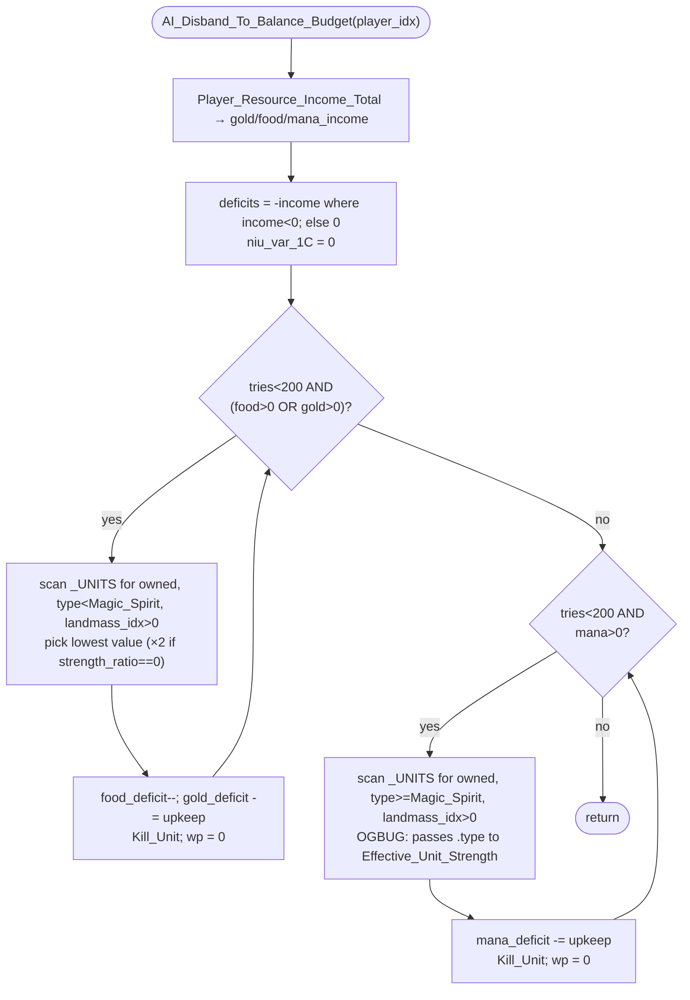

AIMOVE-AI_Disband_To_Balance_Budget.md

C:\STU\devel\STU-Extras\Piethawn\Piethawn\out\WIZARDS\ovr158\AI_Disband_To_Balance_Budget.asm
C:\STU\devel\STU-Extras\Piethawn\Piethawn\out\WIZARDS\ovr158\AI_Disband_To_Balance_Budget.c

WZD: o158p16

AI_Next_Turn()
    |-> AI_Set_Unit_Orders()
        |-> AI_Disband_To_Balance_Budget()

---

# `AI_Disband_To_Balance_Budget` — Walkthrough

| Function | Location | Role |
|---|---|---|
| `AI_Disband_To_Balance_Budget` | [AIMOVE.c:3147-3344](../../MoM/src/AIMOVE.c#L3147-L3344) | If food/gold/mana income is negative, kill the lowest-value units until each deficit reaches zero. Two passes: non-fantastic units cover the food + gold deficits; fantastic units (`type >= ut_Magic_Spirit`) cover the mana deficit. |

Verified faithful to the disassembly `AI_Disband_To_Balance_Budget.asm` throughout (structure 1:1, no RNG calls).

## Purpose

The first item in `AI_Set_Unit_Orders` Phase 3 ([AIMOVE-AI_Set_Unit_Orders.md](AIMOVE-AI_Set_Unit_Orders.md) — global pre-pass). When the AI is bleeding gold, food, or mana per turn, this function thins the herd: it finds the cheapest non-fantastic unit, kills it, repeats until the food and gold ledgers cross zero — then does the same for fantastic units against the mana ledger. Two completely independent loops, sharing only the `tries` cap (200, per loop).

It does **not** consult any per-landmass dispatch; this is a player-scope decision that runs once before the (plane × landmass) iteration begins.

## How it's reached

| Caller | Site | Notes |
|---|---|---|
| [`AI_Set_Unit_Orders`](AIMOVE-AI_Set_Unit_Orders.md) Phase 3 | [AIMOVE.c:232](../../MoM/src/AIMOVE.c#L232) | First of four global pre-pass items, before the per-landmass dispatch loop starts. |

Per-AI-player only — invoked once per turn per AI player.

## Globals / external state

| Symbol | Definition | Effect |
|---|---|---|
| `_UNITS[]` | per-unit record array | Read (type, owner, position) and mutated via `Kill_Unit` + post-kill `wp = 0` reset. |
| `_landmasses[]` | [MOM_DAT.h:4091](../../MoX/src/MOM_DAT.h#L4091) | Read for `unit_landmass_idx = _landmasses[(unit_wp * WORLD_SIZE) + (wy * WORLD_WIDTH) + wx]` — must be `> 0` for the unit to be a kill candidate. |
| `_ai_landmass_strength_ratios[NUM_PLANES][NUM_LANDMASSES]` | per-landmass strength signal | Read; when the unit's `(wp, landmass)` slot holds `0`, `unit_value` is **doubled** (effectively protecting the unit from disband). Maps to the OG `AI_ContBalances[wp][landmass]` slot indirection. |
| `_unit_type_table[].Upkeep` | per-unit-type upkeep table | Read for the upkeep cost; multiplied by `difficulty_modifiers_table[_difficulty].maintenance / 100`. |
| `_difficulty` | global | Read, used to scale upkeep. |

## Signature and locals

```c
void AI_Disband_To_Balance_Budget(int16_t player_idx)
```

Local `niu_var_1C` is set to `0` and never read again — a "ghost" local present in the OG stack frame (offset `bp-1Ch`). Preserved faithful-to-Dasm; possibly an MoO1 4th-resource artifact or scratch slot that never got reused.

## Structure



## Code walk

Line refs are production [AIMOVE.c](../../MoM/src/AIMOVE.c); cross-checked against `AI_Disband_To_Balance_Budget.asm` (the authority). No RNG calls.

### Phase 1 — Income + deficit setup ([3165-3192](../../MoM/src/AIMOVE.c#L3165-L3192))

```c
Player_Resource_Income_Total(player_idx, &gold_income, &food_income, &mana_income);
mana_deficit = 0; food_deficit = 0; gold_deficit = 0;
niu_var_1C = 0;
if(food_income < 0) { food_deficit += -(food_income); }
if(gold_income < 0) { gold_deficit += -(gold_income); }
if(mana_income < 0) { mana_deficit += -(mana_income); }
```

Maps 1:1 onto asm lines 25-54 (the three `cmp/jge/neg/add` blocks at `loc_EF36F`/`loc_EF37D`/`loc_EF38B`). `niu_var_1C = 0` matches asm line 37 (`mov [bp+niu_var_1C], 0`).

### Phase 2 — Loop 1: non-fantastic units → food + gold deficits ([3195-3266](../../MoM/src/AIMOVE.c#L3195-L3266))

```c
for(tries = 0; ((tries < 200) && ((food_deficit > 0) || (gold_deficit > 0))); tries++)
{
    lowest_unit_value = 10000;
    lowest_value_unit_idx = ST_UNDEFINED;
    for(itr_units = 0; itr_units < _units; itr_units++)
    {
        if((_UNITS[itr_units].type < ut_Magic_Spirit) && (_UNITS[itr_units].owner_idx == player_idx))
        {
            unit_wp = _UNITS[itr_units].wp;
            unit_landmass_idx = _landmasses[((unit_wp * WORLD_SIZE) + (...wy * WORLD_WIDTH) + ...wx)];
            if(unit_landmass_idx > 0)
            {
                unit_value = (Effective_Unit_Strength(itr_units) / 10);
                if(_ai_landmass_strength_ratios[unit_wp][unit_landmass_idx] == 0)
                {
                    unit_value *= 2;
                }
                if(unit_value < lowest_unit_value)
                {
                    lowest_unit_value = unit_value;
                    lowest_value_unit_idx = itr_units;
                }
            }
        }
    }

    if(lowest_value_unit_idx != ST_UNDEFINED)
    {
        food_deficit--;
        lowest_value_unit_upkeep = ((_unit_type_table[...].Upkeep * difficulty_modifiers_table[_difficulty].maintenance) / 100);
        if(lowest_value_unit_upkeep == 0) { lowest_value_unit_upkeep = 1; }
        gold_deficit -= lowest_value_unit_upkeep;
        Kill_Unit(lowest_value_unit_idx, kt_Normal);
        _UNITS[lowest_value_unit_idx].wp = 0;  // BUGBUG?
    }
}
```

Maps onto asm `loc_EF393` (loop body entry, sets `lowest_unit_value = 10000` and `lowest_value_unit_idx = ST_UNDEFINED`) through `loc_EF4E4` (`inc tries`) and the joint exit test at `loc_EF4E7-loc_EF4FD`. Critical asm correspondences:

- **Type filter** (asm:71-72): `cmp [es:bx+s_UNIT.type], ut_Magic_Spirit; jb loc_EF3B8` → `type < ut_Magic_Spirit` (jb = unsigned below). Matches production line 3206.
- **`Effective_Unit_Strength(itr_units)` call** (asm:128-129): `push _DI_itr_units; call j_Effective_Unit_Strength` — pushes the **unit index** `itr_units`. Production line 3219 matches. This is the *correct* parameter form.
- **`_ai_landmass_strength_ratios == 0 → unit_value *= 2`** (asm:135-145, `loc_EF45C`): the `AI_ContBalances+bx` indirection in the asm corresponds exactly to `_ai_landmass_strength_ratios[unit_wp][unit_landmass_idx]` in production. Effect: units on "strength ratio == 0" landmasses become *harder* to disband (higher value).
- **`food_deficit--` then `gold_deficit -= upkeep`** (asm:163, 188-189): asymmetric drain. Each killed unit removes exactly `1` from the food deficit but the unit's full upkeep from the gold deficit. Faithful to OG.
- **Post-kill `wp = 0` reset** (asm:196-201): `mov [es:bx+s_UNIT.wp], 0` writes the wp slot after the unit is already killed. Production line 3262 matches with a `BUGBUG?` flag — see [Bug catalog](#bug-catalog) below.

### Phase 3 — Loop 2: fantastic units → mana deficit ([3269-3342](../../MoM/src/AIMOVE.c#L3269-L3342))

```c
for(tries = 0; ((tries < 200) && (mana_deficit > 0)); tries++)
{
    lowest_unit_value = 10000;
    lowest_value_unit_idx = ST_UNDEFINED;
    for(itr_units = 0; itr_units < _units; itr_units++)
    {
        if((_UNITS[itr_units].type >= ut_Magic_Spirit) && (_UNITS[itr_units].owner_idx == player_idx))
        {
            unit_wp = _UNITS[itr_units].wp;
            unit_landmass_idx = _landmasses[((unit_wp * WORLD_SIZE) + (...wy * WORLD_WIDTH) + ...wx)];
            if(unit_landmass_idx > 0)
            {
                /* OGBUG ¿ should use Effective_Unit_Type_Strength() or pass itr_units ? */
                unit_value = (Effective_Unit_Strength(_UNITS[itr_units].type) / 10);
                if(_ai_landmass_strength_ratios[unit_wp][unit_landmass_idx] == 0)
                {
                    unit_value *= 2;
                }
                if(unit_value < lowest_unit_value) { ... }
            }
        }
    }

    if(lowest_value_unit_idx != ST_UNDEFINED)
    {
        lowest_value_unit_upkeep = ((_unit_type_table[...].Upkeep * difficulty_modifiers_table[_difficulty].maintenance) / 100);
        if(lowest_value_unit_upkeep == 0) { lowest_value_unit_upkeep = 1; }
        mana_deficit -= lowest_value_unit_upkeep;
        Kill_Unit(lowest_value_unit_idx, kt_Normal);
        _UNITS[lowest_value_unit_idx].wp = 0;  // BUGBUG?
    }
}
```

Near-identical structure to Loop 1 except:

- **Type filter inverted** (asm:230-231): `cmp [es:bx+s_UNIT.type], ut_Magic_Spirit; jnb loc_EF52A` → `type >= ut_Magic_Spirit` (jnb = unsigned not-below). Matches production line 3283.
- **`Effective_Unit_Strength` parameter is the unit *type*, not the unit *index*** (asm:287-295): the asm loads `_UNITS[itr_units].type` and pushes that as the parameter — **not** `itr_units` itself. Production line 3297 matches: `Effective_Unit_Strength(_UNITS[itr_units].type)`. This is the [B1 OGBUG](#bug-catalog) — IDA-confirmed.
- **Single-resource exit condition** (asm:370-371): only `mana_deficit > 0` keeps the loop running; food and gold are ignored in this pass.
- **No `food_deficit--`** — fantastic units don't consume food in this accounting.
- **Independent `tries` counter** (asm:215, `mov [bp+tries], 0` before `loc_EF505`): production's separate `for(tries = 0; ...)` matches the OG's reset before the second loop.

## OG quirks preserved (faithful — do not "fix")

- **`niu_var_1C` ghost local** ([3171](../../MoM/src/AIMOVE.c#L3171)) — declared at OG stack offset `bp-1Ch`, set to `0`, never read. Possibly an MoO1 4th-resource artifact or unused scratch. Preserved.
- **Asymmetric food vs gold drain in Loop 1** — `food_deficit--` (by 1 per kill) but `gold_deficit -= upkeep` (by the full upkeep cost). Faithful to asm `dec [bp+food_deficit]` vs `sub [bp+gold_deficit], ax`. Possibly intentional (food isn't a per-unit-type cost in MoM's economy), or possibly a SimTex oversight; either way the OG behavior is preserved.
- **Independent 200-iteration cap per loop** — Loop 2 doesn't inherit Loop 1's `tries` count; each gets its own budget. Faithful to asm `mov [bp+tries], 0` before each loop entry.
- **Upkeep floor of 1** — when computed upkeep rounds to 0, the loop forces a minimum of 1 (asm lines 184-186 and 349-351). Preserved in both loops.

## Bug catalog

| # | Severity | Line | Description |
|---|---|---|---|
| **B1** | Medium (OGBUG) | [3296-3297](../../MoM/src/AIMOVE.c#L3296-L3297) | Loop 2 passes `_UNITS[itr_units].type` (a unit type enum) to `Effective_Unit_Strength()` instead of `itr_units` (the unit index). Loop 1 (line 3219) correctly passes the index. As a result, Loop 2 disband ordering for fantastic units uses the per-type strength rather than the per-instance effective strength (which would account for veteran/experience/equipment modifiers). **IDA-confirmed OG-faithful** — asm line 287-295 explicitly loads `s_UNIT.type` and pushes it as the call argument, vs asm line 128 which pushes `_DI_itr_units` directly. Preserved. |
| **B2** | Low (BUGBUG?) | [3262](../../MoM/src/AIMOVE.c#L3262) | Loop 1: after `Kill_Unit(lowest_value_unit_idx, kt_Normal)`, sets `_UNITS[lowest_value_unit_idx].wp = 0`. `Kill_Unit` already marks the slot via `ST_UNDEFINED`. Why reset wp specifically? Unknown — possibly a defensive fixup against stale-pointer reads later in the turn. **IDA-confirmed OG-faithful** — asm line 201 `mov [es:bx+s_UNIT.wp], 0`. Preserved. |
| **B3** | Low (BUGBUG?) | [3338](../../MoM/src/AIMOVE.c#L3338) | Loop 2 mirror of B2. Same status, same IDA-confirmation (asm line 366). Preserved. |
| **B4** | None (NIU) | [3171](../../MoM/src/AIMOVE.c#L3171) | `niu_var_1C = 0;` — declared, set, never read. No behavior impact; preserved for OG stack-frame fidelity. |

(There is no "B5+" deficit-asymmetry entry because the food-vs-gold drain asymmetry is documented under [OG quirks](#og-quirks-preserved-faithful--do-not-fix) above as preserved OG behavior rather than a reconstruction-error candidate.)

## Sub-functions / external calls

- **`Player_Resource_Income_Total(player_idx, &gold, &food, &mana)`** — populates the three income out-parameters. Single call, Phase 1.
- **`Effective_Unit_Strength(unit_idx_or_type)`** — per-unit (Loop 1) or per-unit-type (Loop 2; OGBUG) effective strength. The Loop 2 misuse is the function-typed-vs-index-typed parameter mismatch documented as B1.
- **`Kill_Unit(unit_idx, kt_Normal)`** — removes the unit from the world. Called with `kt_Normal == 0` (asm: `xor ax, ax; push ax`).

No RNG calls. No I/O. No `CONTXXX_Map` or page-frame churn.

## Related references

- `C:\STU\devel\STU-Extras\Piethawn\Piethawn\out\WIZARDS\ovr158\AI_Disband_To_Balance_Budget.asm` — IDA Pro 5.5 disassembly (the authority).
- [AIMOVE-AI_Set_Unit_Orders.md](AIMOVE-AI_Set_Unit_Orders.md) — parent dispatcher; this function is the first item in its Phase 3 global pre-pass.
- [MoM-AI-AIMOVE-Index.md](MoM-AI-AIMOVE-Index.md) — AIMOVE.c function index.
- `MOX_DEF.h` — `WORLD_WIDTH = 60`, `WORLD_SIZE = 2400` constants used in the landmass-index formula.
- `MOM_DAT.h` — `extern uint8_t * _landmasses;` declaration and `_ai_landmass_strength_ratios` storage.
