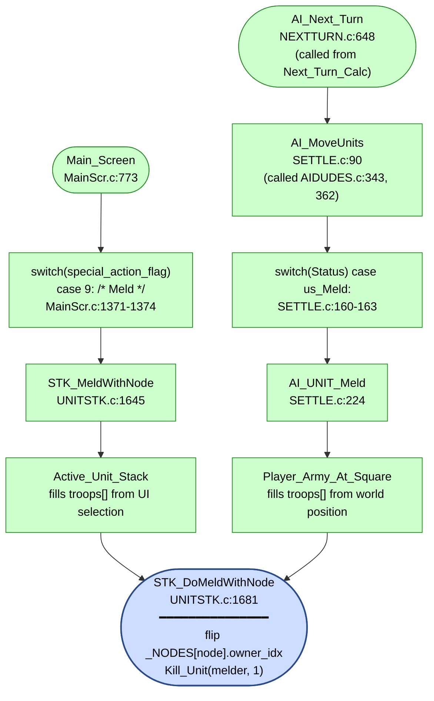

AIMOVE-AI_Stacks_Do_Meld.md

C:\STU\devel\STU-Extras\Piethawn\Piethawn\out\WIZARDS\ovr158\AI_Stacks_Do_Meld.asm
C:\STU\devel\STU-Extras\Piethawn\Piethawn\out\WIZARDS\ovr158\AI_Stacks_Do_Meld.c
C:\STU\devel\STU-Extras\Piethawn\Piethawn\out\WIZARDS\ovr158\AI_Order_Meld.asm
C:\STU\devel\STU-Extras\Piethawn\Piethawn\out\WIZARDS\ovr158\AI_Order_Meld.c

IDGI

Main_Screen()
    |-> STK_MeldWithNode()
        |-> Active_Unit_Stack()
        |-> STK_DoMeldWithNode()
AI_Next_Turn()

    |-> AI_Set_Unit_Orders()
        |-> AI_Stacks_Do_Meld()
            |-> AI_Stacks_Order_Meld()
    |-> AI_Set_Unit_Orders()
        |-> AI_Stacks_Ocean_Landmass_Orders()
            |-> AI_Stacks_Do_Meld()
                |-> AI_Stacks_Order_Meld()
    |-> AI_MoveUnits()
        |-> AI_UNIT_Meld()
            |-> STK_DoMeldWithNode()

The two flows reach the same destination (STK_DoMeldWithNode) but gather "the stack" from completely different data sources.
STK_MeldWithNode (human path) — pulls from UI selection state
 * Input: no parameters except output buffers.
 * Source: _unit_stack[] — the global current-selection array that the UI maintains.
 * Filter: .active == ST_TRUE — units the human has marked active in the current selection.
 * Context: runs right after a click on the Meld special-action button. The "stack" IS whatever the human has actively selected via the UI.
AI_UNIT_Meld (AI path) — synthesizes the stack from world position
 * Input: an explicit (wx, wy, wp, owner) tuple — derived from a starting unit_idx.
 * Source: _UNITS[] directly, walked end-to-end.
 * Filter: same square + same owner (with an extra in_tower clause that bypasses the plane match).
 * Context: runs during AI turn processing where there's no UI selection. The AI has a single unit_idx and needs to gather all OTHER units belonging to the same owner at the same square (because the meld machinery in STK_DoMeldWithNode needs the full stack — to find a Guardian Spirit if present, to mark them all us_Ready afterward, etc.).

---

# AI_Stacks_Do_Meld && AI_Stacks_Order_Meld — Walkthrough

Two tightly-coupled functions covered together: `AI_Stacks_Do_Meld` is the per-stack dispatcher that finds melder units and a meld target; `AI_Stacks_Order_Meld` is the 4-line order-issuer it calls to mark a melder ON its target.

**`AI_Stacks_Do_Meld` location:** [MoM/src/AIMOVE.c:3954](../../MoM/src/AIMOVE.c#L3954) (~135 lines, ends [line ~4088](../../MoM/src/AIMOVE.c#L4088)), with Doxygen header at [lines 3929-3953](../../MoM/src/AIMOVE.c#L3929-L3953). **WZD overlay:** ovr158, p22. **drake178 name:** `AI_ProcessMelders()`. **GEMINI variant:** deleted.

**`AI_Stacks_Order_Meld` location:** [MoM/src/AIMOVE.c:4914](../../MoM/src/AIMOVE.c#L4914) (6 lines, ends [line 4919](../../MoM/src/AIMOVE.c#L4919)), with Doxygen header at [lines 4892-4913](../../MoM/src/AIMOVE.c#L4892-L4913). **WZD overlay:** ovr158, p30. **drake178 name:** `AI_UNIT_SetMeldOrder()`. **GEMINI variant:** deleted.

## Purpose

**Per-stack/per-unit MELDER dispatch.** For each unit in `_ai_own_stack_*` that has the `UA_MELD` ability (Spirits), find the closest non-owned node we can/should meld and issue either a direct meld order (if already on the node) or a goto order toward the node.

A melder is the meta-AI's primary node-acquisition vehicle:
- **Magic Spirits** (basic Sorcery summon, cheap, disposable)
- **Guardian Spirits** (Life-realm, expensive but combat-capable)

When a melder is sitting on a node owned by another wizard (or by no one) and gets the `us_Meld` status, the next turn's dispatch is INTENDED to flip ownership so that the node starts feeding mana into THIS player's spell income. So this pair is the AI's strategic mana-grab dispatcher.

**Production state of the downstream pathway.** The AI dispatch chain reaches `STK_DoMeldWithNode` end-to-end in current production:
- AIDUDES per-turn AI processing reaches [SETTLE.c:162](../../MoM/src/SETTLE.c#L162) — `case us_Meld:` dispatches to `AI_UNIT_Meld(unit_idx)`.
- `AI_UNIT_Meld` at [SETTLE.c:224](../../MoM/src/SETTLE.c#L224) checks `Finished`, gathers the on-square stack via `Player_Army_At_Square`, calls `STK_DoMeldWithNode`, then sets every gathered troop's status to `us_Ready` (drake178-flagged OGBUG that overwrites busy statuses).
- `STK_DoMeldWithNode` at [UNITSTK.c:1681](../../MoM/src/UNITSTK.c#L1681) handles `Can_Meld` (own, no owner, or Guardian-Spirit 25% roll), then `_NODES[node_idx].owner_idx = unit_owner;` and `Kill_Unit(melder_unit_idx, 1);`. Reached via both the human special-action UI path AND the AI `us_Meld` Status dispatch.

So in current production: `AI_Stacks_Do_Meld` → `AI_Stacks_Order_Meld` → `Status = us_Meld` → next turn → `AI_UNIT_Meld(unit_idx)` → `STK_DoMeldWithNode` → node-ownership flip + spirit kill. The strategic-intent dispatcher and the execution machinery are now wired together.

### Call paths reaching `STK_DoMeldWithNode`

The actual node-ownership-flip machinery (`STK_DoMeldWithNode` at [UNITSTK.c:1681](../../MoM/src/UNITSTK.c#L1681)) is reachable through two production paths — human special-action and AI per-turn dispatch — both now wired end-to-end.



**Legend:**
- 🟢 Green: both call paths reach `STK_DoMeldWithNode`. Human path pulls the stack from UI selection state (`_unit_stack[]` via `Active_Unit_Stack`); AI path synthesizes the stack from world position (`_UNITS[]` via `Player_Army_At_Square`).

**Verified line refs (this section only):**
- `Main_Screen` at MainScr.c:773 — grep confirmed function definition.
- `MainScr.c:1371-1374` — Read confirmed `case 9: /* Meld */` (inside Main_Screen's `switch(special_action_flag)`) calls `STK_MeldWithNode()`.
- `STK_MeldWithNode` at UNITSTK.c:1645 — Read confirmed it calls `Active_Unit_Stack` then `STK_DoMeldWithNode`.
- `AI_Next_Turn` called from NEXTTURN.c:648 — grep confirmed `PHASE(AI_Next_Turn())`.
- `AIDUDES.c:343, 362` — grep confirmed `PHASE(AI_MoveUnits(player_idx))` and `PHASE(AI_MoveUnits(NEUTRAL_PLAYER_IDX))`.
- `AI_MoveUnits` at SETTLE.c:90 — grep confirmed function definition.
- `case us_Meld` at SETTLE.c:160-163 — grep confirmed dispatch calls `AI_UNIT_Meld(unit_idx)` at SETTLE.c:162.
- `AI_UNIT_Meld` at SETTLE.c:224 — Read confirmed function definition (gathers stack via `Player_Army_At_Square`, calls `STK_DoMeldWithNode`, marks troops `us_Ready`).
- `STK_DoMeldWithNode` at UNITSTK.c:1681 — grep confirmed function definition.

## Signatures

```c
void AI_Stacks_Do_Meld(int16_t player_idx);
void AI_Stacks_Order_Meld(int16_t unit_idx, int16_t unit_list_idx, int16_t list_unit_idx);
```

`AI_Stacks_Do_Meld` callers:
- [AIMOVE.c:290](../../MoM/src/AIMOVE.c#L290) — **slot 4** of per-landmass dispatch inside [`AI_Set_Unit_Orders`](AIMOVE-AI_Set_Unit_Orders.md). Runs once per (player, plane, landmass).
- [AIMOVE.c:1139](../../MoM/src/AIMOVE.c#L1139) — **Phase 4** of [`AI_Stacks_Ocean_Landmass_Orders`](AIMOVE-AI_Stacks_Ocean_Landmass_Orders.md) (out-of-band; called per (player, plane) after the inner per-landmass loop). The out-of-band call is non-obvious — melders normally meld land nodes, but here `_ai_own_stack_*` describes ocean stacks. Possibly a defensive sweep for melders that wandered onto ocean tiles. Worth investigating during a future ocean-square-melder scenario.

`AI_Stacks_Order_Meld` callers:
- [AIMOVE.c:4044](../../MoM/src/AIMOVE.c#L4044) — only called from `AI_Stacks_Do_Meld` Phase 4a.

**`AI_Stacks_Do_Meld` total invocations per AI player per turn:** `(NUM_PLANES × NUM_LANDMASSES) + NUM_PLANES = 2×99 + 2 = 200`. The function does its own gating internally (UA_MELD ability check, ST_UNDEFINED check, target-eligibility filter), so the high invocation count is harmless — most calls just iterate stacks, find no melders, and return.

## Inputs (globals read)

| Source | Phase | Used for |
|---|---|---|
| `_ai_own_stack_count` | Do_Meld P1 | outer-loop bound |
| `_ai_own_stack_unit_count[itr]` | Do_Meld P2 | per-stack unit-count |
| `_ai_own_stack_unit_list[itr][list_unit_idx]` | Do_Meld P2 | unit-list cursor |
| `_UNITS[unit_idx].{type, wx, wy, wp}` | Do_Meld P2 | melder ID + position cache |
| `_unit_type_table[type].Abilities` | Do_Meld P2 | `UA_MELD` test |
| `_units` | Do_Meld P3c | defender-scan loop bound |
| `_UNITS[itr_units].{owner_idx, wx, wy, wp}` | Do_Meld P3c | defender-scan filter |
| `NUM_NODES` (= 30) | Do_Meld P3 | node-scan loop bound |
| `_NODES[itr_nodes].{wp, owner_idx, wx, wy}` | Do_Meld P3a | node-filter + position |
| `g_ai_evaluation_map[wp][wy*WORLD_WIDTH + wx]` | Do_Meld P3b | `AI_TARGET_SITE` check |
| `_landmasses[wp*WORLD_SIZE + wy*WORLD_WIDTH + wx]` | Do_Meld P3d | landmass-index lookup at node |
| `_ai_continents.plane[wp].player[player_idx].type_array[landmass_idx]` | Do_Meld P3d | landmass-type filter |
| `Delta_XY_With_Wrap(...)` | Do_Meld P3d | distance scorer |
| `MAX_UNIT_COUNT` (= 1000) | Order_Meld | bounds check on `unit_idx` |

## Outputs (side effects)

- **`AI_Stacks_Do_Meld` Phase 4a** — for an on-node melder (`min_delta_distance == 0`): calls `AI_Stacks_Order_Meld(unit_idx, itr, list_unit_idx)`.
- **`AI_Stacks_Do_Meld` Phase 4b** — for a melder elsewhere: calls `AI_Stacks_Order_Attack_Target_Or_Goto_Destination(unit_idx, node_wx, node_wy, itr, list_unit_idx)` with `g_ai_set_target_caller = 14`. Writes `Status` (us_Move/us_GOTO) + `dst_wx`/`dst_wy` + marks the stack slot `ST_UNDEFINED`.
- **`AI_Stacks_Order_Meld`** writes `_UNITS[unit_idx].Status = us_Meld` and marks the stack slot `ST_UNDEFINED`. No-op if `unit_idx < 0` or `unit_idx >= MAX_UNIT_COUNT`.

## Locals

### `AI_Stacks_Do_Meld`

```c
int16_t node_landmass_idx = 0;      /* Phase 3d landmass-index at node */
int16_t unit_wp = 0;                /* Phase 2 unit-plane cache */
int16_t node_is_garrisoned = 0;     /* Phase 3c defender-scan flag */
int16_t delta_distance = 0;         /* Phase 3d candidate distance */
int16_t node_wy = 0;                /* Phase 3 node-position cache */
int16_t node_wx = 0;                /* same — x */
int16_t unit_wy = 0;                /* Phase 2 unit-position cache */
int16_t unit_wx = 0;                /* same — x */
int16_t itr_units = 0;              /* Phase 3c defender-scan iterator */
int16_t unit_idx = 0;               /* Phase 2 _ai_own_stack_unit_list[itr][list_unit_idx] cache */
int16_t list_unit_count = 0;        /* Phase 2 _ai_own_stack_unit_count[itr] cache */
int16_t list_unit_idx = 0;          /* Phase 2 per-stack unit-list iterator */
int16_t min_delta_distance = 0;     /* Phase 3d running-min distance (sentinel 1000) */
int16_t target_node_idx = 0;        /* Phase 3d selected node (sentinel ST_UNDEFINED) */
int16_t itr = 0;                    /* Phase 1 stack iterator (asm: DI) */
int16_t itr_nodes = 0;              /* Phase 3 node iterator (asm: SI) */
```

### `AI_Stacks_Order_Meld`

No locals — entire body is 3 lines (one bounds-check + two assignments).

## Code walk — `AI_Stacks_Do_Meld`

### Phase 1 — Outer stack loop ([line 3949](../../MoM/src/AIMOVE.c#L3949))

```c
for(itr = 0; itr < _ai_own_stack_count; itr++)
{
    list_unit_count = _ai_own_stack_unit_count[itr];
    for(list_unit_idx = 0; list_unit_idx < list_unit_count; list_unit_idx++)
    {
        unit_idx = _ai_own_stack_unit_list[itr][list_unit_idx];
        ...
    }
}
```

Walks every entry in every own-stack on the current landmass (or ocean, depending on caller). Inner loop fetches the unit index from the stack's slot list.

### Phase 2 — Melder filter + position cache ([lines 3960-3971](../../MoM/src/AIMOVE.c#L3960-L3971))

```c
/* OGBUG  MUST check for ST_UNDEFINED first */
if((_unit_type_table[_UNITS[unit_idx].type].Abilities & UA_MELD) == 0)
{
    continue;
}
if(unit_idx == ST_UNDEFINED)
{
    continue;
}

unit_wx = _UNITS[unit_idx].wx;
unit_wy = _UNITS[unit_idx].wy;
unit_wp = _UNITS[unit_idx].wp;
```

Two early-continue gates. First gate skips non-melders (UA_MELD bit clear). Second gate skips already-consumed slots (ST_UNDEFINED sentinel). Falls through to cache the unit's position for Phase 3.

**B1 (drake178-flagged OGBUG, inline comment at line 3959):** the type-read `_UNITS[unit_idx].type` happens BEFORE the `unit_idx == ST_UNDEFINED` check. When `unit_idx == -1` (consumed slot), this is `_UNITS[-1].type` — out-of-bounds read. **IDA-confirmed OG-faithful** ([asm 60-63](C:/STU/devel/STU-Extras/Piethawn/Piethawn/out/WIZARDS/ovr158/AI_Stacks_Do_Meld.asm): reads type first via `mov al, [es:bx+s_UNIT.type]`, then checks `cmp [bp+Unit_Index], -1`).

The early-continue restructuring (vs the original combined-`&&` form) preserves the OGBUG ordering — the type-read still precedes the ST_UNDEFINED check, just in a flatter shape. In practice the OOB read returns whatever byte happens to live at `_UNITS - 1`'s `.type` offset. Most of the time this is a low byte that misses the `UA_MELD` bit and the first gate continues. So the OGBUG is **mostly harmless** but is a genuine OOB read.

### Phase 3 — Node target search ([lines 3973-4032](../../MoM/src/AIMOVE.c#L3973-L4032))

```c
target_node_idx = ST_UNDEFINED;
min_delta_distance = 1000;

for(itr_nodes = 0; itr_nodes < NUM_NODES; itr_nodes++)
{
    if((_NODES[itr_nodes].wp == unit_wp) && (_NODES[itr_nodes].owner_idx != player_idx))
    {
        node_wx = _NODES[itr_nodes].wx;
        node_wy = _NODES[itr_nodes].wy;

        if(g_ai_evaluation_map[unit_wp][((node_wy * WORLD_WIDTH) + node_wx)] == AI_TARGET_SITE)
        {
            node_landmass_idx = _landmasses[((unit_wp * WORLD_SIZE) + (node_wy * WORLD_WIDTH) + node_wx)];
            node_is_garrisoned = ST_FALSE;

            for(itr_units = 0; itr_units < _units; itr_units++)
            {
                if((_UNITS[itr_units].owner_idx == player_idx) && (_UNITS[itr_units].wx == node_wx)
                   && (_UNITS[itr_units].wy == node_wy) && (_UNITS[itr_units].wp == unit_wp))
                {
                    node_is_garrisoned = ST_TRUE;
                }
            }

            if(
                (_ai_continents.plane[unit_wp].player[player_idx].type_array[node_landmass_idx] == lmt_Own)
                || (_ai_continents.plane[unit_wp].player[player_idx].type_array[node_landmass_idx] >= lmt_Leaveable)
                || (node_is_garrisoned == ST_TRUE)
            )
            {
                delta_distance = Delta_XY_With_Wrap(node_wx, node_wy, unit_wx, unit_wy, WORLD_WIDTH);
                if(delta_distance < min_delta_distance)
                {
                    min_delta_distance = delta_distance;
                    target_node_idx = itr_nodes;
                }
            }
        }
    }
}
```

`min_delta_distance = 1000` is the "no candidate" sentinel (toroidal distance maxes well below 1000).

**Phase 3a — Per-node filter** (lines 3980-3984): take the node only if (a) it's on the unit's plane and (b) it's NOT already owned by this player (so a node we already control is skipped — no point re-melding).

**Phase 3b — `AI_TARGET_SITE` gate** (line 3990): the node square must be flagged `AI_TARGET_SITE` (`0x8000`) in `g_ai_evaluation_map`. This is the strategic-value flag set during continent evaluation. Nodes that aren't strategically interesting (already-secured nodes far from the front, isolated, etc.) get filtered out here.

**Phase 3c — Defender scan** (lines 3996-4010): scan `_UNITS[]` to see if any own unit is already AT the node's square. Sets `node_is_garrisoned`. **Quirk:** no early-break — keeps scanning all 1000 units even after a match. OG-faithful (asm 168-211 confirms same lack of break). Wasted CPU, no behavioral impact.

**Phase 3d — Landmass-type filter + distance scoring** (lines 4012-4026): accept the node iff the landmass containing it is one of:
- `lmt_Own` (we control it) — meld at home is safe
- `>= lmt_Leaveable` (5 or 6 — `lmt_Leaveable` or `lmt_NoTargets`) — we're done with the landmass for combat, free to meld
- We have a garrison on the node square already (`node_is_garrisoned == TRUE`) — safe regardless of landmass type

**Skipped landmasses:** `lmt_Unevaluated` (0), `lmt_Contested` (2), `lmt_NoOwnCity` (3), `lmt_NoOwnCityAndAllyHasCity` (4). Don't waste melders on landmasses where war is active or we have no foothold (unless we already garrisoned the node itself).

Then update `min_delta_distance` + `target_node_idx` if this candidate is closer than the running min.

OG name for `lmt_Leaveable` was `lmt_Abandon` — same enum value (5). Asm at offset `+1F8` confirms.

### Phase 4 — Dispatch decision ([lines 4034-4050](../../MoM/src/AIMOVE.c#L4034-L4050))

```c
if(target_node_idx != ST_UNDEFINED)
{
    if(min_delta_distance == 0)
    {
        AI_Stacks_Order_Meld(unit_idx, itr, list_unit_idx);
    }
    else
    {
        node_wx = _NODES[target_node_idx].wx;
        node_wy = _NODES[target_node_idx].wy;
        g_ai_set_target_caller = 14;
        AI_Stacks_Order_Attack_Target_Or_Goto_Destination(unit_idx, node_wx, node_wy, itr, list_unit_idx);
    }
}
```

**Phase 4a — On-node melder** (`min_delta_distance == 0`): the unit is ALREADY standing on a meldable node. Call `AI_Stacks_Order_Meld` — sets `Status = us_Meld` and marks the stack slot consumed.

**Phase 4b — Off-node melder**: route the unit toward the closest target node with `g_ai_set_target_caller = 14`. The order-issuer decides between `us_Move` and `us_GOTO` based on whether the target square has a SITE flag in the eval map (it does — see Phase 3b — so Status will be `us_Move`).

If no target was found (no eligible node anywhere on the plane), do nothing — the melder stays in Status whatever-it-was and may be processed by other slots later.

## Code walk — `AI_Stacks_Order_Meld`

```c
void AI_Stacks_Order_Meld(int16_t unit_idx, int16_t unit_list_idx, int16_t list_unit_idx)
{
    if((unit_idx < 0) || (unit_idx >= MAX_UNIT_COUNT)) { return; }
    _UNITS[unit_idx].Status = us_Meld;
    _ai_own_stack_unit_list[unit_list_idx][list_unit_idx] = ST_UNDEFINED;
}
```

Three lines:

1. **Bounds check** — reject `unit_idx` out of `[0, MAX_UNIT_COUNT)`. **IDA-confirmed OG-faithful** ([asm 9-13](C:/STU/devel/STU-Extras/Piethawn/Piethawn/out/WIZARDS/ovr158/AI_Order_Meld.asm): `or dx, dx; jl ret; cmp dx, 1000; jl proceed`). OG hardcodes `1000`; production uses `MAX_UNIT_COUNT` constant — same value. Production has a Doxygen `/** @brief ... @param ... */` header at [lines 4892-4913](../../MoM/src/AIMOVE.c#L4892-L4913) matching the sibling `AI_Stacks_Order_Ferry` pattern.
2. **Set Status** — `_UNITS[unit_idx].Status = us_Meld`. The melder waits one turn; next turn's melder-Status processing IS INTENDED to flip the node owner via [SETTLE.c:137-140](../../MoM/src/SETTLE.c#L137-L140) `case us_Meld: AI_UNIT_Meld(unit_idx)` — but that function is an empty WIP stub in production (see Purpose section caveat). drake178's OG name is `AI_UNIT_Meld()` (no `__WIP` suffix; the suffix is the project's "not-yet-reconstructed" marker).
3. **Consume stack slot** — `_ai_own_stack_unit_list[unit_list_idx][list_unit_idx] = ST_UNDEFINED`. Marks the slot as "spoken for" so downstream dispatchers (slots 5-13 and the per-plane post-passes) skip this unit.

OG asm also `xor ax, ax` returns 0 (function declared `int` in OG, `void` in production — cosmetic).

## Production vs GEMINI

Only `AI_Stacks_Do_Meld` retains a GEMINI variant; `AI_Stacks_Order_Meld`'s GEMINI was deleted during done-done.

### `AI_Stacks_Do_Meld` ([GEMINI line 4061](../../MoM/src/AIMOVE.c#L4061))

GEMINI uses uppercase variable names (`Player_Index`, `Unit_Index`, `CX_UL_ID`) and a verbose stack-frame comment block — drake178-style names preserved as Borland-Pascal-case identifiers. Structure is identical.

| # | Production | GEMINI | Verdict |
|---|---|---|---|
| **D1** | Two-gate early-continue: first `(Abilities & UA_MELD) == 0 → continue`, then `unit_idx == ST_UNDEFINED → continue` | Combined-`&&` form: `(UA_MELD != 0) && (unit_idx != ST_UNDEFINED)` enters body | Both reproduce the OGBUG ordering (type-read before ST_UNDEFINED check). **IDA-confirmed OG-faithful** per asm 60-63. The two-gate vs combined-`&&` is a refactoring difference; same observable behavior. |
| **D2** | Variable naming `unit_idx`, `itr`, `list_unit_idx` | `Unit_Index`, `CX_ID`/`CX_UL_ID` (drake178 register-aliased names) | Stylistic. |
| **D3** | `lmt_Leaveable` | `lmt_Abandon` (drake178's old name, same enum value 5) | Stylistic — same enum value, just the renamed identifier. |

GEMINI adds no behavioral information. Safe to delete on done-done.

## Bug catalog

| # | Where | Issue | Severity |
|---|---|---|---|
| B1 | [Line 3960](../../MoM/src/AIMOVE.c#L3960) | `AI_Stacks_Do_Meld` Phase 2 first early-continue gate evaluates `_UNITS[unit_idx].type` before the ST_UNDEFINED check on line 3964. When `unit_idx == -1` (consumed slot), reads `_UNITS[-1].type` (OOB). drake178 OGBUG comment inline at line 3959. **IDA-confirmed OG-faithful** (asm 60-63). | OGBUG-faithful; OOB read (mostly harmless — the random byte usually misses `UA_MELD` and the first gate continues) |
| B2 | [Lines 3996-4010](../../MoM/src/AIMOVE.c#L3996-L4010) | `AI_Stacks_Do_Meld` Phase 3c defender-scan has no early-break — keeps scanning all `_units` even after a match. IDA-confirmed OG-faithful (asm 168-211). | OGBUG-faithful; wasted CPU only |
| B-quirk | [Out-of-band call from Ocean_Landmass_Orders Phase 4](../../MoM/src/AIMOVE.c#L1139) | `AI_Stacks_Do_Meld` called per (player, plane) after the inner per-landmass loop, on the OCEAN stack-rebuild context. Melders normally meld land nodes; running this against ocean-stack data is non-obvious. drake178 didn't comment. Worth investigating during the future ocean-square-melder scenario. | Behavioral; semantically dubious but not obviously buggy |

`AI_Stacks_Order_Meld` is OGBUG-clean — bounds check is correct, no OOB, no behavioral surprises.

## ASCII summary

```
AI_Stacks_Do_Meld(player_idx)
  └─ for each ocean/landmass stack [outer: itr]:
       └─ for each unit slot in stack [inner: list_unit_idx]:
            ├─ P2: unit_idx = _ai_own_stack_unit_list[itr][list_unit_idx]
            │       early-continue if NOT UA_MELD  [B1: type-read precedes -1 check]
            │       early-continue if unit_idx == ST_UNDEFINED
            │       cache unit_wx/wy/wp
            │
            ├─ P3: target_node_idx = -1, min_delta = 1000
            │      for each node [itr_nodes]:
            │         filter:  wp == unit_wp  AND  owner != player
            │         filter:  g_ai_evaluation_map == AI_TARGET_SITE
            │         defender-scan _UNITS [B2: no early-break]
            │         filter:  landmass type in {Own, >=Leaveable} OR garrisoned
            │         update min_delta + target_node_idx
            │
            └─ P4: if target found:
                     if min_delta == 0:   AI_Stacks_Order_Meld           [in-place]
                                           │
                                           └─ bounds-check unit_idx
                                              _UNITS[u].Status = us_Meld
                                              _ai_own_stack_unit_list[s][u] = ST_UNDEFINED
                     else:                Order_Attack/GOTO        [caller=14]
                                           ↓ same Status writes + slot consumption
```

## Position in the dispatch chain

```
AI_Set_Unit_Orders(player_idx)
  └─ for wp in [0, 1]:
       ├─ for landmass_idx in [1, NUM_LANDMASSES):
       │    ├─ slot 1: AI_Stacks_Init_Build_Target_Order
       │    ├─ slot 2: AI_Stacks_Move_Out_NonMilitary_Garrisoned
       │    ├─ slot 3: AI_Stacks_Survey_Expedition_Forces
       │    ├─ slot 4: AI_Stacks_Do_Meld                                ◄── HERE
       │    │           └─ AI_Stacks_Order_Meld                         ◄── (on-node case)
       │    ├─ slot 5: AI_Do_Settle
       │    ├─ slot 6: AI_Do_Purify
       │    ├─ slot 7: AI_Do_RoadBuild
       │    └─ ... slots 8-13 ...
       │
       ├─ AI_Stacks_Wartime_Ocean_Movement_And_Cleanup
       └─ AI_Stacks_Ocean_Landmass_Orders
            └─ Phase 4: AI_Stacks_Do_Meld(player_idx)                   ◄── ALSO HERE (out-of-band)
                          └─ AI_Stacks_Order_Meld                       ◄── (same)
```

**Why so early in the per-landmass dispatch (slot 4)?** `AI_Stacks_Do_Meld` consumes stack slots (via `AI_Stacks_Order_Meld`'s `ST_UNDEFINED` write). Running it BEFORE slot 9 ([`AI_Stacks_Roamers_Target_Or_Deploy`](AIMOVE-AI_Stacks_Roamers_Target_Or_Deploy.md)) means later slots see the consumed slots as "already spoken for" and skip those melders for combat-role decisions. Pre-claim melders for their dedicated job before the combat dispatcher gets a crack at them.

**Sibling slot-4-through-7 functions** (per-job order-setters):
- **`AI_Stacks_Do_Meld`** (this) → `AI_Stacks_Order_Meld`
- `AI_Do_Settle` → `AI_Order_Settle`
- `AI_Do_Purify` → `AI_Order_Purify`
- `AI_Do_RoadBuild` → `AI_Order_RoadBuild`

All share the same shape: scan `_ai_own_stack_*` for the relevant ability-bit, find a valid target, issue order via the matching `AI_Order_*` helper. The `AI_Order_*` helpers are all minimal: bounds-check + set `Status` + consume slot.

## Related references

- [AIMOVE-AI_Set_Unit_Orders.md](AIMOVE-AI_Set_Unit_Orders.md) — dispatcher; calls `AI_Stacks_Do_Meld` as slot 4
- [AIMOVE-AI_Stacks_Ocean_Landmass_Orders.md](AIMOVE-AI_Stacks_Ocean_Landmass_Orders.md) — Phase 4 also calls `AI_Stacks_Do_Meld` out-of-band
- [AIMOVE-AI_Stacks_Init_Build_Target_Order.md](AIMOVE-AI_Stacks_Init_Build_Target_Order.md) — slot 1; populates `_ai_own_stack_*` that `AI_Stacks_Do_Meld` reads
- [AIMOVE-AI_Stacks_Move_Out_NonMilitary_Garrisoned.md](AIMOVE-AI_Stacks_Move_Out_NonMilitary_Garrisoned.md) — slot 2; pushes melders out of garrison-occupied positions before slot 4 runs
- [AIMOVE-AI_Stacks_Order_Ferry.md](AIMOVE-AI_Stacks_Order_Ferry.md) — sibling `AI_Order_*` helper (ferry order); same minimal shape
- [MoM-AI-Move-ai_own_stack.md](MoM-AI-Move-ai_own_stack.md) — `_ai_own_stack_*` parallel-arrays reference
- [MoM-AI-Landmass-Types.md](MoM-AI-Landmass-Types.md) — `lmt_*` enum used by the Phase 3d filter
- [MoM-AI-AIMOVE-Index.md](MoM-AI-AIMOVE-Index.md) — function index
- `C:\STU\devel\STU-Extras\Piethawn\Piethawn\out\WIZARDS\ovr158\AI_Stacks_Do_Meld.asm` — IDA Pro 5.5 disassembly (ground truth, verified)
- `C:\STU\devel\STU-Extras\Piethawn\Piethawn\out\WIZARDS\ovr158\AI_Order_Meld.asm` — IDA Pro 5.5 disassembly (ground truth, verified)
