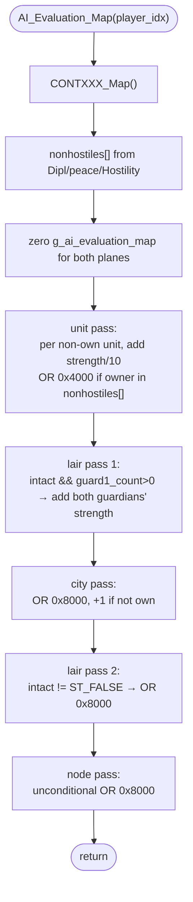

AIMOVE-AI_Evaluation_Map.md

C:\STU\devel\STU-Extras\Piethawn\Piethawn\out\WIZARDS\ovr162\AI_Evaluation_Map.asm
C:\STU\devel\STU-Extras\Piethawn\Piethawn\out\WIZARDS\ovr162\AI_Evaluation_Map.c

WZD: o162p36
drake178 name: (none assigned)

AI_Next_Turn()
    |-> AI_Evaluation_Map()

---

# `AI_Evaluation_Map` — Walkthrough

| Function | Location | Role |
|---|---|---|
| `AI_Evaluation_Map` | [AIMOVE.c:6796-7016](../../MoM/src/AIMOVE.c#L6796-L7016) | Per-AI-player: rebuild `g_ai_evaluation_map[NUM_PLANES][WORLD_SIZE]` — the per-square "what's here?" bitmap consumed by downstream AI targeting/movement passes. Low 14 bits = packed strength value (enemy unit strength/10, plus lair guardian strength/10, plus `+1` for non-own cities). Upper 2 bits = flags: `0x4000` = `AI_TARGET_NONHOSTILE` (own-side unit of a non-hostile player here), `0x8000` = `AI_TARGET_SITE` (city / intact lair / node here). |

The `/* HACK */` blocks throughout the body are explicit OG-bug **mitigations** required to keep modern Windows from raising access violations on out-of-bounds reads the OG bugs would produce. See [Bug catalog (OG bugs + HACK mitigations)](#bug-catalog-og-bugs--hack-mitigations).

## Purpose

The foundational pre-orders setup function: builds the "AI's view of the world map" before any per-turn targeting/movement logic runs. Every downstream pass that asks "should this square be attacked? avoided? walked through?" reads `g_ai_evaluation_map[wp][xy_ofst]`. Specifically:

- **Strength value (low 14 bits)**: `sum(Effective_Unit_Strength(enemy_unit) / 10)` for every non-own unit at the square, plus `(Effective_Unit_Type_Strength(guardN_type) / 10) * (guardN_count & 0x0F)` for both guardian slots of every intact lair at the square, plus `+1` if the square holds a non-own city.
- **`AI_TARGET_NONHOSTILE` flag (`0x4000`)**: square holds at least one unit whose owner is in this player's `nonhostiles[]` table (Wizard Pact, Alliance, current peace duration, or `Hostility[itr] < 2`). Read by movement code that wants to *not* trespass on a friendly wizard's territory.
- **`AI_TARGET_SITE` flag (`0x8000`)**: square holds a city, an intact lair (intact != ST_FALSE), or a node — anything worth attacking/melding/sieging. Read by target-list builders.

The function is called once per AI player per turn ([AIDUDES.c:300](../../MoM/src/AIDUDES.c#L300), wrapped in `PHASE()`), right before [`AI_Evaluate_Continents`](AIMOVE-AI_Eevaluate_Continents.md), which is in turn before `AI_Set_Unit_Orders`.

## How it's reached

| Caller | Site | Notes |
|---|---|---|
| `AI_Next_Turn` per-AI loop | [AIDUDES.c:300](../../MoM/src/AIDUDES.c#L300) `PHASE(AI_Evaluation_Map(player_idx))` | Once per AI player per turn. |

Per-AI-player only. The output is consumed indirectly by every downstream targeting/movement pass via `g_ai_evaluation_map[wp][xy_ofst]` reads.

## Globals / external state

| Symbol | Definition | Effect |
|---|---|---|
| `g_ai_evaluation_map[NUM_PLANES][WORLD_SIZE]` | int16_t bitmap | Written: cleared then repopulated. Read by all downstream AI passes. |
| `_players[].Dipl.Dipl_Status[]`, `.peace_duration[]`, `.Hostility[]` | per-player diplomatic state | Read for `nonhostiles[]` classification. |
| `_UNITS[]` (count `_units`) | per-unit records | Read (owner_idx, wp, wx, wy, type) for strength accumulation. |
| `_LAIRS[NUM_LAIRS]` | per-lair records | Read twice — first for guardian strength contribution (intact + guard1_count > 0), then for AI_TARGET_SITE flag (intact != ST_FALSE). |
| `_CITIES[]` (count `_cities`) | per-city records | Read for AI_TARGET_SITE flag + `+1` strength if not own. |
| `_NODES[NUM_NODES]` | per-node records | Read for AI_TARGET_SITE flag (unconditional). |
| `Effective_Unit_Strength(unit_idx)`, `Effective_Unit_Type_Strength(type)` | strength helpers | Called per unit / per lair guardian. |
| `CONTXXX_Map()` | EMS page-frame remap | Called once at function entry; no matching `EMMDATAH_Map()` at exit (the next-stage `AI_Evaluate_Continents` is responsible for the eventual restore via `AI_Set_Unit_Orders`'s Phase 5 cleanup). |

## Signature and locals

```c
void AI_Evaluation_Map(int16_t player_idx)
```

OG stack locals (asm:4-7): `nonhostiles[NUM_PLAYERS]`, `xy_ofst`, `unit_owner_idx`, `map_square_count` — all present in production at lines 6798-6801. Production adds typed cursor pointers (`p_unit`, `p_lair`, `p_city`, `p_node`) for readability; the OG just re-computes `imul (size s_TYPE); add bx, ax` each time. Cursor pointers are pure readability hoist — they encode the same `_X[itr]` indexing as the OG.

## Structure



## Code walk

Line refs are production [AIMOVE.c](../../MoM/src/AIMOVE.c); cross-checked against `AI_Evaluation_Map.asm` (the authority). No RNG calls.

### Phase 1 — EMM remap + `nonhostiles[]` table ([6811-6833](../../MoM/src/AIMOVE.c#L6811-L6833))

```c
CONTXXX_Map();

for(itr = 0; itr < NUM_PLAYERS; itr++)
{
    if(
        (_players[player_idx].Dipl.Dipl_Status[itr] == DIPL_WizardPact)
        || (_players[player_idx].Dipl.Dipl_Status[itr] == DIPL_Alliance)
        || (_players[player_idx].peace_duration[itr] > 0)
        || (_players[player_idx].Hostility[itr] < 2)
    )
    { nonhostiles[itr] = ST_TRUE; }
    else
    { nonhostiles[itr] = ST_FALSE; }
}
```

Maps onto asm `loc_F83AC`-`loc_F8419` (lines 16-69). The asm tests the four conditions as four separate `cmp; jz loc_F83FC` / `cmp; jg loc_F83FC` / `cmp; jge loc_F840B` chained jumps — short-circuit `||` semantics. Clause order: WizardPact (line 26) → Alliance (line 33) → peace_duration > 0 (line 40) → Hostility < 2 (line 49). Production `||` chain matches order. Faithful.

### Phase 2 — Clear evaluation map ([6836-6843](../../MoM/src/AIMOVE.c#L6836-L6843))

```c
map_square_count = WORLD_SIZE;
for(wp = 0; wp < NUM_PLANES; wp++)
{
    for(itr = 0; itr < map_square_count; itr++)
    {
        g_ai_evaluation_map[wp][itr] = 0;
    }
}
```

Maps onto asm `loc_F8427`/`loc_F8441`/`loc_F8447` (lines 70-94). `map_square_count` is stack-cached (asm line 70) to avoid re-loading the `WORLD_SIZE` immediate inside the hot inner loop — production preserves the variable rather than inlining the constant. Faithful.

### Phase 3 — Unit pass ([6846-6887](../../MoM/src/AIMOVE.c#L6846-L6887))

```c
for(itr_units = 0; itr_units < _units; itr_units++)
{
    p_unit = &_UNITS[itr_units];

    // OGBUG  by (bad) design  assert(_UNITS[itr_units].owner_idx != ST_UNDEFINED);
    /* HACK */  if(p_unit->owner_idx == ST_UNDEFINED) { continue; }
    assert(p_unit->wp != ST_UNDEFINED);
    /* HACK */  if(p_unit->wp == ST_UNDEFINED) { continue; }

    unit_owner_idx = p_unit->owner_idx;
    if(
        (unit_owner_idx == player_idx)
        || (p_unit->owner_idx == player_idx)  // conflicting condition - will always jump
    )
    { continue; }

    wp = p_unit->wp;
    xy_ofst = ((p_unit->wy * WORLD_WIDTH) + p_unit->wx);

    strength = Effective_Unit_Strength(itr) / 10;
    g_ai_evaluation_map[wp][xy_ofst] += strength;

    // OGBUG  will index nonhostiles[] with unit_owner_idx = ST_UNDEFINED, ...
    if(nonhostiles[unit_owner_idx] == ST_TRUE)
    {
        g_ai_evaluation_map[wp][xy_ofst] |= AI_TARGET_NONHOSTILE;
    }
}
```

Maps onto asm `loc_F8451`-`loc_F8524`:

- Own-skip pair (asm:107-122): TWO separate `mov al, [es:bx+s_UNIT.owner_idx]; cbw; cmp ax, [bp+player_idx]; jnz; jmp loc_F8524` blocks back-to-back, both testing the same thing. Production preserves both clauses in the `||` chain at lines 6864-6868 with the explanatory comment. **OG-faithful** — the duplicate test is in the OG bytes. The "// conflicting condition" comment names the redundancy without removing it.
- Position + offset compute (asm:124-152) ↔ production lines 6873-6874.
- `Effective_Unit_Strength(itr) / 10` (asm:153-158) ↔ production line 6877. Note `itr` is the unit index — passed to the strength helper directly.
- `g_ai_evaluation_map[wp][xy_ofst] += strength` (asm:159-166) ↔ production line 6878.
- Nonhostile flag (asm:167-189): `cmp [nonhostiles+bx], ST_TRUE; jnz skip; OR 4000h` ↔ production lines 6882-6885. `AI_TARGET_NONHOSTILE = 0x4000` (asm line 181: `or ax, 4000h`).

### Phase 4 — Lair pass 1: guardian strength ([6890-6926](../../MoM/src/AIMOVE.c#L6890-L6926))

```c
for(itr = 0; itr < NUM_LAIRS; itr++)
{
    if(
        (_LAIRS[itr].intact == ST_TRUE)
        && (_LAIRS[itr].guard1_count > 0)
    )
    {
        assert((_LAIRS[itr].wp >= WORLD_PMIN) && (_LAIRS[itr].wp <= WORLD_PMAX));
        /* HACK */ ... range-check skips ...

        wp = _LAIRS[itr].wp;
        xy_ofst = ((_LAIRS[itr].wy * WORLD_WIDTH) + _LAIRS[itr].wx);

        strength = (Effective_Unit_Type_Strength(_LAIRS[itr].guard1_unit_type) / 10) * (_LAIRS[itr].guard1_count & 0x0F);
        g_ai_evaluation_map[wp][xy_ofst] += strength;

        strength = (Effective_Unit_Type_Strength(_LAIRS[itr].guard2_unit_type) / 10) * (_LAIRS[itr].guard2_count & 0x0F);
        g_ai_evaluation_map[wp][xy_ofst] += strength;
    }
}
```

Maps onto asm `loc_F8533`-`loc_F8644`:

- Intact filter (asm:201-209): `cmp [es:bx+s_LAIR.intact], e_ST_TRUE; jz proceed; else jmp skip` — only fires for fully-intact lairs (intact == ST_TRUE = 1, NOT 0xC0). Production line 6894.
- Guard1 count filter (asm:211-219): `cmp guard1_count, 0; ja proceed; else jmp skip` — unsigned `>` test, so lairs with `guard1_count == 0` skip. Production line 6896.
- Position + offset compute (asm:221-249) ↔ production lines 6913-6914.
- Guard1 strength (asm:251-283): `Effective_Unit_Type_Strength(guard1_unit_type) / 10`, then `* (guard1_count & 0x0F)`. The `& 0x0F` extracts the **low nibble** = current remaining guardians. `Set_Upper_Lair_Guardian_Count` packs initial count into the high nibble at world-gen, so low nibble is the live count. Production line 6917.
- Guard2 strength (asm:284-316) ↔ production line 6921. Same pattern.

### Phase 5 — City pass: SITE flag + value bump ([6929-6957](../../MoM/src/AIMOVE.c#L6929-L6957))

```c
for(itr = 0; itr < _cities; itr++)
{
    p_city = &_CITIES[itr];
    assert(...); /* HACK */ ... range checks ...

    wp = p_city->wp;
    xy_ofst = ((p_city->wy * WORLD_WIDTH) + p_city->wx);

    g_ai_evaluation_map[wp][xy_ofst] |= AI_TARGET_SITE;

    if(p_city->owner_idx != player_idx)
    {
        g_ai_evaluation_map[wp][xy_ofst] += 1;
    }
}
```

Maps onto asm `loc_F8652`-`loc_F86EC`:

- Position + offset compute (asm:328-357) ↔ production lines 6946-6947.
- `OR 0x8000` (asm:358-374): `mov ax, [es:bx]; or ax, 8000h; mov [es:bx], ax`. **`AI_TARGET_SITE = 0x8000`**. Production line 6949.
- Owner check + `+1` (asm:375-391): `cmp owner_idx, player_idx; jz skip; inc [word ptr es:bx]`. Production lines 6952-6955.

### Phase 6 — Lair pass 2: SITE flag for not-FALSE lairs ([6960-6988](../../MoM/src/AIMOVE.c#L6960-L6988))

```c
for(itr = 0; itr < NUM_LAIRS; itr++)
{
    p_lair = &_LAIRS[itr];

    if(p_lair->intact != ST_FALSE)  /* CAUTION: 0xC0 != ST_FALSE */
    {
        /* HACK */ ... range checks ...

        wp = p_lair->wp;
        xy_ofst = ((p_lair->wy * WORLD_WIDTH) + p_lair->wx);

        g_ai_evaluation_map[wp][xy_ofst] |= AI_TARGET_SITE;
    }
}
```

Maps onto asm `loc_F86FB`-`loc_F877D`:

- Intact filter (asm:403-410): `cmp intact, e_ST_FALSE; jz skip` — **different from Phase 4**. Phase 4 only fires when `intact == ST_TRUE` (= 1); Phase 6 fires whenever `intact != ST_FALSE` (catches both 1 = ST_TRUE and 0xC0 partially-intact). The inline comment "CAUTION: 0xC0 != ST_FALSE" names the gotcha — `intact` is a byte field with non-boolean values, so `!=` rather than `==` is the deliberate OG choice. Faithful.
- Rest of the loop is structurally identical to Phase 5 (compute offset, OR 0x8000). Production lines 6981-6984.

### Phase 7 — Node pass: SITE flag for all nodes ([6991-7014](../../MoM/src/AIMOVE.c#L6991-L7014))

```c
for(itr = 0; itr < NUM_NODES; itr++)
{
    p_node = &_NODES[itr];
    assert(...); /* HACK */ ... range checks ...

    wp = p_node->wp;
    xy_ofst = ((p_node->wy * WORLD_WIDTH) + p_node->wx);

    g_ai_evaluation_map[wp][xy_ofst] |= AI_TARGET_SITE;
}
```

Maps onto asm `loc_F878A`-`loc_F87F9`. No intact-equivalent filter — every node contributes its SITE flag unconditionally. Position + offset compute (asm:467-495) ↔ production lines 7009-7010. `OR 0x8000` (asm:497-513) ↔ production line 7012.

## Flag layout

`g_ai_evaluation_map[wp][xy_ofst]` is a 16-bit cell with:

| Bits | Meaning |
|---|---|
| 0 – 13 | Accumulated value: enemy unit strength/10 + lair guardian strength/10 + `+1` per non-own city |
| 14 (`0x4000`) | `AI_TARGET_NONHOSTILE` — square holds a unit owned by a Pact/Alliance/peace/`Hostility<2` player |
| 15 (`0x8000`) | `AI_TARGET_SITE` — square holds a city, an intact-or-partial lair, or a node |

A square that's been the staging tile for an enemy army in a friendly wizard's territory could end up with all three set: strength accumulated, NONHOSTILE flag set, SITE flag set if the army happens to be at a city/lair/node.

## OG quirks preserved (faithful — do not "fix")

- **Duplicate own-skip test in Phase 3 unit pass** (lines 6864-6868) — the OG bytes at asm:107-122 contain two separate `cmp; jnz; jmp` blocks both testing `unit_owner_idx == player_idx`. Production reproduces both via the `||` chain with an inline comment ("conflicting condition - will always jump"). Faithful; the redundancy is in the original.
- **Phase 4 uses `intact == ST_TRUE`, Phase 6 uses `intact != ST_FALSE`** — different tests on the same field. Phase 4 only contributes guardian strength for fully-intact lairs (`intact == 1`); Phase 6 flags as SITE any lair that hasn't been emptied (`intact != 0`, which includes 0xC0 = partially-looted). Asm:207 vs asm:409. Both preserved.
- **`(guardN_count & 0x0F)` low-nibble extraction** — the high nibble is the initial count (set by `Set_Upper_Lair_Guardian_Count` at world-gen); the low nibble is the live count. Strength contribution scales with live count. Faithful (asm:272, 305).
- **No EMM restore at exit** — the function only calls `CONTXXX_Map()` on entry; there's no matching `EMMDATAH_Map()` at exit. The caller chain (downstream `AI_Set_Unit_Orders` Phase 5) handles the restore. Asm:16 has the entry call but no matching exit call before `retf` at line 522. Faithful.

## Bug catalog (OG bugs + HACK mitigations)

The OG asm trusts every read-index. On 1990s DOS, an out-of-bounds read just returned whatever garbage was there and execution continued. On modern Windows, the same read can hit a guard page and raise an access violation, crashing the process. So production preserves the OG behavior *up to* the point of the OOB and then short-circuits with a `/* HACK */ continue;` to avoid the crash. The HACKs are crash-protection mitigations, not arbitrary additions — they sidestep specific OG bugs the OG would have done badly under any OS anyway.

| # | OG bug (preserved up to the crash point) | HACK mitigation | Line refs |
|---|---|---|---|
| **B1** | Unit with `owner_idx == ST_UNDEFINED` reaches `nonhostiles[unit_owner_idx]` (line 6882), indexing with `-1` → OOB read → modern-OS access violation. The OG comment at production line 6850 names this as a "(bad) design" choice: the OG explicitly sanitizes `owner_idx` to `ST_UNDEFINED` at turn start and then trusts the bitmap pass to skip such units somehow — except it doesn't. | `/* HACK */ if(owner_idx == ST_UNDEFINED) continue;` at [6851-6854](../../MoM/src/AIMOVE.c#L6851-L6854). | OGBUG comment at [6850](../../MoM/src/AIMOVE.c#L6850), inline OGBUG at [6881](../../MoM/src/AIMOVE.c#L6881). |
| **B2** | Unit with `wp == ST_UNDEFINED` reaches `g_ai_evaluation_map[wp][...]` (line 6878), indexing the plane axis with `-1` → OOB. | `/* HACK */ if(wp == ST_UNDEFINED) continue;` at [6856-6859](../../MoM/src/AIMOVE.c#L6856-L6859). | Paired `assert(p_unit->wp != ST_UNDEFINED);` at [6855](../../MoM/src/AIMOVE.c#L6855) catches it in debug builds. |
| **B3** | Lair / city / node with an out-of-range `(wp, wx, wy)` (corrupted record, save-load bug, partial init) reaches `g_ai_evaluation_map[wp][xy_ofst]` and indexes with garbage. The OG asm trusts these records and would OOB. | `/* HACK */ if(wp/wx/wy out of range) continue;` at four sites: lair pass 1 [6902-6911](../../MoM/src/AIMOVE.c#L6902-L6911), city pass [6935-6944](../../MoM/src/AIMOVE.c#L6935-L6944), lair pass 2 [6970-6979](../../MoM/src/AIMOVE.c#L6970-L6979), node pass [6998-7007](../../MoM/src/AIMOVE.c#L6998-L7007). | Paired `assert(...)` at each site (lines [6899-6901](../../MoM/src/AIMOVE.c#L6899-L6901), [6932-6934](../../MoM/src/AIMOVE.c#L6932-L6934), [6967-6969](../../MoM/src/AIMOVE.c#L6967-L6969), [6995-6997](../../MoM/src/AIMOVE.c#L6995-L6997)). |

The function's preamble at [AIMOVE.c:6792-6794](../../MoM/src/AIMOVE.c#L6792-L6794) acknowledges the situation:

> The implementation is still under reverse-engineering and contains defensive range checks and naming that do not yet fully describe the final intent of the original routine.

These HACKs are necessary as long as the OG bug-classes above remain unfixed elsewhere (e.g., proper invariants on `_UNITS[]`/`_LAIRS[]`/`_CITIES[]`/`_NODES[]` initialization, or upstream prevention of `owner_idx == ST_UNDEFINED` leaking into this pass). If those root causes are addressed later, the HACKs become provably-dead defensive code and can be removed in a single sweep.

## Sub-functions / external calls

- **`CONTXXX_Map()`** — pages CONTXXX into the EMS frame so `g_ai_evaluation_map` is reachable. Called once at entry.
- **`Effective_Unit_Strength(unit_idx)`** — per-instance effective strength; called once per non-own unit.
- **`Effective_Unit_Type_Strength(type)`** — per-type baseline strength; called twice per intact lair (one per guardian slot).

No RNG. No I/O. No `AI_Stack_*` orders issued — this function only *writes the bitmap*, doesn't act on it.

## Related references

- `C:\STU\devel\STU-Extras\Piethawn\Piethawn\out\WIZARDS\ovr162\AI_Evaluation_Map.asm` — IDA Pro 5.5 disassembly (the authority).
- [AIMOVE-AI_Eevaluate_Continents.md](AIMOVE-AI_Eevaluate_Continents.md) — immediately downstream caller (the next `PHASE()` in [AIDUDES.c:301](../../MoM/src/AIDUDES.c#L301)); consumes `g_ai_evaluation_map` for landmass classification.
- [AIMOVE-AI_Set_Unit_Orders.md](AIMOVE-AI_Set_Unit_Orders.md) — runs after `AI_Evaluate_Continents`; many of its per-landmass dispatch callees read `g_ai_evaluation_map`.
- [MoM-AI-AIMOVE-Index.md](MoM-AI-AIMOVE-Index.md) — AIMOVE.c function index.
- `Set_Upper_Lair_Guardian_Count` (MAPGEN) — the world-gen function that packs initial guardian counts into the high nibble; explains why Phase 4 uses `& 0x0F`.
- `_UNITS`, `_LAIRS`, `_CITIES`, `_NODES`, `g_ai_evaluation_map`, `AI_TARGET_NONHOSTILE`, `AI_TARGET_SITE` — declared in `MoX/src/MOM_DAT.h` / sibling headers.
