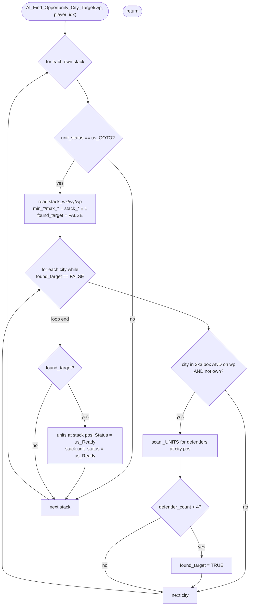

AIMOVE-AI_Find_Opportunity_City_Target.md

C:\STU\devel\STU-Extras\Piethawn\Piethawn\out\WIZARDS\ovr158\AI_Find_Opportunity_City_Target.asm
C:\STU\devel\STU-Extras\Piethawn\Piethawn\out\WIZARDS\ovr158\AI_Find_Opportunity_City_Target.c

AI_Next_Turn()
    |-> AI_Set_Unit_Orders()
        |-> AI_Find_Opportunity_City_Target()   [Phase 3, global pre-pass item 4]

---

# `AI_Find_Opportunity_City_Target` — Walkthrough

| Function | Location | Role |
|---|---|---|
| `AI_Find_Opportunity_City_Target` | [AIMOVE.c:3032-3123](../../MoM/src/AIMOVE.c#L3032-L3123) | For each AI-owned stack currently traveling under `us_GOTO`, look for a weakly-defended (<4 defenders) enemy city in the 3×3 box around the stack on plane `wp`. If found, cancel the stack's GOTO — both at the stack record and on every unit at the stack's position — so the stack is free to attack the opportunity target instead. |

Verified faithful to the disassembly `AI_Find_Opportunity_City_Target.asm` throughout (structure 1:1, no RNG calls).

## Purpose

The fourth and final item in `AI_Set_Unit_Orders` Phase 3 ([AIMOVE-AI_Set_Unit_Orders.md](AIMOVE-AI_Set_Unit_Orders.md) — global pre-pass). The function is a "wait, there's a better target nearby" interrupt: when a stack is already committed to going somewhere (Status = `us_GOTO`), this pass checks whether a soft enemy city is sitting right next to the stack — and if so, releases the stack from its current orders so the per-landmass dispatch loop can re-target it at the opportunity.

The "<4 defenders" threshold defines what counts as "soft." A defender is any unit (own or enemy, friendly or hostile — the count doesn't filter on owner) standing on the city's exact tile. In practice that means: a city with 0-3 garrison units is an opportunity; one with 4+ is left alone.

## How it's reached

| Caller | Site | Notes |
|---|---|---|
| [`AI_Set_Unit_Orders`](AIMOVE-AI_Set_Unit_Orders.md) Phase 3 | [AIMOVE.c:237](../../MoM/src/AIMOVE.c#L237) | Fourth of four global pre-pass items, before the per-landmass dispatch loop. |

Per-AI-player only — invoked once per turn per AI player.

**Note — caller-side OGBUG affecting this function:** `AI_Set_Unit_Orders` calls `AI_Find_Opportunity_City_Target(wp, player_idx)` while its local `wp` is still at its initializer (`0` = Arcanus) — the plane loop hasn't started yet. So this function only ever evaluates the Arcanus plane; Myrror cities are never considered as opportunity targets. The bug is in the caller, not here. Documented in [AIMOVE-AI_Set_Unit_Orders.md](AIMOVE-AI_Set_Unit_Orders.md) bug catalog as IDA-confirmed OG-faithful (preserved per repo policy).

## Globals / external state

| Symbol | Definition | Effect |
|---|---|---|
| `_ai_all_own_stacks[]` (count `_ai_all_own_stack_count`) | AI's compiled own-stack list | Read (`.unit_status`, `.wx`, `.wy`, `.wp`); mutated once per opportunity match: `.unit_status = us_Ready`. |
| `_CITIES[]` (count `_cities`) | per-city records | Read only (`.wx`, `.wy`, `.wp`, `.owner_idx`). |
| `_UNITS[]` (count `_units`) | per-unit records | Read for defender count (city-position match) and stack-cancel (stack-position match). Mutated to `.Status = us_Ready` for every unit at the matching stack's `(wx, wy, wp)` when an opportunity is found. |

## Signature and locals

```c
void AI_Find_Opportunity_City_Target(int16_t wp, int16_t player_idx)
```

OG stack locals (asm:4-16): `defender_count`, `city_wp`, `city_wy`, `city_wx`, `max_wy`, `max_wx`, `min_wy`, `min_wx`, `found_target`, `stack_wp`, `stack_wy`, `stack_wx`, `itr_units`. All map 1:1 to production names.

OG uses one register (`_SI_itr_cities__itr_units`) for both the city iter loop AND two later unit iter loops, reusing the slot. Production keeps two distinct C variables (`itr_cities`, `itr_units`); same effect, no behavior difference.

## Structure



## Code walk

Line refs are production [AIMOVE.c](../../MoM/src/AIMOVE.c); cross-checked against `AI_Find_Opportunity_City_Target.asm` (the authority). No RNG calls.

### Phase 1 — Per-stack GOTO filter ([3050-3056](../../MoM/src/AIMOVE.c#L3050-L3056))

```c
for(itr_stacks = 0; itr_stacks < _ai_all_own_stack_count; itr_stacks++)
{
    if(_ai_all_own_stacks[itr_stacks].unit_status != us_GOTO)
    {
        continue;
    }
    ...
```

Maps 1:1 onto asm `loc_EF0DE`/`loc_EF31F`. The GOTO filter is `cmp [bx+s_AI_STACK_DATA.unit_status], us_GOTO; jz short loc_EF0F4` else `jmp loc_EF31E` (continue). Faithful.

### Phase 2 — Stack position + bbox ([3058-3065](../../MoM/src/AIMOVE.c#L3058-L3065))

```c
stack_wx = _ai_all_own_stacks[itr_stacks].wx;
stack_wy = _ai_all_own_stacks[itr_stacks].wy;
stack_wp = _ai_all_own_stacks[itr_stacks].wp;
min_wx = (stack_wx - 1);
min_wy = (stack_wy - 1);
max_wx = (stack_wx + 1);
max_wy = (stack_wy + 1);
found_target = ST_FALSE;
```

Maps onto asm lines 40-77. Sequence: wx, wy, wp reads (lines 40-63) → min_wx (lines 64-66) → min_wy (lines 67-69) → max_wx (lines 71-73) → max_wy (lines 74-76) → found_target = ST_FALSE (line 77). Production matches order exactly.

### Phase 3 — City scan + filters ([3067-3076](../../MoM/src/AIMOVE.c#L3067-L3076))

```c
for(itr_cities = 0; ((itr_cities < _cities) && (found_target == ST_FALSE)); itr_cities++)
{
    if(_CITIES[itr_cities].wx < min_wx) { continue; }
    if(_CITIES[itr_cities].wx > max_wx) { continue; }
    if(_CITIES[itr_cities].wy < min_wy) { continue; }
    if(_CITIES[itr_cities].wy > max_wy) { continue; }
    if(_CITIES[itr_cities].wp != wp) { continue; }
    if(_CITIES[itr_cities].owner_idx == player_idx) { continue; }
    ...
```

Outer-loop test maps onto asm `loc_EF29B`: `cmp si, _cities; jge loc_EF2AA; cmp found_target, ST_FALSE; jnz loc_EF2AA; jmp loc_EF155`. Continue only when index in range AND found_target still FALSE. Production matches.

Filter sequence maps onto asm:81-151, six independent compare-and-skip blocks in the same order:

| Production line | Filter | OG asm reference |
|---|---|---|
| 3070 | `wx < min_wx` | asm:81-91 (`cmp; jge; else jmp skip`) |
| 3071 | `wx > max_wx` | asm:93-103 (`cmp; jle; else jmp skip`) |
| 3072 | `wy < min_wy` | asm:105-115 (`cmp; jge; else jmp skip`) |
| 3073 | `wy > max_wy` | asm:117-127 (`cmp; jle; else jmp skip`) |
| 3074 | `wp != wp` | asm:129-139 (`cmp; jz; else jmp skip`) |
| 3075 | `owner_idx == player_idx` | asm:141-151 (`cmp; jnz; else jmp skip`) |

Filter order matches OG exactly: wx-min → wx-max → wy-min → wy-max → wp → owner_idx.

### Phase 4 — Defender count ([3078-3094](../../MoM/src/AIMOVE.c#L3078-L3094))

```c
defender_count = 0;
city_wx = _CITIES[itr_cities].wx;
city_wy = _CITIES[itr_cities].wy;
city_wp = _CITIES[itr_cities].wp;
for(itr_units = 0; itr_units < _units; itr_units++)
{
    if(
        (_UNITS[itr_units].wx == city_wx)
        &&
        (_UNITS[itr_units].wy == city_wy)
        &&
        (_UNITS[itr_units].wp == city_wp)
    )
    {
        defender_count++;
    }
}
```

Maps onto asm `loc_EF1F1`-`loc_EF286`:

- `defender_count = 0` (asm:154) ↔ production line 3078.
- `city_wx/wy/wp` reads (asm:155-178) ↔ production lines 3079-3081.
- Inner `itr_units` loop init + test (asm:179-180, 213-216) ↔ production line 3082.
- Position check: asm tests wx (lines 188-191), wy (lines 197-200), wp (lines 206-209), each with `jnz` skip-to-end-of-iter — production's `&&`-chained `if` short-circuits in the same wx→wy→wp order ↔ production lines 3085-3089.
- `defender_count++` (asm:210) ↔ production line 3092.

The defender loop has no owner check — none is needed, since the game-state invariant is that a square holds units from at most one owner. After the wx/wy/wp filter at lines 3070-3075 confirms an enemy city, every unit at that tile is by definition one of its defenders.

### Phase 5 — Opportunity threshold ([3096-3099](../../MoM/src/AIMOVE.c#L3096-L3099))

```c
if(defender_count < 4)
{
    found_target = ST_TRUE;
}
```

Maps onto asm:217-219: `cmp [bp+defender_count], 4; jge short loc_EF29A` else `mov [bp+found_target], e_ST_TRUE`. Faithful — `< 4` matches `jge 4 → skip; else set TRUE`.

### Phase 6 — Cancel GOTO if opportunity found ([3103-3119](../../MoM/src/AIMOVE.c#L3103-L3119))

```c
if(found_target == ST_TRUE)
{
    for(itr_units = 0; itr_units < _units; itr_units++)
    {
        if(
            (_UNITS[itr_units].wx == stack_wx)
            &&
            (_UNITS[itr_units].wy == stack_wy)
            &&
            (_UNITS[itr_units].wp == stack_wp)
        )
        {
            _UNITS[itr_units].Status = us_Ready;
        }
    }
    _ai_all_own_stacks[itr_stacks].unit_status = us_Ready;
}
```

Maps onto asm `loc_EF2AA`-`loc_EF31E`:

- `cmp [bp+found_target], e_ST_TRUE; jnz short loc_EF31E` (asm:229-231) ↔ production line 3103.
- Unit-iter loop with stack-position match → `mov [es:bx+s_UNIT.Status], us_Ready` (asm:235-268) ↔ production lines 3105-3117.
- Per-unit position check order: wx (asm:241-244), wy (asm:250-253), wp (asm:259-262), each `jnz` skip-to-end-of-iter ↔ production's `&&` chain in same order at lines 3107-3113.
- Post-unit-loop `_ai_all_own_stacks[itr_stacks].unit_status = us_Ready` (asm:274-279, after the loop falls through) ↔ production line 3118, after the unit `for` loop closes.

Statement order — units first, then the stack record — matches OG.

## Sub-functions / external calls

None. Pure stack/array scan. No RNG, no I/O, no `CONTXXX_Map`.

## Related references

- `C:\STU\devel\STU-Extras\Piethawn\Piethawn\out\WIZARDS\ovr158\AI_Find_Opportunity_City_Target.asm` — IDA Pro 5.5 disassembly (the authority).
- [AIMOVE-AI_Set_Unit_Orders.md](AIMOVE-AI_Set_Unit_Orders.md) — parent dispatcher; this function is the fourth (last) item in its Phase 3 global pre-pass. Documents the caller-side `wp=0` OGBUG that affects this function's effective scope.
- [AIMOVE-AI_Disband_To_Balance_Budget.md](AIMOVE-AI_Disband_To_Balance_Budget.md), [AIMOVE-AI_Shift_Off_Home_Plane.md](AIMOVE-AI_Shift_Off_Home_Plane.md), [AIMOVE-AI_Move_Out_Boats.md](AIMOVE-AI_Move_Out_Boats.md) — sibling Phase 3 pre-pass items.
- [MoM-AI-AIMOVE-Index.md](MoM-AI-AIMOVE-Index.md) — AIMOVE.c function index.
- `_ai_all_own_stacks`, `_CITIES`, `_UNITS`, `us_GOTO`, `us_Ready` — declared in `MoX/src/MOM_DAT.h` / sibling headers.
