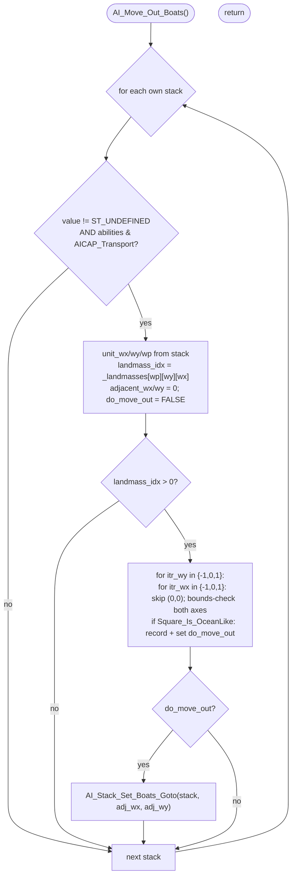

AIMOVE-AI_Move_Out_Boats.md

C:\STU\devel\STU-Extras\Piethawn\Piethawn\out\WIZARDS\ovr158\AI_Move_Out_Boats.asm
C:\STU\devel\STU-Extras\Piethawn\Piethawn\out\WIZARDS\ovr158\AI_Move_Out_Boats.c

AI_Next_Turn()
    |-> AI_Set_Unit_Orders()
        |-> AI_Move_Out_Boats()

---

# `AI_Move_Out_Boats` — Walkthrough

| Function | Location | Role |
|---|---|---|
| `AI_Move_Out_Boats` | [AIMOVE.c:3408-3470](../../MoM/src/AIMOVE.c#L3408-L3470) | For every AI transport stack that's currently parked on a land square (`landmass_idx > 0` — e.g., docked at a port city), scan the 8 neighbor squares for an ocean-like tile and order the stack to sail there via `AI_Stack_Set_Boats_Goto`. |

Verified faithful to the disassembly `AI_Move_Out_Boats.asm` throughout (structure 1:1, no RNG calls).

## Purpose

The third item in `AI_Set_Unit_Orders` Phase 3 ([AIMOVE-AI_Set_Unit_Orders.md](AIMOVE-AI_Set_Unit_Orders.md)). The OG asm var names — `Can_Sail_Off`, `Sailable_Tile_X`, `Sailable_Tile_Y` — and drake178's `AI_Transport_Sailoff` make the intent clear: when a transport ends a prior turn parked on a city/port tile, push it out into the open water so it isn't clogging the dock.

`_landmasses[]` of an ocean square is `0`; `_landmasses[]` of a city/port square is the city's landmass index (`> 0`). The function therefore fires precisely when a transport is sitting on a land tile (the only way transports normally end a turn on land is when docked at a coastal city or fortress). Boats in open ocean (`landmass_idx == 0`) are skipped — by design, that's the "boat already at sea, nothing to do" case.

## How it's reached

| Caller | Site | Notes |
|---|---|---|
| [`AI_Set_Unit_Orders`](AIMOVE-AI_Set_Unit_Orders.md) Phase 3 | [AIMOVE.c:234](../../MoM/src/AIMOVE.c#L234) | Third of four global pre-pass items, before the per-landmass dispatch loop. |

Plane-agnostic — it iterates every AI-owned stack regardless of plane and the per-stack `unit_wp` drives the scan plane.

## Globals / external state

| Symbol | Definition | Effect |
|---|---|---|
| `_ai_all_own_stacks[]` (count `_ai_all_own_stack_count`) | AI's compiled own-stack list | Read (value, abilities, wp, wx, wy). Not mutated here; the sail-off order is issued via `AI_Stack_Set_Boats_Goto`. |
| `_landmasses[]` | [MOM_DAT.h:4091](../../MoX/src/MOM_DAT.h#L4091) | Read via `_landmasses[(unit_wp * WORLD_SIZE) + (unit_wy * WORLD_WIDTH) + unit_wx]`. Non-zero ⇒ stack is on a landmass tile (likely docked). |
| `AICAP_Transport` | stack-ability flag | Required (bit-test on `_ai_all_own_stacks[].abilities`). |

## Signature and locals

```c
void AI_Move_Out_Boats(void)
```

No RNG. No `CONTXXX_Map`. No I/O.

OG locals — `Can_Sail_Off`, `Sailable_Tile_X`, `Sailable_Tile_Y`, `itr_wy`, `landmass_idx`, `wp`, `wy`, `wx` (asm:4-11) — map to production `do_move_out`, `adjacent_wx`, `adjacent_wy`, `itr_wy`, `landmass_idx`, `unit_wp`, `unit_wy`, `unit_wx`.

## Structure



## Code walk

Line refs are production [AIMOVE.c](../../MoM/src/AIMOVE.c); cross-checked against `AI_Move_Out_Boats.asm` (the authority). No RNG calls.

### Phase 1 — Stack filter ([3421-3431](../../MoM/src/AIMOVE.c#L3421-L3431))

```c
for(itr_stack = 0; itr_stack < _ai_all_own_stack_count; itr_stack++)
{
    if(
        (_ai_all_own_stacks[itr_stack].value != ST_UNDEFINED)
        &&
        ((_ai_all_own_stacks[itr_stack].abilities & AICAP_Transport) != 0)
    )
    {
        unit_wx = _ai_all_own_stacks[itr_stack].wx;
        unit_wy = _ai_all_own_stacks[itr_stack].wy;
        unit_wp = _ai_all_own_stacks[itr_stack].wp;
        ...
```

Maps 1:1 onto asm `loc_EF8B4`/`loc_EF8CA`/`loc_EF8E0` (lines 22-66). The value-defined check is `jnz short loc_EF8CA`; the transport `test` is `test [bx+s_AI_STACK_DATA.abilities], AICAP_Transport; jnz short loc_EF8E0`. Both skip-on-fail jumps target `loc_EF9E7` (continue). Faithful.

### Phase 2 — Landmass lookup + scan-state init ([3432-3436](../../MoM/src/AIMOVE.c#L3432-L3436))

```c
landmass_idx = _landmasses[((unit_wp * WORLD_SIZE) + (unit_wy * WORLD_WIDTH) + unit_wx)];
adjacent_wx = 0;
adjacent_wy = 0;
do_move_out = ST_FALSE;
if(landmass_idx > 0)
{
    ...
```

Maps onto asm:67-84. The asm computes the same `wp*WORLD_SIZE + wy*WORLD_WIDTH + wx` byte offset into `_landmasses` (lines 67-79), zeroes `Sailable_Tile_X/Y` and `Can_Sail_Off = ST_FALSE` (lines 80-82), then `cmp [bp+landmass_idx], 0; jnz short loc_EF956` (lines 83-84) — proceeds when non-zero. Faithful.

### Phase 3 — Neighbor scan ([3439-3462](../../MoM/src/AIMOVE.c#L3439-L3462))

```c
for(itr_wy = -1; itr_wy < 2; itr_wy++)        /* -1, 0, 1 */
{
    for(itr_wx = -1; itr_wx < 2; itr_wx++)    /* -1, 0, 1 */
    {
        if(
            ((itr_wy != 0) || (itr_wx != 0))            /* skip center (0,0) */
            &&
            ((itr_wx + unit_wx) < WORLD_WIDTH)
            &&
            ((itr_wy + unit_wy) < WORLD_HEIGHT)
            &&
            ((itr_wx + unit_wx) >= 0)
            &&
            ((itr_wy + unit_wy) >= 0)
        )
        {
            if(Square_Is_OceanLike((itr_wx + unit_wx), (itr_wy + unit_wy), unit_wp) == ST_TRUE)
            {
                adjacent_wx = (unit_wx + itr_wx);
                adjacent_wy = (unit_wy + itr_wy);
                do_move_out = ST_TRUE;
            }
        }
    }
}
```

Maps onto asm `loc_EF956`-`loc_EF9CC`:

- Outer `itr_wy` loop: `mov [bp+itr_wy], -1` (line 88) + `cmp [bp+itr_wy], 2; jl short loc_EF95D` (lines 140-142) ↔ production line 3439. The `-1` literal matches the OG bytes exactly.
- Inner `itr_wx` loop: `mov _DI_itr_wx, -1` (line 92) + `cmp _DI_itr_wx, 2; jl short loc_EF962` (lines 136-138) ↔ production line 3441.
- Center-skip gate (asm:96-99): `cmp itr_wy, 0; jnz loc_EF96C; or itr_wx, itr_wx; jz loc_EF9C3` — tests `itr_wy` first, then `itr_wx`; skip iff (itr_wy == 0 AND itr_wx == 0) ↔ production line 3444 `((itr_wy != 0) || (itr_wx != 0))`. Operand order (`itr_wy` left of `||`) matches asm "test wy first."
- Upper-wx (asm:101-104): `add ax, [bp+wx]; cmp ax, WORLD_WIDTH; jge loc_EF9C3` ↔ production line 3446.
- Upper-wy (asm:105-109): `add ax, [bp+wy]; cmp ax, WORLD_HEIGHT; jge loc_EF9C3` ↔ production line 3448.
- Lower-wx (asm:110-112): `add ax, [bp+wx]; jl loc_EF9C3` ↔ production line 3450.
- Lower-wy (asm:113-115): `add ax, [bp+wy]; jl loc_EF9C3` ↔ production line 3452.
- `Square_Is_OceanLike(wx + itr_wx, wy + itr_wy, wp)` call (asm:116-126) ↔ production line 3455. Argument order matches: x then y then plane.
- Hit-record (asm:127-133): unconditional `mov [bp+Sailable_Tile_X/Y], ax; mov [bp+Can_Sail_Off], ST_TRUE` inside the per-step Ocean-Like-hit block ↔ production lines 3457-3459.

All five clause positions in the `&&` chain match the OG asm's `cmp/jl/jge` sequence order: center → upper-wx → upper-wy → lower-wx → lower-wy.

### Phase 4 — Issue sail-off order ([3463-3466](../../MoM/src/AIMOVE.c#L3463-L3466))

```c
if(do_move_out == ST_TRUE)
{
    AI_Stack_Set_Boats_Goto(itr_stack, adjacent_wx, adjacent_wy);
}
```

Maps onto asm `cmp [bp+Can_Sail_Off], e_ST_TRUE; jnz short loc_EF9E7` then `push Y; push X; push itr_stack; call j_AI_Stack_Set_Boats_Goto` (asm:143-149). Argument order matches: `(itr_stack, adjacent_wx, adjacent_wy)`.

The scan keeps overwriting `adjacent_wx/wy` on every match — the **last** matching ocean neighbor wins in iteration order `(itr_wy, itr_wx) = (-1,-1), (-1,0), (-1,1), (0,-1), (0,1), (1,-1), (1,0), (1,1)`. Asm `mov [bp+Sailable_Tile_X], ax` is unconditional inside the per-step ocean-hit block. Faithful to OG.

## Sub-functions / external calls

- **`Square_Is_OceanLike(wx, wy, wp)`** — checks whether the square is sailable (ocean, shore, river-mouth, etc.). Returns `ST_TRUE`/`ST_FALSE`. Called up to 8 times per processing stack.
- **`AI_Stack_Set_Boats_Goto(stack_idx, wx, wy)`** ([AIMOVE.c:5768](../../MoM/src/AIMOVE.c#L5768)) — sets the stack's destination square. Called at most once per processing stack.

No RNG. No I/O. No EMM page-frame ops.

## Related references

- `C:\STU\devel\STU-Extras\Piethawn\Piethawn\out\WIZARDS\ovr158\AI_Move_Out_Boats.asm` — IDA Pro 5.5 disassembly (the authority).
- [AIMOVE-AI_Set_Unit_Orders.md](AIMOVE-AI_Set_Unit_Orders.md) — parent dispatcher; this function is the third item in its Phase 3 global pre-pass.
- [AIMOVE-AI_Disband_To_Balance_Budget.md](AIMOVE-AI_Disband_To_Balance_Budget.md), [AIMOVE-AI_Shift_Off_Home_Plane.md](AIMOVE-AI_Shift_Off_Home_Plane.md) — sibling Phase 3 pre-pass items.
- [MoM-AI-AIMOVE-Index.md](MoM-AI-AIMOVE-Index.md) — AIMOVE.c function index.
- `_ai_all_own_stacks`, `_landmasses`, `AICAP_Transport` — declared in `MoX/src/MOM_DAT.h`.
- `Square_Is_OceanLike`, `AI_Stack_Set_Boats_Goto` — declared in `MoM/src/AIMOVE.h` / sibling headers.
