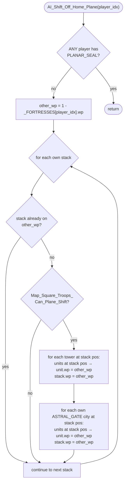

AIMOVE-AI_Shift_Off_Home_Plane.md

C:\STU\devel\STU-Extras\Piethawn\Piethawn\out\WIZARDS\ovr158\AI_Shift_Off_Home_Plane.asm
C:\STU\devel\STU-Extras\Piethawn\Piethawn\out\WIZARDS\ovr158\AI_Shift_Off_Home_Plane.c

AI_Next_Turn()
    |-> AI_Set_Unit_Orders()
        |-> AI_Shift_Off_Home_Plane()

---

# `AI_Shift_Off_Home_Plane` — Walkthrough

| Function | Location | Role |
|---|---|---|
| `AI_Shift_Off_Home_Plane` | [AIMOVE.c:3323-3404](../../MoM/src/AIMOVE.c#L3323-L3404) | Plane-shift each of the AI player's own stacks off its home plane (the plane its fortress is on) when the stack is sitting on a free-plane-shift square (a tower or an Astral-Gate-enchanted own city) — provided no player has cast `PLANAR_SEAL`. |

Verified faithful to the disassembly `AI_Shift_Off_Home_Plane.asm` throughout (structure 1:1, no RNG calls).

## Purpose

The second item in `AI_Set_Unit_Orders` Phase 3 ([AIMOVE-AI_Set_Unit_Orders.md](AIMOVE-AI_Set_Unit_Orders.md)). It looks for opportunities to push the AI's military presence off its home plane using free plane-shift squares:

- **Towers of Wizardry** — bidirectional plane-shift for any unit standing on the tile.
- **Astral Gate** — a city enchantment that lets units in the city plane-shift for free.

When a stack the AI owns is on its home plane AND sitting on one of these squares AND `Map_Square_Troops_Can_Plane_Shift` agrees the terrain is shiftable, every unit at the stack's position has its `wp` set to the other plane, and the stack record's `wp` is updated to match. The whole pass is gated by a `PLANAR_SEAL` global check — if **any** player has it, the function bails immediately.

## How it's reached

| Caller | Site | Notes |
|---|---|---|
| [`AI_Set_Unit_Orders`](AIMOVE-AI_Set_Unit_Orders.md) Phase 3 | [AIMOVE.c:233](../../MoM/src/AIMOVE.c#L233) | Second of four global pre-pass items, before the per-landmass dispatch loop. |

Per-AI-player only — invoked once per turn per AI player.

## Globals / external state

| Symbol | Definition | Effect |
|---|---|---|
| `_players[].Globals[PLANAR_SEAL]` | per-player global-enchantment flag | Read; scanned across **all** players (including self) as an early-exit gate. |
| `_FORTRESSES[player_idx].wp` | per-player fortress record | Read once to compute `other_wp = 1 - fortress.wp` (the non-home plane). |
| `_ai_all_own_stacks[]` (count `_ai_all_own_stack_count`) | AI's compiled own-stack list | Read (wp, wx, wy); `.wp` written to `other_wp` once per matching tower or Astral-Gate city. |
| `_TOWERS[NUM_TOWERS]` | per-tower position record | Read (wx, wy). |
| `_CITIES[].owner_idx`, `.enchantments[ASTRAL_GATE]`, `.wx`, `.wy` | per-city records | Read; filters cities owned by `player_idx` with the Astral Gate enchantment at the stack's position. |
| `_UNITS[]` (count `_units`) | per-unit records | Read (wx, wy); `.wp` written to `other_wp` for every unit at the stack's `(wx, wy)`. |

## Signature and locals

```c
void AI_Shift_Off_Home_Plane(int16_t player_idx)
```

No RNG. No `CONTXXX_Map`. No I/O.

## Structure



## Code walk

Line refs are production [AIMOVE.c](../../MoM/src/AIMOVE.c); cross-checked against `AI_Shift_Off_Home_Plane.asm` (the authority). No RNG calls.

### Phase 1 — PLANAR_SEAL gate ([3333-3339](../../MoM/src/AIMOVE.c#L3333-L3339))

```c
for(itr = 0; itr < _num_players; itr++)
{
    if(_players[itr].Globals[PLANAR_SEAL] != 0)
    {
        return;
    }
}
```

Maps 1:1 onto asm `loc_EF68A`/`loc_EF6A0` (lines 18-35). The early return matches asm `xor ax, ax; jmp @@Done`. **Scans every player, including `player_idx` itself** — if the AI cast `PLANAR_SEAL`, it blocks its own plane-shift pass. Faithful-to-Dasm.

### Phase 2 — Compute other_wp ([3340](../../MoM/src/AIMOVE.c#L3340))

```c
other_wp = (1 - _FORTRESSES[player_idx].wp);
```

Maps onto asm lines 36-45 (`mov ax, _FORTRESSES.wp; mov dx, 1; sub dx, ax; mov Opposite_Plane, dx`). For a 2-plane world, `other_wp` is the non-home plane.

### Phase 3 — Per-stack loop ([3341-3403](../../MoM/src/AIMOVE.c#L3341-L3403))

```c
for(itr2 = 0; itr2 < _ai_all_own_stack_count; itr2++)
{
    stack_wp = _ai_all_own_stacks[itr2].wp;
    if(stack_wp != other_wp)  /* skip stacks already on the non-home plane */
    {
        stack_wx = _ai_all_own_stacks[itr2].wx;
        stack_wy = _ai_all_own_stacks[itr2].wy;
        if(Map_Square_Troops_Can_Plane_Shift(stack_wx, stack_wy, stack_wp) == ST_TRUE)
        {
            /* Tower path — Sub-phase 3a */
            /* Astral-Gate path — Sub-phase 3b */
        }
    }
}
```

The `stack_wp != other_wp` test maps onto asm `cmp ax, [bp+Opposite_Plane]; jnz loc_EF6E4` (line 60) — if the stack is already on `other_wp`, the asm jumps to `loc_EF897` (continue). Faithful.

`Map_Square_Troops_Can_Plane_Shift(wx, wy, wp)` checks both planes are land at the same coordinate and the unit isn't blocked from shifting — returns `ST_TRUE` for tower tiles and for any square where every unit on the stack can plane-shift.

#### Sub-phase 3a — Tower path ([3350-3371](../../MoM/src/AIMOVE.c#L3350-L3371))

```c
for(itr_towers = 0; itr_towers < NUM_TOWERS; itr_towers++)
{
    if(
        (_TOWERS[itr_towers].wx == stack_wx)
        &&
        (_TOWERS[itr_towers].wy == stack_wy)
    )
    {
        for(itr = 0; itr < _units; itr++)
        {
            if(
                (_UNITS[itr].wx == (int8_t)stack_wx)
                &&
                (_UNITS[itr].wy == (int8_t)stack_wy)
            )
            {
                _UNITS[itr].wp = (int8_t)other_wp;
            }
        }
        _ai_all_own_stacks[itr2].wp = (uint8_t)other_wp;
    }
}
```

Maps 1:1 onto asm `loc_EF72C`-`loc_EF7B5`:

- Outer tower loop (asm:90-91, 153-158) ↔ production line 3350.
- Tower position check (asm:99-111: `jnz short loc_EF7B5` on wx then wy) ↔ production lines 3352-3356.
- Inner unit loop init (asm:112-113 `xor _SI_itr, _SI_itr`) ↔ production line 3358.
- Inner unit position check (asm:121-133 `cmp ax, [bp+Stack_X/Y]; jnz short loc_EF79B`) ↔ production lines 3360-3364.
- `_UNITS[itr].wp = other_wp` (asm:134-140 `mov al, [byte ptr bp+Opposite_Plane]; mov [es:bx+s_UNIT.wp], al`) ↔ production line 3366.
- Post-inner-loop `_ai_all_own_stacks[itr2].wp = other_wp` (asm:146-152, inside the tower-match block, after the inner loop falls through) ↔ production line 3369.

#### Sub-phase 3b — Astral-Gate path ([3372-3400](../../MoM/src/AIMOVE.c#L3372-L3400))

```c
for(itr_cities = 0; itr_cities < _cities; itr_cities++)
{
    if(
        (_CITIES[itr_cities].owner_idx == player_idx)
        &&
        (_CITIES[itr_cities].enchantments[ASTRAL_GATE] != 0)
    )
    {
        if(
            (_CITIES[itr_cities].wx == stack_wx)
            &&
            (_CITIES[itr_cities].wy == stack_wy)
        )
        {
            for(itr = 0; itr < _units; itr++)
            {
                if(
                    (_UNITS[itr].wx == (int8_t)stack_wx)
                    &&
                    (_UNITS[itr].wy == (int8_t)stack_wy)
                )
                {
                    _UNITS[itr].wp = (int8_t)other_wp;
                }
            }
            _ai_all_own_stacks[itr2].wp = (uint8_t)other_wp;
        }
    }
}
```

Maps 1:1 onto asm `loc_EF7C9`-`loc_EF888`:

- Outer city loop (asm:161-162, 246-252) ↔ production line 3372.
- Owner filter (asm:170-174 `cmp ax, [bp+player_idx]; jz/jmp`) ↔ production line 3375.
- ASTRAL_GATE enchantment filter (asm:182-184 `cmp [es:bx+s_CITY.enchantments.ASTRAL_GATE], 0; jnz`) ↔ production line 3377.
- City position check (asm:192-204 `cmp ax, [bp+Stack_X/Y]; jnz`) ↔ production lines 3381-3384.
- Inner unit position check + `_UNITS[itr].wp = other_wp` (asm:208-238, `loc_EF830`) ↔ production lines 3386-3396.
- Post-inner-loop `_ai_all_own_stacks[itr2].wp = other_wp` (asm:239-245, inside city-position-match block, after inner loop falls through) ↔ production line 3397.

## OG quirks preserved (faithful — do not "fix")

- **PLANAR_SEAL early return scans ALL players including self** — if the AI player has `_players[player_idx].Globals[PLANAR_SEAL] != 0`, the function bails on its own pass. Asm lines 18-35 explicitly loop all `_num_players` slots with no self-skip. Possibly intentional (planar seal is a *global* lock) or possibly an OG oversight; either way preserved faithful-to-Dasm.
- **Tower path and Astral-Gate path are structurally identical** — both: outer scan → position match → inner unit-position update loop → post-loop stack-wp assignment. The asm reflects this symmetry (`loc_EF72C` mirrors `loc_EF7C9` mirrors), and production mirrors it. If you ever feel tempted to refactor either branch, the symmetric pair is the constraint.

## Sub-functions / external calls

- **`Map_Square_Troops_Can_Plane_Shift(wx, wy, wp)`** — terrain + occupancy gate for free plane-shifting. Returns `ST_TRUE` if the square supports it (both planes land at coord, no blocking restrictions on the stack).
- No RNG. No I/O. No EMM page-frame ops.

## Related references

- `C:\STU\devel\STU-Extras\Piethawn\Piethawn\out\WIZARDS\ovr158\AI_Shift_Off_Home_Plane.asm` — IDA Pro 5.5 disassembly (the authority).
- [AIMOVE-AI_Set_Unit_Orders.md](AIMOVE-AI_Set_Unit_Orders.md) — parent dispatcher; this function is the second item in its Phase 3 global pre-pass.
- [AIMOVE-AI_Disband_To_Balance_Budget.md](AIMOVE-AI_Disband_To_Balance_Budget.md) — sibling (Phase 3 item 1) for the same parent.
- [MoM-AI-AIMOVE-Index.md](MoM-AI-AIMOVE-Index.md) — AIMOVE.c function index.
- `_TOWERS`, `_CITIES`, `_FORTRESSES`, `_UNITS`, `_ai_all_own_stacks` — declared in `MoX/src/MOM_DAT.h`.
- `ASTRAL_GATE` index, `PLANAR_SEAL` index — global-enchantment slots in `_players[].Globals[]` / `_CITIES[].enchantments[]`.
