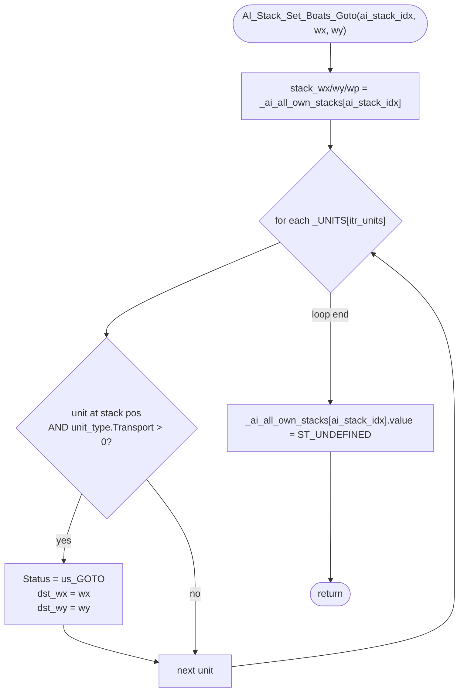

AIMOVE-AI_Stack_Set_Boats_Goto.md

C:\STU\devel\STU-Extras\Piethawn\Piethawn\out\WIZARDS\ovr162\AI_Stack_Set_Boats_Goto.asm
C:\STU\devel\STU-Extras\Piethawn\Piethawn\out\WIZARDS\ovr162\AI_Stack_Set_Boats_Goto.c

AI_Next_Turn()
    |-> AI_Set_Unit_Orders()
        |-> AI_Move_Out_Boats()
            |-> AI_Stack_Set_Boats_Goto()

---

# `AI_Stack_Set_Boats_Goto` — Walkthrough

| Function | Location | Role |
|---|---|---|
| `AI_Stack_Set_Boats_Goto` | [AIMOVE.c:5755-5782](../../MoM/src/AIMOVE.c#L5755-L5782) | Commit a "go to (wx, wy)" order to every transport-capable unit standing at the given stack's position, and mark the stack record as processed by setting its `value` to `ST_UNDEFINED`. |

Verified faithful to the disassembly `AI_Stack_Set_Boats_Goto.asm` throughout (structure 1:1, no RNG calls).

## Purpose

The commit step for [`AI_Move_Out_Boats`](AIMOVE-AI_Move_Out_Boats.md). Once `AI_Move_Out_Boats` has identified an adjacent ocean square for a transport stack to sail to, this helper:

1. Reads the stack's `(wx, wy, wp)` triple from `_ai_all_own_stacks[]`.
2. Walks every unit in `_UNITS[]`; for each one at that exact `(wx, wy, wp)` whose unit-type has `Transport > 0` (i.e., it's an actual boat — Trireme, Galley, Warship, etc.), sets `Status = us_GOTO` and writes the destination `(dst_wx, dst_wy)`.
3. Marks the stack's `value` slot `ST_UNDEFINED` so it isn't re-processed by subsequent passes this turn.

Non-transport units in the same stack (passenger units the boats are ferrying) are deliberately **not** touched — the boats sail with their cargo via the regular cargo / embark system, not via per-passenger GOTO orders.

## How it's reached

| Caller | Site | Notes |
|---|---|---|
| [`AI_Move_Out_Boats`](AIMOVE-AI_Move_Out_Boats.md) Phase 4 | [AIMOVE.c:3465](../../MoM/src/AIMOVE.c#L3465) | Only production caller. Invoked at most once per processing stack. |

Grep across `MoM/src` confirms `AI_Move_Out_Boats` is the sole call site. The header declaration at [AIMOVE.h:201](../../MoM/src/AIMOVE.h#L201) makes the symbol externally visible but it isn't currently used elsewhere.

## Globals / external state

| Symbol | Definition | Effect |
|---|---|---|
| `_ai_all_own_stacks[ai_stack_idx]` | AI's compiled own-stack list | Read (`.wx`, `.wy`, `.wp`). Mutated once at the end: `.value = ST_UNDEFINED`. |
| `_UNITS[]` (count `_units`) | per-unit records | Read (`.wx`, `.wy`, `.wp`, `.type`); mutated for each matched unit (`.Status`, `.dst_wx`, `.dst_wy`). |
| `_unit_type_table[].Transport` | per-unit-type transport-capacity field | Read; `> 0` is the boat filter. |

## Signature and locals

```c
void AI_Stack_Set_Boats_Goto(int16_t ai_stack_idx, int16_t wx, int16_t wy);
```

OG signature uses `byte ptr` for `wx` (`bp+8`) and `wy` (`bp+0Ah`) — the asm reads only the low byte (`mov al, [bp+wx]`). Production passes `int16_t` and casts `(int8_t)` when writing to `_UNITS[].dst_wx/dst_wy` (themselves `int8_t` storage). Behavior-equivalent: only the low 8 bits propagate to storage in both forms.

OG stack locals — `stack_wp`, `stack_wy`, `stack_wx` (asm:4-6) — map to production `stack_wp`, `stack_wy`, `stack_wx`.

## Structure



## Code walk

Line refs are production [AIMOVE.c](../../MoM/src/AIMOVE.c); cross-checked against `AI_Stack_Set_Boats_Goto.asm` (the authority). No RNG calls.

### Phase 1 — Read stack position ([5761-5763](../../MoM/src/AIMOVE.c#L5761-L5763))

```c
stack_wx = _ai_all_own_stacks[ai_stack_idx].wx;
stack_wy = _ai_all_own_stacks[ai_stack_idx].wy;
stack_wp = _ai_all_own_stacks[ai_stack_idx].wp;
```

Maps 1:1 onto asm:17-41 (three identical `imul (size s_AI_STACK_DATA); add bx, ax; mov al, [bx+offset]; cbw; mov [bp+stack_*], ax` sequences, one each for `.wx` at line 23-25, `.wy` at 31-33, `.wp` at 39-41).

### Phase 2 — Per-unit filter and commit ([5764-5780](../../MoM/src/AIMOVE.c#L5764-L5780))

```c
for(itr_units = 0; itr_units < _units; itr_units++)
{
    if(
        (_UNITS[itr_units].wx == stack_wx)
        &&
        (_UNITS[itr_units].wy == stack_wy)
        &&
        (_UNITS[itr_units].wp == stack_wp)
        &&
        (_unit_type_table[_UNITS[itr_units].type].Transport > 0)
    )
    {
        _UNITS[itr_units].Status = us_GOTO;
        _UNITS[itr_units].dst_wx = (int8_t)wx;
        _UNITS[itr_units].dst_wy = (int8_t)wy;
    }
}
```

Maps onto asm `loc_F6037`-`loc_F60D2`:

- `_UNITS[itr_units].wx == stack_wx` (asm:45-55: `cmp ax, [bp+stack_wx]; jz short loc_F604F` else `jmp loc_F60D2`) ↔ production line 5767. Tested first, matching asm order.
- `_UNITS[itr_units].wy == stack_wy` (asm:57-66: `cmp ax, [bp+stack_wy]; jnz short loc_F60D2`) ↔ production line 5769.
- `_UNITS[itr_units].wp == stack_wp` (asm:67-75: `cmp ax, [bp+stack_wp]; jnz short loc_F60D2`) ↔ production line 5771.
- `_unit_type_table[type].Transport > 0` (asm:76-87: `cmp [_unit_type_table.Transport+bx], 0; jle short loc_F60D2`) ↔ production line 5773. Clause order in the C `&&` chain matches asm test order: wx → wy → wp → Transport.
- `_UNITS[itr_units].Status = us_GOTO` (asm:88-93: `mov [es:bx+s_UNIT.Status], us_GOTO`) ↔ production line 5776.
- `_UNITS[itr_units].dst_wx = (int8_t)wx` (asm:94-100: `mov al, [bp+wx]; mov [es:bx+s_UNIT.dst_wx], al`) ↔ production line 5777. Note `mov al` — reads the low byte only.
- `_UNITS[itr_units].dst_wy = (int8_t)wy` (asm:101-107: `mov al, [bp+wy]; mov [es:bx+s_UNIT.dst_wy], al`) ↔ production line 5778.

Statement order inside the matched-unit block matches asm: Status, then dst_wx, then dst_wy.

### Phase 3 — Mark stack processed ([5781](../../MoM/src/AIMOVE.c#L5781))

```c
_ai_all_own_stacks[ai_stack_idx].value = ST_UNDEFINED;
```

Maps onto asm `@@Done` block (lines 116-122): `mov [bx+s_AI_STACK_DATA.value], e_ST_UNDEFINED`. This sits **after** the loop exit (asm `jge short @@Done` from the loop test at line 112), inside the function epilogue but before stack-restoration — matches production placement after the `for` loop closes and before the function returns.

Setting `value = ST_UNDEFINED` is how the caller (`AI_Move_Out_Boats` or any future caller) knows this stack has had its order committed for the turn — `_ai_all_own_stacks[].value != ST_UNDEFINED` is the "still pending" gate used by other passes (see `AI_Move_Out_Boats` Phase 1 stack filter at [AIMOVE.c:3423](../../MoM/src/AIMOVE.c#L3423)).

## Sub-functions / external calls

None. Pure stack/array manipulation. No RNG, no I/O, no `CONTXXX_Map`.

## Related references

- `C:\STU\devel\STU-Extras\Piethawn\Piethawn\out\WIZARDS\ovr162\AI_Stack_Set_Boats_Goto.asm` — IDA Pro 5.5 disassembly (the authority).
- [AIMOVE-AI_Move_Out_Boats.md](AIMOVE-AI_Move_Out_Boats.md) — sole caller; this helper is its Phase 4 commit step.
- [AIMOVE-AI_Set_Unit_Orders.md](AIMOVE-AI_Set_Unit_Orders.md) — grand-parent dispatcher; `AI_Move_Out_Boats` is its Phase 3 global-pre-pass item 3.
- [MoM-AI-AIMOVE-Index.md](MoM-AI-AIMOVE-Index.md) — AIMOVE.c function index.
- `_ai_all_own_stacks`, `_UNITS`, `_unit_type_table`, `us_GOTO`, `ST_UNDEFINED` — declared in `MoX/src/MOM_DAT.h` / sibling headers.
