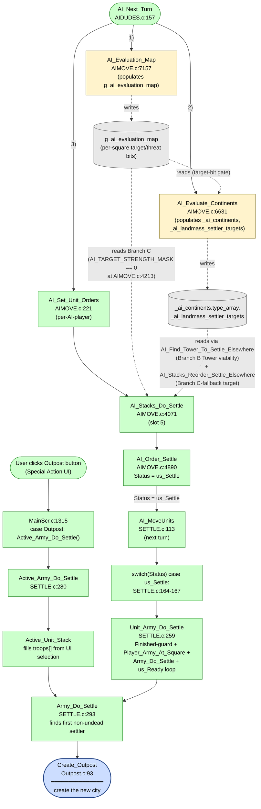

AIMOVE-AI_Stacks_Do_Settle.md
SEEALSO: AIMOVE-AI_Stacks_Reorder_Settle_Elsewhere.md

# Settle AoC

C:\STU\devel\STU-Extras\Piethawn\Piethawn\out\WIZARDS\ovr158\AI_Stacks_Do_Settle.asm
C:\STU\devel\STU-Extras\Piethawn\Piethawn\out\WIZARDS\ovr158\AI_Stacks_Do_Settle.c
C:\STU\devel\STU-Extras\Piethawn\Piethawn\out\WIZARDS\ovr158\AI_Order_Settle.asm
C:\STU\devel\STU-Extras\Piethawn\Piethawn\out\WIZARDS\ovr158\AI_CanSettleOffPlane__ALWAYS_FALSE.asm
C:\STU\devel\STU-Extras\Piethawn\Piethawn\out\WIZARDS\ovr100\AI_UNIT_Settle.asm

Next_Turn_Proc() |-> Next_Turn_Calc() |-> AI_Next_Turn()

AI_Next_Turn()
    |-> AI_Set_Unit_Orders()
        |-> AI_Stacks_Do_Settle()
            |-> AI_Find_Tower_To_Settle_Elsewhere()
            |-> AI_Stacks_Order_Attack_Target_Or_Goto_Destination()
            |-> Compute_Base_Values_For_Map_Square()
            |-> AI_Stacks_Reorder_Settle_Elsewhere()
                |-> Next_Nearest_Ferry_Square()
                |-> TILE_AI_FindEmptyLnd__WIP()
            |-> AI_Order_Settle()
                `_UNITS[unit_idx].Status = us_Settle;`
    |-> AI_MoveUnits()
        |-> Unit_Army_Do_Settle()
        |-> Army_Do_Settle()

AI_MoveUnits()
    case us_Settle:
    {
        Unit_Army_Do_Settle(unit_idx);
    } break;

Unit_Army_Do_Settle() |-> Army_Do_Settle()
¿ ~= AI_UNIT_Meld() |-> STK_DoMeldWithNode() ? 

Main_Screen()
    |-> Active_Army_Do_Settle()
        |-> Active_Unit_Stack(&troop_count, &troops[0]);
        |-> Army_Do_Settle(troop_count, &troops[0]);

...
Status == us_Settle
    |-> AI_MoveUnits

---

# Settle Area-of-Code — Walkthrough

Seven functions across three files implement the AI settler-management pipeline + the human-side analog. Reviewed together because they share state (`_ai_own_stack_*`, `_UNITS[].Status`) and culminate in a single square-mutation call (`Create_Outpost`). `AI_Stacks_Reorder_Settle_Elsewhere` is large enough to warrant its own sub-review — see [AIMOVE-AI_Stacks_Reorder_Settle_Elsewhere.md](AIMOVE-AI_Stacks_Reorder_Settle_Elsewhere.md).

| Function | Location | Role |
|---|---|---|
| `AI_Stacks_Do_Settle` | [AIMOVE.c:4071](../../MoM/src/AIMOVE.c#L4071) | Per-(player, landmass) dispatcher (slot 5). Decides for each settler: settle-in-place, hop-to-Tower, move-to-best-square, or send-to-colonize. |
| `AI_Order_Settle` | [AIMOVE.c:4890](../../MoM/src/AIMOVE.c#L4890) | 3-line order-issuer. Sets `Status = us_Settle`, consumes the stack slot. |
| `Unit_Army_Do_Settle` | [SETTLE.c:259](../../MoM/src/SETTLE.c#L259) | Status-dispatch handler for `us_Settle`. Finished-guard + `Player_Army_At_Square` + `Army_Do_Settle` + OGBUG mark-all-Ready loop. |
| `Active_Army_Do_Settle` | [SETTLE.c:292](../../MoM/src/SETTLE.c#L292) | Human-side wrapper. Gathers `Active_Unit_Stack`, calls `Army_Do_Settle`. |
| `Army_Do_Settle` | [SETTLE.c:301](../../MoM/src/SETTLE.c#L301) | Actual settle machinery. Finds first non-undead settler in the gathered stack and calls `Create_Outpost`. |
| `AI_Find_Tower_To_Settle_Elsewhere` | [AIMOVE.c:5100](../../MoM/src/AIMOVE.c#L5100) | Tower-hop eligibility check. Returns TRUE + writes off-plane destination iff settler is on the home-Fortress plane, owns a same-landmass Tower, and the off-plane landmass at that Tower isn't Contested or hostile. |
| `AI_Stacks_Reorder_Settle_Elsewhere` | [AIMOVE.c:5195](../../MoM/src/AIMOVE.c#L5195) | Branch C-fallback when no good square on current landmass. Routes settler via direct-GOTO / walk-to-embark / walk-to-transport / ferry-request. Reviewed separately in [AIMOVE-AI_Stacks_Reorder_Settle_Elsewhere.md](AIMOVE-AI_Stacks_Reorder_Settle_Elsewhere.md). |


## Purpose

Settlers (units with `UA_CREATEOUTPOST` ability) need orders every turn until they found a city. `AI_Stacks_Do_Settle` is the AI's per-landmass scan that decides, for each settler on this landmass, what to tell it to do this turn:

1. **Settle in place** if the current square is suitable AND a probabilistic check rolls in favor.
2. **Hop to a Tower** to settle on the other plane (live branch — see [`AI_Find_Tower_To_Settle_Elsewhere`](../../MoM/src/AIMOVE.c#L5100) walk).
3. **Move toward the best nearby square** (scored by population + production + gold + magic + special resources).
4. **Send-to-colonize** as a last resort if no good square was found.

The settler bears `Status = us_Settle` until next turn's per-unit dispatch in [`AI_MoveUnits`](../../MoM/src/SETTLE.c#L113) hits `case us_Settle` and calls `Unit_Army_Do_Settle`. Both paths — AI (`AI_MoveUnits` → `Unit_Army_Do_Settle` → `Army_Do_Settle` → `Create_Outpost`) and human (`Main_Screen` → `Active_Army_Do_Settle` → `Army_Do_Settle` → `Create_Outpost`) — are fully wired and produce a city.

## Call paths reaching `Create_Outpost`

Verified by grep + Read of each call site.



**Legend:**
- 🟢 Human path (Special Action Outpost) and AI dispatch path — both fully wired; both produce a city via `Army_Do_Settle` → `Create_Outpost`.
- 🟡 AI per-turn prep — `AI_Evaluation_Map` and `AI_Evaluate_Continents` run in `AI_Next_Turn` *before* `AI_Set_Unit_Orders` (see [AIDUDES.c sibling-call order](../../MoM/src/AIDUDES.c)) and populate the data that `AI_Stacks_Do_Settle` and its helpers read.
- ⚪ Data stores — `g_ai_evaluation_map` (per-square target/threat-bit grid, indexed `[wp][wy*WIDTH + wx]`) and `_ai_continents.type_array` + `_ai_landmass_settler_targets` (per-(plane, player) landmass classifications and the chosen off-landmass settler-target). Dashed arrows = read/write of these stores, not function calls.

**Verified line refs:**
- `Active_Army_Do_Settle` at SETTLE.c:292 — Read confirmed it calls `Active_Unit_Stack` then `Army_Do_Settle`.
- `Active_Army_Do_Settle` called from MainScr.c:1315 — grep confirmed.
- `AI_Stacks_Do_Settle` at AIMOVE.c:4071, called from AIMOVE.c:282 (slot 5 of `AI_Set_Unit_Orders` per-landmass dispatch) — grep confirmed.
- `AI_Order_Settle` at AIMOVE.c:4890 — Read confirmed 3-line body.
- `case us_Settle` at SETTLE.c:164-167 — grep confirmed dispatch calls `Unit_Army_Do_Settle(unit_idx)` at SETTLE.c:166.
- `Unit_Army_Do_Settle` at SETTLE.c:259 — Read confirmed implemented body (Finished guard + Player_Army_At_Square + Army_Do_Settle + OGBUG us_Ready loop).
- `Army_Do_Settle` at SETTLE.c:301 — Read confirmed full implementation.
- `Create_Outpost` at Outpost.c:93 — grep confirmed function definition.
- `AI_Find_Tower_To_Settle_Elsewhere` at AIMOVE.c:5100 — Read confirmed real body with TRUE-return path; renamed from `__STUB` 2026-05-30 (to `AI_CanSettleOffPlane`), then again 2026-06-03 (to current); compiles clean.

## Code walk — `AI_Stacks_Do_Settle` ([lines 4071-4273](../../MoM/src/AIMOVE.c#L4071-L4273))

### Phase 1 — `Fast_Expand_Chance` from Wizard Objective ([lines 4108-4116](../../MoM/src/AIMOVE.c#L4108-L4116))

```c
Fast_Expand_Chance = 1;
switch (_players[player_idx].Objective)
{
    case OBJ_Expansionist:  { Fast_Expand_Chance = 4; } break;
    case OBJ_Militarist:    { Fast_Expand_Chance = 2; } break;
    case OBJ_Pragmatist:    { Fast_Expand_Chance = 2; } break;
    case OBJ_Perfectionist: { Fast_Expand_Chance = 1; } break;
    case OBJ_Theurgist:     { Fast_Expand_Chance = 3; } break;
}
```

Mapping from Wizard's strategic objective to a 1-4 weight used later in the settle-in-place gate. Expansionist gets the highest weight (4) — most willing to settle on the current square rather than scout further. Perfectionist gets the lowest weight (1) — most picky.

### Phase 2 — Empty-garrison early-return ([lines 4120-4135](../../MoM/src/AIMOVE.c#L4120-L4135))

```c
Empty_Garrison = ST_FALSE;
for(itr_stacks = 0; itr_stacks < _ai_own_stack_count; itr_stacks++)
{
    if(
        (_ai_own_stack_type[itr_stacks] == AISTK_Garrison)
        &&
        (_ai_own_stack_unit_count[itr_stacks] < 1)
    )
    {
        Empty_Garrison = ST_TRUE;
    }
}
if(Empty_Garrison == ST_TRUE)
{
    return;
}
```

Scan all own-stacks; if ANY `AISTK_Garrison` stack has zero units, return immediately (skipping the entire Phase 3 settle pass for this landmass). drake178's function-header comment flags this: *"BUG that allows settling while the AI has an empty garrison somewhere"* — the intent was probably "if a garrison is empty, prioritize filling it before founding new cities," but the implementation skips settling for the whole landmass regardless of whether the empty garrison is even on this landmass.

### Phase 3 — Per-settler decision ([lines 4138-4271](../../MoM/src/AIMOVE.c#L4138-L4271))

Outer loop walks every `_ai_own_stack_*` and every slot within. Filter: slot must be a defined `unit_idx` AND its type must have `UA_CREATEOUTPOST`. Cache settler's position.

**In-place-settle gate** ([4162-4180](../../MoM/src/AIMOVE.c#L4162-L4180)):

```c
if(
    (
        (Map_Square_Area_Has_Opponent(unit_wx, unit_wy, unit_wp, 3, player_idx) == ST_FALSE)
        || (_turn < 100)
        || (Random(5) == 1)
    )
    &&
    (
        (Map_Square_Survey(unit_wx, unit_wy, unit_wp) == ST_FALSE)
        && (Random(5) <= Fast_Expand_Chance)
    )
)
{
    AI_Order_Settle(unit_idx, itr_stacks, itr_list_units);
    continue;
}
```

Two-gate structure matching OG asm: settle-in-place fires only when **both** groups are true. Group 1: `NoEnemy OR EarlyGame OR Random(5)==1`. Group 2: `!Surveyed AND Random(5)<=Fast_Expand_Chance`. If either group fails, fall through to Branch B (Tower) or Branch C (best-square).

**Branch B — Tower hop ([4182-4190](../../MoM/src/AIMOVE.c#L4182-L4190)):** `if(AI_Find_Tower_To_Settle_Elsewhere(...)) { /* GOTO Tower */ }`. If TRUE, the function writes the chosen Tower's coords to `tower_wx`/`tower_wy` and the caller issues a GOTO order (caller=15 via `AI_Stacks_Order_Attack_Target_Or_Goto_Destination`). See the Code Walk below for what the function actually gates on. drake178's OG name `AI_CanSettleOffPlane__ALWAYS_FALSE` reflects an empirical "never observed TRUE in traces" — not a structural always-FALSE; the asm and the production C body both have a real TRUE return path.

**Branch C — Best-square search ([lines 4193-4248](../../MoM/src/AIMOVE.c#L4193-L4248)):** walk the landmass's land-square chain (`_ai_landmass_land_squares_*`), skip surveyed squares and squares with any `AI_TARGET_STRENGTH_MASK` bit set, compute `map_square_value` for each unsurveyed empty square:

```c
map_square_value = (
    (maximum_population * 10) + production_bonus + gold_bonus + unit_cost_reduction
    + (gold_units * 3)
    + (magic_units * 5)
    + (have_nightshade * 10)
    + (have_mithril * 20)
    + (have_adamantium * 50)
    + (have_shore * 50)
) / distance;
```

The divide is guarded by the `if(distance != 0)` test at [line 4204](../../MoM/src/AIMOVE.c#L4204), so the divide is safe.

Picks the highest-scoring square (tracked in `highest_map_square_value`/`highest_value_wx`/`highest_value_wy`). If found, GOTO it (caller=16); if no square found, fall through to **Branch C-fallback** at [line 4254](../../MoM/src/AIMOVE.c#L4254): `AI_Stacks_Reorder_Settle_Elsewhere(unit_idx, ...)` to colonize from a different landmass (or via transport). See [AIMOVE-AI_Stacks_Reorder_Settle_Elsewhere.md](AIMOVE-AI_Stacks_Reorder_Settle_Elsewhere.md) for the full walkthrough of that fallback — it consumes a pre-computed off-landmass settler-target set by `AI_Evaluate_Continents` and routes the settler via direct-GOTO (if seafaring/flying), walk-to-embark, walk-to-transport, or ferry-request.

## Code walk — `AI_Order_Settle` ([lines 4890-4895](../../MoM/src/AIMOVE.c#L4890-L4895))

```c
void AI_Order_Settle(int16_t unit_idx, int16_t unit_list_idx, int16_t list_unit_idx)
{
    if((unit_idx < 0) || (unit_idx >= MAX_UNIT_COUNT)) { return; }
    _UNITS[unit_idx].Status = us_Settle;
    _ai_own_stack_unit_list[unit_list_idx][list_unit_idx] = ST_UNDEFINED;
}
```

Same minimal shape as `AI_Stacks_Order_Meld`, `AI_Stacks_Order_Ferry`, etc.: bounds-check, set Status, consume stack slot. The Status persists until next turn's `AI_MoveUnits` dispatch.

## Code walk — `Unit_Army_Do_Settle` ([lines 259-288](../../MoM/src/SETTLE.c#L259-L288))

```c
void Unit_Army_Do_Settle(int16_t unit_idx)
{
    int16_t troops[MAX_STACK] = { 0, 0, 0, 0, 0, 0, 0, 0, 0 };
    int16_t unit_owner_idx = 0;
    int16_t unit_wp = 0, unit_wy = 0, unit_wx = 0;
    int16_t troop_count = 0;
    int16_t itr_troops = 0;

    if(_UNITS[unit_idx].Finished == ST_TRUE) { return; }

    unit_wx = _UNITS[unit_idx].wx;
    unit_wy = _UNITS[unit_idx].wy;
    unit_wp = _UNITS[unit_idx].wp;
    unit_owner_idx = _UNITS[unit_idx].owner_idx;

    Player_Army_At_Square(unit_wx, unit_wy, unit_wp, unit_owner_idx, &troop_count, troops);

    Army_Do_Settle(troop_count, troops);

    for(itr_troops = 0; itr_troops < troop_count; itr_troops++)
    {
        _UNITS[troops[itr_troops]].Status = us_Ready;  /* OGBUG: marks all units as Ready regardless of prior status */
    }
}
```

AI-side dispatch handler for `Status = us_Settle`. Four phases:

1. **Finished guard** — if this unit already moved this turn, bail immediately (no double-action).
2. **Cache settler position** — wx/wy/wp/owner_idx from `_UNITS[unit_idx]`.
3. **Gather full stack at the settler's square** via `Player_Army_At_Square` (AI-side gather; different source from human-side `Active_Unit_Stack`).
4. **Settle via `Army_Do_Settle`** — the leaf finds the first non-undead UA_CREATEOUTPOST unit in the gathered stack and calls `Create_Outpost`.
5. **OGBUG mark-all-Ready loop** — every unit in the gathered stack has its Status reset to `us_Ready`, regardless of prior status. drake178 flagged this in the header as *"BUG: marks all other units on the square as ready regardless of their previous status."* Preserved per faithful-to-Dasm rule.

Mirrors `AI_UNIT_Meld` at [SETTLE.c:224](../../MoM/src/SETTLE.c#L224) — same structure, with `Army_Do_Settle` substituted for `STK_DoMeldWithNode`.

## Code walk — `Active_Army_Do_Settle` ([lines 292-298](../../MoM/src/SETTLE.c#L292-L298))

```c
int16_t Active_Army_Do_Settle(void)
{
    int16_t troops[MAX_STACK] = { 0, 0, 0, 0, 0, 0, 0, 0, 0 };
    int16_t troop_count = 0;
    Active_Unit_Stack(&troop_count, &troops[0]);
    return Army_Do_Settle(troop_count, &troops[0]);
}
```

Human-side wrapper. `Active_Unit_Stack` pulls the currently UI-selected stack out of `_unit_stack[]` (different source from the AI's `Player_Army_At_Square`-based gathering — see the parallel Meld doc for that distinction). Called only from [MainScr.c:1315](../../MoM/src/MainScr.c#L1315) when the user clicks the Outpost special-action.

## Code walk — `Army_Do_Settle` ([lines 301-351](../../MoM/src/SETTLE.c#L301-L351))

```c
int16_t Army_Do_Settle(int16_t troop_count, int16_t troops[])
{
    int16_t stack_has_settler = ST_FALSE;
    int16_t unit_idx;
    int16_t unit_type;
    /* ... */

    /* Find a settler in the stack (UA_CREATEOUTPOST + not undead) */
    for(itr_troops = 0; ((itr_troops < troop_count) && (stack_has_settler == ST_FALSE)); itr_troops++)
    {
        unit_idx = troops[itr_troops];
        unit_type = _UNITS[unit_idx].type;
        if(
            ((_unit_type_table[unit_type].Abilities & UA_CREATEOUTPOST) != 0)
            && ((_UNITS[unit_idx].mutations & UM_UNDEAD) == 0)
        )
        {
            stack_has_settler = ST_TRUE;
        }
    }

    if(stack_has_settler != ST_TRUE) { return ST_FALSE; }

    unit_wx = _UNITS[unit_idx].wx;
    unit_wy = _UNITS[unit_idx].wy;
    unit_wp = _UNITS[unit_idx].wp;
    unit_owner = _UNITS[unit_idx].owner_idx;
    unit_race = _unit_type_table[unit_type].race_type;

    if(Create_Outpost(unit_wx, unit_wy, unit_wp, unit_race, unit_owner, unit_idx) == ST_TRUE)
    {
        return ST_TRUE;
    }
    else
    {
        return ST_FALSE;
    }
}
```

Two phases:

**Phase 1 — Find a settler.** Loop terminates when `stack_has_settler == TRUE` (via the loop-condition early-exit). `unit_idx` at exit holds the index of the first settler found. Filter requires both `UA_CREATEOUTPOST` AND `(mutations & UM_UNDEAD) == 0` — undead settlers (e.g., from Animate Dead on a captured settler) can't found cities.

**Phase 2 — Settle.** Cache settler's position + owner + race, call `Create_Outpost(...)`. Return TRUE on success.

**Compare to `STK_DoMeldWithNode`'s loop bug:** Army_Do_Settle uses the loop-current `unit_idx` correctly (the loop exits when the settler is found, so `unit_idx` is the settler's index). Unlike `STK_DoMeldWithNode` which had the production-only `Spirit_Unit_Index = unit_idx` outer-scope-cache bug, Army_Do_Settle is clean.

## Code walk — `AI_Find_Tower_To_Settle_Elsewhere` ([lines 5100-5191](../../MoM/src/AIMOVE.c#L5100-L5191))

Answers: "can this settler reach a useful landmass on the plane OPPOSITE the home Fortress, by walking through a Tower I own on the current landmass?" Returns `ST_TRUE` and writes destination coords to `*new_target_wx`/`*new_target_wy` when all gates pass.

### Gate 1 — Planar Seal check ([5119-5125](../../MoM/src/AIMOVE.c#L5119-L5125))

```c
for(itr_players = 0; itr_players < _num_players; itr_players++)
{
    if(_players[itr_players].Globals[PLANAR_SEAL] != 0) { return ST_FALSE; }
}
```

If ANY player has the Planar Seal global enchantment up, no between-plane travel is possible — bail.

### Gate 2 — Home-plane check ([5127-5132](../../MoM/src/AIMOVE.c#L5127-L5132))

```c
landmass_wp = (1 - _FORTRESSES[player_idx].wp);
if(wp == landmass_wp) { return ST_FALSE; }
```

`landmass_wp` = the plane OPPOSITE the player's Fortress. If the settler's `wp` equals that opposite plane (i.e., the settler is already off-home-plane), bail. **Read:** off-plane settling only expands AWAY from the home plane — never back toward it.

### Gate 3 — Already-in-Tower check ([5134-5149](../../MoM/src/AIMOVE.c#L5134-L5149))

If the settler currently stands on a Tower square, return FALSE. (A different code path handles cross-plane action when on a Tower.)

### Gate 4 — Find closest reachable Tower ([5151-5165](../../MoM/src/AIMOVE.c#L5151-L5165))

```c
for (itr_towers = 0; itr_towers < NUM_TOWERS; itr_towers++) {
    if (_TOWERS[itr_towers].owner_idx == player_idx) {
        if (_landmasses[(unit_wp * WORLD_SIZE) + (_TOWERS[itr_towers].wy * WORLD_WIDTH) + _TOWERS[itr_towers].wx] == unit_landmass_idx) {
            delta_distance = Delta_XY_With_Wrap(...);
            if (delta_distance < min_delta_distance) {
                min_delta_distance = delta_distance;
                tower_wx = _TOWERS[itr_towers].wx;
                tower_wy = _TOWERS[itr_towers].wy;
            }
        }
    }
}
if (min_delta_distance == 1000) { return 0; }
```

Among Towers OWNED by this player AND on the settler's current landmass, pick the closest. If none, bail.

### Gate 5 — Off-plane landmass viability ([5171-5184](../../MoM/src/AIMOVE.c#L5171-L5184))

```c
landmass_wx = tower_wx;
landmass_wy = tower_wy;
landmass_idx = _landmasses[(landmass_wp * WORLD_SIZE) + (landmass_wy * WORLD_WIDTH) + landmass_wx];
if(_ai_continents.plane[landmass_wp].player[player_idx].type_array[landmass_idx] == lmt_Contested)        { return ST_FALSE; }
if(_ai_continents.plane[landmass_wp].player[player_idx].type_array[landmass_idx] == lmt_NoOwnCityAndAllyHasCity) { return ST_FALSE; }
```

Towers connect both planes at the same `(wx, wy)`. Look up the off-plane landmass at the chosen Tower's coords; if it's Contested or NoOwnCityAndAllyHasCity, bail.

### Success ([5186-5189](../../MoM/src/AIMOVE.c#L5186-L5189))

```c
*new_target_wx = landmass_wx;
*new_target_wy = landmass_wy;
return ST_TRUE;
```

Write Tower coords through the pointer args (the Tower coords double as the destination for the GOTO order — caller `AI_Stacks_Do_Settle` then issues `AI_Stacks_Order_Attack_Target_Or_Goto_Destination(unit_idx, *new_target_wx, *new_target_wy, ...)`).

### History note

Two-step rename history:
- Originally `AI_CanSettleOffPlane__STUB` with the body summary "always returns ST_FALSE" — that was wrong. The function has had this real body since at least the first 2025-09 commit. drake178's OG name `__ALWAYS_FALSE` is empirical ("never seen TRUE in traces"), not structural.
- 2026-05-30: renamed to `AI_CanSettleOffPlane` (dropped `__STUB` suffix after body verification).
- 2026-06-03: renamed to `AI_Find_Tower_To_Settle_Elsewhere` to describe what the function does (finds a Tower) rather than what it queries (can-X?). Sibling-parallel with `AI_Stacks_Reorder_Settle_Elsewhere`.

## Bug catalog

| # | Where | Issue | Severity |
|---|---|---|---|
| B1 | [Lines 4120-4135](../../MoM/src/AIMOVE.c#L4120-L4135) | Phase 2 empty-garrison check **early-returns from the entire settle pass** for this landmass if ANY `AISTK_Garrison` stack has zero units. Doesn't filter by landmass — an empty garrison on a DIFFERENT landmass on the same plane still cancels. drake178 flagged in function header. | OG-faithful (asm verified); behavioral — settlers freeze on multi-landmass turns whenever any one garrison is empty |
| B2 | [Lines 5100-5191](../../MoM/src/AIMOVE.c#L5100-L5191) | `AI_Find_Tower_To_Settle_Elsewhere` gate-stack is highly restrictive (Planar Seal, home-plane, not-in-Tower, owns-Tower-on-current-landmass, off-plane-landmass-not-Contested-or-hostile). drake178's OG name `__ALWAYS_FALSE` reflects empirical "never observed TRUE in traces" — likely true under most realistic game states, but the function has a real TRUE return path. Worth instrumenting if studying off-plane expansion behavior. | OG-faithful; behavioral observation, not a bug |
| B3 | [SETTLE.c:283-286](../../MoM/src/SETTLE.c#L283-L286) | `Unit_Army_Do_Settle` mark-all-Ready post-loop sets every unit in the gathered stack to `us_Ready`, regardless of prior status. Same OGBUG as `AI_UNIT_Meld`. | OGBUG-faithful; preserved per Dasm |

## ASCII summary

```
AI_Stacks_Do_Settle(player_idx, landmass_idx)                        [slot 5 per-landmass]
  ├─ Phase 1: Fast_Expand_Chance = switch(Wizard Objective)    [1-4]
  ├─ Phase 2: Empty_Garrison check
  │            if ANY AISTK_Garrison has 0 units: return       [B1: any-landmass scope]
  └─ Phase 3: for each stack, for each settler (UA_CREATEOUTPOST):
       in-place gate (two-group AND, matches OG asm):
         settle if: (NoEnemy OR EarlyGame OR Random==1)
                AND (!surveyed AND Random<=Fast_Expand_Chance)
         else: try Branch B / Branch C below
       try-move:
         ├─ Branch B: AI_Find_Tower_To_Settle_Elsewhere → if TRUE: GOTO Tower (caller=15)
         │              [B2: gates are very restrictive — rarely fires in practice]
         └─ Branch C: scan landmass land-squares, score by map_square_value/distance
                       if any candidate: GOTO highest (caller=16)
                       else: AI_Stacks_Reorder_Settle_Elsewhere (transport-based)


AI_Order_Settle(unit_idx, stack_idx, list_unit_idx)
  └─ bounds-check + Status = us_Settle + consume stack slot


next turn:
AI_MoveUnits → switch(Status) → case us_Settle: → Unit_Army_Do_Settle
  ├─ Finished guard
  ├─ Player_Army_At_Square → gather stack at settler's square
  ├─ Army_Do_Settle(troop_count, troops)
  │     ├─ find first non-undead UA_CREATEOUTPOST unit
  │     └─ Create_Outpost(wx, wy, wp, race, owner, settler_idx)
  └─ mark every gathered unit as us_Ready                       [B3: OGBUG preserved]


human path:
Main_Screen → case Outpost: Active_Army_Do_Settle
  └─ Active_Unit_Stack → Army_Do_Settle
       ├─ find first non-undead UA_CREATEOUTPOST unit
       └─ Create_Outpost(wx, wy, wp, race, owner, settler_idx)
```

## Position in the dispatch chain

```
AI_Set_Unit_Orders(player_idx)
  └─ for wp in [0, 1]:
       └─ for landmass_idx in [1, NUM_LANDMASSES):
            ├─ slot 1: AI_Stacks_Init_Build_Target_Order
            ├─ slot 2: AI_Stacks_Move_Out_NonMilitary_Garrisoned
            ├─ slot 3: AI_Stacks_Survey_Expedition_Forces
            ├─ slot 4: AI_Stacks_Do_Meld                       (→ AI_Stacks_Order_Meld)
            ├─ slot 5: AI_Stacks_Do_Settle                            ◄── HERE (→ AI_Order_Settle)
            ├─ slot 6: AI_Stacks_Do_Purify                            (→ AI_Stacks_Order_Purify)
            ├─ slot 7: AI_Do_RoadBuild                         (→ AI_Order_RoadBuild)
            └─ ... slots 8-13 ...
```

**Pairing with sibling slot-4-through-7 functions:** All four `AI_Do_*` slots scan `_ai_own_stack_*` for the relevant ability bit, find a target, issue order via a minimal `AI_Order_*` helper. The order-issuer just writes Status + consumes the slot; next-turn dispatch in `AI_MoveUnits` (SETTLE.c) reads Status and calls the matching `AI_UNIT_*` handler.

**Why slot 5 (settle) runs AFTER slot 4 (meld)?** Settlers and melders share the same slot-consumption mechanism (`ST_UNDEFINED` write). If slot 4 already claimed a unit as a melder (because it has both `UA_MELD` and `UA_CREATEOUTPOST`? — unlikely in stock data but technically possible), slot 5 wouldn't see it. In practice the two ability bits are disjoint across `_unit_type_table[]`.

## Related references

- [AIMOVE-AI_Set_Unit_Orders.md](AIMOVE-AI_Set_Unit_Orders.md) — dispatcher; calls `AI_Stacks_Do_Settle` as slot 5
- [AIMOVE-AI_Stacks_Reorder_Settle_Elsewhere.md](AIMOVE-AI_Stacks_Reorder_Settle_Elsewhere.md) — sub-review of the Branch C-fallback routing (direct/embark/transport/ferry)
- [AIMOVE-AI_Do_Meld.md](AIMOVE-AI_Do_Meld.md) — parallel AoC; same shape, same `AI_UNIT_*__WIP` pattern (meld variant has been implemented; settle variant has not)
- [AIMOVE-AI_Stacks_Init_Build_Target_Order.md](AIMOVE-AI_Stacks_Init_Build_Target_Order.md) — slot 1; populates `_ai_own_stack_*` that this function reads
- [MoM/src/Outpost.c](../../MoM/src/Outpost.c) — `Create_Outpost` definition (Outpost.c:93)
- [MoM/src/CITYCALC.c](../../MoM/src/CITYCALC.c) — `Compute_Base_Values_For_Map_Square` definition (CITYCALC.c:3756) — the square-quality scorer Branch C uses
- [MoM-AI-Move-ai_own_stack.md](MoM-AI-Move-ai_own_stack.md) — `_ai_own_stack_*` parallel-arrays reference
- [MoM-AI-AIMOVE-Index.md](MoM-AI-AIMOVE-Index.md) — function index
- `C:\STU\devel\STU-Extras\Piethawn\Piethawn\out\WIZARDS\ovr158\AI_Stacks_Do_Settle.asm` — IDA Pro 5.5 disassembly (ground truth, verified for B2)
- `C:\STU\devel\STU-Extras\Piethawn\Piethawn\out\WIZARDS\ovr158\AI_Order_Settle.asm` — IDA Pro 5.5 disassembly
- `C:\STU\devel\STU-Extras\Piethawn\Piethawn\out\WIZARDS\ovr100\AI_UNIT_Settle.asm` — IDA Pro 5.5 disassembly of the OG version of the SETTLE.c handler (drake178's OG name `AI_UNIT_Settle`; production renamed to `Unit_Army_Do_Settle`; ground truth, verified for Finished guard + Player_Army_At_Square + leaf call + OGBUG mark-all-Ready)
- `C:\STU\devel\STU-Extras\Piethawn\Piethawn\out\WIZARDS\ovr158\AI_CanSettleOffPlane__ALWAYS_FALSE.asm` — OG; the drake178 `__ALWAYS_FALSE` suffix is empirical (never-observed-TRUE), not structural — asm has a real TRUE return path. Production C body matches.
