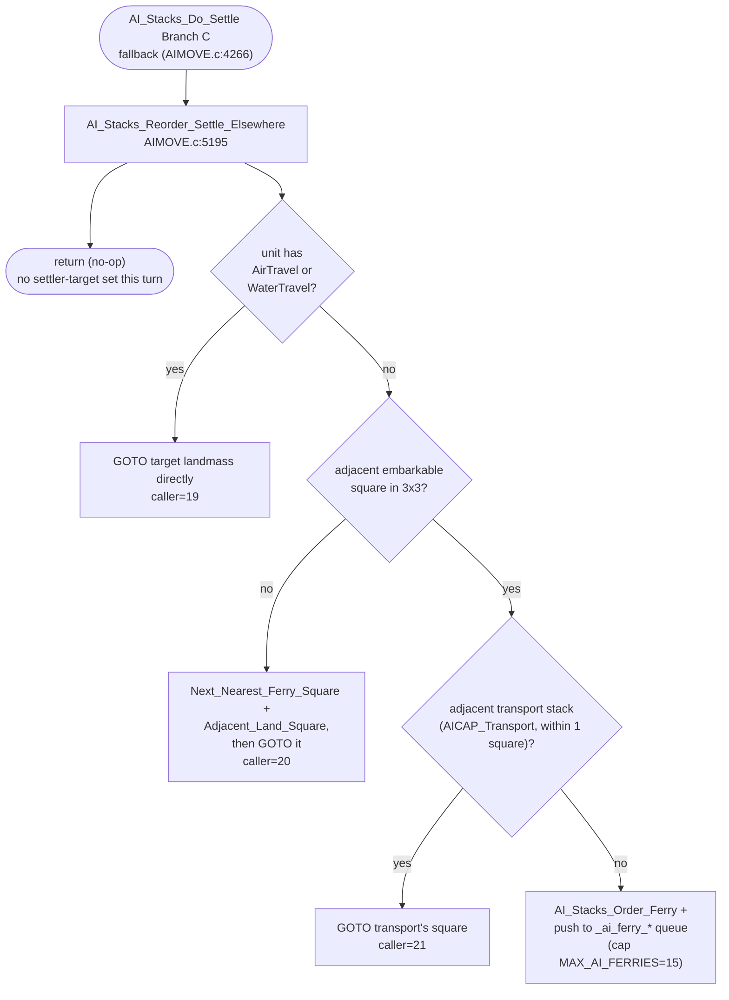

AIMOVE-AI_Stacks_Reorder_Settle_Elsewhere.md
SEEALSO: AIMOVE-AI_Stacks_Do_Settle.md

# Settle AoC — Branch C-fallback (`AI_Stacks_Reorder_Settle_Elsewhere`)

C:\STU\devel\STU-Extras\Piethawn\Piethawn\out\WIZARDS\ovr158\AI_SendToColonize__WIP.asm
C:\STU\devel\STU-Extras\Piethawn\Piethawn\out\WIZARDS\ovr158\AI_SendToColonize__WIP.c

AI_Stacks_Do_Settle()
    |-> AI_Stacks_Reorder_Settle_Elsewhere()
        |-> AI_Stacks_Order_Attack_Target_Or_Goto_Destination()  [3 different callers: 19, 20, 21]
        |-> Next_Nearest_Ferry_Square()
        |-> Adjacent_Land_Square()
        |-> AI_Stacks_Order_Ferry()

producer of the targets read here:
AI_Evaluate_Continents() → _ai_landmass_settler_targets[wp][player_idx] (AIMOVE.c:6895)

---

# `AI_Stacks_Reorder_Settle_Elsewhere` — Walkthrough

The Branch C-fallback of `AI_Stacks_Do_Settle` ([4266](../../MoM/src/AIMOVE.c#L4266)): if the per-landmass best-square search finds nothing usable, the settler isn't going to settle on its current landmass — it needs to **leave the landmass entirely** and try to colonize elsewhere. This function decides how: ferry, walk-to-embark, or sail/fly direct.

| Function | Location | Role |
|---|---|---|
| `AI_Stacks_Reorder_Settle_Elsewhere` | [AIMOVE.c:5195](../../MoM/src/AIMOVE.c#L5195) | Production. Reads pre-computed `_ai_landmass_settler_targets[wp][player_idx]`; routes settler to ferry/transport/direct depending on travel capability and adjacency. |

## Purpose

A settler that:
- Is not on a square good enough to settle in place ([`AI_Stacks_Do_Settle` Phase 3 in-place-gate](AIMOVE-AI_Stacks_Do_Settle.md#phase-3--per-settler-decision-lines-4152-4295))
- Cannot reach the off-plane via a Tower ([`AI_Find_Tower_To_Settle_Elsewhere`](AIMOVE-AI_Stacks_Do_Settle.md#code-walk--ai_find_tower_to_settle_elsewhere-lines-5100-5191) returned FALSE)
- Found no good square on its current landmass (Branch C's `Tile_Settling_Value` scan came up empty)

…has nothing left to do on this landmass. `AI_Stacks_Reorder_Settle_Elsewhere` consumes a pre-computed off-landmass settler-target (set by `AI_Evaluate_Continents` at [AIMOVE.c:6931](../../MoM/src/AIMOVE.c#L6931), one (wp, player) → (landmass_idx, wx, wy) per turn) and issues the right kind of order to start getting the settler there.

Three branches of how:



## How it's reached

Two production call sites + one GEMINI call site:

| Caller | Site | Notes |
|---|---|---|
| `AI_Stacks_Do_Settle` (production) | [AIMOVE.c:4254](../../MoM/src/AIMOVE.c#L4254) | Branch C-fallback after `highest_map_square_value == ST_UNDEFINED` (no square found on current landmass) |

The settler still has `Status = us_Ready` when this fires — `AI_Stacks_Reorder_Settle_Elsewhere` does NOT set `us_Settle`. It only sets the destination via `AI_Stacks_Order_Attack_Target_Or_Goto_Destination` (or queues a ferry request). The settler will travel toward the destination, and once it gets to a suitable square it'll come back through `AI_Stacks_Do_Settle` again next turn(s) and try the settle-in-place gate.

## Code walk — `AI_Stacks_Reorder_Settle_Elsewhere` ([lines 5195-5352](../../MoM/src/AIMOVE.c#L5195-L5352))

### Phase 1+2 — Setup ([5215-5231](../../MoM/src/AIMOVE.c#L5215-L5231))

```c
uu_landmass_idx = _landmasses[((WORLD_SIZE * wp) + (wy * WORLD_WIDTH) + wx)];
unit_wx = _UNITS[unit_idx].wx;
unit_wy = _UNITS[unit_idx].wx;  /* OGBUG  should be _UNITS[].wy, not _UNITS[].wx */
wp = _UNITS[unit_idx].wp;
is_seafaring = ST_FALSE;
if((Unit_Has_AirTravel(unit_idx) != ST_FALSE) || (Unit_Has_WaterTravel(unit_idx) != ST_FALSE))
{
    is_seafaring = ST_TRUE;
}
```

Cache landmass at caller-supplied (wx, wy, wp). Cache settler's own (wx, wy, wp) — note `wp` parameter is overwritten with `_UNITS[unit_idx].wp`. The `unit_wy = _UNITS[unit_idx].wx` is **OGBUG B1** below (faithful to OG asm, see asm line 58 — same `s_UNIT.wx` load).

`is_seafaring`: per-unit check — TRUE iff [`Unit_Has_AirTravel(unit_idx)`](../../MoM/src/UnitMove.c#L367) OR [`Unit_Has_WaterTravel(unit_idx)`](../../MoM/src/UnitMove.c#L426) fires for this specific settler. Both helpers union three sources:

- **Unit-type movement flags** (`_unit_type_table[].Move_Flags`) — `MV_FLYING`, `MV_SAILING`, `MV_SWIMMING`
- **Unit enchantments** (`_UNITS[].enchantments`) — `UE_WIND_WALKING`, `UE_FLIGHT`, `UE_WATER_WALKING`
- **Unit mutations** (`_UNITS[].mutations`) — `CC_FLIGHT`

So the gate fires for two native-race settler cases plus the cast-on-them cases:

- **Lizardman settlers** carry `MV_SWIMMING` natively → `Unit_Has_WaterTravel` returns TRUE → Phase 4a sends them straight to the off-landmass target via ocean.
- **Draconian settlers** carry `MV_FLYING` natively → `Unit_Has_AirTravel` returns TRUE → same direct-GOTO route.
- **Any other race's settler** with Wind Walking, Flight, or Water Walking cast on it — same outcome.

For the remaining cases (a plain-vanilla High Men / Barbarian / etc. settler with no mobility enchantments), the gate fails and the function falls through to Phase 4b — the embark/transport/ferry routing.

### Phase 3 — Sanity check / early exit ([5234-5243](../../MoM/src/AIMOVE.c#L5234-L5243))

```c
if(_ai_landmass_settler_targets[wp][player_idx] == 0)
{
    return;
}
destination_wx = _ai_landmass_settler_targets_wx_array[wp][player_idx];
destination_wy = _ai_landmass_settler_targets_wy_array[wp][player_idx];
```

`_ai_landmass_settler_targets[wp][player_idx]` holds a landmass index (or 0 = none-set). It's populated by `AI_Evaluate_Continents` at [AIMOVE.c:6931](../../MoM/src/AIMOVE.c#L6931), which picks ONE (landmass, wx, wy) per (player, plane) per turn — the best target landmass for colonization on that plane. If `AI_Evaluate_Continents` couldn't find one (no unoccupied landmass available), it writes 0 ([AIMOVE.c:6937](../../MoM/src/AIMOVE.c#L6937)), and this function silently no-ops.

The local `destination_wx`/`destination_wy` here holds the off-landmass settler-target. It's the same local reused at [lines 5324-5325](../../MoM/src/AIMOVE.c#L5324-L5325) for the nearby-transport's coords in Phase 4c2 — both uses pass through `AI_Stacks_Order_Attack_Target_Or_Goto_Destination` as the GOTO target, so the unified name reads cleanly. (OG asm uses two distinct stack slots, `target_wx`/`target_wy` and `transport_wx`/`transport_wy`; production consolidates to one local under the unified `destination_*` name.)

### Phase 4a — Seafaring direct ([5244-5252](../../MoM/src/AIMOVE.c#L5244-L5252))

```c
if(is_seafaring == ST_TRUE)
{
    g_ai_set_target_caller = 19;
    AI_Stacks_Order_Attack_Target_Or_Goto_Destination(unit_idx, destination_wx, destination_wy, unit_list_idx, list_unit_idx);
}
```

Settler can travel on water or air — just GOTO the destination landmass directly. No transport coordination needed. caller=19 is the trace tag for this dispatch.

### Phase 4b — 3×3 embarkable-square scan ([5255-5285](../../MoM/src/AIMOVE.c#L5255-L5285))

```c
/* Phase 4b: Ferry */
square_is_embarkable = ST_FALSE;
for(unit_wy = (wy - 1); (wy + 2) > unit_wy; unit_wy++)
{
    if(
        (unit_wy <= 0)
        ||
        (unit_wy >= WORLD_HEIGHT)
    )
    {
        continue;
    }
    for(itr_wx = (wx - 1); (wx + 2) > itr_wx; itr_wx++)
    {
        unit_wx = itr_wx;
        if(unit_wx < 0)
        {
            unit_wx += WORLD_WIDTH;
        }
        if(unit_wx >= WORLD_WIDTH)
        {
            unit_wx -= WORLD_WIDTH;
        }
        if(Map_Square_Is_Embarkable(unit_wx, unit_wy, wp) != ST_FALSE)
        {
            square_is_embarkable = ST_TRUE;
            new_target_wx = itr_wx;  /* OGBUG  this should be unit_wx, not itr_wx */
            new_target_wy = unit_wy;
        }
    }
}
```

3×3 scan centered on the settler-target (wx, wy) (caller-supplied — not the settler's current position; the settler may be standing on the target if it walked there last turn). Y-bounds (`<=0 || >=HEIGHT`) gate the row out via `continue` — no top/bottom wrap on a cylindrical world. X gets cylindrical wrap. On TRUE from `Map_Square_Is_Embarkable`, record the candidate as the best-known embarkable square (last-write-wins inside the 3×3).

**OGBUG B2 — `new_target_wx = itr_wx;`.** OG asm at lines 158-159: `mov ax, [bp+Unwrapped_X]; mov [bp+Adjacent_Ocean_X], ax` — stores the UN-WRAPPED loop counter, not the wrapped value that was actually checked. Production faithfully reproduces this. The source comment was updated from `BUGBUG` to `OGBUG` to reflect that this is OG-faithful (not a reconstruction error to fix).

### Phase 4c — Post-scan decision ([5287-5346](../../MoM/src/AIMOVE.c#L5287-L5346))

If no embarkable square was found in the 3×3, fall back to longer-range dock search (Phase 4c1). Otherwise, look for an existing transport stack nearby or queue a ferry request (Phase 4c2).

#### Phase 4c1 — No adjacent embarkable, find a dock further out ([5288-5301](../../MoM/src/AIMOVE.c#L5288-L5301))

```c
if(square_is_embarkable == ST_FALSE)
{
    /* Find a suitable landing site or transport load point */
    Next_Nearest_Ferry_Square(wx, wy, wp, &new_target_wx, &new_target_wy);
    if(Adjacent_Land_Square(new_target_wx, new_target_wy, wp, &new_target_wx, &new_target_wy) == ST_TRUE)
    {
        g_ai_set_target_caller = 20;
        AI_Stacks_Order_Attack_Target_Or_Goto_Destination(unit_idx, new_target_wx, new_target_wy, unit_list_idx, list_unit_idx);
    }
}
```

No suitable embarkable in the 3×3 — fall back to `Next_Nearest_Ferry_Square` (renamed from `TILE_AI_FindLoadTile__WIP`; declared at [AIMOVE.h:207](../../MoM/src/AIMOVE.h#L207)) to find the closest dock square on the landmass, then `Adjacent_Land_Square` (renamed from `TILE_AI_FindEmptyLnd__WIP`; defined at [AIMOVE.c:6269](../../MoM/src/AIMOVE.c#L6269)) to pick a safe land square adjacent to that dock. If found, GOTO it (caller=20). Otherwise no-op — settler stays put this turn.

#### Phase 4c2 — Adjacent embarkable found, look for nearby transport ([5302-5346](../../MoM/src/AIMOVE.c#L5302-L5346))

```c
else
{
    found_transport = ST_FALSE;
    for(itr_stacks = 0; ((itr_stacks < _ai_all_own_stack_count) && (found_transport == ST_FALSE)); itr_stacks++)
    {
        if((_ai_all_own_stacks[itr_stacks].wp == wp)
           && ((_ai_all_own_stacks[itr_stacks].abilities & AICAP_Transport) != 0))
        {
            unit_wx = _ai_all_own_stacks[itr_stacks].wx;
            unit_wy = _ai_all_own_stacks[itr_stacks].wy;
            if((abs(wx - unit_wx) < 2) && (abs(wy - unit_wy) < 2))
            {
                found_transport = ST_TRUE;
                destination_wx = unit_wx;
                destination_wy = unit_wy;
                niu_stack_capacity_total = _ai_all_own_stacks[itr_stacks].transport_capacity;
                niu_stack_capacity_free = (MAX_STACK - _ai_all_own_stacks[itr_stacks].unit_count);
            }
        }
    }
    if(found_transport == ST_TRUE)
    {
        g_ai_set_target_caller = 21;
        AI_Stacks_Order_Attack_Target_Or_Goto_Destination(unit_idx, destination_wx, destination_wy, unit_list_idx, list_unit_idx);
    }
    else
    {
        if(_ai_ferry_count < MAX_AI_FERRIES)
        {
            AI_Stacks_Order_Ferry(unit_idx, unit_list_idx, list_unit_idx);
            _ai_ferry_wx_array[_ai_ferry_count] = new_target_wx;
            _ai_ferry_wy_array[_ai_ferry_count] = new_target_wy;
            _ai_ferry_wp_array[_ai_ferry_count] = wp;
            _ai_ferry_count++;
        }
    }
}
```

Scan `_ai_all_own_stacks` for a transport-capable stack (`AICAP_Transport`) on the same plane within 1 square of the settler-target (wx, wy). If found: GOTO the transport (caller=21) — the settler walks to it and boards.

If no transport adjacent: register a ferry request in the global `_ai_ferry_*` arrays (capped at 15, `MAX_AI_FERRIES`). `AI_Stacks_Order_Ferry` sets `Status = us_Ferry`. The ferry queue is consumed later in `AI_Set_Unit_Orders` post-pass — boats matched to requests via [`AI_Stacks_Setup_Ferry`](AIMOVE-AI_Stacks_Setup_Ferry.md).

Note `niu_stack_capacity_total` and `niu_stack_capacity_free` (the `niu_` prefix marks them "not in use") are computed but never read downstream — vestigial captures, same in OG asm at `[bp+transport_capacity]` / `[bp+Transport_StackSize]` (OG names; production renamed locals on rename pass). The likely-intended use was a "does this transport have room for the settler?" gate before the GOTO at [line 5334](../../MoM/src/AIMOVE.c#L5334), but the gate was never wired up — OG always issues the GOTO regardless of free space. Preserved as `niu_`-marked locals to keep the OG-faithful write site visible.

## Bug catalog

| # | Where | Issue | Verdict |
|---|---|---|---|
| B1 | [Line 5218](../../MoM/src/AIMOVE.c#L5218) | `unit_wy = _UNITS[unit_idx].wx;` — should be `.wy`. Means `unit_wy` actually holds the unit's X coord. Source comment marks as OGBUG. | OGBUG; verified faithful to OG asm `AI_SendToColonize__WIP.asm:58` (OG filename — Piethawn output) which loads `s_UNIT.wx` into the Y-slot register. Preserve. |
| B2 | [Line 5279](../../MoM/src/AIMOVE.c#L5279) | `new_target_wx = itr_wx;` (unwrapped X) instead of `unit_wx` (wrapped X). | OGBUG; verified faithful to OG asm lines 158-159 which explicitly store `[bp+Unwrapped_X]`. Source comment correctly labels as `OGBUG`. Preserve. |
| B3 | [Line 5219](../../MoM/src/AIMOVE.c#L5219) | `wp = _UNITS[unit_idx].wp;` — clobbers caller's `wp` param with the unit's own `wp`. Affects downstream `_ai_landmass_settler_targets[wp]` lookup. Source comment marks as `OGBUG  overwrites WP`. | OG-faithful (asm lines 66-68). Caller passes the destination's wp, function overwrites with unit's current wp. Means the lookup is "settler-target on the unit's current plane" — which usually matches but means cross-plane caller intent is lost. Behavioral, not a bug per se. |

## Where the settler-target comes from

`_ai_landmass_settler_targets[wp][player_idx]`, `_ai_landmass_settler_targets_wx_array[wp][player_idx]`, `_ai_landmass_settler_targets_wy_array[wp][player_idx]` — three parallel arrays, indexed by (plane, player), each holding ONE target.

**Producer:** `AI_Evaluate_Continents` ([AIMOVE.c:6931-6937](../../MoM/src/AIMOVE.c#L6931-L6937)):

```c
if(min_delta_distance < 1000)
{
    _ai_landmass_settler_targets[wp][player_idx] = (uint8_t)target_landmass_idx;
    _ai_landmass_settler_targets_wx_array[wp][player_idx] = (uint8_t)target_square_wx;
    _ai_landmass_settler_targets_wy_array[wp][player_idx] = (uint8_t)target_square_wy;
}
else
{
    _ai_landmass_settler_targets[wp][player_idx] = 0;  /* no unoccupied landmass available */
}
```

Set once per turn per (player, plane), in `AI_Evaluate_Continents` (which runs in `AI_Next_Turn` BEFORE `AI_Set_Unit_Orders` — see [AIDUDES.c:300-301](../../MoM/src/AIDUDES.c#L300-L301)). The chosen landmass is the closest unoccupied landmass on the plane. Zero means "no candidate" → all settlers fall through to the early-exit at line 5237.

**Other consumers** (so the read-pattern at line 5235 is shared, not exclusive):

| Site | Function | Use |
|---|---|---|
| [AIMOVE.c:1345-1347](../../MoM/src/AIMOVE.c#L1345-L1347) | `AI_Stacks_Ocean_Landmass_Orders` | ferry-stage destination match |
| [AIMOVE.c:1364](../../MoM/src/AIMOVE.c#L1364) | `AI_Stacks_Ocean_Landmass_Orders` | exclude already-targeted landmass |
| [AIMOVE.c:1431-1445](../../MoM/src/AIMOVE.c#L1431-L1445) | `AI_Stacks_Ocean_Landmass_Orders` | locate adjacent target square for stage routing |
| [AIMOVE.c:5235-5243](../../MoM/src/AIMOVE.c#L5235-L5243) | `AI_Stacks_Reorder_Settle_Elsewhere` | this function |

## drake178 OG name mapping

Preserved as a cross-reference because these names appear in the Piethawn asm filenames and IDA artifacts:

| Production | drake178 OG / asm |
|---|---|
| `AI_Stacks_Reorder_Settle_Elsewhere` | `AI_SendToColonize` (o158p35) |
| `_ai_landmass_settler_targets` | `AI_NewColConts` |
| `_ai_landmass_settler_targets_wx_array` | `AI_NewColTgtXs` |
| `_ai_landmass_settler_targets_wy_array` | `AI_NewColTgtYs` |
| `_ai_ferry_count` / `_ai_ferry_wx_array` etc. | `ai_seektransport_cnt` / `AI_SeekTransport_Xs` etc. |
| `AI_Stacks_Order_Ferry` | `AI_Order_SeekTransport` |
| `AI_Stacks_Order_Attack_Target_Or_Goto_Destination` | `AI_Set_Move_Or_Goto_Target` |
| `MAX_AI_FERRIES` (= 15) | `MAX_SEEKTRANSPORT` (= 15) |

## Related references

- [AIMOVE-AI_Stacks_Do_Settle.md](AIMOVE-AI_Stacks_Do_Settle.md) — caller; this function is `AI_Stacks_Do_Settle` Phase 3 Branch C-fallback
- [AIMOVE-AI_Stacks_Ferry_Add_Location.md](AIMOVE-AI_Stacks_Ferry_Add_Location.md) — sibling write-to-`_ai_ferry_*` (with dedup); this function writes without dedup
- [AIMOVE-AI_Stacks_Setup_Ferry.md](AIMOVE-AI_Stacks_Setup_Ferry.md) — consumer of the `_ai_ferry_*` queue; matches boats to requests
- [MoM/src/AIMOVE.c#L6931](../../MoM/src/AIMOVE.c#L6931) — producer of `_ai_landmass_settler_targets` in `AI_Evaluate_Continents`
- [MoM-AI-Move-ai_own_stack.md](MoM-AI-Move-ai_own_stack.md) — `_ai_all_own_stacks` parallel-arrays reference (read in Phase 4c2)
- [Next_Nearest_Ferry_Square](../../MoM/src/AIMOVE.c#L6176) (formerly `TILE_AI_FindLoadTile__WIP`) and [Adjacent_Land_Square](../../MoM/src/AIMOVE.c#L6269) (formerly `TILE_AI_FindEmptyLnd__WIP`) — paired dock-finder / safe-square-finder helpers called from Phase 4c1
- `C:\STU\devel\STU-Extras\Piethawn\Piethawn\out\WIZARDS\ovr158\AI_SendToColonize__WIP.asm` — IDA Pro 5.5 disassembly (OG filename; ground truth, verified for B1/B2)
