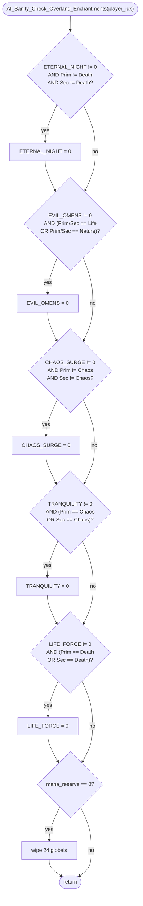

AISPELL-AI_Sanity_Check_Overland_Enchantments.md

C:\STU\devel\STU-Extras\Piethawn\Piethawn\out\WIZARDS\ovr156\AI_Sanity_Check_Overland_Enchantments.asm
C:\STU\devel\STU-Extras\Piethawn\Piethawn\out\WIZARDS\ovr156\AI_Sanity_Check_Overland_Enchantments.c

AI_Next_Turn()
    |-> AI_Sanity_Check_Overland_Enchantments()

---

# `AI_Sanity_Check_Overland_Enchantments` — Walkthrough

| Function | Location | Role |
|---|---|---|
| `AI_Sanity_Check_Overland_Enchantments` | [AISPELL.c:4096-4203](../../MoM/src/AISPELL.c#L4096-L4203) | Per-AI-player: dispel five specific global enchantments (ETERNAL_NIGHT, EVIL_OMENS, CHAOS_SURGE, TRANQUILITY, LIFE_FORCE) when the AI's realms disagree with the enchantment's allegiance, plus wipe 24 additional globals if `mana_reserve == 0`. |

Verified faithful to the disassembly `AI_Sanity_Check_Overland_Enchantments.asm` throughout (structure 1:1).

## Purpose

Called once per AI player per turn. Two responsibilities:

1. **Realm-conflict cleanup** — for each of the 5 target globals, check the AI's `Prim_Realm` and `Sec_Realm`. If the enchantment's realm allegiance is incompatible with the AI's realms, dispel it:

   | Enchantment | Dispel when | Rationale |
   |---|---|---|
   | `ETERNAL_NIGHT` | AI is NEITHER Death (Prim ≠ Death AND Sec ≠ Death) | Night is a Death global; non-Death wizards shouldn't hold it. |
   | `EVIL_OMENS` | AI IS Life or Nature (any of the four realm slots matches Life/Nature) | Omens debuffs Life/Nature effects; wizards of those realms would dispel. |
   | `CHAOS_SURGE` | AI is NEITHER Chaos (Prim ≠ Chaos AND Sec ≠ Chaos) | Surge is a Chaos global. |
   | `TRANQUILITY` | AI IS Chaos (Prim == Chaos OR Sec == Chaos) | Tranquility is a Life spell that suppresses Chaos globals; Chaos wizards would dispel. |
   | `LIFE_FORCE` | AI IS Death (Prim == Death OR Sec == Death) | Life Force is a Life global that suppresses Death globals; Death wizards would dispel. |

2. **Mana-zero mass-dispel** — if the AI's `mana_reserve == 0`, wipe 24 specific globals unconditionally. Presumably the AI is broke and can't sustain any upkeep-costing enchantments.

## How it's reached

| Caller | Site | Notes |
|---|---|---|
| `AI_Next_Turn` per-AI loop | Called per AI player per turn. | No self-throttle. |

## Globals / external state

| Symbol | Definition | Effect |
|---|---|---|
| `_players[player_idx]` (`s_WIZARD`) | per-player wizard record | Read: `Globals[]` (5 realm-check slots), `Prim_Realm`, `Sec_Realm`, `mana_reserve`. Mutated: up to 5 realm-check dispels + 24 mana-zero mass-dispels of `Globals[]`. |

Enchantment slot names in `Globals[]`: `ETERNAL_NIGHT`, `EVIL_OMENS`, `CHAOS_SURGE`, `TRANQUILITY`, `LIFE_FORCE` (the 5 realm-check targets), plus 19 more in the mana-zero block: `ZOMBIE_MASTERY`, `AURA_OF_MAJESTY`, `WIND_MASTERY`, `SUPPRESS_MAGIC`, `TIME_STOP`, `NATURES_AWARENESS`, `NATURES_WRATH`, `HERB_MASTERY`, `DOOM_MASTERY`, `GREAT_WASTING`, `METEOR_STORMS`, `ARMAGEDDON`, `CRUSADE`, `JUST_CAUSE`, `HOLY_ARMS`, `PLANAR_SEAL`, `CHARM_OF_LIFE`, `DETECT_MAGIC`, `AWARENESS`.

Realm enum: `sbr_Death`, `sbr_Life`, `sbr_Nature`, `sbr_Chaos`, `sbr_Sorcery` (only Death/Life/Nature/Chaos referenced here).

## Signature and locals

```c
void AI_Sanity_Check_Overland_Enchantments(int16_t player_idx)
```

No locals. No RNG. No I/O.

## Structure



## Code walk

Line refs are production [AISPELL.c](../../MoM/src/AISPELL.c); cross-checked against `AI_Sanity_Check_Overland_Enchantments.asm` (the authority).

### Phase 1 — ETERNAL_NIGHT dispel ([4099-4110](../../MoM/src/AISPELL.c#L4099-L4110))

```c
if(
    (_players[player_idx].Globals[ETERNAL_NIGHT] != 0)
    &&
    (_players[player_idx].Prim_Realm != sbr_Death)
    &&
    (_players[player_idx].Sec_Realm != sbr_Death)
)
{
    _players[player_idx].Globals[ETERNAL_NIGHT] = 0;
}
```

Maps 1:1 onto asm:13-31:

```asm
cmp [_players.Globals.ETERNAL_NIGHT+bx], 0
jz  short loc_E7A4C                          ; == 0 → skip
cmp [_players.Prim_Realm+bx], sbr_Death
jz  short loc_E7A4C                          ; == Death → skip
cmp [_players.Sec_Realm+bx], sbr_Death
jz  short loc_E7A4C                          ; == Death → skip
mov [_players.Globals.ETERNAL_NIGHT+bx], 0   ; dispel
```

All three `jz-to-skip` correspond to `&& !=` clauses. Faithful.

### Phase 2 — EVIL_OMENS dispel ([4112-4129](../../MoM/src/AISPELL.c#L4112-L4129))

```c
if(
    (_players[player_idx].Globals[EVIL_OMENS] != 0)
    &&
    (
        (_players[player_idx].Prim_Realm == sbr_Life)
        ||
        (_players[player_idx].Sec_Realm == sbr_Life)
        ||
        (_players[player_idx].Prim_Realm == sbr_Nature)
        ||
        (_players[player_idx].Sec_Realm == sbr_Nature)
    )
)
{
    _players[player_idx].Globals[EVIL_OMENS] = 0;
}
```

Maps onto asm:37-68. The OG uses an OR-chain shape — three `jz-to-dispel` followed by one `jnz-to-skip`:

```asm
cmp [_players.Globals.EVIL_OMENS+bx], 0
jz  short loc_E7AAA                          ; == 0 → skip
cmp [_players.Prim_Realm+bx], sbr_Life
jz  short loc_E7A9C                          ; == Life → dispel
cmp [_players.Sec_Realm+bx], sbr_Life
jz  short loc_E7A9C                          ; == Life → dispel
cmp [_players.Prim_Realm+bx], sbr_Nature
jz  short loc_E7A9C                          ; == Nature → dispel
cmp [_players.Sec_Realm+bx], sbr_Nature
jnz short loc_E7AAA                          ; != Nature → skip (fall through to dispel)
loc_E7A9C:
mov [_players.Globals.EVIL_OMENS+bx], 0     ; dispel
```

Production's four-clause `||` group mirrors the OG's four asm comparisons in order (Prim Life, Sec Life, Prim Nature, Sec Nature). Faithful.

### Phase 3 — CHAOS_SURGE dispel ([4131-4142](../../MoM/src/AISPELL.c#L4131-L4142))

```c
if(
    (_players[player_idx].Globals[CHAOS_SURGE] != 0)
    &&
    (_players[player_idx].Prim_Realm != sbr_Chaos)
    &&
    (_players[player_idx].Sec_Realm != sbr_Chaos)
)
{
    _players[player_idx].Globals[CHAOS_SURGE] = 0;
}
```

Maps 1:1 onto asm:74-92 — three `jz-to-skip` for the `!= Chaos` guards. Same shape as Phase 1 (ETERNAL_NIGHT). Faithful.

Minor OG asm oddity at asm:71: the first block after `loc_E7AAA` has `mov dx, size s_WIZARD+s_WIZARD.wizard_id` (should be plain `size s_WIZARD`) for the CHAOS_SURGE `!= 0` check's offset. For `player_idx == 0` the multiplication yields 0 either way so the read is correct; for `player_idx > 0` the OG reads from a slightly-wrong offset. Production uses standard array indexing so this quirk doesn't propagate. Preserved as-is (production is not obliged to reproduce IDA-listing anomalies that may just be disassembler symbol-resolution quirks).

### Phase 4 — TRANQUILITY dispel ([4144-4157](../../MoM/src/AISPELL.c#L4144-L4157))

```c
if(
    (_players[player_idx].Globals[TRANQUILITY] != 0)
    &&
    (
        (_players[player_idx].Prim_Realm == sbr_Chaos)
        ||
        (_players[player_idx].Sec_Realm == sbr_Chaos)
    )
)
{
    _players[player_idx].Globals[TRANQUILITY] = 0;
}
```

Maps onto asm:98-117:

```asm
cmp [_players.Globals.TRANQUILITY+bx], 0
jz  short loc_E7B26                          ; == 0 → skip
cmp [_players.Prim_Realm+bx], sbr_Chaos
jz  short loc_E7B18                          ; == Chaos → dispel
cmp [_players.Sec_Realm+bx], sbr_Chaos
jnz short loc_E7B26                          ; != Chaos → skip
loc_E7B18:
mov [_players.Globals.TRANQUILITY+bx], 0
```

Two-clause OR shape (Prim Chaos, Sec Chaos). Production matches. Faithful.

### Phase 5 — LIFE_FORCE dispel ([4159-4172](../../MoM/src/AISPELL.c#L4159-L4172))

```c
if(
    (_players[player_idx].Globals[LIFE_FORCE] != 0)
    &&
    (
        (_players[player_idx].Prim_Realm == sbr_Death)
        ||
        (_players[player_idx].Sec_Realm == sbr_Death)
    )
)
{
    _players[player_idx].Globals[LIFE_FORCE] = 0;
}
```

Maps onto asm:123-142:

```asm
cmp [_players.Globals.LIFE_FORCE+bx], 0
jz  short loc_E7B64                          ; == 0 → skip
cmp [_players.Prim_Realm+bx], sbr_Death
jz  short loc_E7B56                          ; == Death → dispel
cmp [_players.Sec_Realm+bx], sbr_Death
jnz short loc_E7B64                          ; != Death → skip
loc_E7B56:
mov [_players.Globals.LIFE_FORCE+bx], 0
```

Two-clause OR shape on `sbr_Death`, same structure as Phase 4 but different realm. Production matches. Faithful.

### Phase 6 — mana-zero mass-dispel ([4174-4201](../../MoM/src/AISPELL.c#L4174-L4201))

```c
if(_players[player_idx].mana_reserve == 0)
{
    _players[player_idx].Globals[ETERNAL_NIGHT] = 0;
    _players[player_idx].Globals[EVIL_OMENS] = 0;
    _players[player_idx].Globals[ZOMBIE_MASTERY] = 0;
    /* ... 21 more ... */
    _players[player_idx].Globals[AWARENESS] = 0;
}
```

Maps 1:1 onto asm:143-272. The 24 store operations are in the same order as the OG:

| Order | Enchantment | OG asm line | Production line |
|---|---|---|---|
| 1 | ETERNAL_NIGHT | 157 | 4177 |
| 2 | EVIL_OMENS | 162 | 4178 |
| 3 | ZOMBIE_MASTERY | 167 | 4179 |
| 4 | AURA_OF_MAJESTY | 172 | 4180 |
| 5 | WIND_MASTERY | 177 | 4181 |
| 6 | SUPPRESS_MAGIC | 182 | 4182 |
| 7 | TIME_STOP | 187 | 4183 |
| 8 | NATURES_AWARENESS | 192 | 4184 |
| 9 | NATURES_WRATH | 197 | 4185 |
| 10 | HERB_MASTERY | 202 | 4186 |
| 11 | CHAOS_SURGE | 207 | 4187 |
| 12 | DOOM_MASTERY | 212 | 4188 |
| 13 | GREAT_WASTING | 217 | 4189 |
| 14 | METEOR_STORMS | 222 | 4190 |
| 15 | ARMAGEDDON | 227 | 4191 |
| 16 | TRANQUILITY | 232 | 4192 |
| 17 | LIFE_FORCE | 237 | 4193 |
| 18 | CRUSADE | 242 | 4194 |
| 19 | JUST_CAUSE | 247 | 4195 |
| 20 | HOLY_ARMS | 252 | 4196 |
| 21 | PLANAR_SEAL | 257 | 4197 |
| 22 | CHARM_OF_LIFE | 262 | 4198 |
| 23 | DETECT_MAGIC | 267 | 4199 |
| 24 | AWARENESS | 272 | 4200 |

Faithful. Note the OG asm uses `Meteor_Storm` (singular) as the label; production uses `METEOR_STORMS` (plural) — presumably the ReMoM enum uses the plural form. Not a bug, just naming convention.

## OG quirks preserved (faithful — do not "fix")

- **Phase 6 wipes 24 globals unconditionally when mana hits 0** — the OG author flagged this in a comment (`WARNING: this may not be the best thing to do...`) that the current source no longer carries. Semantic: the AI drops all 24 upkeep-costing globals when broke, including potentially-valuable ones (CHARM_OF_LIFE, DETECT_MAGIC, AWARENESS) that the AI could re-fund next turn. Preserved as OG behavior; the arguable-suboptimality is a design choice, not a reconstruction error.
- **Phase 6 wipes 24 globals, not all globals** — some upkeep-costing globals are notably absent from the wipe list (e.g., `NIGHT_STALKER`, `EARTH_MASTERY`, `SPELL_BINDING`). The 24-item list is preserved OG behavior, not exhaustive. Faithful.
- **Enchantments are dispelled to `0`, not to a "was cancelled" sentinel** — a re-cast next turn would produce a fresh enchantment with a full duration/level. Faithful.
- **No RNG involved** — the sanity-check decisions are purely deterministic from the AI's realms and mana state. Same output every time the same player state hits this function. PRNG stream unaffected.

## Sub-functions / external calls

None. Pure state mutation on `_players[player_idx]`. No RNG, no I/O, no `CONTXXX_Map`, no helper calls.

## Related references

- `C:\STU\devel\STU-Extras\Piethawn\Piethawn\out\WIZARDS\ovr156\AI_Sanity_Check_Overland_Enchantments.asm` — IDA Pro 5.5 disassembly (the authority).
- Called from the per-AI-player turn loop; not paired with a "sanity-check for humans" — humans are trusted to manage their own upkeep.
- `s_WIZARD` fields read/written: `Globals[]` (5 realm-check slots + 24 mana-zero slots), `Prim_Realm`, `Sec_Realm`, `mana_reserve`.
- `sbr_Death`, `sbr_Life`, `sbr_Nature`, `sbr_Chaos` — realm enum values.
- Global-enchantment slot indices — declared in `MoX/src/MOM_DAT.h` or `MOM_DEF.h`.
