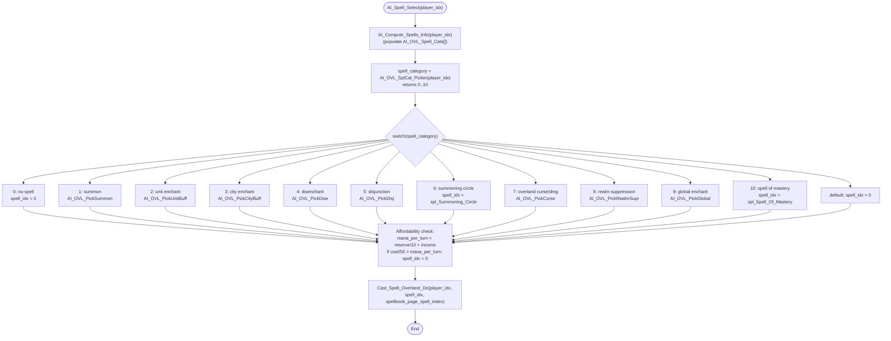

AISPELL-AI_Spell_Select.md

C:\STU\devel\STU-Extras\Piethawn\Piethawn\out\WIZARDS\ovr156\AI_Spell_Select.asm
C:\STU\devel\STU-Extras\Piethawn\Piethawn\out\WIZARDS\ovr156\AI_Spell_Select.c

Next_Turn_Proc()
|-> Next_Turn_Calc()
    |-> AI_Next_Turn()
         |-> Cast_Spell_Overland()
AI_Spell_Select()
    |-> AI_Compute_Spells_Info()
    |-> AI_OVL_SplCat_Picker()
    |-> AI_OVL_PickSummon()
    |-> AI_OVL_PickUnitBuff()
    |-> AI_OVL_PickCityBuff()
    |-> AI_OVL_PickDise()
    |-> AI_OVL_PickDisj()
    |-> AI_OVL_PickCurse()
    |-> AI_OVL_PickRealmSupr()
    |-> AI_OVL_PickGlobal()
    |-> Player_Resource_Income_Total()
    |-> Cast_Spell_Overland_Do()

---

# `AI_Spell_Select` — Walkthrough

| Function | Location | Role |
|---|---|---|
| `AI_Spell_Select` | [AISPELL.c:309-378](../../MoM/src/AISPELL.c#L309-L378) (70 lines, plus Doxygen header at 287-308) | Per-AI-turn "what spell does this wizard start casting?" dispatcher. Computes the AI's spell inventory, picks a category, picks a specific spell within the category, applies an affordability check, then hands off to `Cast_Spell_Overland_Do` to start the cast. |

## Purpose

Called once per (AI player, turn) when the AI is idle (`casting_spell_idx == spl_NONE`). Drives the AI's overland spell-casting agenda. The function is a thin **dispatcher** — the real work happens in 10 leaf "pickers" (one per category) that are stubbed out in this codebase. See [Stubbed leaves](#stubbed-leaves).

The decision flow:

1. Recompute the AI's overland-spell inventory (`AI_Compute_Spells_Info`).
2. Choose a CATEGORY (0-10): summon, unit-buff, city-buff, disenchant, disjunction, summoning circle, overland curse, suppress global, global enchantment, spell-of-mastery, or none.
3. Within the chosen category, choose a specific `spell_idx`.
4. Apply a "50-turn affordability" sanity check — if the spell would take more than ~50 turns of perceived mana income, cancel it.
5. Hand off to `Cast_Spell_Overland_Do` to begin (or instant-complete) the cast.

`Cast_Spell_Overland_Do` is the same function the spellbook screen calls when the human player picks a spell — i.e., this is the AI's equivalent of clicking a spell in the spellbook.

## How it's reached

| Caller | Site | Notes |
|---|---|---|
| `AI_Next_Turn` | [AIDUDES.c:278](../../MoM/src/AIDUDES.c#L278) | Wrapped in `PHASE()` for STU_LOG timing. Inside per-AI-player loop, gated by `if (_players[player_idx].casting_spell_idx == spl_NONE)` — only runs when the AI isn't already mid-cast. |

`AI_Spell_Select` appears as text in [CITYCALC.c:969](../../MoM/src/CITYCALC.c#L969) and [SBookScr.c:473](../../MoM/src/SBookScr.c#L473), but both are XREF comments, not real calls.

## Structure



## Code walk

### Phase 1 — Setup ([309-323](../../MoM/src/AISPELL.c#L309-L323))

```c
void AI_Spell_Select(int16_t player_idx)
{
    int16_t mana_income = 0;
    int16_t food_income = 0;
    int16_t gold_income = 0;
    uint8_t * ptr_players_spells_known = 0;
    int16_t mana_per_turn = 0;
    int16_t spellbook_page_spell_index = 0;
    int16_t spell_category = 0;
    int16_t spell_idx = 0;

    /* OGBUG  somehow, the Dasm shows -1 for the spell index */
    ptr_players_spells_known = &_players[player_idx].spells_list[0];

    AI_Compute_Spells_Info(player_idx);
```

- **`ptr_players_spells_known` is set but never read** in the rest of the function — a dead store carried over from the OG asm. Production writes `&...spells_list[0]` but the inline OGBUG comment at [line 320](../../MoM/src/AISPELL.c#L320) notes that the IDA disassembly actually shows `[-1]` (off-by-one index, OG-faithful). Since the value is never used the divergence is harmless; preserve the production form and the OGBUG flag.
- **`spellbook_page_spell_index` is zero-initialized but never reassigned** before being passed to `Cast_Spell_Overland_Do` at [line 376](../../MoM/src/AISPELL.c#L376) — the variable is just `0` at the call. AI path doesn't need it; that field matters for the spellbook UI on human casts.
- `AI_Compute_Spells_Info` ([AISPELL.c:400](../../MoM/src/AISPELL.c#L400)) populates `AI_OVL_Spell_Cats[]` and related per-spell metadata that the picker will consult.

### Phase 2 — Pick category ([325-326](../../MoM/src/AISPELL.c#L325-L326))

```c
spell_category = AI_OVL_SplCat_Picker(player_idx);
```

`AI_OVL_SplCat_Picker` returns a category code 0-10 (table below). It also has a documented side effect: it sets `_players[].cp_target_3` (hostile target wizard) — see [MOM_DAT.h:1484](../../MoX/src/MOM_DAT.h#L1484) — which feeds `OVL_TargetWiz` / `IDK_AI_Strategy_3` downstream.

Currently stubbed to `return 0;` — see [Stubbed leaves](#stubbed-leaves).

### Phase 3 — Dispatch by category ([327-365](../../MoM/src/AISPELL.c#L327-L365))

Plain switch. Two categories return constants directly:

- Category 6 → `spell_idx = spl_Summoning_Circle`
- Category 10 → `spell_idx = spl_Spell_Of_Mastery`

All other non-zero categories delegate to a picker. The default branch and category 0 both produce `spell_idx = 0` (cast nothing).

| Category | Picker | What it picks |
|---|---|---|
| 0 | (none) | No spell |
| 1 | `AI_OVL_PickSummon` | Summoning spells |
| 2 | `AI_OVL_PickUnitBuff` | Unit enchantments |
| 3 | `AI_OVL_PickCityBuff` | City enchantments |
| 4 | `AI_OVL_PickDise` | Disenchant / Disenchant True |
| 5 | `AI_OVL_PickDisj` | Disjunction / Disjunction True |
| 6 | (constant) | `spl_Summoning_Circle` |
| 7 | `AI_OVL_PickCurse` | Overland curses / direct damage |
| 8 | `AI_OVL_PickRealmSupr` | Realm-suppression globals (Suppress Magic, Tranquility, Life Force, Nature's Awareness) |
| 9 | `AI_OVL_PickGlobal` | Other global enchantments |
| 10 | (constant) | `spl_Spell_Of_Mastery` |

### Phase 4 — Affordability check ([367-374](../../MoM/src/AISPELL.c#L367-L374))

```c
/* Calculate perceived mana availability: 10% of reserve + current turn income */
/* Turn-based cost check: If spell takes more than ~50 turns of "perceived" mana, cancel it */
Player_Resource_Income_Total(player_idx, &gold_income, &food_income, &mana_income);
mana_per_turn = ((_players[player_idx].mana_reserve / 10) + mana_income);
if((spell_data_table[spell_idx].casting_cost / 50) > mana_per_turn)
{
    spell_idx = 0;
}
```

- "Perceived" mana per turn = 10% of mana reserve + current mana income.
- "Affordable" = the spell can be paid off in ≤50 turns at that perceived rate.
- The check evaluates `spell_data_table[spell_idx].casting_cost / 50 > mana_per_turn` — integer division, so a cost of <50 always satisfies "0 > mana_per_turn" iff `mana_per_turn` is negative (can't happen given reserve and income are non-negative). Effectively: cheap spells (<50 mana) always pass; expensive spells must clear the threshold.
- **Edge case:** when category 0 is selected (no spell), `spell_idx = 0` enters the check. `spell_data_table[0]` exists and its `.casting_cost` is whatever the table holds for the zero-th spell entry — typically 0, so the check is harmless. But if spell 0 in `spell_data_table` ever held a nonzero cost the check would still run on it as if it were a real cast attempt. This is a OG-faithful no-op in practice, but worth flagging as a soft correctness footnote.

### Phase 5 — Dispatch to caster ([376](../../MoM/src/AISPELL.c#L376))

```c
Cast_Spell_Overland_Do(player_idx, spell_idx, spellbook_page_spell_index);
```

Same entry point the human spellbook screen uses ([SBookScr.c:476](../../MoM/src/SBookScr.c#L476)). `spellbook_page_spell_index` is always 0 here (see Phase 1 note) — that field matters for the spellbook UI on human casts but the AI doesn't need it.

`Cast_Spell_Overland_Do` either:
- begins a multi-turn cast (most spells) — sets `casting_spell_idx`/`casting_cost_remaining` on the player, returns; mana drains over subsequent turns until `Cast_Spell_Overland` ([Wave 4A](SETTLE-Cast_Spell_Overland.md)) completes it, OR
- instant-completes the cast (some spells are flagged for immediate effect).

## Stubbed leaves

The 9 `AI_OVL_*` picker functions are present in [AISPELL.c](../../MoM/src/AISPELL.c) as **empty stubs returning 0**. They compile clean (no warnings) and link into momlib normally, but at runtime every call returns 0 — i.e., every category resolves to `spell_idx = 0` and the AI casts nothing.

| Picker | Location | Status |
|---|---|---|
| `AI_OVL_SplCat_Picker` | [AISPELL.c:382-385](../../MoM/src/AISPELL.c#L382-L385) | Stub `return 0;` |
| `AI_OVL_PickSummon` | [AISPELL.c:471-474](../../MoM/src/AISPELL.c#L471-L474) | Stub `return 0;` |
| `AI_OVL_PickUnitBuff` | [AISPELL.c:477-480](../../MoM/src/AISPELL.c#L477-L480) | Stub `return 0;` |
| `AI_OVL_PickRealmSupr` | [AISPELL.c:483-486](../../MoM/src/AISPELL.c#L483-L486) | Stub `return 0;` |
| `AI_OVL_PickGlobal` | [AISPELL.c:489-492](../../MoM/src/AISPELL.c#L489-L492) | Stub `return 0;` |
| `AI_OVL_PickCurse` | [AISPELL.c:495-498](../../MoM/src/AISPELL.c#L495-L498) | Stub `return 0;` |
| `AI_OVL_PickCityBuff` | [AISPELL.c:501-504](../../MoM/src/AISPELL.c#L501-L504) | Stub `return 0;` |
| `AI_OVL_PickDise` | [AISPELL.c:519-522](../../MoM/src/AISPELL.c#L519-L522) | Stub `return 0;` |
| `AI_OVL_PickDisj` | [AISPELL.c:525-528](../../MoM/src/AISPELL.c#L525-L528) | Stub `return 0;` |

**Runtime behavior of `AI_Spell_Select` today:** `AI_OVL_SplCat_Picker` returns 0 → `spell_category = 0` → switch case 0 → `spell_idx = 0` → affordability check sees `spell_data_table[0].casting_cost / 50` (typically 0) and either clears `spell_idx` to 0 again or leaves it at 0 → `Cast_Spell_Overland_Do(player_idx, 0, 0)` is called. Net effect: the AI never starts an overland cast. Per Wave 4A's `Cast_Spell_Overland`, an idle `casting_spell_idx == spl_NONE` short-circuits the cast-completion path too — so the entire overland spell-AI subsystem is currently inert.

The leaves are tracked separately in [doc/__TODO-AiTurn.md](../__TODO-AiTurn.md) under Wave 4C/4D/4E and are out of scope for this function.

## Bug catalog

No `OGBUG` / `BUGBUG` markers inside the function body except for the dead-store flag at line 320. Other items are documentation, not behavior:

| # | Where | Concern |
|---|---|---|
| 1 | [Line 320](../../MoM/src/AISPELL.c#L320) | OGBUG-flagged: production writes `&...spells_list[0]` but the Dasm shows `[-1]`. Dead store, divergence is harmless. Preserved with inline comment. |
| 2 | [Line 316](../../MoM/src/AISPELL.c#L316) + [376](../../MoM/src/AISPELL.c#L376) | `spellbook_page_spell_index` passed to `Cast_Spell_Overland_Do` as `0` (zero-init, never reassigned). AI path doesn't need it; matches OG. |
| 3 | [Line 371](../../MoM/src/AISPELL.c#L371) | Affordability check runs even when `spell_idx == 0`. Harmless under current `spell_data_table[0]` content, but logically should short-circuit. OG-faithful; not actively wrong. |

None warrant a code change in this function.

## Sub-functions / external calls

- **`AI_Compute_Spells_Info`** ([AISPELL.c:400](../../MoM/src/AISPELL.c#L400)) — populates `AI_OVL_Spell_Cats[]` from the player's known-spells inventory, filtering out combat-only AI-groups (5, 12, 24, 47, 70, etc.). RECONSTRUCTED.
- **`AI_OVL_SplCat_Picker`** ([AISPELL.c:382](../../MoM/src/AISPELL.c#L382)) — category chooser (0-10). STUB `return 0;`.
- **`AI_OVL_PickSummon` / `AI_OVL_PickUnitBuff` / `AI_OVL_PickCityBuff` / `AI_OVL_PickDise` / `AI_OVL_PickDisj` / `AI_OVL_PickCurse` / `AI_OVL_PickRealmSupr` / `AI_OVL_PickGlobal`** — per-category spell choosers. ALL STUBS `return 0;`. See [Stubbed leaves](#stubbed-leaves) for line refs.
- **`Player_Resource_Income_Total`** ([CITYCALC.c](../../MoM/src/CITYCALC.c)) — computes per-turn gold/food/mana income. RECONSTRUCTED (XREF at [CITYCALC.c:969](../../MoM/src/CITYCALC.c#L969)).
- **`Cast_Spell_Overland_Do`** ([SBookScr.c:476](../../MoM/src/SBookScr.c#L476)) — begins or instant-completes the cast. Shared with the human spellbook screen path.

## Related references

- `C:\STU\devel\STU-Extras\Piethawn\Piethawn\out\WIZARDS\ovr156\AI_Spell_Select.asm` — IDA Pro 5.5 disassembly source.
- [SETTLE-Cast_Spell_Overland.md](SETTLE-Cast_Spell_Overland.md) — Wave 4A: the cast-completion function that consumes what this function queues.
- [doc/MoM-NextTurn-AI.md](../MoM-NextTurn-AI.md) — IDA raw-asm extracts for `AI_OVL_SplCat_Picker` and the leaf pickers; primary reference for reconstructing them.
- [doc/MoM-GrandVizier.md](../MoM-GrandVizier.md) — `AI_OVL_PickSummon` Floating Island branch IDA extracts.
- [MOX_TYPE.h `s_PLAYER`](../../MoX/src/MOM_DAT.h#L1484) — `cp_target_3` field set as a side effect by `AI_OVL_SplCat_Picker`.
- [doc/__TODO-AiTurn.md](../__TODO-AiTurn.md) — overall AI_Next_Turn done-done plan.
