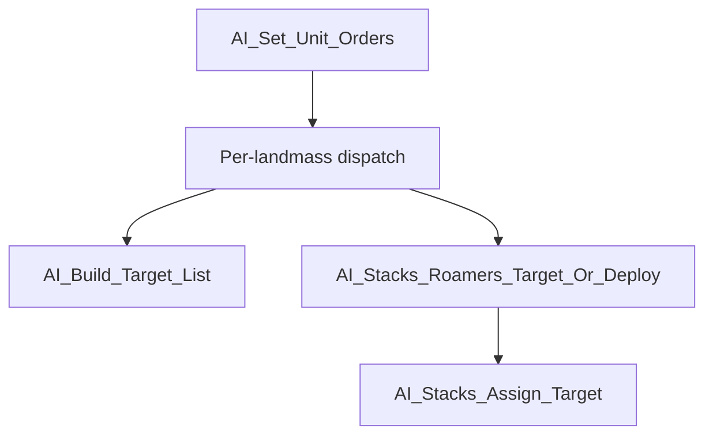

MoM-AI-Move-ai_own_stack.md
SEEALSO:  C:\STU\devel\ReMoM\doc\ComputerPlayer\AIMOVE-AI_Stacks_Init_Build_Target_Order

# "ai_own_stack" - 'Area Of Code'

includes a subset:
    SEEALSO: AIMOVE-AI_Stacks_Stage_Expedition_Forces.md
    AI_Stacks_Survey_Expedition_Forces()
    AI_Stacks_Survey_Expedition_Forces_Stack()
    AI_Stacks_Stage_Expedition_Forces()
    AI_Stacks_Garrison_Sites()

* cp_landmass_wx_array, cp_landmass_wy_array
    * XREF:
        * AI_Stacks_Init_Build_Target_Order()
        * AI_Set_Unit_Orders()
        * AI_Stacks_Stage_Expedition_Forces()
        * AI_Stacks_Garrison_Sites()
* G_Seafaring_Lowest_Value
    * XREF:
        * AI_Stacks_Survey_Expedition_Forces()
        * AI_Stacks_Survey_Expedition_Forces_Stack()
* G_Pushout_Lowest_Value
    * XREF:
        * AI_Stacks_Survey_Expedition_Forces()
        * AI_Stacks_Survey_Expedition_Forces_Stack()
* G_Seafaring_Count
    * XREF:
        * AI_Stacks_Survey_Expedition_Forces()
        * AI_Stacks_Survey_Expedition_Forces_Stack()
* cp_drafted_unit_count
    * XREF:
        * AI_Stacks_Survey_Expedition_Forces()
        * AI_Stacks_Survey_Expedition_Forces_Stack()
        * AI_Stacks_Stage_Expedition_Forces()
* G_Seafaring_Values
    * XREF:
* G_Pushout_Values
    * XREF:
* G_Seafaring_CX_IDs
    * XREF:
* G_Pushout_CX_IDs
    * XREF:
* G_Seafaring_UL_Indices
    * XREF:
* G_Pushout_UL_Indices
    * XREF:
* G_Seafaring_Unit_Indices
    * XREF:
* G_Pushout_Unit_Indices
    * XREF:
        * AI_Stacks_Survey_Expedition_Forces_Stack()
        * AI_Stacks_Stage_Expedition_Forces()
* cp_staged_unit_count
    * XREF:
        * AI_Stacks_Init_Build_Target_Order()
        * AI_Stacks_Stage_Expedition_Forces()
* cp_enroute_unit_count
    * XREF:
        * AI_Stacks_Init_Build_Target_Order()
        * AI_Stacks_Stage_Expedition_Forces()
* g_ai_minattackstack
    * XREF:
        * AI_Set_Unit_Orders()
        * AI_Stacks_Stage_Expedition_Forces()


some overlap with `g_ai_evaluation_map`
struct s_AI_TARGET
struct s_AI_STACK_DATA

¿ vs. _ai_all_own_stacks ?

relationship?
    _ai_targets_value[MAX_AI_TARGETS]; _ai_targets_strength[MAX_AI_TARGETS]; _ai_targets_wy[MAX_AI_TARGETS]; _ai_targets_wx[MAX_AI_TARGETS]; _ai_targets_count; 

relationship?
    int16_t ai_transport_count; int16_t _ai_ferry_count; int16_t _ai_ferry_wp_array[15]; int16_t _ai_ferry_wy_array[15]; int16_t _ai_ferry_wx_array[15];


#define MAX_AI_STACKS 80

/*
_ai_own_stack_type
0: in transit, purifying, or road building (c < 3)
1: Free/Roaming  (not sitting on a Site)
2: DNE
3: Garrison - City, Node, Tower (sitting on a Site, assumed to be garrisoned in a City or protecting a Node or Tower)
4: Garrison - Fortress City   (sitting on a Site, which is the player's Fortress City)

0 is set if AI_Stacks_Target_Nearest_Hostile_Stack() returns ST_FALSE
*/
enum e_AI_OWN_STACK_TYPE
{
    AISTK_Unknown = 0,   /* in transit, purifying, or road building (c < 3) */
    AISTK_Roamer = 1,   /* Free/Roaming  (not sitting on a Site) */
    AISTK_DNE = 2,      /* DNE */
    AISTK_Garrison = 3,  /* Garrison - City, Node, Tower (sitting on a Site, assumed to be garrisoned in a City or protecting a Node or Tower) */
    AISTK_FortressGarrison = 4,   /* Garrison - Fortress City   (sitting on a Site, which is the player's Fortress City) */
    AISTK_COUNT = 5
};

// WZD dseg:9D4A
/*
~ "AI Own Stack"

cleared in AI_Stacks_Init_Build_Target_Order
    _ai_own_stack_count = 0;
    _ai_own_stack_wx[] = ST_UNDEFINED;
    _ai_own_stack_wy[] = ST_UNDEFINED;
    _ai_own_stack_wp[] = ST_UNDEFINED;
    _ai_own_stack_unit_count[] = 0;

...works like setting target value to 0 in AI_Stacks_Assign_Target()
_ai_own_stack_unit_list[][] = ST_UNDEFINED
    AI_Stacks_Init_Build_Target_Order
    AI_Stacks_Order_Attack_Target_Or_Goto_Destination()
    AI_Order_Settle()
    AI_Order_RoadBuild()
    AI_Stacks_Order_Ferry()
    AI_Order_Meld()
    AI_Order_Purify()
*/
int16_t _ai_own_stack_count;
int16_t * _ai_own_stack_unit_list[MAX_AI_STACKS];
SAMB_ptr _ai_own_stack_unit_count;
SAMB_ptr _ai_own_stack_type;    /* enum e_AI_OWN_STACK_TYPE */
SAMB_ptr _ai_own_stack_wp;
SAMB_ptr _ai_own_stack_wy;
SAMB_ptr _ai_own_stack_wx;

// WZD o158p15
AI_Find_Opportunity_City_Target()

// WZD o158p17
AI_Shift_Off_Home_Plane()
...uses _ai_all_own_stacks[]

// WZD o158p18
AI_Move_Out_Boats() |-> AI_Stack_Set_Boats_Goto()
...uses _ai_all_own_stacks[]
...// WZD o162p19  AI_Stack_Set_Boats_Goto(int16_t ai_stack_idx, int16_t wx, int16_t wy) ...uses _ai_all_own_stacks[]


// WZD o158p35
AI_SendToColonize__WIP()
...uses the arrays
...also _ai_landmass_settler_targets_wx_array
...also _ai_ferry_wx_array/Ys/Ps

intermingled?
    // WZD o158p32
    Map_Square_Area_Has_Opponent
    // WZD o158p33
    AI_Enemy_Unit_In_Range
    // WZD o158p34
    AI_CanSettleOffPlane__STUB
    // WZD o158p36
    AI_Stacks_Ferry_Add_Location()
    // WZD o158p37
    AI_Tower_Target_Worthwhile()
    // WZD o158p38
    AI_Reevaluate_Continent()


_ai_own_stack_count;
_ai_own_stack_unit_list[];
_ai_own_stack_unit_count;
_ai_own_stack_type;
_ai_own_stack_wp;
_ai_own_stack_wy;
_ai_own_stack_wx;


## G_Pushout_* and G_Seafaring_* — secondary indexes INTO `_ai_own_stack_*`

These look like a separate AI subsystem but they are NOT. They're a **top-9 cherry-picked subset** of `_ai_own_stack_*` slots, materialized as ranked lists for fast iteration by downstream consumers. They live in the same area-of-code as everything else in this doc.

Declared at [AIMOVE.c:72-83](../../MoM/src/AIMOVE.c#L72-L83):

```c
int16_t G_Pushout_Lowest_Value;                  /* scalar — cached min for fast displacement */
int16_t cp_drafted_unit_count;                   /* scalar — pool size (inconsistent name) */
int16_t G_Pushout_Values[MAX_STACK];             /* per-entry: score for ranking */
int16_t G_Pushout_CX_IDs[MAX_STACK];             /* per-entry: index into _ai_own_stack_* */
int16_t G_Pushout_UL_Indices[MAX_STACK];         /* per-entry: per-stack slot within _ai_own_stack_unit_list */
int16_t G_Pushout_Unit_Indices[MAX_STACK];       /* per-entry: cached _UNITS[] index (same as _ai_own_stack_unit_list[CX][UL]) */

/* Mirror-shaped Seafaring pool — same layout, different naming for the count: */
int16_t G_Seafaring_Lowest_Value;
int16_t G_Seafaring_Count;                       /* scalar — pool size */
int16_t G_Seafaring_Values[MAX_STACK];
int16_t G_Seafaring_CX_IDs[MAX_STACK];
int16_t G_Seafaring_UL_Indices[MAX_STACK];
int16_t G_Seafaring_Unit_Indices[MAX_STACK];
```

**Pool entries are 3-index triples that point into the `_ai_own_stack_*` AoS:**

```
G_Pushout_CX_IDs[i]       → which stack:    _ai_own_stack_*[CX]
G_Pushout_UL_Indices[i]   → which slot:     _ai_own_stack_unit_list[CX][UL]
G_Pushout_Unit_Indices[i] → cached _UNITS[] idx (same value the dereference above would give)
G_Pushout_Values[i]       → unit's effective strength score (for ranking + displacement)
```

The cached `Unit_Indices[i]` is redundant with the `unit_list[CX][UL]` dereference — kept for speed (avoids the indirect read at consume time).

### Producer

[`AI_Stacks_Survey_Expedition_Forces_Stack`](../../MoM/src/AIMOVE.c#L3942) (called from `AI_Stacks_Survey_Expedition_Forces`, dispatch slot 3). The producer scans every `_ai_own_stack_*` entry, scores "excess" combat units, and maintains a top-9 ranked pool with cached lowest-value for fast displacement decisions. After the producer, a bubble-sort pass orders the entries by value descending.

**OGBUG — pool ranking is meaningless** ([AIMOVE.c:4034-4042](../../MoM/src/AIMOVE.c#L4034-L4042)). The "value" assigned to each candidate is NOT a real strength score. The OG passed the wrong argument (or called the wrong function) and got back garbage; the production reconstruction emulates this with `((Random(256) << 8) | Random(256))` — two random bytes concatenated into a pseudo-random 16-bit value. The intended computation, per the inline comment, was `Effective_Unit_Strength(unit_type) / 10`.

Practical consequences for both pools:

- The "top 9 by value" semantic is broken in the OG. Pool entries are ranked by random numbers, not by actual unit strength.
- The displacement logic still EXERCISES (the random values vary, so `unit_value > G_Pushout_Lowest_Value` fires intermittently and a candidate's chance of staying in the pool depends on how its random value compares to the random values of incumbents).
- The bubble sort still sorts — by random values, not strength.
- Consumers downstream (`AI_Stacks_Stage_Expedition_Forces` for Pushout) see "9 essentially-random excess units" rather than "9 strongest excess units."

So even before considering the Seafaring pool's dead-consumer status, BOTH pools' rankings are degraded by this OG bug. The pool size cap (9) holds; the priority queue still maintains *something* close to a top-N over a 16-bit random distribution; but the "top" being selected has no relationship to unit strength.

### Consumers

| Pool | Reader | Where |
|---|---|---|
| `G_Pushout_*` | [`AI_Stacks_Stage_Expedition_Forces`](AIMOVE-AI_Stacks_Stage_Expedition_Forces.md) | Slot 12 of `AI_Set_Unit_Orders` dispatch — pulls pool entries to order their units toward THIS landmass's stage point |
| `G_Seafaring_*` | **NONE** | Producer fills + sorts the pool every turn; no consumer reads it back. **Dead infrastructure** — mirror-shaped scaffolding for an intended-but-never-built sibling stage function |

### Why this matters

The pools look like a separate AI subsystem because of the `G_` prefix and the different naming style (`CX_IDs`, `UL_Indices`, `Values`, `Lowest_Value`). They aren't. They're a secondary index over the AoC's main arrays — same units, same stacks, just ranked and bounded to the top 9.

When reading dispatch code that mentions `G_Pushout_*`, mentally translate to: *"look up an excess-flagged slot in `_ai_own_stack_*` that the survey pass tagged as worth drafting elsewhere."*


## AI_Stacks_Init_Build_Target_Order

Seems odd that it changes the _ai_own_stack_type from AISTK_Roamer to AISTK_Unknown if it can't find an immediate target with #AI_Stacks_Target_Nearest_Hostile_Stack.
What's the different between using AI_Stacks_Target_Nearest_Hostile_Stack() here vs. AI_Stacks_Roamers_Target_Or_Deploy() |-> AI_Stacks_Assign_Target() later?

Stack is Roamer in us_Move (already moving toward a previous target)
So the two slots cover non-overlapping cases of Roamer stacks:
    Slot 1: already actively moving, quick "is there still a nearby enemy stack worth chasing?" check
    Slot 9: not actively moving, full target-list pick

## AI_Stacks_Target_Nearest_Hostile_Stack()
    ...uses _ai_own_stack
    ...interrupts existing us_Move status/action

OON XREF: AI_Stacks_Init_Build_Target_Order() |-> AI_Stacks_Target_Nearest_Hostile_Stack()

...elsewhere, for one unit in _ai_own_stack_unit_list[][], choose target, set status and destination
// WZD o158p26
AI_Stacks_Order_Attack_Target_Or_Goto_Destination()
    target_value = g_ai_evaluation_map[wp][((target_wy * WORLD_WIDTH) + target_wx)];
    if(
        ((target_value & AI_TARGET_SITE) != 0)
        ||
        ((target_value & AI_TARGET_STRENGTH_MASK) != 0)
    )
        _UNITS[unit_idx].Status = us_Move;
    else
        _UNITS[unit_idx].Status = us_GOTO;

Compare to AI_Build_Target_List Phase 4 (free-roaming enemy stacks at AIMOVE.c:2696-2728):
if(
    ((eval & AI_TARGET_NONHOSTILE) == 0)   // NOT nonhostile (i.e., hostile)
    && ((eval & AI_TARGET_SITE) == 0)      // NOT a site
    && ((eval & AI_TARGET_STRENGTH_MASK) != 0)  // strength bits set
)

So the chase is self-perpetuating across turns:


Turn N start: stack already in us_Move (from turn N-1's retarget or original siege order)
   ↓
AI_Stacks_Init_Build_Target_Order() 3:
   First unit in us_Move? Yes
   → AI_Stacks_Target_Nearest_Hostile_Stack finds nearby hostile enemy stack
   → AI_Stacks_Order_Attack_Target_Or_Goto_Destination(target with STRENGTH_MASK bits)
      → reads eval at target → sees strength bits → Status = us_Move
      → dst_wx/wy updated to new target
      → _ai_own_stack_unit_list[stack][slot] = ST_UNDEFINED  (consume)
   ↓
Turn N+1 start: stack rebuilt fresh by next slot-1 call
   Unit's Status is still us_Move (set last turn)
   → Phase 3 fires again
   → AI_Stacks_Target_Nearest_Hostile_Stack again
   → ... loop
Loop terminates only when:

So us_Move is uniformly "I'm going to fight something at the destination" and us_GOTO is uniformly "I'm just traveling." The eval map's bit packing is the single source of truth for that classification.

## AI_Stacks_Order_Attack_Target_Or_Goto_Destination()

Code-Path:
    AI_Stacks_Order_Attack_Target_Or_Goto_Destination() |-> ¿ ... ? |-> AI_MoveUnits() |-> AI_UNIT_Move()

AI_MoveUnits()
    case us_GOTO:
        AI_UNIT_Move(unit_idx);
    case us_Move:
        AI_UNIT_Move(unit_idx);


Yes — exactly that chain, confirmed:


AI_Next_Turn (per-AI-player driver)
  │
  ├─ AI_Choose_War_Landmass(player_idx)              [AIDUDES.c:241]
  ├─ AI_Evaluate_Continents(player_idx)              [AIDUDES.c:284]
  ├─ AI_Set_Unit_Orders(player_idx)                  [AIDUDES.c:285]
  │   └─ per (plane, landmass) dispatch:
  │       └─ slot 9: AI_Stacks_Roamers_Target_Or_Deploy
  │            └─ AI_Stacks_Assign_Target
  │                 └─ AI_Stacks_Order_Attack_Target_Or_Goto_Destination(unit, target_wx, target_wy, ...)
  │                      └─ writes _UNITS[unit].Status = us_Move/us_GOTO
  │                      └─ writes _UNITS[unit].dst_wx/dst_wy = target
  │                      └─ consumes _ai_own_stack_unit_list[s][u] = ST_UNDEFINED
  │
  └─ AI_MoveUnits(player_idx)                        [AIDUDES.c:327, SETTLE.c:90]
       │
       └─ for unit_idx in 0.._units:
            switch(_UNITS[unit_idx].Status):
                case us_GOTO:        → AI_UNIT_Move(unit_idx)         [SETTLE.c:135]
                case us_Move:        → AI_UNIT_Move(unit_idx)         [SETTLE.c:151]
                case us_BuildRoad:   → AI_UNIT_BuildRoad__WIP, then AI_UNIT_Move
                case us_Meld:        → AI_UNIT_Meld__WIP
                case us_Settle:      → AI_UNIT_Settle__WIP
                case us_Ferry: → AI_UNIT_SeekTransprt__WIP
                default:             → skip
                  │
                  └─ AI_UNIT_Move(unit_idx)                            [SETTLE.c:296]
                        unit_dst_wx = _UNITS[unit_idx].dst_wx;   ← reads dst set by AI_Stacks_Order_Attack_Target_Or_Goto_Destination
                        unit_dst_wy = _UNITS[unit_idx].dst_wy;
                        ... eventually Move_Units(...) ...       ← actual movement
Plus AI_MoveUnits(NEUTRAL_PLAYER_IDX) at AIDUDES.c:346 — neutrals' garrisons get the same treatment.


Mermaid blocks render in GitHub-flavored markdown, VS Code's built-in preview (with the Markdown Mermaid extension), and most Obsidian/MkDocs setups. The syntax:

Useful diagram types for what we've been documenting:
flowchart — dispatch graphs, call chains (better than my ASCII art when there are multiple branches/joins)
stateDiagram-v2 — the lmt_* state machine (writer-by-writer transitions)
sequenceDiagram — turn-driver flow (AI_Next_Turn → AI_Choose_War_Landmass → AI_Evaluate_Continents → AI_Set_Unit_Orders → AI_MoveUnits), particularly good for showing the temporal ordering of reads vs writes for lmt_NoTargets and lmt_Leaveable
classDiagram — _ai_continents and _UNITS structure relationships
Tradeoffs vs the ASCII art I've been using


## AI_Order_Settle()


## AI_Order_RoadBuild()


## AI_Stacks_Order_Ferry()


## AI_Order_Meld()


## AI_Order_Purify()


