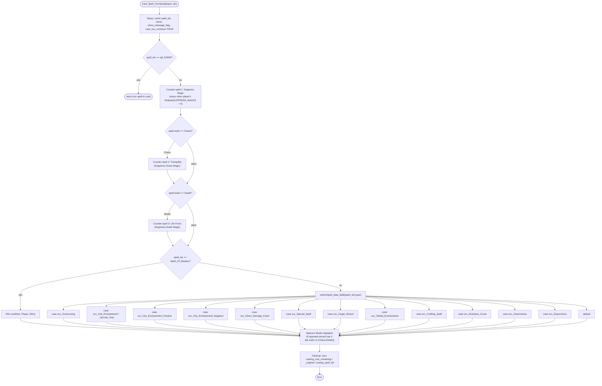

SETTLE-Cast_Spell_Overland.md

C:\STU\devel\STU-Extras\Piethawn\Piethawn\out\WIZARDS\ovr135\Cast_Spell_Overland.asm
C:\STU\devel\STU-Extras\Piethawn\Piethawn\out\WIZARDS\ovr135\Cast_Spell_Overland.c

Next_Turn_Proc()
|-> Next_Turn_Calc()
    |-> AI_Next_Turn()
         |-> Cast_Spell_Overland()

---

# `Cast_Spell_Overland` — Walkthrough

| Function | Location | Role |
|---|---|---|
| `Cast_Spell_Overland` | [OverSpel.c:627-1956](../../MoM/src/OverSpel.c#L627-L1956) (1330 lines) | Completes an in-progress overland spell cast: applies counter-spell checks (Suppress Magic / Tranquility / Life Force), then dispatches by spell-class to apply the spell's effect (summon a unit, enchant a city/unit, fire damage, raise/drop a global enchantment, etc.). |

## Purpose

Called once per (player, turn) when `_players[player_idx].casting_cost_remaining <= 0 && casting_spell_idx != spl_NONE` — i.e., the player has accumulated enough mana to finish casting whatever spell they queued. The function:

1. Runs the spell against any active counter-spell defenses (other wizards' Suppress Magic, Tranquility if Chaos, Life Force if Death) — each can fizzle the cast probabilistically.
2. If the cast survives the counter-spells, executes the spell's effect — which for the AI requires knowing the target (which the AI's target-picker subsystem in `AI_Spell_Select__STUB` and the `AITP_*` / `Pick_Target_For_*` helpers chose).
3. Sets `g_ai_recompute_needed` if the spell would invalidate the AI's hostility/target-value caches — caller (`AI_Next_Turn`) then re-runs `Allocate_AI_Data` + `Player_Hostile_Opponents` + `AI_Player_Calculate_Target_Values`.
4. Triggers Nature's Wrath retaliation against the caster if any opposing wizard has it active and the cast was Chaos- or Death-realm.

## How it's reached

Three real call sites; many comment-only cross-references.

| Caller | Site | Notes |
|---|---|---|
| `AI_Next_Turn` (AI per-turn) | [AIDUDES.c:264](../../MoM/src/AIDUDES.c#L264) | Inside per-AI-player loop, after war-landmass evaluation, when the AI's `casting_cost_remaining <= 0`. Wrapped in `PHASE()` for STU_LOG timing. |
| `Next_Turn_Proc` (human per-turn) | [NEXTTURN.c:406](../../MoM/src/NEXTTURN.c#L406) | Same trigger condition for the human player. |
| Spellbook screen — "Instant" cast | [SBookScr.c:611](../../MoM/src/SBookScr.c#L611) | When a human player picks a spell that completes immediately (rather than over multiple turns), this is the dispatch path. |

## Structure



## Code walk

### Phase 1 — Setup ([627-670](../../MoM/src/OverSpel.c#L627-L670))

```c
char spell_name[LEN_SPELL_NAME] = { 0, ... };
int16_t show_message_flag = 0;
int16_t cast_can_continue = 0;
int16_t spell_idx = 0;
/* ... */

show_message_flag = (player_idx == HUMAN_PLAYER_IDX) ? ST_TRUE : ST_FALSE;
cast_can_continue = ST_TRUE;
g_ai_recompute_needed = ST_FALSE;

spell_idx = _players[player_idx].casting_spell_idx;
if(spell_idx == spl_NONE) { return; }

stu_strcpy(spell_name, spell_data_table[spell_idx].name);
```

- `show_message_flag` gates UI feedback (only the human sees the cast-result notifications).
- `cast_can_continue` is the "is the cast still proceeding without failure?" continue/short-circuit gate. Optimistically TRUE; cleared to FALSE at the first blocker. Used across six concerns: counter-spell fizzles ([Phase 2](#phase-2--counter-spell-triad)), target-picker failures, human casting-screen cancels, inner-leaf cast failures, auto-counter resists, and the Nature's Wrath pre-pass gate.
- `g_ai_recompute_needed` is the **out-band signal** to `AI_Next_Turn` indicating "this spell changed AI-relevant state; please re-evaluate hostility/target-values."
- Early-bail if `spell_idx == spl_NONE` — defensive; caller's guard should already prevent this.

### Phase 2 — Counter-spell triad

Three counter-spells run in sequence. Each iterates every OTHER player; if that player has the counter-spell global enchantment active, roll a dispel attempt; if it succeeds, set `cast_can_continue = ST_FALSE` and short-circuit subsequent counter-spell checks (loops gate on `cast_can_continue == ST_TRUE`).

The dispel formula is `Random(250) <= (125000 / (500 + Calculate_Dispel_Difficulty(...)))` — equivalent to `Random(250) <= 250 * 500 / (500 + TSCC)` where TSCC is the target spell's casting cost + realm-adjusted difficulty.

#### Sub-phase 2a — Suppress Magic ([673-720](../../MoM/src/OverSpel.c#L673-L720))

```c
for(itr_players = 0; itr_players < _num_players && cast_can_continue == ST_TRUE; itr_players++)
{
    if((_players[itr_players].Globals[SUPPRESS_MAGIC] > 0) && (itr_players != player_idx))
    {
        threshold = 500 + Calculate_Dispel_Difficulty(...);
        threshold = 125000 / threshold;
        if(Random(250) <= threshold) {
            Fizzle_Notification(player_idx, itr_players, spell_idx, str_SuppressMagic);
            cast_can_continue = ST_FALSE;
        }
    }
}
```

Universal — every overland cast checks against Suppress Magic. drake178 quoted in the source comments: *"Tries to prevent, with a strength 500 dispelling force, all enemy overland spells and enchantments."*

#### Sub-phase 2b — Tranquility ([716-764](../../MoM/src/OverSpel.c#L716-L764))

Same shape as Suppress Magic but gated on `spell_data_table[spell_idx].magic_realm == sbr_Chaos`. Only chaos-realm spells run this check.

#### Sub-phase 2c — Life Force ([761-810](../../MoM/src/OverSpel.c#L761-L810))

Same shape, gated on `magic_realm == sbr_Death`. Only death-realm spells.

### Phase 3 — Spell-Of-Mastery short-circuit ([811](../../MoM/src/OverSpel.c#L811))

```c
if(spell_idx == spl_Spell_Of_Mastery)
{
    /* Win the game for this player */
}
```

The endgame "Spell of Mastery" wins the game for the caster; it short-circuits the main switch entirely.

### Phase 4 — Main `switch(spell_type)` ([816-1893](../../MoM/src/OverSpel.c#L816-L1893))

Dispatches by `spell_data_table[spell_idx].type` (an `scc_*` enum). Each case applies the spell's effect.

| Case | Lines | Role |
|---|---|---|
| `scc_Summoning` (0) | [819-886](../../MoM/src/OverSpel.c#L819-L886) | Summon a unit at the caster's Summoning Circle. Floating Island special-case. Capacity check `_units < 950`. |
| `scc_Unit_Enchantment` + `_Normal_Only` (1) | [888-1159](../../MoM/src/OverSpel.c#L888-L1159) | Apply a unit enchantment to the AI-picked target unit. Multiple per-spell special cases (Stone_Skin, Resist_Elements, Chaos_Channels, Immolation, Cloak_Of_Fear, True_Sight, Magic_Immunity, Planar_Travel, Invisibility, Wraith_Form, Wind_Walking, Regeneration, Black_Channels, Heroism). |
| `scc_City_Enchantment_Positive` (2) | [1161-1265](../../MoM/src/OverSpel.c#L1161-L1265) | Apply a positive city enchantment. Summoning_Circle special-case (the destination Tower coords matter). |
| `scc_City_Enchantment_Negative` (3) | [1267-1362](../../MoM/src/OverSpel.c#L1267-L1362) | Apply a negative city enchantment to an enemy city. |
| `scc_Direct_Damage_Fixed` (4) | [1364-1415](../../MoM/src/OverSpel.c#L1364-L1415) | Fire a fixed-strength damage spell. Human-only entry for some (per Spells129.c:169 cross-ref). |
| `scc_Special_Spell` (5) | [1417-1452](../../MoM/src/OverSpel.c#L1417-L1452) | Catch-all for special spells (Spell_Binding, Resurrection, Incarnation, Summon_Hero, etc.). 5× `OGBUG no return value` annotations — see B5-B9. Inner default at [1449](../../MoM/src/OverSpel.c#L1449) triggers `STU_DEBUG_BREAK()` — defensive. |
| `scc_Target_Wizard` (6) | [1454-1552](../../MoM/src/OverSpel.c#L1454-L1552) | Spells that target another wizard directly (Spell of Return, Banish, etc.). Inner default at [1511](../../MoM/src/OverSpel.c#L1511). |
| `scc_Global_Enchantment` (9) | [1554-1616](../../MoM/src/OverSpel.c#L1554-L1616) | Raise a global enchantment (Suppress Magic, Tranquility, Life Force, Just Cause, etc.). |
| `scc_Crafting_Spell` (11) | [1618-1645](../../MoM/src/OverSpel.c#L1618-L1645) | Item-crafting initiation (Create Artifact, Enchant Item). |
| `scc_Mundane_Curse` (16) | [1647-1651](../../MoM/src/OverSpel.c#L1647-L1651) | Curse spells against mundane targets. |
| `scc_Disenchants` (19) | [1653-1827](../../MoM/src/OverSpel.c#L1653-L1827) | Disenchant Area / True Sight / etc. |
| `scc_Disjunctions` (20) | [1829-1881](../../MoM/src/OverSpel.c#L1829-L1881) | Disjunction / Disjunction True. |
| `default` | [1883](../../MoM/src/OverSpel.c#L1883) | Fall-through — `STU_DEBUG_BREAK()` defensive. |

### Phase 5 — Nature's Wrath post-pass ([1906-1949](../../MoM/src/OverSpel.c#L1906-L1949))

After the main switch, scan every other player. If any has Nature's Wrath up AND the cast spell was Chaos- or Death-realm, set `g_ai_recompute_needed = ST_TRUE` and invoke the retaliation via `Call_Forth_The_Force_Of_Nature(player_idx)` ([line 1944](../../MoM/src/OverSpel.c#L1944)).

```c
for(itr_players = 0; itr_players < _num_players; itr_players++)
{
    if((_players[itr_players].Globals[NATURES_WRATH] > 0) && (itr_players != player_idx))
    {
        MultiPurpose_Local_Var = itr_players;
    }
}
if((MultiPurpose_Local_Var >= 0)
   && ((spell_data_table[spell_idx].magic_realm == sbr_Chaos)
       || (spell_data_table[spell_idx].magic_realm == sbr_Death)))
{
    g_ai_recompute_needed = ST_TRUE;
    Call_Forth_The_Force_Of_Nature(player_idx);
}
```

`MultiPurpose_Local_Var` records the LAST opposing wizard found with Nature's Wrath, not the first — multiple-defender behavior is "last writer wins" but only affects which wizard ID would be passed downstream (here it's only used as a `>= 0` presence flag).

### Phase 6 — Cleanup ([1952-1955](../../MoM/src/OverSpel.c#L1952-L1955))

```c
_players[player_idx].casting_cost_remaining = 0;
_players[player_idx].casting_cost_original = 0;
_players[player_idx].casting_spell_idx = 0;
```

Zero out the casting-progress fields so the caster is ready to start a new cast.

## Bug catalog

9 inline bug markers. Source uses a mix of `OGBUG`, `BUGBUG`, `¿ OGBUG`, and `¿ BUGBUG` to distinguish "OG-faithful preserved bug" from "still-uncertain or production-only concern."

| # | Line | Source comment | Category |
|---|---|---|---|
| B1 | [821](../../MoM/src/OverSpel.c#L821) | `¿ OGBUG should be ((player_idx == HUMAN_PLAYER_IDX) && (_units < 950)) ?` | Uncertain. Capacity-check should perhaps gate on human-player as well as unit-count. Needs OG asm verification before promoting to confirmed OGBUG. |
| B2 | [872](../../MoM/src/OverSpel.c#L872) | `/* HACK */ /* WASBUG */ Select_Stack_At_Unit((_units - 1));  /* OGBUG  missing parameter */` | Confirmed OGBUG — drake178 documented the OG calls `Select_Stack_At_Unit` without its required `unit_idx` parameter. Production routes around by passing `(_units - 1)`. Preserve. |
| B3 | [971](../../MoM/src/OverSpel.c#L971) | `BUGBUG:  bad definition of "Normal Unit"` | Definitional concern in `scc_Unit_Enchantment_Normal_Only` filter. Behavioral — affects which units this branch accepts. Needs verification. |
| B4 | [1101](../../MoM/src/OverSpel.c#L1101) | `¿ BUGBUG  should be NOT normal AND undead ?` | Uncertain boolean polarity in the Black_Channels branch. |
| B5 | [1435](../../MoM/src/OverSpel.c#L1435) | `Cast_Spell_Binding(player_idx);  /* OGBUG  no return_value  cast_can_continue = Cast_Spell_Binding(player_idx); */` | OGBUG — Spell_Binding leaf returns `void`. OG drops the fizzle-result, production preserves the drop. |
| B6 | [1441](../../MoM/src/OverSpel.c#L1441) | Same shape: Resurrection | OGBUG-faithful. |
| B7 | [1442](../../MoM/src/OverSpel.c#L1442) | Same shape: Incarnation | OGBUG-faithful. |
| B8 | [1447](../../MoM/src/OverSpel.c#L1447) | Same shape: Summon_Hero (hero) | OGBUG-faithful. |
| B9 | [1448](../../MoM/src/OverSpel.c#L1448) | Same shape: Summon_Champion | OGBUG-faithful. |

**Cluster verdict for B5-B9:** these five are all `OGBUG no return value` in the `scc_Special_Spell` branch. The OG drops the inner-cast success/fail because the leaf functions return `void`. Production preserves the drop faithfully. Fix would mean (a) changing the leaf signatures to return `int16_t` and (b) propagating up to `cast_can_continue` — both DIVERGE from OG. Defer unless you want behavior parity with a hypothetical fixed version.

**Cluster verdict for B1, B3, B4:** still-uncertain query markers. Each needs OG asm read-through to convert from `¿` question to verdict. Not blocking — these are flags-for-future, not active misbehavior.

**B2:** confirmed OG asm divergence (missing parameter on `Select_Stack_At_Unit`); production routes around with the deliberately-`(_units - 1)` argument. drake178's commentary chain is intact and accurate.

## Sub-functions / external calls

- **`Calculate_Dispel_Difficulty`** — used inside each counter-spell threshold computation. Returns `casting_cost_original + realm_adjustment`.
- **`Fizzle_Notification`** — UI/log emit when a counter-spell fizzles the cast.
- **`stu_strcpy`** — STU string utility.
- **`Cast_Spell_Binding` / `Cast_Resurrection` / `Cast_Incarnation` / `Cast_Summon_Hero` (×2 — hero vs champion)** — `void`-returning leaf cast functions for `scc_Special_Spell` branch (B5-B9 cluster).
- **`Select_Stack_At_Unit((_units - 1))`** at [line 872](../../MoM/src/OverSpel.c#L872) — B2 OGBUG workaround call.
- **`Random`** — RNG for counter-spell fizzle rolls.
- **`Player_Win`** — Spell of Mastery branch (Phase 3).
- **`Call_Forth_The_Force_Of_Nature`** ([Spells129.c:1831](../../MoM/src/Spells129.c#L1831)) — Nature's Wrath retaliation. Wired at [OverSpel.c:1944](../../MoM/src/OverSpel.c#L1944).

## Related references

- `C:\STU\devel\STU-Extras\Piethawn\Piethawn\out\WIZARDS\ovr135\Cast_Spell_Overland.asm` — IDA Pro 5.5 disassembly.
- [SBookScr.c:476 — `Cast_Spell_Overland_Do`](../../MoM/src/SBookScr.c#L476) — human-side completion path; same shape, different trigger.
- [AISPELL.c:300 — `AI_Spell_Select__STUB`](../../MoM/src/AISPELL.c#L300) — picks WHICH spell the AI will cast (next Wave 4 todo item).
- [AISPELL.c — `AITP_*` + `Pick_Target_For_*` cluster](../../MoM/src/AISPELL.c) — picks WHO/WHAT to cast on (Wave 4C/4D todo items).
- [doc/__TODO-AiTurn.md](../__TODO-AiTurn.md) — overall AI_Next_Turn done-done plan.
