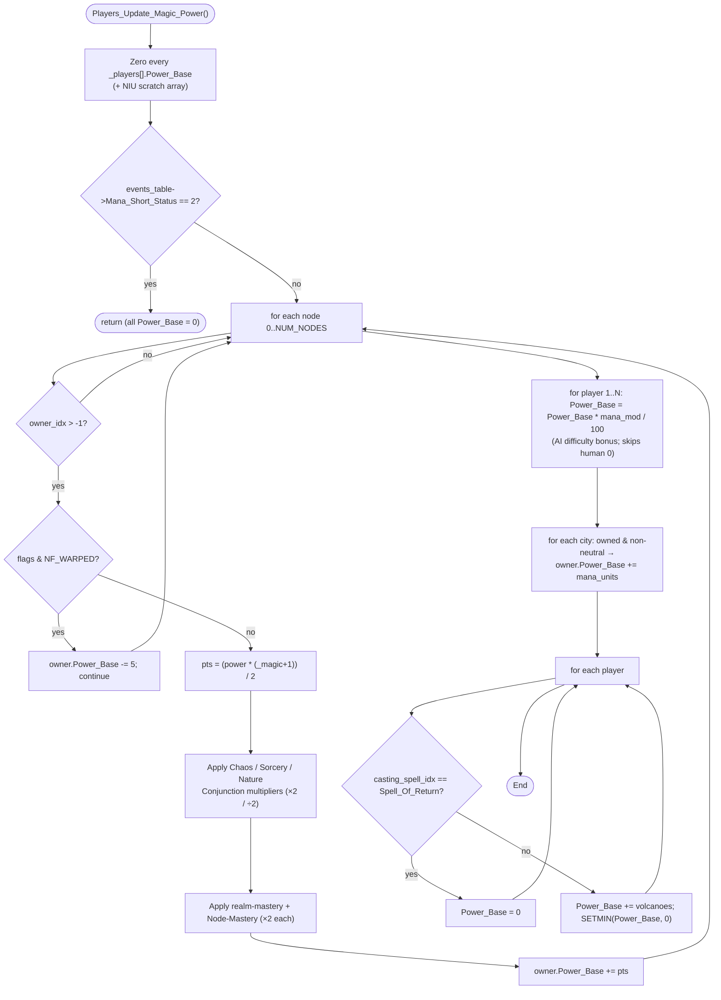

CITYCALC-Players_Update_Magic_Power.md

~ 'New Game' |-> 'Load Game'

NOTE: _players[].Power_Base is not set in the 'New Game' AoC, its first set is here in the 'Load Game' AoC - Loaded_Game_Update() |-> Init_Overland() |-> PreInit_Overland() |-> Players_Update_Magic_Power()

depends on
    ((_NODES[itr].power * (_magic + 1)) / 2)
    _CITIES[itr].mana_units
    _players[itr].volcanoes

Load_Screen
|-> Loaded_Game_Update()          [WZD ovr160]
    |-> Init_Overland()
        |-> PreInit_Overland()
            |-> Players_Update_Magic_Power()

---

# `Players_Update_Magic_Power` — Walkthrough

| Function | Location | Role |
|---|---|---|
| `Players_Update_Magic_Power` | [CITYCALC.c:116-238](../../MoM/src/CITYCALC.c#L116-L238) (WZD `ovr120` p02) | Recomputes every wizard's raw magic-power total (`_players[].Power_Base`) from scratch each turn: sums node output (with conjunction / realm-mastery multipliers), applies the per-difficulty AI mana bonus, adds city mana output and volcanoes, then applies the global Mana-Short and per-wizard Spell-of-Return overrides. |

> **Disassembly fidelity:** verified 1:1 against `ovr120` [Players_Update_Magic_Power.asm](../../../STU-Extras/Piethawn/Piethawn/out/WIZARDS/ovr120/Players_Update_Magic_Power.asm) — full structural pass (every branch, compare polarity, sign/zero extension, and operation order). All earlier-flagged deviations are resolved; see [Disassembly fidelity record](#disassembly-fidelity-record).

## Purpose

`Power_Base` is the un-allocated magic-power pool a wizard produces this turn — the input that `Players_Apply_Magic_Power` later splits into research / mana-reserve / casting-skill income. This function rebuilds `Power_Base` from the live world state. The contributors, in order of application:

1. **Nodes** — each owned node contributes `(power * (_magic + 1)) / 2`, doubled/halved by any active realm Conjunction event, doubled again per matching realm-mastery retort and again for Node Mastery. A *warped* node instead drains a flat `-5`.
2. **AI difficulty bonus** — every non-human wizard's node subtotal is scaled by `difficulty_modifiers_table[_difficulty].mana / 100`.
3. **Cities** — each owned (non-neutral) city adds its `mana_units`.
4. **Volcanoes** — each volcano the wizard created adds `+1`.
5. **Overrides** — a wizard mid-cast on Spell of Return produces `0`; otherwise the total is floored at `0`.

A global **Mana Short** conjunction (`Mana_Short_Status == 2`) short-circuits the whole thing: all `Power_Base` values are left at `0`.

## How it's reached

`Players_Update_Magic_Power` is called from several Areas-of-Concern. The 'Load Game' path is the **first** time `Power_Base` is set (it is *not* initialized in 'New Game'); thereafter it is recomputed each turn.

| Caller | Site | Notes |
|---|---|---|
| `PreInit_Overland` (Load Game) | [LoadScr.c:1026](../../MoM/src/LoadScr.c#L1026) | First-ever set of `_players[].Power_Base`, after `Do_City_Calculations` runs over every city. |
| `Next_Turn_Calc` (per-turn) | [NEXTTURN.c:690](../../MoM/src/NEXTTURN.c#L690) | Wrapped in `PHASE()`; immediately precedes `Players_Apply_Magic_Power` which consumes `Power_Base`. |
| Magic screen | [MagicScr.c:518](../../MoM/src/MagicScr.c#L518) | Recompute on the magic/power-distribution UI. |
| Spellbook | [Spellbook.c:694](../../MoM/src/Spellbook.c#L694) | Recompute after a spellbook action. |
| Spells128 | [Spells128.c:917](../../MoM/src/Spells128.c#L917) | Recompute after a spell effect that changes node/city ownership. |
| Wizard view | [WIZVIEW.c:189](../../MoM/src/WIZVIEW.c#L189) | Recompute for the wizard-status display. |

Comment-only cross-reference: [AIDUDES.c:573](../../MoM/src/AIDUDES.c#L573) (`AI_Power_Distrib` notes it depends on this function's output).

## Structure



## Code walk

### Phase 1 — Zero out + Mana-Short gate ([126-140](../../MoM/src/CITYCALC.c#L126-L140))

```c
for(itr = 0; itr < _num_players; itr++)
{
    _players[itr].Power_Base = 0;
    niu_players_power_base_array[itr] = 0;
}

if(events_table->Mana_Short_Status == 2)
{
    return;
}
```

- Every wizard's `Power_Base` is reset before recomputation — this function is fully idempotent / recompute-from-scratch.
- `niu_players_power_base_array` is written but never read — a vestigial scratch array (NIU = Not In Use). Preserved from the OG stack frame (it appears as `UU_players_power_base_array= word ptr -0Eh` in the [asm](../../../STU-Extras/Piethawn/Piethawn/out/WIZARDS/ovr120/Players_Update_Magic_Power.asm#L4)).
- **Mana Short** (`Mana_Short_Status == 2`, i.e. the conjunction is active) returns immediately, leaving all totals at `0`. No node/city/volcano power that turn.

### Phase 2 — Node power loop ([143-198](../../MoM/src/CITYCALC.c#L143-L198))

Iterates all `NUM_NODES` nodes; only owned nodes (`owner_idx > ST_UNDEFINED`) contribute (the OG's `cmp owner_idx,-1; jg body / jmp next` is mirrored by `if(owner_idx <= ST_UNDEFINED) continue;`).

```c
if((_NODES[itr].flags & NF_WARPED) > 0)
{
    _players[node_owner_idx].Power_Base -= 5;
    continue;
}

node_magic_power_points = ((_NODES[itr].power * (_magic + 1)) / 2);
```

- **Warped** nodes drain a flat `-5` from the owner and skip the rest (no base contribution).
- Base output scales with the world's magic-strength setting `_magic` via `(power * (_magic + 1)) / 2`.

**Conjunction multipliers** ([169-187](../../MoM/src/CITYCALC.c#L169-L187)) — when a realm Conjunction event is active (`Status == 2`), that realm's nodes double and the other two realms' nodes halve. Node realm is read from `_NODES[itr].type` using the `nt_` enum (`nt_Sorcery=0, nt_Nature=1, nt_Chaos=2`):

| Active conjunction | Sorcery node | Nature node | Chaos node |
|---|---|---|---|
| Chaos (`Conjunction_Chaos_Status`) | ÷2 | ÷2 | ×2 |
| Sorcery (`Conjunction_Sorcery_Status`) | ×2 | ÷2 | ÷2 |
| Nature (`Conjunction_Nature_Status`) | ÷2 | ×2 | ÷2 |

**Mastery multipliers** ([189-193](../../MoM/src/CITYCALC.c#L189-L193)) — matching realm-mastery retort doubles its realm's nodes; **Node Mastery** doubles *all* of the owner's nodes (and stacks on top of realm mastery). Each mastery is tested `> ST_FALSE` to mirror the OG's `cmp ...,ST_FALSE; jle` (signed `> 0`), not bare truthiness:

```c
if((_NODES[itr].type == nt_Sorcery) && (_players[node_owner_idx].sorcery_mastery > ST_FALSE)) { node_magic_power_points *= 2; }
if((_NODES[itr].type == nt_Chaos  ) && (_players[node_owner_idx].chaos_mastery   > ST_FALSE)) { node_magic_power_points *= 2; }
if((_NODES[itr].type == nt_Nature ) && (_players[node_owner_idx].nature_mastery  > ST_FALSE)) { node_magic_power_points *= 2; }
if(_players[node_owner_idx].node_mastery > ST_FALSE)                                          { node_magic_power_points *= 2; }

_players[node_owner_idx].Power_Base += node_magic_power_points;
```

### Phase 3 — AI difficulty bonus ([201-207](../../MoM/src/CITYCALC.c#L201-L207))

```c
for(itr = 1; itr < _num_players; itr++)
{
    _players[itr].Power_Base = ((_players[itr].Power_Base * (difficulty_modifiers_table[_difficulty].mana)) / 100);  // e.g., * 150 / 100 ~== * 1.5 ~== +50%
}
```

- Loop starts at `itr = 1` — the human player (index 0) is excluded; only AI wizards get the difficulty mana scaling.
- **Applied to the node subtotal only** — it runs before city mana and volcanoes are added, so those contributors are *not* difficulty-scaled.

### Phase 4 — City mana ([209-217](../../MoM/src/CITYCALC.c#L209-L217))

```c
if((_CITIES[itr].owner_idx > -1) && (_CITIES[itr].owner_idx != NEUTRAL_PLAYER_IDX))
{
    _players[_CITIES[itr].owner_idx].Power_Base += _CITIES[itr].mana_units;
}
```

Each owned, non-neutral city adds its already-computed `mana_units` (set earlier by `Do_City_Calculations` → `City_Mana_Production`). Neutral cities produce no wizard power.

### Phase 5 — Volcanoes + overrides ([220-234](../../MoM/src/CITYCALC.c#L220-L234))

```c
if(_players[itr].casting_spell_idx == spl_Spell_Of_Return)
{
    _players[itr].Power_Base = 0;
}
else
{
    _players[itr].Power_Base += _players[itr].volcanoes;
    SETMIN(_players[itr].Power_Base, 0);
}
```

- A wizard currently casting **Spell of Return** (banished, returning to the world) produces no power — `Power_Base` forced to `0`.
- Otherwise each volcano the wizard created adds `+1`, then the total is floored at `0`.
- **`SETMIN` clamps to a minimum.** `MOX_DEF.h` defines `SETMIN(a, b)` as `if ((b) > (a)) (a) = (b)` — it sets `a` to the larger of the two, guaranteeing `a >= b`. So `SETMIN(Power_Base, 0)` enforces a minimum of `0` (non-negative), exactly as the name says. (Relevant because a heavily-warped wizard's node drain can push the subtotal negative.)

## Disassembly fidelity record

Full structural pass against `ovr120` [Players_Update_Magic_Power.asm](../../../STU-Extras/Piethawn/Piethawn/out/WIZARDS/ovr120/Players_Update_Magic_Power.asm) — every branch, loop bound, compare polarity, sign/zero extension, and operation order matched to an instruction. **Control flow is 1:1.** The items below were investigated and are all **resolved**; they're recorded because each was a real reconstruction trap.

- **Node-type enum — root cause was a bad disassembly enum, not the C.** The OG `s_NODE.type` encoding is the `nt_` enum (`nt_Sorcery=0, nt_Nature=1, nt_Chaos=2`, [MOM_DAT.h:823-825](../../MoX/src/MOM_DAT.h#L823)). Production reads it with `nt_` here and writes it with `nt_` in `MAPGEN` ([MAPGEN.c:2333-2346](../../MoM/src/MAPGEN.c#L2333)) — reader and writer agree. The apparent `{Chaos=1, Sorcery=2, Nature=3}` reading (note the impossible `== 3`) seen in the exported Hex-Rays `.c` came from the disassembly's **combat**-node-type enum (`cnt_`) having Nature/Chaos swapped *and* being mis-applied to `s_NODE.type`. With the dasm enum corrected, production matches the OG 1:1. The exported Piethawn `.asm`/`.c` node-type immediates for this function were unreliable on this point — the live IDA Pro 5.5 reading is authoritative.

- **Mastery test polarity — matches the OG.** Each mastery is tested `> ST_FALSE` ([CITYCALC.c:189-193](../../MoM/src/CITYCALC.c#L189-L193)), mirroring the OG's `cmp ...,ST_FALSE; jle` (signed `> 0`). (Bare truthiness `!= 0` would have diverged on negative values.)

- **`mana_units` zero-extension — matches the OG.** `s_CITY.mana_units` is `uint8_t` ([MOM_DAT.h:1754](../../MoX/src/MOM_DAT.h#L1754)); the OG zero-extends it (`mov al,…; mov ah,0`). A signed `int8_t` would have sign-extended and diverged for values > 127.

- **`Power_Base` is signed — matches the OG.** The OG uses signed compares (`jg owner_idx,-1`; `jge` for the final `Power_Base >= 0` floor at [asm:409](../../../STU-Extras/Piethawn/Piethawn/out/WIZARDS/ovr120/Players_Update_Magic_Power.asm#L409)). The field is `int16_t Power_Base` ([MOM_DAT.h:1447](../../MoX/src/MOM_DAT.h#L1447)), so `SETMIN(Power_Base, 0)` fires correctly when warped-node `-= 5` drains push a subtotal below zero. (A `uint16_t` typing would have made that floor dead code.)

- **AI difficulty math — production matches the OG.** Production computes `(Power_Base * mana_mod) / 100` ([CITYCALC.c:206](../../MoM/src/CITYCALC.c#L206)). The disassembly ([asm:294-325](../../../STU-Extras/Piethawn/Piethawn/out/WIZARDS/ovr120/Players_Update_Magic_Power.asm#L294-L325)) confirms it: `100` is the `LDIV@` **divisor** and the `LXMUL@` operands are `Power_Base` and `mana_mod`, giving `(Power_Base * mana_mod) / 100`. Consistent with the same table in `Do_City_Calculations` ([CITYCALC.c:78](../../MoM/src/CITYCALC.c#L78)).

## Sub-functions / external calls

- **`difficulty_modifiers_table[_difficulty].mana`** — per-difficulty mana scaling percentage (e.g. `150` → +50% for AI). Same table drives `Do_City_Calculations`.
- **`events_table`** ([MOM_DAT.h:2236](../../MoX/src/MOM_DAT.h#L2236)) — global conjunction/event status block. `Mana_Short_Status`, `Conjunction_Chaos_Status`, `Conjunction_Sorcery_Status`, `Conjunction_Nature_Status`; `Status == 2` means the event is active.
- **`SETMIN`** ([MOX_DEF.h:90](../../MoX/src/MOX_DEF.h#L90)) — `if ((b) > (a)) (a) = (b)`; sets `a` to `max(a, b)`, clamping `a` to a minimum of `b`.
- **`_NODES[]` / `_CITIES[]` / `_players[]`** — node, city, and wizard tables.
- **`_magic`** — world magic-strength setting (drives node base output).

## Related references

- [NEXTTURN.c:2451 — `Players_Apply_Magic_Power`](../../MoM/src/NEXTTURN.c#L2451) — the immediate consumer: splits `Power_Base` into research / mana / skill income.
- [AIDUDES.c:560 — `AI_Power_Distrib`](../../MoM/src/AIDUDES.c#L560) — AI side that allocates the resulting power across wand/research/skill (OSG p.406).
- [CITYCALC.c:58 — `Do_City_Calculations`](../../MoM/src/CITYCALC.c#L58) — sets each city's `mana_units` (Phase 4 input) and uses the same difficulty mana modifier.
