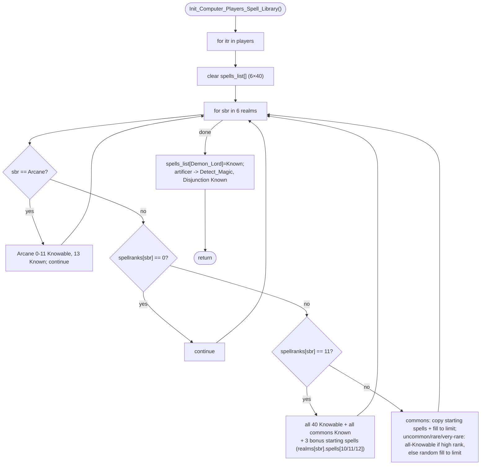

INITGAME-Init_Computer_Players_Spell_Library.md

C:\STU\devel\STU-Extras\Piethawn\Piethawn\out\MAGIC\ovr056\Init_Computer_Players_Spell_Library.asm
C:\STU\devel\STU-Extras\Piethawn\Piethawn\out\MAGIC\ovr056\Init_Computer_Players_Spell_Library.c

New_Game / Map setup
|-> Init_Computer_Players()                       [INITGAME.c:75]
    |-> Init_Computer_Players_Wizard_Profile()
    |-> Init_Computer_Players_Spell_Library()     [INITGAME.c:100]

NOTE:
does not set _players[].Power_Base, it gets set in the 'Load Game' AoC - Loaded_Game_Update() |-> Init_Overland() |-> PreInit_Overland() |-> Players_Update_Magic_Power()

---

# `Init_Computer_Players_Spell_Library` — Walkthrough

| Function | Location | Role |
|---|---|---|
| `Init_Computer_Players_Spell_Library` | [INITGAME.c:1334-1722](../../MoM/src/INITGAME.c#L1334-L1722) | For every player, builds the spell library: marks each realm's spells `Known` / `Knowable` / `Unknown` from the wizard's book count, copies the predefined starting spells, and grants the Arcane + artificer fixed spells. |

Verified faithful to the disassembly `Init_Computer_Players_Spell_Library.asm` throughout — including the start-spell realm indexing, which is plain identity `sbr` order (both jump tables `off_54663` / `off_54681` byte-verified; see below).

## Purpose

Runs once at new-game setup, after `Init_Computer_Players_Wizard_Profile` has set each wizard's `spellranks[]`. It fills `_players[itr].spells_list[]` — 6 realms × 40 spells (10 common / 10 uncommon / 10 rare / 10 very-rare), each byte `sls_Unknown (0)` / `sls_Knowable (1)` / `sls_Known (2)`. Per realm with books, it grants starting `Known` spells from `_player_start_spells` and marks a book-count-scaled number of the rest `Knowable`. Arcane is always partly researchable; Spell of Mastery, Demon Lord, and the artificer spells are fixed grants.

`spells_list` index for realm `sbr`, rarity slot position `p`: **`sbr*40 + rarity_base + p`** (rarity_base 0/10/20/30).

## How it's reached

| Caller | Site | Notes |
|---|---|---|
| `Init_Computer_Players` | [INITGAME.c:100](../../MoM/src/INITGAME.c#L100) | Second AI-setup step, after the wizard-profile pass. |
| `Init_Computer_Players` ← `Map`/new-game | [MAPGEN.c:288](../../MoM/src/MAPGEN.c#L288) | The only call site of `Init_Computer_Players`. |

## The `_player_start_spells` indexing convention

`_player_start_spells[itr]` is one `s_Init_Base_Realms` per player (`0x82` = 130 bytes = five 13-`int16_t` realm blocks). **The blocks are in plain `sbr` order** — `realms[sbr]` is the block for realm `sbr`:

| Realm | `sbr_*` = `realms[]` index | word base | byte offset |
|---|---|---|---|
| Nature  | 0 | 0  | `+0`   |
| Sorcery | 1 | 13 | `+1Ah` |
| Chaos   | 2 | 26 | `+34h` |
| Life    | 3 | 39 | `+4Eh` |
| Death   | 4 | 52 | `+68h` |

Each stored value is a 1-based global spell id; the realm-local slot is `(value - 1) % 40`, written at `spells_list[sbr*40 + (value-1) % 40]`. **The read (`realms[sbr]`) and the write (`spells_list[sbr*40 + …]`) use the same `sbr` index — no permutation.** The asm confirms it: the commons-copy dispatch `off_54663` and the rank-11 dispatch `off_54681` both route `sbr` → the block at byte `sbr*26` (identity). The data is *written* the same way — AI players in `Init_Computer_Players` ([INITGAME.c:90-94](../../MoM/src/INITGAME.c#L90-L94)), the human in `Newgame_Screen_5` — so writer and reader agree.

## Structure



## Code walk

Line refs are production [INITGAME.c](../../MoM/src/INITGAME.c); cross-checked against `Init_Computer_Players_Spell_Library.asm` (the authority). `Random(n)` returns `1..n` ([random.c:263](../../MoX/src/random.c#L263)).

### Clear ([1351-1357](../../MoM/src/INITGAME.c#L1351-L1357))

Zeroes all 6×40 `spells_list` entries for the player.

### Realm dispatch ([1359-1387](../../MoM/src/INITGAME.c#L1359-L1387))

`for sbr in 0..5`. Arcane ([1362-1379](../../MoM/src/INITGAME.c#L1362-L1379)) marks slots 0-11 `Knowable` and slot 13 (`spl_Spell_Of_Mastery`) `Known`, skips slot 12 (the `// WTF Why not 0x0C?` note, faithful to the asm), then `continue`. `spellranks==0` realms `continue` ([1381](../../MoM/src/INITGAME.c#L1381)). `spellranks==11` takes the max-book branch ([1646](../../MoM/src/INITGAME.c#L1646)); else the normal rank-1-10 branch.

### Normal branch — commons ([1387-1476](../../MoM/src/INITGAME.c#L1387-L1476))

1. Clear `Availability_Array` ([1390-1393](../../MoM/src/INITGAME.c#L1390-L1393)); common availability limit by book count (`1→3 … 6→9, 7-10→10`, [1395-1407](../../MoM/src/INITGAME.c#L1395-L1407)).
2. **Copy starting commons** ([1409-1457](../../MoM/src/INITGAME.c#L1409-L1457)): per `switch(sbr)` case, for the first `spellranks-1` entries, `spells_list[sbr*40 + (start_spell - 1) % 40] = Known`, where `start_spell = _player_start_spells[itr].realms[sbr_X].spells[itr2]` — same `sbr` index on both sides (see the convention above).
3. **Fill commons to the limit** ([1460-1476](../../MoM/src/INITGAME.c#L1460-L1476)): `Available_Spells = spellranks-1`; while under the limit, roll `Random(NUM_SPELLS_PER_MAGIC_RARITY)` ([1464](../../MoM/src/INITGAME.c#L1464)), mark an unknown common `Knowable`, and recount.

### Normal branch — uncommon / rare / very-rare ([1481-1642](../../MoM/src/INITGAME.c#L1481-L1642))

Each rarity: if the book count is high enough (`>7` uncommon [1484](../../MoM/src/INITGAME.c#L1484), `>9` rare [1539](../../MoM/src/INITGAME.c#L1539) / very-rare [1594](../../MoM/src/INITGAME.c#L1594)) mark all 10 `Knowable`; otherwise set a book-count-scaled limit and randomly fill that many **distinct** slots (fill rolls at [1514](../../MoM/src/INITGAME.c#L1514) / [1569](../../MoM/src/INITGAME.c#L1569) / [1624](../../MoM/src/INITGAME.c#L1624)) —

```c
while(IDK_itr_10 < Availability_Limit) {
    InRarity_Index = (Random(NUM_SPELLS_PER_MAGIC_RARITY) - 1);
    if(Availability_Array[InRarity_Index] != 1) { Availability_Array[InRarity_Index] = 1; IDK_itr_10++; }
}
```

— then copy the marked slots into `spells_list[sbr*40 + rarity_base + p]`. The `while` (advance only on a newly-filled slot) re-rolls collisions, matching the asm's `do { roll } while(slot set); set; idx++` — same distinct-fill count and same RNG consumption.

### Max-book branch (`spellranks == 11`) ([1646-1707](../../MoM/src/INITGAME.c#L1646-L1707))

All 40 realm spells `Knowable`, then per realm all 10 commons `Known`, then 3 bonus starting spells `Known` at `realms[sbr_X].spells[10/11/12]` (written `spells_list[sbr*40 + (value-1)%40]`). Same identity `sbr` indexing as the commons copy (asm dispatch `off_54681`).

### Fixed grants ([1711-1715](../../MoM/src/INITGAME.c#L1711-L1715))

`spells_list[spl_Demon_Lord] = Known`; if `artificer`, `spl_Detect_Magic` and `spl_Disjunction` `Known` (asm `[200]=2`, artificer `[206]=2`, `[210]=2`).

## Sub-functions / external calls

- **`Random`** ([random.c:263](../../MoX/src/random.c#L263)) — returns `1..n`.
- **`_players[]`**, **`_num_players`**, **`_player_start_spells`** — globals read/written.

## Related references

- `C:\STU\devel\STU-Extras\Piethawn\Piethawn\out\MAGIC\ovr056\Init_Computer_Players_Spell_Library.asm` — IDA Pro 5.5 disassembly (the authority; realm dispatch `off_54663` commons / `off_54681` rank-11, both identity `sbr`).
- [INITGAME.c:75 — `Init_Computer_Players`](../../MoM/src/INITGAME.c#L75) — caller; populates `_player_start_spells` for AI at [INITGAME.c:90-94](../../MoM/src/INITGAME.c#L90-L94).
- [INITGAME-Init_Computer_Players_Wizard_Profile.md](INITGAME-Init_Computer_Players_Wizard_Profile.md) — the preceding AI-setup step; populates the `spellranks[]` this function reads.
- [NEWGAME-Newgame_Screen_5.md](NEWGAME-Newgame_Screen_5.md) — writes the human's `_player_start_spells` in the same identity `sbr` order.
- `NewGame.h` — `s_Init_Base_Realms` / `s_Init_Base_Spells` (`_player_start_spells` layout); `MOM_DAT.h` — `e_SPELL_BOOK_REALM` (`sbr_*`).
