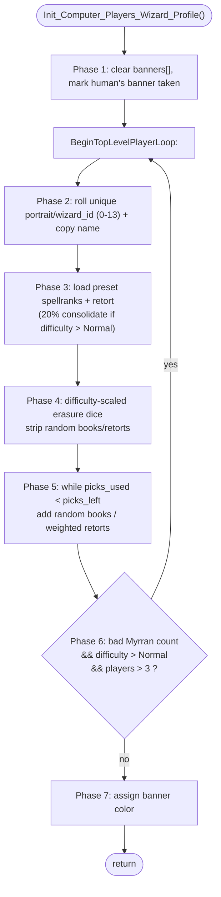

INITGAME-Init_Computer_Players_Wizard_Profile.md

C:\STU\devel\STU-Extras\Piethawn\Piethawn\out\MAGIC\ovr056\Init_Computer_Players_Wizard_Profile.asm
C:\STU\devel\STU-Extras\Piethawn\Piethawn\out\MAGIC\ovr056\Init_Computer_Players_Wizard_Profile.c

New_Game / Map setup
|-> Init_Computer_Players()            [INITGAME.c:73]
    |-> Init_Computer_Players_Wizard_Profile()   [INITGAME.c:754]
    |-> Init_Computer_Players_Spell_Library()

---

# `Init_Computer_Players_Wizard_Profile` — Walkthrough

| Function | Location | Role |
|---|---|---|
| `Init_Computer_Players_Wizard_Profile` | [INITGAME.c:754-1236](../../MoM/src/INITGAME.c#L754-L1236) | Rolls each AI wizard's identity and spellbook profile at new-game setup: a unique portrait/name, the preset realm book-counts and retort, a difficulty-scaled "erasure" pass that strips traits, a "spend remaining picks" allocation of extra books/retorts, a Myrran-distribution sanity retry, and finally a banner color. |
| `Init_Computer_Players_Wizard_Profile__GEMINI` | [INITGAME.c:1239-1546](../../MoM/src/INITGAME.c#L1239-L1546) (inside `#if 0`) | A reference IDA→C translation (identical to Piethawn's `*.c`), kept for comparison. Useful as a second opinion but **not** OG-truth — see [Notes vs `__GEMINI`](#notes-vs-__gemini). |

This reconstruction is verified faithful to the disassembly `Init_Computer_Players_Wizard_Profile.asm` throughout, carrying one deliberately-preserved original-game bug ([B1](#preserved-og-bug-b1)).

## Purpose

Called once during new-game initialization, after the wizard preset table exists and before the AI spell libraries are built. For every AI player (index `1 .. _num_players-1`; index 0 is the human, skipped) it:

1. Picks a unique random portrait/`wizard_id` (0-13) and copies the matching preset name.
2. Loads the preset realm book counts (`spellranks[]`) and the preset retort, with a difficulty-gated 20% chance to consolidate a two-realm wizard into one realm.
3. Runs a difficulty-scaled **erasure** pass that randomly removes books/retorts (more dice at higher difficulty).
4. **Spends remaining picks**: while the wizard is under its pick budget (11 Normal / 13 Hard / 15 Impossible), randomly add books to a realm or grant a retort, weighting realm-mastery/power retorts toward realms the wizard actually has.
5. Counts Myrran wizards; on high difficulty with a bad spread, **regenerates every profile** from the top.
6. Assigns a banner color, preferring the color of the first realm the wizard has ≥4 books in, else a random free color.

## How it's reached

| Caller | Site | Notes |
|---|---|---|
| `Init_Computer_Players` | [INITGAME.c:78](../../MoM/src/INITGAME.c#L78) | First statement of AI setup. |
| `Init_Computer_Players` ← `Map`/new-game | [MAPGEN.c:288](../../MoM/src/MAPGEN.c#L288) | The only call site of `Init_Computer_Players`. |

## Structure



## Code walk

Line refs are production [INITGAME.c](../../MoM/src/INITGAME.c). Phase numbers follow the in-source `/* Phase N */` comments (the banner phase is marked `/* Phase ? */`; it's "Phase 7" here). Each phase is cross-checked against the IDA disassembly `Init_Computer_Players_Wizard_Profile.asm`, which is the authority.

> **RNG note.** ReMoM's `Random(n)` returns **`1..n`** (`(result % n) + 1`, [random.c:263](../../MoX/src/random.c#L263)) — identical to OG. Every `-1`/`+1` the asm applies to a `Random()` result is load-bearing.

### Phase 1 — Banner reset ([776-781](../../MoM/src/INITGAME.c#L776-L781))

`banners[]` is cleared and the human player's banner is marked taken so no AI steals it. This runs once; it is *outside* the retry loop.

### `BeginTopLevelPlayerLoop:` ([784](../../MoM/src/INITGAME.c#L784))

The retry label, placed exactly where the asm's `@@BeginTopLevelPlayerLoop` sits — **after** the banner setup, **before** the portrait loop. Phase 6 jumps back here. Because nothing between this label and Phase 6 mutates `banners[]`, the array stays `{human marked}` across retries, so it correctly does not need re-clearing.

### Phase 2 — Unique portrait + name ([787-806](../../MoM/src/INITGAME.c#L787-L806))

Per AI: `do { Random_Result = Random(14) - 1; scan earlier players for a clash } while(Portrait_Taken != ST_FALSE);` — reroll until unique (range 0-13), then assign and copy the preset name. The loop condition `!= ST_FALSE` matches the asm exit `cmp Portrait_Taken, e_ST_TRUE / jnz` (loop while taken).

### Phase 3 — Presets ([809-834](../../MoM/src/INITGAME.c#L809-L834))

Loads `spellranks[]` (Life→+6, Death→+8, Chaos→+4, Nature→+0, Sorcery→+2 — `sbr_*` order), rolls `Random(5)==1 && _difficulty > god_Normal` to `Consolidate_Spell_Book_Realms`, clears all `NUM_WIZARD_SPECIAL_ABILITIES` retort flags, and sets the preset retort if `special != ST_UNDEFINED`. On a retry this fully overwrites `spellranks[]` and re-clears the retorts, so nothing accumulates across passes.

### Phase 4 — Erasure pass ([837-871](../../MoM/src/INITGAME.c#L837-L871))

`Erasure_Dice` by difficulty: `0 / 0 / Random(3) / Random(3)+Random(3) / Random(5)+Random(5) / Random(8)+Random(8)`. Per die, `Trait_Type = Random(6)`; cases 1-5 decrement a realm (if `> 1`); case 6 wipes retorts via the preserved [B1](#preserved-og-bug-b1).

### Phase 5 — Spend remaining picks ([874-1154](../../MoM/src/INITGAME.c#L874-L1154))

`Picks_Used` = sum of 5 `spellranks` + retort costs (Myrran +3; Warlord/Infernal/Divine/Famous/Channeller +2; else +1). `Picks_Left` = 11 / 13 (Hard) / 15 (Impossible). Then `while(Picks_Used < Picks_Left)`:

```c
Trait_Type  = Random(8);
Trait_Value = (1 + Random(4));
/* clamp Trait_Value vs (Picks_Left-Picks_Used) and vs (12-Book_Count);
   if Trait_Value <= 0 -> Trait_Type = 6; if Trait_Type == 6 -> Trait_Value = 1 */
switch(Trait_Type) { 1..5: add books to a realm; 6/7/8: grant a retort }
/* recompute Picks_Used + retort costs at the bottom of the body */
```

The retort path (cases 6/7/8, [1026-1104](../../MoM/src/INITGAME.c#L1026-L1104)) rolls `Random(NUM_WIZARD_SPECIAL_ABILITIES) - 1` (0-17). For a roll in `[wsa_Chaos_Mastery .. wsa_Divine_Power]` (2-6) it builds a `Bookshelf[]` of the wizard's realm books, zeroes realms it already masters and (per `divine_power`/`infernal_power` and the pick budget) Life/Death, then `Get_Weighted_Choice` picks a realm and maps it to the corresponding mastery/power retort. Otherwise it grants the rolled retort directly, gated by the pick budget for Warlord/Channeller/Famous (`Picks_Left-1 > Picks_Used`) and Myrran (`Picks_Left-2 > Picks_Used`), unconditionally for the rest.

**Loop shape note.** The asm computes `Picks_Used` at entry, jumps to a single test (`loc_5387B`), and recomputes at the end of the body — i.e. a `while` with a bottom-of-body recompute and `Picks_Used` computed in two physically separate places. This reconstruction mirrors that exactly, including the duplicated compute block. (GEMINI folds it into one top-of-loop `do/while`+`break`; behaviorally equal, but not a 1:1 of the binary — see [Notes vs `__GEMINI`](#notes-vs-__gemini).)

### Phase 6 — Myrran rebalance retry ([1157-1176](../../MoM/src/INITGAME.c#L1157-L1176))

Counts wizards with the Myrran retort (`_players[itr1].myrran`). If `(myrran_count < 1 || myrran_count > 2) && (_difficulty > god_Normal && _num_players > 3)`, `goto BeginTopLevelPlayerLoop` to regenerate every profile. The loop relies on the RNG eventually producing 1-2 Myrrans on Hard+/4+ players — the same convergence the OG relied on.

The two `_wizard_presets_table[7]` (Sss'ra) writes are kept as comments: in the OG they sit *after* the unconditional jump and are unreachable dead code, so they are preserved for reference only.

### Phase 7 — Banner assignment ([1184-1232](../../MoM/src/INITGAME.c#L1184-L1232))

An `else if` chain on `(realm_books > 3) && (color free)` — Nature→Green, Chaos→Red, Sorcery→Blue, Death→Purple — falling through to the next realm when the preferred color is taken, then a `do { Random(5)-1 } while(taken)` that picks a free color and claims it (`banners[] = ST_TRUE`, set `banner_id`). The compound conditions give the asm's fall-through (both the realm test and the color-taken test branch to the next realm).

## Preserved OG bug (B1)

| Line | Source | Verdict |
|---|---|---|
| [865-866](../../MoM/src/INITGAME.c#L865-L866) | `/* OGBUG  should use itr3, not itr1 */`  `wsa_ptr[itr1] = ST_FALSE;` | **OGBUG, faithful.** In the erasure "wipe retorts" case the inner loop runs over `itr3` but writes `wsa_ptr[itr1]` (the erasure-die index), so it clears one slot repeatedly instead of all retorts. The asm does exactly this (`loc_53381: add bx, itr1`). Preserved per the no-fixing-OG-bugs rule. |

## Notes vs `__GEMINI`

The `#if 0` `__GEMINI` block (and the identical Piethawn `*.c`) is a raw IDA→C translation. It models control flow well but guessed several symbols and idioms; where it disagrees with this reconstruction, the disassembly was the tiebreaker. Enduring divergences worth knowing if you re-derive from it:

- **Erasure wipe index (B1).** GEMINI "corrects" `wsa_ptr[itr1]` to `wsa_ptr[k]`. The asm uses the `itr1` index — so GEMINI silently removes a real OGBUG. This reconstruction preserves it.
- **Myrran-count field.** GEMINI counts `_players[j].alchemy` (the *first* retort slot, `wsa_Alchemy = 0`) and mislabels it `/* wsa_Myrran */`. The asm checks `_players.myrran`; this reconstruction uses the correct field.
- **Enum guesses.** GEMINI annotates literals like `wsa_Myrran = 10`, `wsa_Chaos_Mastery = 4`, `wsa_Divine_Power = 14`. The real values (`NewGame.h`) are 9 / 2 / 6; the retort-mastery range is `[2,6]`, not GEMINI's `[4,14]`.
- **Loop idiom.** GEMINI rewrites Phase 5 as a single-compute `do/while`+`break`; the binary computes `Picks_Used` twice (entry + bottom-of-body) and tests once. This reconstruction keeps the two-compute shape, which is where transcription has to be checked byte-for-byte.
- **Retry label placement.** GEMINI puts `BeginTopLevelPlayerLoop:` *before* the banner clear; the asm label is *after* it. Harmless (banners aren't touched before the retry point) but not a 1:1 of the label.

## Sub-functions / external calls

- **`Random`** ([random.c:263](../../MoX/src/random.c#L263)) — 9-bit LFSR, returns `1..n`.
- **`Consolidate_Spell_Book_Realms`** ([INITGAME.c:2346](../../MoM/src/INITGAME.c#L2346)) — 20% two-realm→one-realm merge (Phase 3).
- **`Get_Weighted_Choice`** ([AIBUILD.c](../../MoM/src/AIBUILD.c)) — weighted index pick over `Bookshelf[]` (Phase 5 retort path).
- **`stu_strcpy`** — preset name copy (Phase 2).
- **`_wizard_presets_table`**, **`_players[]`**, **`_num_players`**, **`_difficulty`** — globals read/written.

## Related references

- `C:\STU\devel\STU-Extras\Piethawn\Piethawn\out\MAGIC\ovr056\Init_Computer_Players_Wizard_Profile.asm` — IDA Pro 5.5 disassembly (the authority).
- [INITGAME.c:1239-1546](../../MoM/src/INITGAME.c#L1239-L1546) — `__GEMINI` reference translation (`#if 0`).
- [INITGAME.c:73 — `Init_Computer_Players`](../../MoM/src/INITGAME.c#L73) — caller.
- [INITGAME.c:1608 — `Init_Computer_Players_Spell_Library`](../../MoM/src/INITGAME.c#L1608) — the next AI-setup step (sibling function).
- `doc/ComputerPlayer/SETTLE-Cast_Spell_Overland.md` — walkthrough template this doc follows.
