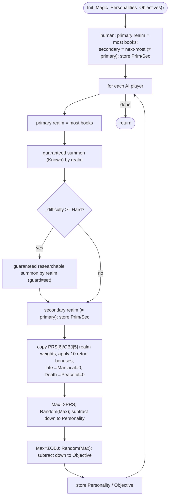

INITGAME-Init_Magic_Personalities_Objectives.md

C:\STU\devel\STU-Extras\Piethawn\Piethawn\out\MAGIC\ovr056\Init_Magic_Personalities_Objectives.asm
C:\STU\devel\STU-Extras\Piethawn\Piethawn\out\MAGIC\ovr056\Init_Magic_Personalities_Objectives.c

New_Game / Map setup
|-> Init_Runtime()                            [INITGAME.c:146]
    |-> Init_Magic_Personalities_Objectives() [INITGAME.c:157]

---

# `Init_Magic_Personalities_Objectives` — Walkthrough

| Function | Location | Role |
|---|---|---|
| `Init_Magic_Personalities_Objectives` | [INITGAME.c:369-640](../../MoM/src/INITGAME.c#L369-L640) | Sets every player's primary/secondary realm; for each **AI** player grants a guaranteed starting summon (+ a guaranteed researchable summon on Hard/Impossible), then weighted-random-rolls a **personality** and an **objective** from realm + retort weights. |

Verified faithful to the disassembly `Init_Magic_Personalities_Objectives.asm` throughout — structure, the two jump-table switches, the weight math, and the `Random()` sequence (2 rolls per AI player) all 1:1. Carries two preserved OG bugs (B1/B2). Compiles clean (`cmake --build --preset MSVC-debug`).

## Purpose

Runs once during `Init_Runtime`, after players exist and spellranks are set. For player 0 (human) it only records primary/secondary realm. For each AI player it additionally seeds spell-library entries and rolls Personality + Objective.

`Random(n)` returns `1..n` ([random.c:263](../../MoX/src/random.c#L263)). Two rolls per AI player: one for personality, one for objective (the trace's `rng_call 44541→44549` = 8 rolls for 4 AI players).

## How it's reached

| Caller | Site | Notes |
|---|---|---|
| `Init_Runtime` | [INITGAME.c:157](../../MoM/src/INITGAME.c#L157) | Sixth step of runtime init, after `Init_CP_Strategy`, before `Init_Summoning_Circle_And_Spell_Of_Mastery`. |

## Realm / enum constants

- `sbr_*` (realm = `spellranks[]` index): Nature 0, Sorcery 1, Chaos 2, Life 3, Death 4. `NUM_MAGIC_TYPES = 5`.
- `AI_PRS_*` (personality, index into `AI_PRS_Weights[6]`): Maniacal 0, Ruthless 1, Aggressive 2, Chaotic 3, Lawful 4, Peaceful 5.
- `AI_OBJ_*` (objective, index into `AI_OBJ_Weights[6]`, only 0–4 valid): Pragmatist 0, Militarist 1, Theurgist 2, Perfectionist 3, Expansionist 4.
- `TBL_AI_Realm_PRS[6][6]` / `TBL_AI_Realm_OBJ[6][5]` ([NewGame.c:238-253](../../MoM/src/NewGame.c#L238-L253)) — per-realm base weights (asm names `TBL_AI_Realm_PER` / `TBL_AI_Realm_OBJ`); the second dimension (6 / 5) is the per-realm weight count.

## Structure

## Code walk

Line refs are production [INITGAME.c](../../MoM/src/INITGAME.c); cross-checked against `Init_Magic_Personalities_Objectives.asm` (the authority). Spell offsets in the asm are `spell_id − 1`; both spell switches go through jump tables that reorder the case bodies, so code-order ≠ `sbr`-order — the realm→spell mapping was verified by the constant values, not by case order.

### Human realm ([387-415](../../MoM/src/INITGAME.c#L387-L415))

Primary = realm with the most books (scan `spellranks[1..4]` vs `[0]`). Secondary = next-most, **excluding the primary** (`if(itr != Primary_Realm)` — asm `loc_527DB` `cmp Primary_Realm,SI; jz skip`). Fallback `if(spellranks[Secondary]==0) Secondary = Primary` (see [B2](#og-quirks-preserved)). Store `Prim_Realm`/`Sec_Realm`. **Faithful.**

### AI loop ([420-636](../../MoM/src/INITGAME.c#L420-L636)) — per `itr_players` 1..`_num_players-1`

1. **Primary realm** ([422-432](../../MoM/src/INITGAME.c#L422-L432)) — same scan (no exclusion; this is the primary). **Faithful.**
2. **Guaranteed summon** ([434-456](../../MoM/src/INITGAME.c#L434-L456)) — `switch(Primary_Realm)` → `spells_list[summon] = 2` (Known): Nature→`spl_Sprites`(9), Sorcery→`spl_Nagas`(49), Chaos→`spl_Hell_Hounds`(84), Life→`spl_Guardian_Spirit`(129), Death→`spl_Ghouls`(166). Matches the asm offset set `{8,48,83,128,165}` (= id−1). **Faithful.**
3. **Hard+ guaranteed researchable** ([458-498](../../MoM/src/INITGAME.c#L458-L498)) — when `_difficulty >= god_Hard`, `switch(Primary_Realm)`: if a *guard* spell is unknown, set a summon researchable. Per realm (guard / set): Nature `spl_Basilisk`(20) / `spl_Basilisk`(20); Sorcery `spl_Basilisk`(20) / `spl_Phantom_Beast`(60); Chaos `spl_Basilisk`(20) / `spl_Chimeras`(100); Life `spl_Path_Finding`(16) (asm `+0Fh`) / `spl_Unicorns`(136); Death `spl_Basilisk`(20) / `spl_Shadow_Demons`(180). **Faithful — including the OG guard≠set quirk ([B1](#og-quirks-preserved)).**
4. **Secondary realm** ([500-521](../../MoM/src/INITGAME.c#L500-L521)) — scan excluding the primary, fallback, store `Prim_Realm`/`Sec_Realm`. **Faithful.**
5. **Weights** ([523-602](../../MoM/src/INITGAME.c#L523-L602)) — copy `TBL_AI_Realm_PRS[Primary][0..5]` → `AI_PRS_Weights` and `TBL_AI_Realm_OBJ[Primary][0..4]` → `AI_OBJ_Weights`; apply the 10 retort bonuses (warlord, chaos_mastery, nature_mastery, infernal_power, divine_power, channeler → PRS; alchemy, archmage, myrran, conjurer → OBJ; warlord also adds two OBJ) in asm order; then `Life→AI_PRS_Weights[Maniacal]=0`, `Death→AI_PRS_Weights[Peaceful]=0`. **Faithful.**
6. **Personality roll** ([604-616](../../MoM/src/INITGAME.c#L604-L616)) — `Max_Value = Σ AI_PRS_Weights[0..5]`; `Random(Max_Value)`; subtract `AI_PRS_Weights[0]` then walk `Picked_Personality` 1→5 subtracting `AI_PRS_Weights[Picked_Personality]` until `Random_Result <= 0`. **Faithful** (asm `loc_52B7F`/`loc_52BA9`).
7. **Objective roll** ([618-630](../../MoM/src/INITGAME.c#L618-L630)) — `Max_Value = Σ AI_OBJ_Weights[0..4]`; `Random(Max_Value)`; subtract `AI_OBJ_Weights[0]` (`AI_OBJ_PRAGMATIST`) then walk `Picked_Objective` 1→4 subtracting `AI_OBJ_Weights[Picked_Objective]`. **Faithful** (asm `loc_52BD0`/`loc_52BFA`).
8. Store `Personality`/`Objective` ([632-634](../../MoM/src/INITGAME.c#L632-L634)). **Faithful.**

## OG quirks preserved

| # | Line(s) | What |
|---|---|---|
| B1 | [458-498](../../MoM/src/INITGAME.c#L458-L498) | Hard+ researchable grant: the *guard* spell differs from the *granted* spell in four cases (Sorcery/Chaos/Death guard `spl_Basilisk` but grant a different summon; Life guards the unrelated `spl_Path_Finding`). Faithful to the asm. Because the body is `if(guard==0) set=1` (unconditional set), an AI that already **knows** the granted summon has it downgraded to merely researchable — drake178's "will also remove those spells" note. |
| B2 | [410-413](../../MoM/src/INITGAME.c#L410-L413) (human), [514-517](../../MoM/src/INITGAME.c#L514-L517) (AI) | `Secondary_Realm` inits to 0 (Nature) and the exclusion scan starts at `itr = 1`, so a wizard whose **primary is Nature** never finds a higher non-Nature realm and ends with Nature as secondary too — drake178: "2+ realm wizards with Nature as the primary will also always set that as the secondary." Faithful to the asm. |

## Sub-functions / external calls

- **`Random`** ([random.c:263](../../MoX/src/random.c#L263)) — returns `1..n`; two calls per AI player.
- Globals: **`_players[]`** (`spellranks`, `Prim_Realm`, `Sec_Realm`, `Personality`, `Objective`, `spells_list`, the retort flags), **`_num_players`**, **`_difficulty`**, **`TBL_AI_Realm_PRS`**, **`TBL_AI_Realm_OBJ`**.

## Related references

- `C:\STU\devel\STU-Extras\Piethawn\Piethawn\out\MAGIC\ovr056\Init_Magic_Personalities_Objectives.asm` — IDA Pro 5.5 disassembly (the authority; jump tables `off_52C43` summon / `off_52C39` researchable; Random sites `loc_52B7F`+`loc_52BD0`).
- [INITGAME.c:157](../../MoM/src/INITGAME.c#L157) — call site (`Init_Runtime`).
- [NewGame.c:205-253](../../MoM/src/NewGame.c#L205-L253) — `TBL_AI_Realm_PRS`/`TBL_AI_Realm_OBJ` data + the `AI_PERS_Modifiers`/`AI_OBJ_Modifiers` struct field order.
- `NewGame.h` — `AI_PRS_*` / `AI_OBJ_*` defines; `MOX_DEF.h` — `NUM_MAGIC_TYPES` (5); `Spellbook.h` — `spl_*` ids.
