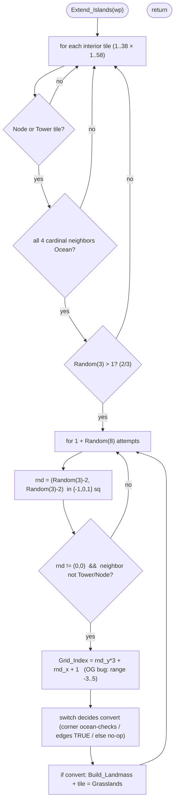

MAPGEN-Extend_Islands.md

C:\STU\devel\STU-Extras\Piethawn\Piethawn\out\MAGIC\ovr051\Extend_Islands.asm
C:\STU\devel\STU-Extras\Piethawn\Piethawn\out\MAGIC\ovr051\Extend_Islands.c

Init_New_Game()
    |-> ... Generate_Nodes / Rebalance_Node_Types ...
    |-> Extend_Islands(ARCANUS_PLANE);   [MAPGEN.c:342]
    |-> Extend_Islands(MYRROR_PLANE);    [MAPGEN.c:343]

---

# `Extend_Islands` — Walkthrough

| Function | Location | Role |
|---|---|---|
| `Extend_Islands` | [MAPGEN.c:471-638](../../MoM/src/MAPGEN.c#L471-L638) | Grows a little land around each magic Node / Tower that sits alone in open Ocean, so those features aren't stranded on a single tile. |
| `Extend_Islands__GEMINI` | [MAPGEN.c:641-784](../../MoM/src/MAPGEN.c#L641-L784) (inside `#if 0`) | Reference IDA→C translation (= Piethawn `*.c`). Matches the asm; kept for cross-reference. Not OG-truth. |

Verified faithful to the disassembly `Extend_Islands.asm` throughout (structure and RNG sequence 1:1), carrying one deliberately-preserved OG bug in the `Grid_Index` formula (see below).

## Purpose

Called once per plane (after the nodes are placed/rebalanced). It scans every interior tile; for any tile that is a **Node** (`tt_SorceryNode`/`tt_NatureNode`/`tt_ChaosNode`) or a **Tower**, and whose four cardinal neighbors are all Ocean (a 1-tile island), it rolls a 2⁄3 chance to make `1 + Random(8)` attempts to convert one random adjacent Ocean tile to `tt_Grasslands1` (calling `Build_Landmass` on it).

## How it's reached

| Caller | Site | Notes |
|---|---|---|
| `Init_New_Game` / MAPGEN | [MAPGEN.c:342-343](../../MoM/src/MAPGEN.c#L342-L343) | Once for `ARCANUS_PLANE`, once for `MYRROR_PLANE`. |

## Structure



## Code walk

Line refs are production [MAPGEN.c](../../MoM/src/MAPGEN.c); cross-checked against `Extend_Islands.asm` (the authority). `Random(n)` returns `1..n` ([random.c:263](../../MoX/src/random.c#L263)).

### Scan + feature/ocean gate ([487-522](../../MoM/src/MAPGEN.c#L487-L522))

Loop the interior (`itr_wy` 1..`WORLD_HEIGHT-1`, `itr_wx` 1..`WORLD_WIDTH-1` = 1..38 × 1..58). For each tile: scan the `NUM_TOWERS` (6) towers to set `square_has_tower`, then require the tile be a Node or a Tower **and** all four cardinal neighbors Ocean (`Square_Is_Ocean_NewGame` for N/W/E/S, short-circuited). **Faithful.**

### Conversion attempts ([524-630](../../MoM/src/MAPGEN.c#L524-L630))

```c
if(Random(3) > 1) {                          // 2/3 gate (asm: cmp ax,1; jg)
    attempts = (1 + Random(8));              // 2..9 attempts
    for(itr = 0; itr < attempts; itr++) {
        rnd_wx = (Random(3) - 2);            // {-1,0,1}
        rnd_wy = (Random(3) - 2);            // {-1,0,1}
        if(rnd_wx != 0 || rnd_wy != 0) {     // skip the center
            if(neighbor not Tower && not Node) {
                Grid_Index = ((rnd_wy * 3) + rnd_wx + 1);   // OG BUG: see below
                convert = ST_FALSE;
                switch(Grid_Index) { ... }
                if(convert == ST_TRUE) { Build_Landmass(...); tile = tt_Grasslands1; }
            }
        }
    }
}
```

The RNG sequence is **1:1** with the asm — one `Random(3)` gate, one `Random(8)` for the attempt count, then two `Random(3)` per attempt — which matters for stream parity.

### The `switch` ([551-622](../../MoM/src/MAPGEN.c#L551-L622))

Production switches on `Grid_Index` directly (cases 0-9); the asm dispatches via `jump_table[Grid_Index - 1]` guarded by an **unsigned** `cmp (Grid_Index-1), 8; jbe` — these are equivalent (case `N` ⇔ jump-table index `N-1`), and negative `Grid_Index` falls through to no conversion in both. The case logic (verified against the asm for the reachable cases): edge cells (2/4/6/8) → `convert = TRUE`; corner cells (1/3/7/9) → `TRUE` unless converting would leave a diagonal-only land bridge (both relevant orthogonal neighbors Ocean → `FALSE`); cell 5 → `FALSE`.

## OG bug preserved — the `Grid_Index` formula

A proper 3×3 mapping of `rnd in {-1,0,1}^2` to 1..9 needs `(rnd_y+1)*3 + (rnd_x+1) + 1`. The OG instead computes **`rnd_y*3 + rnd_x + 1`**, whose range is **-3..5, not 1..9** (drake189's note). Production preserves it ([544](../../MoM/src/MAPGEN.c#L544)). The consequence — which neighbor each `rnd` actually lands on, and whether it converts:

| neighbor | `(rnd_x,rnd_y)` | actual `Grid_Index` | outcome |
|---|---|---|---|
| NW / N / NE | `(-1,-1)/(0,-1)/(1,-1)` | -3 / -2 / -1 | **skipped** (negative → no case) — never extends north |
| W | `(-1,0)` | 0 | no case → never |
| E | `(1,0)` | 2 | case 2 → **convert** (always) |
| SW | `(-1,1)` | 3 | case 3 → convert unless S+W both Ocean |
| S | `(0,1)` | 4 | case 4 → **convert** (always) |
| SE | `(1,1)` | 5 | case 5 → never |

So islands effectively only grow toward **E, S, and (conditionally) SW** — a strong south-east bias — and switch cases **1, 6, 7, 8, 9 are dead code** (no valid `rnd` ever produces those `Grid_Index` values). This is OG-faithful; preserve it. The `case 5` comment "can't convert current square" reflects the *intended* (1..9) mapping where 5 is the center — under the bug, `Grid_Index 5` is actually the SE neighbor.

## Notes vs `__GEMINI`

The `__GEMINI` translation matches the asm — same scan, the `Random(3)`/`Random(8)+1`/`Random(3)` sequence, the buggy `rnd_y*3 + rnd_x + 1` formula (its comment also flags the out-of-range bug), and the same case logic (cases 2/4/6/8 grouped as `TRUE`). One cosmetic note: GEMINI's `Random(3) <= 1 → continue` comment assumes `Random` returns `0..n-1`; the *code* is identical to production's `Random(3) > 1` (both proceed when `Random(3) > 1`), and ReMoM's `Random` returns `1..n`, so production's "2/3" reading is the correct one.

## Sub-functions / external calls

- **`Random`** ([random.c:263](../../MoX/src/random.c#L263)) — returns `1..n`.
- **`Square_Is_Ocean_NewGame(wx, wy, wp)`** — the 4-cardinal Ocean test.
- **`Square_Has_Tower_NewGame(wx, wy)`** / **`Square_Is_Node_NewGame(wx, wy, wp)`** — reject converting onto a tower/node tile.
- **`Build_Landmass(wp, wx, wy)`** — stamps the new grassland and its surroundings.
- **`_TOWERS[]`** (`NUM_TOWERS` = 6), **`p_world_map`** — globals read/written.

## Related references

- `C:\STU\devel\STU-Extras\Piethawn\Piethawn\out\MAGIC\ovr051\Extend_Islands.asm` — IDA Pro 5.5 disassembly (the authority).
- [MAPGEN.c:641-784](../../MoM/src/MAPGEN.c#L641-L784) — `__GEMINI` reference translation (`#if 0`).
- [MAPGEN.c:342-343](../../MoM/src/MAPGEN.c#L342-L343) — call sites (Arcanus / Myrror).
- [MAPGEN-Generate_Nodes.md](MAPGEN-Generate_Nodes.md) — places the nodes this function extends land around.
- `MOM_DEF.h` — `WORLD_WIDTH`/`WORLD_HEIGHT` (60/40), `NUM_TOWERS` (6); `TerrType.h` — `tt_Grasslands1` (0xA2), `tt_SorceryNode`/`tt_NatureNode`/`tt_ChaosNode` (0xA8/0xA9/0xAA).
