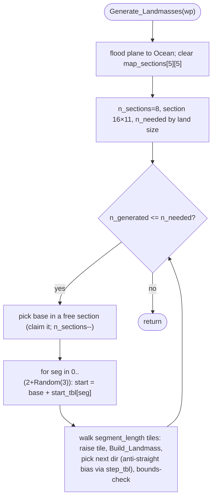

MAPGEN-Generate_Landmasses.md

C:\STU\devel\STU-Extras\Piethawn\Piethawn\out\MAGIC\ovr051\Generate_Landmasses.asm
C:\STU\devel\STU-Extras\Piethawn\Piethawn\out\MAGIC\ovr051\Generate_Landmasses.c

New_Game / Map setup
|-> Simulate_World_Map_Generation() / MAPGEN
    |-> Generate_Landmasses(ARCANUS_PLANE)
    |-> Generate_Landmasses(MYRROR_PLANE)

---

# `Generate_Landmasses` — Walkthrough

| Function | Location | Role |
|---|---|---|
| `Generate_Landmasses` | [MAPGEN.c:1772-1925](../../MoM/src/MAPGEN.c#L1772-L1925) | Procedurally generates one plane's landmasses: floods the plane to Ocean, scatters seed points across a section grid, and grows each landmass with a biased random walk that raises tile elevation and calls `Build_Landmass`, until a land-tile budget is met. |

Verified faithful to the disassembly `Generate_Landmasses.asm` throughout (structure 1:1, RNG-call sequence 1:1).

## Purpose

Called once per plane during new-game map generation. The algorithm:

1. Floods the whole plane to `tt_Ocean`.
2. Divides the world into a section grid and claims **8** seed sections (`n_sections`) for spatial spread.
3. Sets a land-tile budget `n_needed` by world land size (Small 360 / Medium 480 / Large 720).
4. Until the budget is met, for each landmass: pick a base point inside a free section, then draw `2 + Random(3)` ( = 3-5) **segments** radiating from that base. Each segment is a random walk of `segment_length` tiles; every step raises the tile's value (Ocean→land, then elevation) and calls `Build_Landmass`, with an **anti-straight-line bias** on the walk direction.

It mutates `p_world_map[wp][][]` and counts every Ocean→land conversion in `n_generated`.

## Key locals

| name | IDA stack var | meaning |
|---|---|---|
| `segment_length` | `Steps_To_Take [bp-0Eh]` | planned length (in moves) of the current segment's walk; `5/10/20 + Random(10)` by land size |
| `steps_walked` | `Steps_Taken [bp-10h]` | moves made so far in the current segment |
| `straight_run_length` | `Same_Dir_Steps [bp-16h]` | length of the current straight-line run; used as the meander bias weight — P(keep going straight) = `1 / (2 · straight_run_length)` |

(These were renamed from the IDA stack-variable names for readability; the IDA names are kept in the table for asm cross-reference.)

## How it's reached

| Caller | Site | Notes |
|---|---|---|
| MAPGEN (map setup) | `Generate_Landmasses(ARCANUS_PLANE)` / `(MYRROR_PLANE)` | Once per plane. |

## Direction tables (`__1` / `__2`)

The walk uses cardinal offsets `{0,-1,0,1,0} / {1,0,-1,0,0}` — index 0=South, 1=West, 2=North, 3=East, 4=None.

The OG has **two** such tables for two purposes (asm):
- `dir_chg_tbl_wx__2[direction]` — the per-segment **start** offset from `base` (`loc_45507`).
- `dir_chg_tbl_wx__1[dir_chg]` — each **step** offset (`loc_455BB`).

The IDA data segment (`MAGIC.lst`) shows the two are **byte-identical**:

```
dir_chg_tbl_wx__1 dw 0, -1, 0, 1, 0      dir_chg_tbl_wx__2 dw 0, -1, 0, 1, 0
dir_chg_tbl_wy__1 dw 1, 0, -1, 0, 0      dir_chg_tbl_wy__2 dw 1, 0, -1, 0, 0
```

Production mirrors them as `dir_chg_step_tbl_wx/wy` (≈ `__1`, step offset, used at [1898-1899](../../MoM/src/MAPGEN.c#L1898-L1899)) and `dir_chg_start_tbl_wx/wy` (≈ `__2`, segment-start offset, used at [1861-1862](../../MoM/src/MAPGEN.c#L1861-L1862)) ([defs 104-116](../../MoM/src/MAPGEN.c#L104-L116)). Because the two hold identical values, the split is purely for clarity — the map and the RNG stream are unaffected. (A third, generically-named `dir_chg_tbl_wx/wy` with the same values serves the other MAPGEN helpers.)

## The section grid — vestigial 80×55 geometry

The section constants look wrong for a 60×40 world, and they are — they appear sized for a **larger map that predates the shipped one.** This is inference (no ground-truth that MoM's map was ever 80×55), but the geometry is internally consistent with it and the source `DEDU` notes reach the same conclusion.

**What's reachable on 60×40.** Seeds land at `base_wx = 6 + Random(46)` → **{7..52}** and `base_wy = 6 + Random(26)` → **{7..32}** (a central region with ~7-8 tile margins). The section cell is `[base_wy / 11][base_wx / 16]` (genuine `idiv`, not a bit-shift), so the reachable indices are:

| | division | reachable index |
|---|---|---|
| column `base_wx / 16` | 7-15→0, 16-31→1, 32-47→2, 48-52→3 | **{0,1,2,3}** — 4 cols (outer two clipped) |
| row `base_wy / 11` | 7-10→0, 11-21→1, 22-32→2 | **{0,1,2}** — 3 rows (outer two clipped) |

So `8` seeds are claimed out of a reachable **4×3 = 12** cells, inside a `map_sections[5][5] = 25`-slot array. Only a clipped corner is ever touched, and the cells are uneven because 16 and 11 don't divide 60 and 40.

**Why 16×11 and [5][5].** **16 × 5 = 80**, **11 × 5 = 55**. A `[5][5]` grid of 16×11 cells tiles an **80×55** world *exactly* — full array, uniform cells, no clipping. That is almost certainly what these constants were dimensioned for; when MoM's overland world settled at 60×40, the section size and the `[5][5]` array were never re-derived. (For a 60×40 5×5 grid the cells *would* be 12×8 — exactly what the `DEDU` comment proposes.)

**What the `8` is.** A **spatial-spread quota**, not a coverage figure. While `n_sections > 0`, each new landmass must land in an *unclaimed* cell (re-roll until it does); once 8 distinct cells are taken, `n_sections` hits 0 and the rest place freely. So "8" pushes the first 8 landmasses into 8 distinct grid cells so they don't clump, then stops caring. **The code is faithful — the constants are just carried from a map that no longer exists. Leave it as-is.**

## Structure



## Code walk

Line refs are production [MAPGEN.c](../../MoM/src/MAPGEN.c); cross-checked against `Generate_Landmasses.asm` (the authority). `Random(n)` returns `1..n` ([random.c:263](../../MoX/src/random.c#L263)).

### Phase 1 — Flood + setup ([1797-1826](../../MoM/src/MAPGEN.c#L1797-L1826))

Set every `p_world_map[wp][y][x] = tt_Ocean`, zero `map_sections[5][5]`, then `n_sections = 8`, `section 16×11`, `n_needed = 360/480/720` by `_landsize`. (The asm uses `_world_maps` far-pointer arithmetic; production uses the typed `p_world_map` view.)

### Phase 2 — Budget loop ([1831](../../MoM/src/MAPGEN.c#L1831))

`while(n_generated <= n_needed)`: reset `new_direction = ST_UNDEFINED`, `straight_run_length = 1`.

#### Seed-section selection ([1835-1851](../../MoM/src/MAPGEN.c#L1835-L1851))

Roll a base point; re-roll until it lands in a free section, or accept any point once `n_sections` is spent (asm `loc_4543C`). The `assert(base_wx/wy >= 7)` lines are ReMoM-only.

#### Per-landmass segments ([1852-1923](../../MoM/src/MAPGEN.c#L1852-L1923))

`direction_change_count = 2 + Random(3)` (3-5). For each segment `direction`:
- `segment_length = 5/10/20 + Random(10)` by land size.
- Segment start: `curr = base + dir_chg_start_tbl[direction]` ([1861-1862](../../MoM/src/MAPGEN.c#L1861-L1862)).
- Walk ([1864](../../MoM/src/MAPGEN.c#L1864)) `while(steps_walked < segment_length && n_generated <= n_needed)`:
  - If the tile is Ocean, `n_generated++`; raise the tile; `Build_Landmass` ([1866-1873](../../MoM/src/MAPGEN.c#L1866-L1873)).
  - **Direction-retry** ([1878-1921](../../MoM/src/MAPGEN.c#L1878-L1921)) — re-roll until a direction passes the anti-straight bias **and** stays in bounds:

    ```c
    while(1) {
        dir_chg = Random(4) - 1;                        // {0..3} = S/W/N/E
        if(dir_chg == new_direction) {
            if(Random(straight_run_length * 2) != 1) { continue; }   // usually reject staying straight
            else { straight_run_length++; }
        } else { straight_run_length = 1; }
        new_direction = dir_chg;
        next_wx = curr_wx + dir_chg_step_tbl_wx[dir_chg];
        next_wy = curr_wy + dir_chg_step_tbl_wy[dir_chg];
        if( next_wx <  (WORLD_XSTART + 2)        // < 2
         || next_wy <  (WORLD_YSTART + 4)        // < 4
         || next_wx >= (WORLD_WIDTH  - 2)        // >= 58
         || next_wy >= (WORLD_HEIGHT - 4) )      // >= 36
        { new_direction = ST_UNDEFINED; }                       // re-roll, reset bias  (loc_455FD: jmp back)
        else { curr_wx = next_wx; curr_wy = next_wy; steps_walked++; break; }   // loc_45604
    }
    ```

This maps 1:1 onto the asm: the inner loop's success exit (`loc_45604`) does `curr=next; curr=next; inc steps_walked` as one block then falls to the step test (`loc_45613`); the out-of-bounds path (`loc_455FD`) sets `ST_UNDEFINED` and jumps back to re-roll (it does **not** break). The four edge bounds (`2 / 4 / 58 / 36`) match exactly — important for RNG parity, since a tighter upper bound would add stray `Random(4)` retries near the fringe and desync the stream.

The `straight_run_length` reset on a turn (and on an edge bounce, via `ST_UNDEFINED` forcing the next roll into the `else`) is what makes coastlines meander rather than run straight; P(another straight step) = `1 / (2 · straight_run_length)` decays 1/2, 1/4, 1/6, …

## OG quirks preserved (faithful — do not "fix")

- **Section grid sized for ~80×55** — see [above](#the-section-grid--vestigial-8055-geometry). Vestigial constants; faithful.
- **Duplicate direction tables** — OG `__1`/`__2` are bit-identical; production mirrors them as two identically-valued tables.
- **`while(n_generated <= n_needed)` and the step guard use `<=`/`>`** — the budget can overshoot by one tile. Faithful (asm `jg`).

## Sub-functions / external calls

- **`Random`** ([random.c:263](../../MoX/src/random.c#L263)) — returns `1..n`.
- **`Build_Landmass(wp, wx, wy)`** — per-tile landmass expansion, called each step.
- **`p_world_map`**, **`_landsize`**, **`dir_chg_step_tbl_wx/wy`**, **`dir_chg_start_tbl_wx/wy`** — globals read/written.

## Related references

- `C:\STU\devel\STU-Extras\Piethawn\Piethawn\out\MAGIC\ovr051\Generate_Landmasses.asm` — IDA Pro 5.5 disassembly (the authority).
- `C:\STU\devel\STU-Extras\Piethawn\Piethawn\in\MAGIC.lst` — IDA listing with the `dir_chg_tbl_wx__1`/`__2` data (proves they're identical).
- `…\out\MAGIC\ovr051\Generate_Landmasses.c` — Piethawn reference IDA→C translation (the in-file `#if 0 __GEMINI` copy has been removed).
- `MOM_DEF.h` — `WORLD_WIDTH`/`WORLD_HEIGHT` (60/40); `MOX_DEF.h` — `WORLD_XSTART`/`WORLD_YSTART` (0); `TerrType.h` — `tt_Ocean`.
