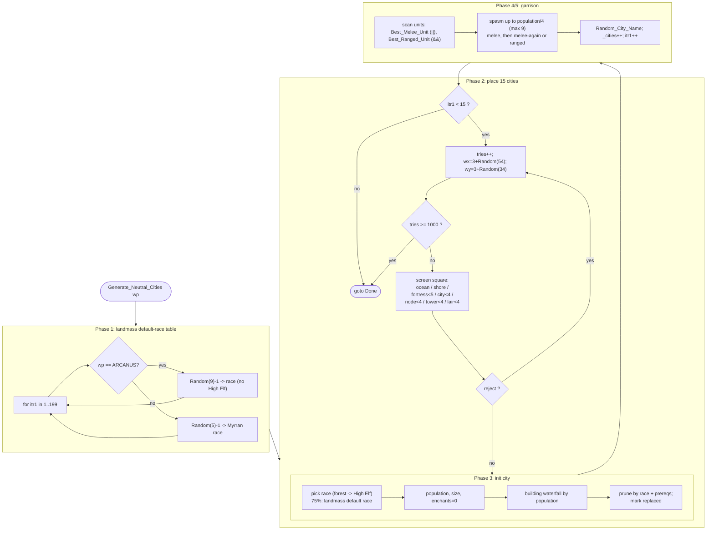

MAPGEN-Generate_Neutral_Cities.md

C:\STU\devel\STU-Extras\Piethawn\Piethawn\out\MAGIC\ovr051\Generate_Neutral_Cities.asm
C:\STU\devel\STU-Extras\Piethawn\Piethawn\out\MAGIC\ovr051\Generate_Neutral_Cities__WIP.c

Init_New_Game()
    |-> Generate_Neutral_Cities(ARCANUS_PLANE);
    |-> Generate_Neutral_Cities(MYRROR_PLANE);

---

# MAPGEN — `Generate_Neutral_Cities()`

Per-function walkthrough of the neutral-city placement routine, comparing the
ReMoM production reconstruction against the IDA Pro disassembly (the arbiter of
truth).

## Sources

| Role | Location |
| --- | --- |
| Production reconstruction | [MAPGEN.c:5528](../../MoM/src/MAPGEN.c#L5528) `Generate_Neutral_Cities()` |
| OG disassembly (ground truth) | `C:\STU\devel\STU-Extras\Piethawn\Piethawn\out\MAGIC\ovr051\Generate_Neutral_Cities.asm` |
| OG decompile (reference, **not** authority) | `…\ovr051\Generate_Neutral_Cities__WIP.c` |

Overlay/proc: `MGC` overlay 51 (the asm `proc Generate_Neutral_Cities far`).
Called twice from new-game setup — once per plane:
[MAPGEN.c:561-562](../../MoM/src/MAPGEN.c#L561-L562).

`Random(n)` returns `1..n` ([random.c:263](../../MoX/src/random.c#L263)).

---

## Purpose

For one plane (`wp`), populate the world with the 15 independent ("neutral")
cities the game starts with:

1. Build a per-landmass *default race* table for the plane.
2. Place up to 15 cities at randomly-chosen, validity-screened squares.
3. For each city: pick a race, roll population/size, grant a starter set of
   buildings (waterfall by population), prune buildings by race and by
   prerequisite, mark replaced buildings, pick the best melee + ranged unit the
   city can recruit, and spawn a garrison.

---

## Program flow

### Phase 1 — landmass default-race table ([5550-5583](../../MoM/src/MAPGEN.c#L5550-L5583))

`for itr1 in 1..199` fill `m_landmasses_default_race[itr1]`:

- **Arcanus** (`wp == ARCANUS_PLANE`): `switch (Random(NUM_RACES_ARCANUS) - 1)`
  with `NUM_RACES_ARCANUS == 9`, so only selectors `0..8` are reachable. The
  jump table carries 13 entries (`cmp bx, 12`); cases `9..12` are dead code in
  the OG itself.
  - `0`→Barbarian, `1`→Gnoll, `2`→Halfling, `3`/`4`→High Men, `5`→Klackon,
    `6`→Lizardman, `7`→Nomad, `8`→Orc.
  - High Elves are excluded from this table (no forest test at the landmass
    level). The source comment advertises a "high men double chance" via the
    extra table entries, but because `Random(9)` never yields `9..12`, **that
    weighting never actually fires** — an OG quirk reproduced faithfully.
- **Myrror**: `switch (Random(NUM_RACES_MYRROR) - 1)`, `NUM_RACES_MYRROR == 5`:
  `0`→Beastmen, `1`→Dark Elf, `2`→Draconian, `3`→Dwarf, `4`→Troll.

### Phase 2 — placement loop (15 cities) ([5587-5659](../../MoM/src/MAPGEN.c#L5587-L5659))

`itr1` counts placed cities to 15; `tries` is a retry counter capped at 1000.
Each attempt:

1. `tries++`; if `tries >= 1000` `goto Done` (abandon the whole routine).
2. `wx = 3 + Random(54)` (3..56), `wy = 3 + Random(34)` (3..36).
3. `reject = ST_FALSE`, then screen the square:
   - **Ocean** — `tt_Ocean` → reject.
   - **Shore** — `tt_Shore1_Fst .. tt_Shore1_Lst` → reject *(OGBUG: no such squares exist yet at this stage)*.
   - **Near a Fortress** — `Range(wx,wy,fortress) < 5` for `itr2 in 0.._num_players-1` (no plane filter).
   - **Near a City** — same plane and `Delta_XY_With_Wrap(...,WORLD_WIDTH) < 4`.
   - **Near a Node** — same plane and `Range(...) < 4` (`NUM_NODES`).
   - **Near a Tower** — `Range(...) < 4` for the 6 towers (no plane filter).
   - **Near a Lair** — same plane and `Range(...) < 4` for the `NUM_LAIRS` lair slots ([5646](../../MoM/src/MAPGEN.c#L5646)).
4. `do { … } while(reject == ST_TRUE && tries < 1000)` — re-roll on rejected square.
5. If `tries >= 1000` → `goto Done`.

### Phase 3 — city initialization ([5663-5834](../../MoM/src/MAPGEN.c#L5663-L5834))

- `location_is_forest_square = Square_Is_Forest_NewGame(wx,wy,wp)` ([5663](../../MoM/src/MAPGEN.c#L5663)).
- **Race** — `switch (Random(NUM_RACES_*) - 1)`:
  - Arcanus: same race set as Phase 1, except selector `3` becomes **High Elf if
    the square is forest, else High Men**.
  - Myrror: same five Myrran races.
- **75% override**: `if (Random(4) > 1)` replace race with the landmass default
  `m_landmasses_default_race[GET_LANDMASS(wx,wy,wp)]` ([5708](../../MoM/src/MAPGEN.c#L5708)).
- Set `wx/wy/wp`, `owner_idx = NEUTRAL_PLAYER_IDX (5)`.
- **Population**: `1 + (_difficulty+1)/3 + Random(4)`. On difficulty above
  `god_Normal`, a 1-in-5 roll replaces it with `(_difficulty+1)/3 + Random(10)`
  ([5717-5721](../../MoM/src/MAPGEN.c#L5717-L5721)). *(OGBUG: ignores terrain.)*
- `size = population / 4`.
- Zero `bldg_cnt` and all 27 city enchantments; `construction = bt_AUTOBUILD (-4)`.
- Mark every building `bs_NotBuilt`, then `bldg_status[bt_NONE] = bs_Replaced` ([5756](../../MoM/src/MAPGEN.c#L5756)).
- **Building waterfall**: `switch (population - 2)` grants Shrine → Armorers Guild
  → Fighters Guild → City Walls → Stable → Granary → Armory → Builders Hall →
  Smithy → Barracks via fall-through ([5757-5784](../../MoM/src/MAPGEN.c#L5757-L5784)).
- **Prune by race**: clear each entry in the race's `cant_build[]` list ([5787-5790](../../MoM/src/MAPGEN.c#L5787-L5790)).
- **Prune by prerequisite** ([5794-5818](../../MoM/src/MAPGEN.c#L5794-L5818)): for each *built* building (`bldg_status[itr2] == bs_Built`), drop it if a required building is unbuilt. Carries OGBUG **B2** (terrain-requirement OOB read).
- **Mark replaced** ([5822-5834](../../MoM/src/MAPGEN.c#L5822-L5834)): where a built building's `replace_bldg` is also built, set the replaced one to `bs_Replaced` *(OGBUG: bottom of a replace chain can be missed)*.

### Phase 4 — pick garrison unit types ([5841-5917](../../MoM/src/MAPGEN.c#L5841-L5917))

Scan `ut_BarbSwordsmen .. ut_Magic_Spirit-1` twice, keeping the **highest unit
index** that matches the city race, has each required building either absent
(`reqd_bldg == 0`) or built/replaced, is not an outpost-creator/construction/
transport unit, and:

- **Best_Melee_Unit** ([5841-5879](../../MoM/src/MAPGEN.c#L5841-L5879)): `Ranged_Type == rat_UNDEF` **or** `>= srat_Thrown` (no-ranged end **or** thrown end — a union, so `||`).
- **Best_Ranged_Unit** ([5880-5917](../../MoM/src/MAPGEN.c#L5880-L5917)): `Ranged_Type > rat_NONE` **and** `< srat_Thrown` (the open band `0 < x < 100` — an interval, so `&&`).

### Phase 5 — spawn garrison & finalize ([5922-5953](../../MoM/src/MAPGEN.c#L5922-L5953))

- Create up to `population/4` (and `< MAX_STACK == 9`) `Best_Melee_Unit`.
- If `Best_Ranged_Unit == 0`: create another up to `population/4` melee units;
  else create up to `population/4` ranged units. *(OGBUG: Dark Elves have no
  melee unit so they garrison at half strength; ranged units effectively never
  appear for other races because the Sawmill/Shrine path is unreachable.)*
- `Random_City_Name_By_Race_NewGame(race, name)`; `_cities++`; `itr1++`.

---

## Mermaid diagram

---

## Verification against the asm

The production reconstruction matches the disassembly across the parts of the
function where a translation could plausibly differ:

| Item | OG asm | Production |
| --- | --- | --- |
| Retry condition | re-roll iff `reject==ST_TRUE && tries<1000` (`loc_4AC8F`) | `do { … } while(reject == ST_TRUE && tries < 1000)` ✓ |
| Phase-2 distance checks | Fortress `Range<5` (`_num_players`), City `Delta_XY_With_Wrap<4`, Node `Range<4`, Tower `Range<4`, Lair `Range<4` | all five loops, same `Range`/`Delta_XY_With_Wrap` mix ✓ |
| Lair count | `cmp itr2, 102` (asm line 404) | `itr2 < NUM_LAIRS` — post-refactor `NUM_LAIRS == 102`, so matches ✓ |
| `cant_build` prune bound | `itr3 < cant_build_count` (`cmp count,itr3; jg`) | `itr3 < …cant_build_count` ✓ |
| Prerequisite-prune guard + bound | `loc_4B325`: `add bx,itr2` then `cmp Buildings.None, bs_Built`; `itr2 = 1..35` (`loc_4B404`) | `bldg_status[itr2] == bs_Built`; `itr2 < NUM_BUILDINGS` ✓ |
| Replace-marking bound | `itr2 = 1..35` (`loc_4B494`) | `itr2 < NUM_BUILDINGS` = `1..35` ✓ |
| Phase-1 selector 8 | `loc_4A9B9` → **Orc** | `case 8: rt_Orc` ✓ |
| Garrison req-building test (both loops) | `loc_4B4D1`/`loc_4B534` (melee), same in `loc_4B6EA` (ranged): `cmp reqd_bldg, 0 / jz` ⇒ **0 = requirement satisfied**, else require `bs_Built`/`bs_Replaced` | `(reqd_bldg_1 == 0) \|\| built \|\| replaced` and same for `reqd_bldg_2` ✓ |
| Melee classifier (Ranged_Type) | `cmp rat_UNDEF / jz accept`, `cmp srat_Thrown / jl skip`, fall-through accept → `(==UNDEF) \|\| (>=Thrown)` (`loc_4B594`) | `(Ranged_Type == rat_UNDEF) \|\| (Ranged_Type >= srat_Thrown)` ✓ |
| Ranged classifier (Ranged_Type) | `cmp rat_NONE / jle skip`, `cmp srat_Thrown / jge skip`, accept only if both pass → `(>NONE) && (<Thrown)` (`loc_4B6EA`) | `(Ranged_Type > rat_NONE) && (Ranged_Type < srat_Thrown)` ✓ |

The distance loops mirror `Generate_Home_Cities()`
([MAPGEN.c:1051](../../MoM/src/MAPGEN.c#L1051), see
[MAPGEN-Generate_Home_Cities.md](MAPGEN-Generate_Home_Cities.md)), with the
extra same-plane City `< 4` loop unique to neutral-city placement (asm
`loc_4AB33`).

### Why the two garrison classifiers use different connectors

`Ranged_Type` is a number line: `rat_UNDEF (-1)` / `rat_NONE (0)` = no ranged,
`1..99` = true ranged (bows, magic), `srat_Thrown (100+)` = thrown (melee-range).
A **ranged** unit lives *inside* the open band `0 < x < 100` — an interval, so
both bounds must hold (`&&`). A **melee** unit is the *complement* — either the
no-ranged end or the thrown end — a union of two regions (`||`). By De Morgan the
complement of an interval is a union, so the correct operators are genuinely
opposite.

---

## OG bugs preserved (do **not** "fix" in baseline ReMoM)

- **B1** Population formula ignores terrain — [MAPGEN.c:5717](../../MoM/src/MAPGEN.c#L5717).
- **B2** Prerequisite check: `reqd_bldg_1 > 100` is treated as a terrain index
  and read out of `bldg_status[]` bounds, and a building that has both a terrain
  and a building requirement has the building requirement ignored —
  [MAPGEN.c:5799-5801](../../MoM/src/MAPGEN.c#L5799-L5801).
- **B3** Garrison composition: Dark Elves get no `Best_Melee_Unit` (half
  garrison), and ranged units effectively never spawn for other races because
  the building path that would unlock them is unreachable with the generated
  populations — [MAPGEN.c:5922-5945](../../MoM/src/MAPGEN.c#L5922-L5945).
- **B4** Replace-marking only considers a built replacer that is not itself
  replaced, so the bottom of a replace chain can be skipped —
  [MAPGEN.c:5822-5834](../../MoM/src/MAPGEN.c#L5822-L5834).
- **OG quirk** The "high men double chance" advertised by the Arcanus race
  comment never fires: the 13-entry jump table is indexed by `Random(9)`, so the
  weighting selectors `9..12` are dead.

> **Verification note:** the production-fidelity rows were checked against the
> disassembly at `…\ovr051\Generate_Neutral_Cities.asm`: `loc_4AC8F` retry
> decision; `loc_4AAED` fortress / `loc_4AB33` city / `loc_4AB97` node /
> `loc_4ABF5` tower / `loc_4AC3A` lair (`cmp itr2,102`, line 404); `loc_4B325`/
> `loc_4B404` prerequisite loop (`add bx,itr2` then `cmp Buildings.None`);
> `loc_4B494` replace loop; `loc_4B594` melee classifier (`cmp rat_UNDEF` /
> `cmp srat_Thrown`); `loc_4B6EA` ranged classifier (`jle`/`jge` → AND).
