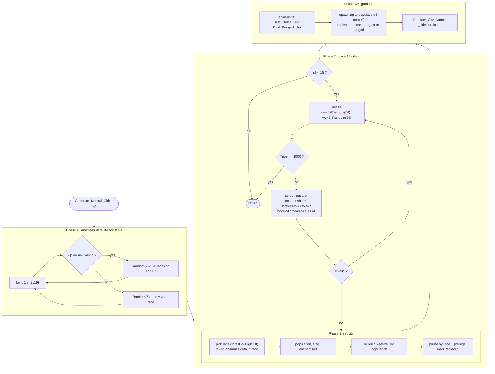

# MAPGEN — `Generate_Neutral_Cities()`

Per-function walkthrough of the neutral-city placement routine, comparing the
ReMoM production reconstruction against the Gemini AI translation, with the
IDA Pro disassembly as the arbiter of truth.

## Sources

| Role | Location |
| --- | --- |
| Production reconstruction | [MAPGEN.c:4803](../../MoM/src/MAPGEN.c#L4803) `Generate_Neutral_Cities()` |
| Gemini translation | [MAPGEN.c:5330](../../MoM/src/MAPGEN.c#L5330) `Generate_Neutral_Cities__GEMINI()` |
| OG disassembly (ground truth) | `C:\STU\devel\STU-Extras\Piethawn\Piethawn\out\MAGIC\ovr051\Generate_Neutral_Cities.asm` |
| OG decompile (reference) | `…\ovr051\Generate_Neutral_Cities.c` |

Overlay/proc: `MGC` overlay 51 (the asm `proc Generate_Neutral_Cities far`).
Called twice from new-game setup — once per plane:
[MAPGEN.c:354-355](../../MoM/src/MAPGEN.c#L354-L355).

---

## Purpose

For one plane (`wp`), populate the world with the 15 independent ("neutral")
cities the game starts with:

1. Build a per-landmass *default race* table for the plane.
2. Place up to 15 cities at randomly-chosen, validity-screened squares.
3. For each city: pick a race, roll population/size, grant a starter set of
   buildings (waterfall by population), prune buildings by race and by
   prerequisite, mark replaced buildings, pick the best melee + ranged unit the
   city can recruit, and spawn a garrison.

---

## Program flow

### Phase 1 — landmass default-race table

`for itr1 in 1..199` fill `m_landmasses_default_race[itr1]`:

- **Arcanus** (`wp == ARCANUS_PLANE`): `switch (Random(NUM_RACES_ARCANUS) - 1)`
  with `NUM_RACES_ARCANUS == 9`, so only selectors `0..8` are reachable. The
  jump table carries 13 entries (`cmp bx, 12`); cases `9..12` are dead code in
  the OG itself.
  - `0`→Barbarian, `1`→Gnoll, `2`→Halfling, `3`/`4`→High Men, `5`→Klackon,
    `6`→Lizardman, `7`→Nomad, `8`→Orc.
  - High Elves are excluded from this table (no forest test at the landmass
    level). The source comment advertises a "high men double chance" via the
    extra table entries, but because `Random(9)` never yields `9..12`, **that
    weighting never actually fires** — an OG quirk reproduced faithfully.
- **Myrror**: `switch (Random(NUM_RACES_MYRROR) - 1)`, `NUM_RACES_MYRROR == 5`:
  `0`→Beastmen, `1`→Dark Elf, `2`→Draconian, `3`→Dwarf, `4`→Troll.

### Phase 2 — placement loop (15 cities)

`itr1` counts placed cities to 15; `Tries` is a global retry counter capped at
1000. Each attempt:

1. `Tries++`; if `Tries >= 1000` abandon the whole routine.
2. `wx = 3 + Random(54)` (3..56), `wy = 3 + Random(34)` (3..36).
3. `Invalid = ST_FALSE`, then screen the square:
   - **Ocean** — `tt_Ocean1` → invalid.
   - **Shore** — `tt_Shore1_Fst .. tt_Shore1_Lst` → invalid.
   - **Near a Fortress** — `Range(wx,wy,fortress) < 5` for `itr2 in 0.._num_players-1` (no plane filter).
   - **Near a City** — same plane and `Delta_XY_With_Wrap(...,WORLD_WIDTH) < 4`.
   - **Near a Node** — same plane and `Range(...) < 4` (`NUM_NODES`).
   - **Near a Tower** — `Range(...) < 4` for the 6 towers (no plane filter).
   - **Near a Lair** — same plane and `Range(...) < 4` for the 102 lair slots.
4. If `Tries < 1000 && Invalid` → re-roll the location.
5. If `Tries >= 1000` → abandon.

### Phase 3 — city initialization

- `location_is_forest_square = Square_Is_Forest_NewGame(wx,wy,wp)`.
- **Race** — `switch (Random(NUM_RACES_* ) - 1)`:
  - Arcanus: same race set as Phase 1, except selector `3` becomes **High Elf if
    the square is forest, else High Men**.
  - Myrror: same five Myrran races.
- **25% override**: `if (Random(4) > 1)` replace race with the landmass default
  `m_landmasses_default_race[GET_LANDMASS(wx,wy,wp)]`.
- Set `wx/wy/wp`, `owner_idx = NEUTRAL_PLAYER_IDX (5)`.
- **Population**: `1 + (_difficulty+1)/3 + Random(4)`. On difficulty above
  `god_Normal`, a 1-in-5 roll replaces it with `(_difficulty+1)/3 + Random(10)`.
  Stored to a `int8_t`. *(OG bug: ignores terrain.)*
- `size = population / 4`.
- Zero `bldg_cnt` and all 27 city enchantments; `construction = bt_AUTOBUILD (-4)`.
- Mark every building `bs_NotBuilt`, then `bldg_status[bt_NONE] = bs_Replaced`.
- **Building waterfall**: `switch (population - 2)` grants Shrine → Armorers Guild
  → Fighters Guild → City Walls → Stable → Granary → Armory → Builders Hall →
  Smithy → Barracks via fall-through, larger populations getting the higher tiers.
- **Prune by race**: clear each entry in the race's `cant_build[]` list.
- **Prune by prerequisite**: for each built building, if `reqd_bldg_1 > 100`
  treat it as a terrain index and read `bldg_status[reqd_terrain]` *(OG bug:
  out-of-bounds, and the real `reqd_bldg` check is then skipped)*; otherwise
  clear the building if either required building is unbuilt.
- **Mark replaced**: where a built building's `replace_bldg` is also built, set
  the replaced one to `bs_Replaced` *(OG warning: bottom of a replace chain can
  be missed)*.

### Phase 4 — pick garrison unit types

Scan `ut_BarbSwordsmen .. ut_Magic_Spirit-1` twice, keeping the **highest unit
index** that matches the city race, has its required building(s) built/replaced,
is not an outpost-creator/construction/transport unit, and:

- **Best_Melee_Unit**: `Ranged_Type == rat_NONE` or `>= srat_Thrown`.
- **Best_Ranged_Unit**: `Ranged_Type > rat_NONE` and `< srat_Thrown`.

### Phase 5 — spawn garrison & finalize

- Create up to `population/4` (and `< MAX_STACK == 9`) `Best_Melee_Unit`.
- If `Best_Ranged_Unit == 0`: create another up to `population/4` melee units;
  else create up to `population/4` ranged units. *(OG warnings: Dark Elves have
  no melee unit so they garrison at half strength; ranged units effectively
  never appear for other races because the Sawmill/Shrine path is unreachable.)*
- `Random_City_Name_By_Race_NewGame(race, name)`; `_cities++`; `itr1++`.

---

## Mermaid diagram

---

## Production vs Gemini — comparison

The OG asm is the arbiter. Each row notes which version matches it.

### Production fidelity to the asm

The production reconstruction matches the disassembly across the parts of the
function where the two translations could plausibly differ:

| Item | OG asm | Production |
| --- | --- | --- |
| Retry condition | re-roll iff `Tries<1000 && Invalid==ST_TRUE` (`loc_4AC8F`) | `do { … } while(Invalid == ST_TRUE && tries < 1000)` ✓ |
| Phase-2 distance checks | Fortress `Range<5` (`_num_players`), City `Delta_XY_With_Wrap<4`, Node `Range<4`, Tower `Range<4`, Lair `Range<4` | all five loops, same `Range`/`Delta_XY_With_Wrap` mix ✓ |
| Lair count | `cmp itr2, 102` | `itr2 < NUM_LAIRS_102` ✓ (note: not the `NUM_LAIRS` 99-HACK) |
| `cant_build` prune bound | `itr3 < cant_build_count` (`cmp count,itr3; jg`) | `itr3 < …cant_build_count` ✓ |
| Prerequisite-prune bound | `itr2 = 1..35` (`cmp itr2,35; jg`, `loc_4B404`) | `itr2 < NUM_BUILDINGS` = `1..35` ✓ |
| Replace-marking bound | `itr2 = 1..35` (`loc_4B494`) | `itr2 < NUM_BUILDINGS` = `1..35` ✓ |

The faithful distance loops mirror `Generate_Home_Cities()` at
[MAPGEN.c:852-936](../../MoM/src/MAPGEN.c#L852-L936), with the extra same-plane
City `< 4` loop unique to neutral-city placement (asm `loc_4AB33`).

### Reconstruction error in the Gemini version (production is faithful here)

| # | Item | OG asm | Production | Gemini |
| --- | --- | --- | --- | --- |
| **G1** | Phase-1 landmass switch, selector `8` | `loc_4A9B9` → **Orc** | `case 8: rt_Orc` ✓ | `case 0: case 8:` → **Barbarian** ✗ |

Gemini's *Phase-1* landmass switch also mislabels the dead selectors `9/11/12`,
but those are unreachable (`Random(9)`), so only selector `8` matters — and it
is wrong (Barbarian instead of Orc). Note Gemini's *Phase-3* city-race switch
maps selector `8`→Orc correctly, so Gemini is internally inconsistent between
its two copies of the same OG jump table. Production reproduces both correctly.

### Representational differences (behaviorally equivalent)

| Item | Production | Gemini |
| --- | --- | --- |
| Terrain read | `TERRAIN_TYPE(wx,wy,wp)` macro | raw `_world_maps[wp][wy][wx]` |
| Landmass read | `GET_LANDMASS(wx,wy,wp)` macro | raw `_landmasses[wp][wy][wx]` |
| Enchantments reset | `enchantments[INDEX] = ST_FALSE` (indexed array) | named `Enchants.<field> = 0` (matches asm field names) |
| Garrison cap | `MAX_STACK` (9) | literal `9` |
| Neutral owner | `NEUTRAL_PLAYER_IDX` | literal `5` |
| Auto-build | `bt_AUTOBUILD` | literal `-4` (equal) |
| Name call | `Random_City_Name_By_Race_NewGame(race, _CITIES[_cities].name)` | `…(race, &_CITIES[_cities])` — equal because `name` is at struct offset `0` |
| Placement loop shape | `for(itr1<15)` + inner `do/while(Invalid==ST_TRUE …)` + `return` on `tries>=1000` | `for(itr1<15;)` + inner `do/while` + `goto Done` (equivalent control flow) |

---

## OG bugs preserved (do **not** "fix" in baseline ReMoM)

- **B1** Population formula ignores terrain — flagged at
  [MAPGEN.c:5021](../../MoM/src/MAPGEN.c#L5021).
- **B2** Prerequisite check: `reqd_bldg_1 > 100` is treated as a terrain index
  and read out of `bldg_status[]` bounds, and a building that has both a terrain
  and a building requirement has the building requirement ignored —
  [MAPGEN.c:5097-5128](../../MoM/src/MAPGEN.c#L5097-L5128).
- **B3** Garrison composition: Dark Elves get no `Best_Melee_Unit` (half
  garrison), and ranged units effectively never spawn for other races because
  the building path that would unlock them is unreachable with the generated
  populations — [MAPGEN.c:5253-5292](../../MoM/src/MAPGEN.c#L5253-L5292).
- **B4** Replace-marking only considers a built replacer that is not itself
  replaced, so the bottom of a replace chain can be skipped —
  [MAPGEN.c:5130-5152](../../MoM/src/MAPGEN.c#L5130-L5152).
- **OG quirk** The "high men double chance" advertised by the Arcanus race
  comment never fires: the 13-entry jump table is indexed by `Random(9)`, so the
  weighting selectors `9..12` are dead.

> **Verification note:** the production-fidelity rows and `G1` were checked
> line-by-line against the disassembly at
> `…\ovr051\Generate_Neutral_Cities.asm` (`loc_4AC8F` retry decision;
> `loc_4AAED` fortress, `loc_4AB33` city, `loc_4AB97` node, `loc_4ABF5` tower,
> `loc_4AC3A` lair; `loc_4B404`/`loc_4B494` building-loop bounds; `loc_4A9B9`
> Phase-1 selector 8).
