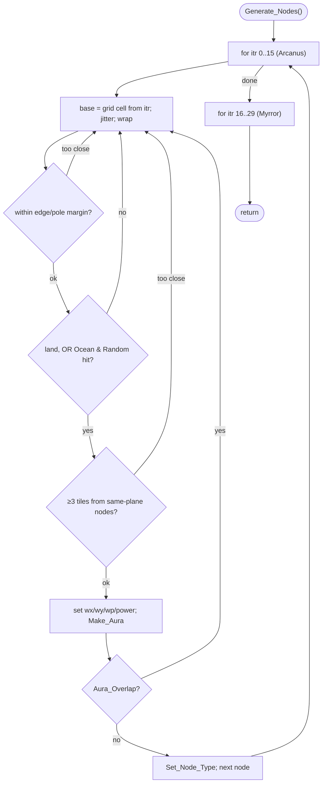

MAPGEN-Generate_Nodes.md

C:\STU\devel\STU-Extras\Piethawn\Piethawn\out\MAGIC\ovr051\Generate_Nodes.asm
C:\STU\devel\STU-Extras\Piethawn\Piethawn\out\MAGIC\ovr051\Generate_Nodes.c

C:\STU\devel\STU-Extras\Piethawn\Piethawn\out\MAGIC\ovr051\Rebalance_Node_Types.asm
C:\STU\devel\STU-Extras\Piethawn\Piethawn\out\MAGIC\ovr051\Rebalance_Node_Types.c

Init_New_Game()
    |-> Generate_Nodes();                     [MAPGEN.c:330]
    |-> Draw_Building_The_Worlds(50);
    |-> Rebalance_Node_Types(ARCANUS_PLANE);
    |-> Rebalance_Node_Types(MYRROR_PLANE);

---

# `Generate_Nodes` — Walkthrough

| Function | Location | Role |
|---|---|---|
| `Generate_Nodes` | [MAPGEN.c:1937-2059](../../MoM/src/MAPGEN.c#L1937-L2059) | Places the 30 magic Nodes (16 Arcanus, 14 Myrror) on a jittered grid, rejecting edge/pole tiles, enforcing minimum spacing, then rolling each node's power, aura, and realm type. |
| `Generate_Nodes__GEMINI` | [MAPGEN.c:2062-2185](../../MoM/src/MAPGEN.c#L2062-L2185) (inside `#if 0`) | Reference IDA→C translation (= Piethawn `*.c`). For this function it matches the asm closely; kept for cross-reference. Not OG-truth. |

Verified faithful to the disassembly `Generate_Nodes.asm` throughout, carrying two deliberately-preserved OG bugs (B1/B2) and an OG margin asymmetry.

## Purpose

Called once during map generation (after both planes' terrain is built). It fills `_NODES[0..29]`:

- **Arcanus nodes** — indices 0-15, plane 0, power `4 + Random(6)`.
- **Myrror nodes** — indices 16-29, plane 1, power `9 + Random(11)` (stronger).

Each node is placed by: compute a grid base cell from the node index, jitter it randomly, wrap into the world, reject if too near an edge/pole, accept land outright (or Ocean only with a small random chance), enforce a ≥3-tile spacing from existing nodes of the same plane, then `Make_Aura` / `Aura_Overlap` (retry on overlap) / `Set_Node_Type`.

## How it's reached

| Caller | Site | Notes |
|---|---|---|
| MAPGEN (map setup) | [MAPGEN.c:330](../../MoM/src/MAPGEN.c#L330) | After `Generate_Climate_Terrain_Types`; `Rebalance_Node_Types` runs next for both planes. |

## Structure

## Code walk

Line refs are production [MAPGEN.c](../../MoM/src/MAPGEN.c); cross-checked against `Generate_Nodes.asm` (the authority). `Random(n)` returns `1..n` ([random.c:263](../../MoX/src/random.c#L263)). `s_NODE` is `0x30` (48) bytes.

### Arcanus loop ([1946-1999](../../MoM/src/MAPGEN.c#L1946-L1999))

For `itr` 0..15, the `while(1)` retries (label `somehow1`) until a node is placed:

- **Base cell + jitter** ([1951-1954](../../MoM/src/MAPGEN.c#L1951-L1954)): `base_wx = (itr%5)*12`, `base_wy = (itr/5)*10`; `wx = base_wx + Random(24)-1`, `wy = base_wy + Random(20)-1`.
- **Wrap** ([1955-1958](../../MoM/src/MAPGEN.c#L1955-L1958)): `WORLD_WIDTH`/`WORLD_HEIGHT` (60/40) for `>=`, `WORLD_XSTART`/`YSTART` (0) for `<`.
- **Edge/pole reject** ([1960-1971](../../MoM/src/MAPGEN.c#L1960-L1971)): `wx<3 || wy<2 || wx>=57 || wy>=37` → `continue`. (North margin 2 vs 3 elsewhere — preserved, see below.)
- **Terrain/random gate** ([1972-1976](../../MoM/src/MAPGEN.c#L1972-L1976)): proceed if `(tile != Ocean) || (Random(40) == 1)`. The `||` short-circuit rolls `Random(40)` only on Ocean — matches the asm (`jnz` skips the roll on non-Ocean).
- **Spacing** ([1978-1984](../../MoM/src/MAPGEN.c#L1978-L1984)): for each prior node, `Delta_XY_With_Wrap(...) < 3` → `goto somehow1`. No `wp` filter — all prior nodes are Arcanus.
- **Place + aura** ([1985-1996](../../MoM/src/MAPGEN.c#L1985-L1996)): set fields, `power = 4 + Random(6)`, `Make_Aura`; if `Aura_Overlap(itr) != ST_TRUE`, `Set_Node_Type` and `break`.

### Myrror loop ([2000-2058](../../MoM/src/MAPGEN.c#L2000-L2058))

Same shape for `itr` 16..29 (label `Attempt_Myrror`), with these per-plane differences — all matched to the asm:

- **Base cell** ([2006-2008](../../MoM/src/MAPGEN.c#L2006-L2008)): `base_wx = ((itr-20)%5)*12`, `base_wy = ((itr-20)/5)*20` (note `*20`, vs Arcanus `*10`). The `(itr-20)` offset is an OGBUG ([B2](#og-quirks-preserved)).
- **Jitter** ([2009-2010](../../MoM/src/MAPGEN.c#L2009-L2010)): `wy` jitter is `Random(40)-1` (vs Arcanus `Random(20)-1`).
- **Wrap** ([2011-2014](../../MoM/src/MAPGEN.c#L2011-L2014)): `WORLD_WIDTH`/`HEIGHT` / `WORLD_XSTART`/`YSTART` — same as Arcanus.
- **Terrain gate** ([2028-2032](../../MoM/src/MAPGEN.c#L2028-L2032)): `(p_world_map[ARCANUS_PLANE]...) || (Random(25) == 1)`. Reading the **Arcanus** plane is an OGBUG ([B1](#og-quirks-preserved)).
- **Spacing** ([2034-2043](../../MoM/src/MAPGEN.c#L2034-L2043)): guarded by `if(_NODES[itr2].wp == MYRROR_PLANE)` — distance is enforced only against other Myrror nodes (asm `cmp [wp], 1; jnz skip`).
- **Place + aura** ([2044-2055](../../MoM/src/MAPGEN.c#L2044-L2055)): `wp = MYRROR_PLANE`, `power = 9 + Random(11)`, then `Make_Aura` / `Aura_Overlap` / `Set_Node_Type`.

## OG quirks preserved (faithful — do not "fix")

| # | Line | What |
|---|---|---|
| B1 | [2029](../../MoM/src/MAPGEN.c#L2029) | Myrror terrain check reads `p_world_map[ARCANUS_PLANE]`. The asm reads `_world_maps` base (plane 0) with no plane offset, same as the Arcanus loop — so the Myrror nodes' land/ocean test is taken against the *Arcanus* map. OGBUG; annotated and preserved. |
| B2 | [2006-2007](../../MoM/src/MAPGEN.c#L2006-L2007) | Myrror base uses `(itr - 20)` (negative base coords for itr 16-19, fixed up by the wrap) rather than `(itr - 16)`. OG-faithful (asm `add ax, -20`). |
| margin | [2015](../../MoM/src/MAPGEN.c#L2015) | The edge/pole reject keeps a 2-tile north margin (`wy < 2`) but 3 tiles west/east/south. Asymmetric, but OG-faithful (asm `cmp wy, 2` / `cmp wy, 37`). Likely a SimTex off-by-one on the north pole; preserved. |

## Notes vs `__GEMINI`

The `__GEMINI` translation matches the asm for this function — same `(itr-20)` base, `base_wy * 20`, `60/40` wrap, the `wp == 1` spacing filter, and the plane-0 (`_world_maps[wy*60+wx]`, no offset) terrain read that makes B1 an OG behavior. It's a clean cross-reference here.

## Sub-functions / external calls

- **`Random`** ([random.c:263](../../MoX/src/random.c#L263)) — returns `1..n`.
- **`Delta_XY_With_Wrap(x1, y1, x2, y2, width)`** — toroidal distance; used for the ≥3-tile spacing test.
- **`Make_Aura(power, &Aura_Xs, &Aura_Ys, wx, wy)`** — fills the node's influence-tile arrays.
- **`Aura_Overlap(itr)`** — returns `ST_TRUE` if this node's aura collides with an existing one (→ retry).
- **`Set_Node_Type(power, &Aura_Xs, &Aura_Ys, wp, &type)`** — assigns the node's magic realm.
- **`_NODES[]`**, **`p_world_map`** — globals read/written.

## Related references

- `C:\STU\devel\STU-Extras\Piethawn\Piethawn\out\MAGIC\ovr051\Generate_Nodes.asm` — IDA Pro 5.5 disassembly (the authority).
- [MAPGEN.c:2062-2185](../../MoM/src/MAPGEN.c#L2062-L2185) — `__GEMINI` reference translation (`#if 0`).
- [MAPGEN.c:330](../../MoM/src/MAPGEN.c#L330) — call site; `Rebalance_Node_Types` runs immediately after for both planes.
- `…\out\MAGIC\ovr051\Rebalance_Node_Types.asm` / `.c` — the sibling node-system step that runs next.
- [MAPGEN-Generate_Landmasses.md](MAPGEN-Generate_Landmasses.md) — the preceding map-gen step.
- `MOM_DEF.h` — `WORLD_WIDTH`/`WORLD_HEIGHT` (60/40), `NUM_NODES` (30); `MOX_DEF.h` — `WORLD_XSTART`/`YSTART` (0); `TerrType.h` — `tt_Ocean`.
