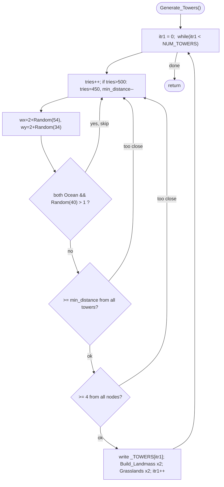

MAPGEN-Generate_Towers.md

C:\STU\devel\STU-Extras\Piethawn\Piethawn\out\MAGIC\ovr051\Generate_Towers.asm
C:\STU\devel\STU-Extras\Piethawn\Piethawn\out\MAGIC\ovr051\Generate_Towers.c

Init_New_Game()
    |-> ... Rebalance_Node_Types ...
    |-> Generate_Towers();               [MAPGEN.c:338]
    |-> Extend_Islands(ARCANUS/MYRROR);

---

# `Generate_Towers` — Walkthrough

| Function | Location | Role |
|---|---|---|
| `Generate_Towers` | [MAPGEN.c:802-883](../../MoM/src/MAPGEN.c#L802-L883) | Places the 6 Towers of Wizardry: random spots that aren't too close to existing towers or nodes, then forced to land on both planes. |

Verified faithful to the disassembly `Generate_Towers.asm` throughout — structure and `Random()` sequence 1:1 — carrying one preserved OG UB (`tries` uninitialized; see below).

## Purpose

Called once during map generation (after the nodes are placed/rebalanced, before `Extend_Islands`). Places `NUM_TOWERS` (6) Towers of Wizardry, each at the same coordinate on both planes. For each tower it retries until it finds a spot that:
- is land on either plane, or passes a 1-in-40 roll if open Ocean on both;
- is at least `min_distance` tiles from every already-placed tower (starts at 10, relaxes after many failures);
- is at least 4 tiles from every node.

On success it stamps the tower into `_TOWERS[]`, forces land via `Build_Landmass` on both planes, and sets the tile to `tt_Grasslands1` on both.

## How it's reached

| Caller | Site | Notes |
|---|---|---|
| `Init_New_Game` / MAPGEN | [MAPGEN.c:338](../../MoM/src/MAPGEN.c#L338) | After `Rebalance_Node_Types`, before `Extend_Islands`. Runs once (both planes share tower coords). |

## Structure



## Code walk

Line refs are production [MAPGEN.c](../../MoM/src/MAPGEN.c); cross-checked against `Generate_Towers.asm` (the authority). `Random(n)` returns `1..n` ([random.c:263](../../MoX/src/random.c#L263)).

### Retry loop ([813-878](../../MoM/src/MAPGEN.c#L813-L878))

`min_distance = 10`; `itr1 = 0; while(itr1 < NUM_TOWERS)`. `itr1` is incremented **only after a successful placement** ([878](../../MoM/src/MAPGEN.c#L878)) — every rejection path `continue`s without advancing it, so each tower slot retries until placed. This mirrors the asm, where `inc itr1` runs only after placement and every reject `jmp`s back to the attempt top (`loc_43CA7`) leaving `itr1` untouched.

`tries++` each attempt; `if(tries > 500){ tries = 450; min_distance--; }`. `tries` is **not** reset per tower, so it accumulates across the whole run and gradually relaxes spacing if placement gets hard.

### Coordinate roll + terrain gate ([826-840](../../MoM/src/MAPGEN.c#L826-L840))

`wx = 2 + Random(54)`, `wy = 2 + Random(34)`. Then:

```c
if( (ARC tile == tt_Ocean) && (MYR tile == tt_Ocean) && (Random(40) > 1) ) { continue; }
```

i.e. an all-Ocean spot is rejected unless `Random(40) <= 1` (a 1-in-40 accept). The `&&` short-circuit rolls `Random(40)` only when both planes are Ocean, and the `> 1` test matches the asm's `cmp ax,1; jle proceed` (proceed on `<= 1`, retry on `> 1`). **Faithful, RNG-exact.**

### Distance checks ([842-863](../../MoM/src/MAPGEN.c#L842-L863))

```c
for(itr2 = 0; itr2 < itr1; itr2++)
    if(Delta_XY_With_Wrap(wx, wy, _TOWERS[itr2].wx, _TOWERS[itr2].wy, WORLD_WIDTH) < min_distance) break;
if(itr2 < itr1) { continue; }                 // too close to a tower -> re-roll

for(itr2 = 0; itr2 < NUM_NODES; itr2++)
    if(Delta_XY_With_Wrap(wx, wy, _NODES[itr2].wx, _NODES[itr2].wy, WORLD_WIDTH) < 4) break;
if(itr2 < NUM_NODES) { continue; }            // too close to a node -> re-roll
```

Each loop `break`s on a violation and the following `if(itr2 < …) continue;` re-rolls the whole attempt — equivalent to the asm's `jmp loc_43CA7` from inside each distance loop. **Faithful.**

### Placement ([865-878](../../MoM/src/MAPGEN.c#L865-L878))

Write `wx`/`wy`/`owner_idx = ST_UNDEFINED` into `_TOWERS[itr1]`, `Build_Landmass` on both planes, set both tiles to `tt_Grasslands1`, then `itr1++`. **Faithful.**

## OG quirk preserved

**`tries` is uninitialized in the OG.** The asm never zeroes it (`sub sp,8` allocates the local; the first use is `inc [Tries]`), so it starts from stack garbage. Production initializes `int16_t tries = 0;` ([804](../../MoM/src/MAPGEN.c#L804)) with an `OGBUG uninitialized` note ([819](../../MoM/src/MAPGEN.c#L819)): undefined behavior can't be faithfully reproduced, so init-to-0 is the pragmatic reconstruction. It only matters once `tries > 500` (the spacing relaxation), which is rare, so the practical/RNG impact versus any given OG run is negligible.

## Notes vs `__GEMINI`

The in-file `#if 0 __GEMINI` copy has been removed. The Piethawn `Generate_Towers.c` remains as an external reference translation; it matches the asm (the retry `continue`s, the `Random(40)`-when-both-Ocean gate, the distance checks) and likewise guesses `tries = 0`.

## Sub-functions / external calls

- **`Random`** ([random.c:263](../../MoX/src/random.c#L263)) — returns `1..n`.
- **`Delta_XY_With_Wrap(x1, y1, x2, y2, width)`** — toroidal distance; used for both spacing tests.
- **`Build_Landmass(wp, wx, wy)`** — forces land under the tower (called per plane).
- **`_TOWERS[]`** (`NUM_TOWERS` = 6), **`_NODES[]`** (`NUM_NODES` = 30), **`p_world_map`** — globals read/written.

## Related references

- `C:\STU\devel\STU-Extras\Piethawn\Piethawn\out\MAGIC\ovr051\Generate_Towers.asm` — IDA Pro 5.5 disassembly (the authority).
- `…\out\MAGIC\ovr051\Generate_Towers.c` — Piethawn reference IDA→C translation (the in-file `#if 0 __GEMINI` copy has been removed).
- [MAPGEN.c:338](../../MoM/src/MAPGEN.c#L338) — call site.
- [MAPGEN-Generate_Nodes.md](MAPGEN-Generate_Nodes.md) / [MAPGEN-Rebalance_Node_Types.md](MAPGEN-Rebalance_Node_Types.md) — preceding steps; Rebalance's FN-ENTER is the last confirmed-clean RNG checkpoint and this function is the first step downstream of it.
- `MOM_DEF.h` — `WORLD_WIDTH`/`WORLD_HEIGHT` (60/40), `NUM_TOWERS` (6), `NUM_NODES` (30); `TerrType.h` — `tt_Grasslands1` (0xA2), `tt_Ocean` (0).
