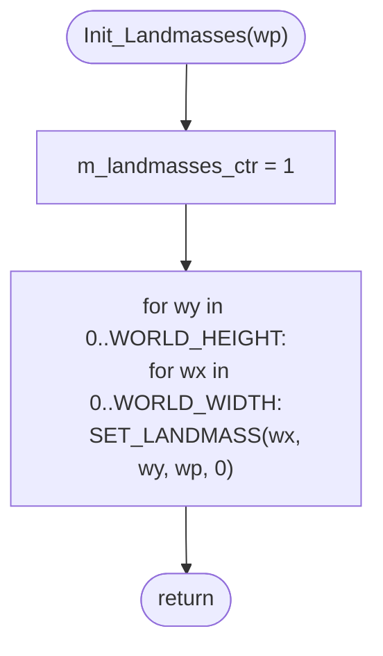

MAPGEN-Init_Landmasses.md

C:\STU\devel\STU-Extras\Piethawn\Piethawn\out\MAGIC\ovr051\Init_Landmasses.asm
C:\STU\devel\STU-Extras\Piethawn\Piethawn\out\MAGIC\ovr051\Init_Landmasses.c

Newgame_Control()
    |-> Init_New_Game();
        ...
        |-> Init_Landmasses(ARCANUS_PLANE);
        |-> Init_Landmasses(MYRROR_PLANE);
        |-> Generate_Landmasses(ARCANUS_PLANE);
        |-> Generate_Landmasses(MYRROR_PLANE);

---

# `Init_Landmasses` — Walkthrough

| Function | Location | Role |
|---|---|---|
| `Init_Landmasses` | [MAPGEN.c:1307-1325](../../MoM/src/MAPGEN.c#L1307-L1325) | Resets one plane's landmass-id map: seeds `m_landmasses_ctr = 1` (next id to hand out) and writes `0` (= `NO_LANDMASS`) to every `_landmasses[]` slot for the plane. |

Verified faithful to the disassembly `Init_Landmasses.asm` throughout (structure 1:1, no RNG calls).

## Purpose

Called once per plane during new-game map generation, **before** `Generate_Landmasses` for that plane. It clears the plane's slice of the shared `_landmasses[NUM_PLANES * WORLD_SIZE]` byte array so the subsequent generation pass starts from a known "no landmass anywhere" state, then primes the per-plane id counter at `1` so that the sentinel value `0` cleanly means "no landmass."

It does **not** touch terrain (`p_world_map`) — that's `Generate_Landmasses`' first action (flood to Ocean). It only touches the landmass-id map.

## How it's reached

| Caller | Site | Notes |
|---|---|---|
| `Init_New_Game` ([MAPGEN.c:264](../../MoM/src/MAPGEN.c#L264)) | [MAPGEN.c:297](../../MoM/src/MAPGEN.c#L297) `Init_Landmasses(ARCANUS_PLANE)` | Step 1 of landmass setup for Arcanus. |
| `Init_New_Game` ([MAPGEN.c:264](../../MoM/src/MAPGEN.c#L264)) | [MAPGEN.c:301](../../MoM/src/MAPGEN.c#L301) `Init_Landmasses(MYRROR_PLANE)` | Step 1 of landmass setup for Myrror. |

Per-plane only — `Init_New_Game` invokes it twice, once per plane, before either `Generate_Landmasses` call. `m_landmasses_ctr` is therefore **not reset between planes after generation begins** — see [OG quirks](#og-quirks-preserved-faithful--do-not-fix) below.

## Globals touched

| Symbol | Definition | Effect |
|---|---|---|
| `m_landmasses_ctr` | [MAPGEN.c:201](../../MoM/src/MAPGEN.c#L201) (`dseg:9040`) | Written: `= 1`. Read/incremented later by `Build_Landmass` ([MAPGEN.c:2460-2461](../../MoM/src/MAPGEN.c#L2460-L2461)) when a new landmass id is handed out. |
| `_landmasses[]` | declared [MOM_DAT.h:4091](../../MoX/src/MOM_DAT.h#L4091) as `uint8_t *`; one byte per `(wp, wy, wx)` | Each `(wx, wy)` slot on `wp` written to `0` via `SET_LANDMASS` ([MOX_DEF.h:594](../../MoX/src/MOX_DEF.h#L594)). |

`SET_LANDMASS(wx, wy, wp, 0)` indexes as `_landmasses[(wp * WORLD_SIZE) + (wy * WORLD_WIDTH) + wx]` — `WORLD_SIZE = 2400 = 60 * 40` ([MOM_DEF.h:267-273](../../MoX/src/MOM_DEF.h#L267-L273)), so each plane occupies a contiguous 2400-byte slab and a call with a given `wp` touches exactly that slab.

## Structure



## Code walk

Line refs are production [MAPGEN.c](../../MoM/src/MAPGEN.c); cross-checked against `Init_Landmasses.asm` (the authority). No RNG calls.

### Phase 1 — Counter seed ([1314](../../MoM/src/MAPGEN.c#L1314))

```c
m_landmasses_ctr = 1;
```

Maps 1:1 onto asm `mov [m_landmasses_ctr], 1` (line 10 of the .asm). The value `1` is the **next** landmass id `Build_Landmass` will hand out, leaving `0` reserved as `NO_LANDMASS` for the clear pass below and for every subsequent "is this tile part of any landmass?" check ([MAPGEN.c:1698](../../MoM/src/MAPGEN.c#L1698), [MAPGEN.c:3150](../../MoM/src/MAPGEN.c#L3150)).

### Phase 2 — Clear the plane's slab ([1315-1321](../../MoM/src/MAPGEN.c#L1315-L1321))

```c
for(wy = 0; wy < WORLD_HEIGHT; wy++)
{
    for(wx = 0; wx < WORLD_WIDTH; wx++)
    {
        SET_LANDMASS(wx, wy, wp, 0);  /* landmass_idx of NO_LANDMASS */
    }
}
```

Maps 1:1 onto asm `loc_449DE`/`loc_44A06` outer-`wy` and `loc_449E2`/`loc_44A00` inner-`wx` loops. The asm computes the same `wp * WORLD_SIZE + wy * WORLD_WIDTH + wx` byte offset (the `imul`/`add` chain at `loc_449E2`) and writes `0` (the `mov [byte ptr es:bx], 0` at line 29 of the .asm). Loop bounds use the manifest constants `e_WORLD_HEIGHT` / `e_WORLD_WIDTH` — same as production.

## OG quirks preserved (faithful — do not "fix")

- **`m_landmasses_ctr` is a single global shared across both planes.** The caller invokes `Init_Landmasses(ARCANUS_PLANE)`, `Init_Landmasses(MYRROR_PLANE)`, then `Generate_Landmasses(ARCANUS_PLANE)`, `Generate_Landmasses(MYRROR_PLANE)`. Because the second `Init_Landmasses` call re-seeds the counter to `1` **before** either `Generate_Landmasses` runs, both planes start their numbering at `1` — but the counter is **not** reset between the Arcanus and Myrror generation passes. So Arcanus is numbered `1..N` and Myrror is numbered `(N+1)..M` in the shared array, and Myrror's first new landmass picks up wherever Arcanus left off. This is invisible because landmass ids are looked up via `(wp, wy, wx)` and the planes never share ids; the value just keeps climbing. Faithful — asm initializes the counter once per call, and the caller pattern is what makes the planes share the numbering space.
- **Byte-level zero write, not a `memset` block.** The asm walks one byte at a time through the `(wp, wy, wx)` formula rather than computing the slab start and doing a `rep stosb`. Production mirrors this via the macro per-square; do not replace with a `memset` — the loop shape is part of the 1:1 mapping.

## Sub-functions / external calls

- **`SET_LANDMASS(wx, wy, wp, idx)`** ([MOX_DEF.h:594](../../MoX/src/MOX_DEF.h#L594)) — macro; expands to a single byte write into `_landmasses[]` at the `(wp, wy, wx)` offset.

No function calls, no RNG, no I/O.

## Related references

- `C:\STU\devel\STU-Extras\Piethawn\Piethawn\out\MAGIC\ovr051\Init_Landmasses.asm` — IDA Pro 5.5 disassembly (the authority).
- [MAPGEN-Generate_Landmasses.md](MAPGEN-Generate_Landmasses.md) — the immediate next per-plane step; consumes the cleared `_landmasses[]` slab and the `m_landmasses_ctr = 1` seed.
- `MOX_DEF.h` — `GET_LANDMASS` / `SET_LANDMASS` macros and `WORLD_WIDTH` / `WORLD_HEIGHT` constants.
- `MOM_DEF.h` — `WORLD_SIZE = 2400`, `NUM_LANDMASSES = 60` (the type-array length used by AI-side consumers, separate from the `_landmasses[]` map).
- `MOM_DAT.h` — `extern uint8_t * _landmasses;` declaration.
