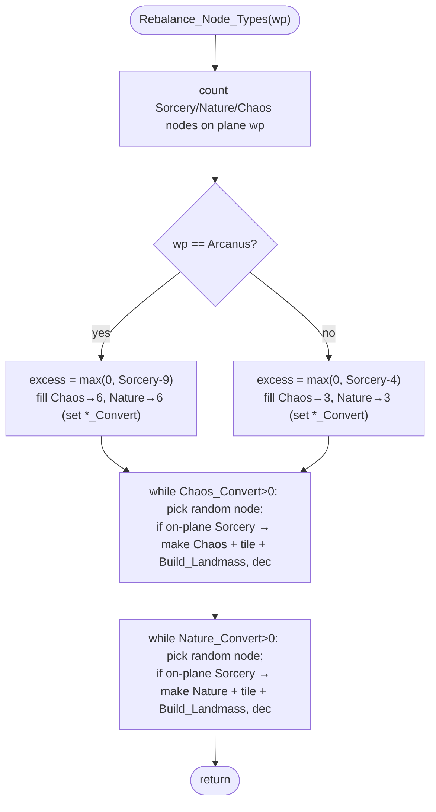

MAPGEN-Rebalance_Node_Types.md

C:\STU\devel\STU-Extras\Piethawn\Piethawn\out\MAGIC\ovr051\Rebalance_Node_Types.asm
C:\STU\devel\STU-Extras\Piethawn\Piethawn\out\MAGIC\ovr051\Rebalance_Node_Types.c

Init_New_Game()
    |-> Generate_Nodes();
    |-> Draw_Building_The_Worlds(50);
    |-> Rebalance_Node_Types(ARCANUS_PLANE);   [MAPGEN.c:333]
    |-> Rebalance_Node_Types(MYRROR_PLANE);    [MAPGEN.c:334]

---

# `Rebalance_Node_Types` — Walkthrough

| Function | Location | Role |
|---|---|---|
| `Rebalance_Node_Types` | [MAPGEN.c:1321-1438](../../MoM/src/MAPGEN.c#L1321-L1438) | Caps Sorcery-node over-representation on one plane: if there are too many Sorcery nodes, converts a number of random Sorcery nodes into Chaos and Nature nodes so each realm reaches a minimum count. |
| `Rebalance_Node_Types__GEMINI` | [MAPGEN.c:1441-1568](../../MoM/src/MAPGEN.c#L1441-L1568) (inside `#if 0`) | Reference IDA→C translation (= Piethawn `*.c`). Matches the asm; kept for cross-reference. Not OG-truth. |

Verified faithful to the disassembly `Rebalance_Node_Types.asm` throughout, carrying one deliberately-preserved OG oddity (the `Excess_Sorcery` count is never decremented — see below).

## Purpose

Called once per plane immediately after `Generate_Nodes` (`Set_Node_Type` tends to over-assign Sorcery). It guarantees a minimum spread of node realms on the plane:

- **Arcanus** — if more than 9 Sorcery nodes, top up Chaos and Nature to **6 each**.
- **Myrror** — if more than 4 Sorcery nodes, top up Chaos and Nature to **3 each**.

It does this by counting node types, computing how many Chaos/Nature conversions are needed, then converting that many randomly-chosen Sorcery nodes on the plane — updating each node's `type`, its world-map tile (`tt_ChaosNode` / `tt_NatureNode`), and re-running `Build_Landmass`.

Node types (`e_NODE_TYPE`): `nt_Sorcery = 0`, `nt_Nature = 1`, `nt_Chaos = 2`.

## How it's reached

| Caller | Site | Notes |
|---|---|---|
| `Init_New_Game` / MAPGEN | [MAPGEN.c:333-334](../../MoM/src/MAPGEN.c#L333-L334) | Once for `ARCANUS_PLANE`, once for `MYRROR_PLANE`, after `Generate_Nodes`. |

## Structure



## Code walk

Line refs are production [MAPGEN.c](../../MoM/src/MAPGEN.c); cross-checked against `Rebalance_Node_Types.asm` (the authority). `Random(n)` returns `1..n` ([random.c:263](../../MoX/src/random.c#L263)). `s_NODE` is `0x30` (48) bytes.

### Count node types ([1331-1345](../../MoM/src/MAPGEN.c#L1331-L1345))

Zero the three counters, then for each of the 30 nodes on plane `wp`, `switch(_NODES[node_idx].type)` increments `Sorcery_Count` / `Nature_Count` / `Chaos_Count`. (Asm `loc_44A2C`: `or ax,ax`→Sorcery, `cmp 1`→Nature, `cmp 2`→Chaos; other types counted nowhere — production's switch has no `default`, matching.)

### Compute conversion targets ([1346-1403](../../MoM/src/MAPGEN.c#L1346-L1403))

Per plane, set `Excess_Sorcery = max(0, Sorcery_Count - threshold)` (threshold 9 Arcanus / 4 Myrror), then top each realm up to its target:

```c
while((Chaos_Count < 6) && (Excess_Sorcery > 0)) { Chaos_Count++;  Chaos_Convert++;  }
while((Nature_Count < 6) && (Excess_Sorcery > 0)) { Nature_Count++; Nature_Convert++; }
```

(Myrror uses 3/3.) `Chaos_Convert` / `Nature_Convert` end up as the number of Sorcery→Chaos / Sorcery→Nature conversions to perform. See the [OG oddity](#og-quirk-preserved) about `Excess_Sorcery`.

### Convert random Sorcery nodes ([1406-1437](../../MoM/src/MAPGEN.c#L1406-L1437))

Two identical loops (Chaos then Nature). Each rejection-samples a node and converts only on-plane Sorcery nodes:

```c
while(Chaos_Convert > 0) {
    random_node_idx = Random(30) - 1;
    if(_NODES[random_node_idx].wp == wp) {
        if(_NODES[random_node_idx].type == nt_Sorcery) {
            _NODES[random_node_idx].type = nt_Chaos;
            p_world_map[wp][_NODES[random_node_idx].wy][_NODES[random_node_idx].wx] = tt_ChaosNode;
            Build_Landmass(wp, _NODES[random_node_idx].wx, _NODES[random_node_idx].wy);  // "already done before"
            Chaos_Convert--;
        }
    }
}
```

A miss (wrong plane or not Sorcery) just re-rolls without decrementing — matching the asm (`jmp` back to the loop test). Termination is guaranteed: the conversion target never exceeds the available Sorcery surplus (e.g. on Arcanus the total needed is `Sorcery_Count - 4`, always ≤ `Sorcery_Count`). The Nature loop is the same with `nt_Nature` / `tt_NatureNode`.

## OG quirk preserved

**`Excess_Sorcery` is computed but never decremented** ([1365-1374](../../MoM/src/MAPGEN.c#L1365-L1374), [1393-1402](../../MoM/src/MAPGEN.c#L1393-L1402)). The fill loops gate on `Excess_Sorcery > 0` as a **boolean** — so any surplus ≥ 1 tops Chaos/Nature all the way to the target (6/6 or 3/3), and "1 has the same result as 7" (the source `INCONSISTENT` note). The asm confirms it (`loc_44AA7`/`loc_44AAD`: `inc Chaos_Count; inc Chaos_Convert` then `cmp Excess_Sorcery, 0; jg` — no `dec`). OG-faithful; preserve. Had it decremented, the surplus magnitude would bound the conversions and the realm spread would scale with it.

## Notes vs `__GEMINI`

The `__GEMINI` translation matches the asm — same counts, thresholds (9/6 Arcanus, 4/3 Myrror), the never-decremented `Excess_Sorcery`, the `Random(30)-1` rejection sampling, and the `0/1/2 = Sorcery/Nature/Chaos` type mapping. Clean cross-reference (it indexes `_world_maps` manually where production uses the `p_world_map` view — equivalent).

## Sub-functions / external calls

- **`Random`** ([random.c:263](../../MoX/src/random.c#L263)) — returns `1..n`; `Random(30) - 1` picks a node index 0-29.
- **`Build_Landmass(wp, wx, wy)`** — re-stamps the node tile (the source notes it's redundant here — "already done before").
- **`_NODES[]`**, **`p_world_map`** — globals read/written.

## Related references

- `C:\STU\devel\STU-Extras\Piethawn\Piethawn\out\MAGIC\ovr051\Rebalance_Node_Types.asm` — IDA Pro 5.5 disassembly (the authority).
- [MAPGEN.c:1441-1568](../../MoM/src/MAPGEN.c#L1441-L1568) — `__GEMINI` reference translation (`#if 0`).
- [MAPGEN.c:333-334](../../MoM/src/MAPGEN.c#L333-L334) — call sites (Arcanus / Myrror).
- [MAPGEN-Generate_Nodes.md](MAPGEN-Generate_Nodes.md) — the preceding step that places the nodes and sets their initial types.
- `MOM_DAT.h` — `e_NODE_TYPE` (`nt_Sorcery`/`nt_Nature`/`nt_Chaos` = 0/1/2), `NUM_NODES` (30); `TerrType.h` — `tt_ChaosNode` (0xAA) / `tt_NatureNode` (0xA9).
