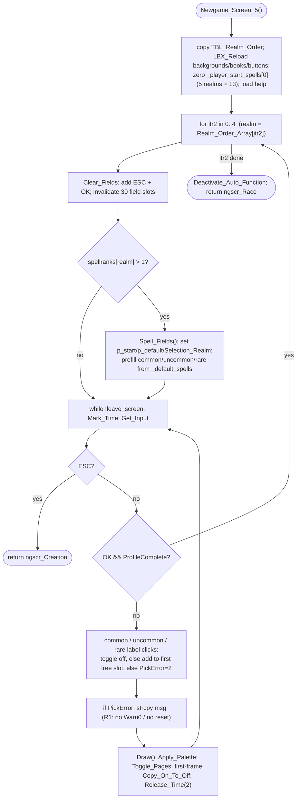

NEWGAME-Newgame_Screen_5.md

C:\STU\devel\STU-Extras\Piethawn\Piethawn\out\MAGIC\ovr050\Newgame_Screen_5.asm
C:\STU\devel\STU-Extras\Piethawn\Piethawn\out\MAGIC\ovr050\Newgame_Screen_5.c

New_Game (state machine)
|-> newgame_state = Newgame_Screen_5();        [NewGame.c:1510]
    |-> Newgame_Screen_5_Spell_Fields()        [NewGame.c:4882]
    |-> Newgame_Screen_5_Draw()                [NewGame.c:5138]

---

# `Newgame_Screen_5` — Walkthrough

| Function | Location | Role |
|---|---|---|
| `Newgame_Screen_5` | [NewGame.c:4766-5158](../../MoM/src/NewGame.c#L4766-L5158) | The custom-wizard **"Select Spells"** screen. For each of the 5 magic realms (in `TBL_Realm_Order`) where the human has >1 book, pre-fills the realm's default starting spells and runs an input loop letting the player toggle common/uncommon/rare picks until the profile is complete. Returns `ngscr_Creation` (ESC) or `ngscr_Race`. |
| `Newgame_Screen_5__GEMINI` | [NewGame.c:5159+](../../MoM/src/NewGame.c#L5159) (inside `#if 0`) | Reference IDA→C translation (= Piethawn `*.c`), kept for comparison. Matches the asm — including the error block production currently omits (see [R1](#reconstruction-gaps)). |

Verified against the disassembly `Newgame_Screen_5.asm`. Structurally 1:1 **except** the pick-error display block is not reconstructed ([R1](#reconstruction-gaps)) — flagged in source by the `@note This function is WIP`. No `Random()` calls (this is a UI screen; RNG-neutral).

## Purpose

One screen in the new-game state machine, reached only for a **custom** wizard who chose to pick spells manually. It writes the human player's hand-picked starting spells into `_player_start_spells[0]`. The outer loop runs once per realm (5 screens back-to-back); realms with ≤1 book are skipped (no spells to choose) and the screen advances immediately.

## How it's reached

| Caller | Site | Notes |
|---|---|---|
| `New_Game` | [NewGame.c:1510](../../MoM/src/NewGame.c#L1510) | `newgame_state = Newgame_Screen_5();` — one node in the new-game screen dispatch. |

## Structure

## Code walk

Line refs are production [NewGame.c](../../MoM/src/NewGame.c); cross-checked against `Newgame_Screen_5.asm` (the authority). Stack-var name map (asm → production): `Common_Spells` → `spellrank_cnt`, `LabelBox_Index` → `section_idx`, `Error_Message` → `message`; global `NEWG_SpellSel_Realm` → `m_select_spells_realm`; tables `TBL_SpellsPerBook_C/U/R` → `m_select_count_common/uncommon/rare`.

### Asset load + reset ([4786-4841](../../MoM/src/NewGame.c#L4786-L4841))

`memcpy(Realm_Order_Array, TBL_Realm_Order, 10)` (= asm `SCOPY@`, 10 bytes = 5 `int16_t`); `LBX_Reload`/`LBX_Reload_Next` for the background, the right overlay (47), the 3 dark regions (48-50) + picks-back (51), OK buttons (42/43), the 15 book images (24-38), warning-box halves (44/45), and the check marker (52); `spellpicks_count = 0`; `NEWG_PickError = 0`; `Assign_Auto_Function(Newgame_Screen_5_Draw, 1)`. **Faithful.**

### Zero start-spells + help ([4843-4853](../../MoM/src/NewGame.c#L4843-L4853))

`for itr in 0..12` zero `_player_start_spells[0].realms[sbr_Nature/Sorcery/Chaos/Life/Death].spells[itr]` — all 5 realm blocks (asm zeroes the same byte offsets `+0/+1Ah/+34h/+4Eh/+68h`). Then `LBX_Load_Data_Static` for the "Select Spells" help entry (36). **Faithful.** Note the realm-index convention here is **identity/`sbr` order** — see the [cross-function note](#cross-function-observation-dedu).

### Per-realm setup ([4855-4933](../../MoM/src/NewGame.c#L4855-L4933))

`for itr2 in 0..4`: `leave_screen = TRUE`; `m_select_spells_realm = Realm_Order_Array[itr2]`; `NEWG_ProfileComplete = FALSE`; `Clear_Fields`; add ESC hot-key (`_quit_button`) and the hidden OK field at `(251,181,282,196)` (`_ok_button`); invalidate all 30 `m_newgame_fields`. If `spellranks[realm] > 1`:
- `Newgame_Screen_5_Spell_Fields()`; `leave_screen = FALSE`; `First_Draw_Done = FALSE`.
- The 5 `if(m_select_spells_realm == sbr_*)` blocks point `p_start_spells`/`p_default_spells` at that realm's block and set `Selection_Realm` (asm `loc_41CB9`-`loc_41D11`, same offsets). **Faithful.**
- `spellrank_cnt = spellranks[realm] - 1`; `spellrank_idx = spellrank_cnt - 1` (asm `Common_Spells`/`spellrank_idx`).
- **Prefill** ([4920-4931](../../MoM/src/NewGame.c#L4920-L4931)): copy `m_select_count_common[spellrank_idx]` defaults into `p_start_spells[itr]`, `m_select_count_uncommon[...]` into `p_start_spells[10+itr]`, `m_select_count_rare[...]` into `p_start_spells[12+itr]` (realm block is 13 words: common at 0, uncommon at 10, rare at 12). **Faithful.**

### Input loop ([4935-5149](../../MoM/src/NewGame.c#L4935-L5149))

`while(leave_screen == FALSE)`: `Mark_Time`; `input_field_idx = Get_Input`.
- **ESC** → `return ngscr_Creation` ([4941](../../MoM/src/NewGame.c#L4941); asm `mov ax,4`). **OK** → leave only if `NEWG_ProfileComplete != FALSE` ([4943-4949](../../MoM/src/NewGame.c#L4943-L4949)). **Faithful.**
- **Click handling**, gated by `spellrank_cnt > 0 && First_Draw_Done && input_field_idx != 0` ([4950-4954](../../MoM/src/NewGame.c#L4950-L4954)). Three near-identical sections — **common** (gated `0 < count < 10`, [4958-5010](../../MoM/src/NewGame.c#L4958-L5010)), **uncommon** (`count > 0`, [5014-5062](../../MoM/src/NewGame.c#L5014-L5062)), **rare** (`count > 0`, [5069-5117](../../MoM/src/NewGame.c#L5069-L5117)) — each laid out as a 2×5 label grid. For the clicked field: first pass removes the spell if already picked (`p_start_spells[...] = spl_NONE`); else second pass adds it to the first free slot; else `NEWG_PickError = 2`. `section_idx` (asm `LabelBox_Index`) advances once per emitted section, so uncommon/rare field indices are offset by `section_idx*10`. **Faithful**, including the OG quirk in the add-pass condition (see [B1](#og-quirks-preserved)).
- **Error display** ([5127-5134](../../MoM/src/NewGame.c#L5127-L5134)) — **incomplete; see [R1](#reconstruction-gaps).**
- **Render** ([5136-5147](../../MoM/src/NewGame.c#L5136-L5147)): when `leave_screen == FALSE`, `Newgame_Screen_5_Draw`; `Apply_Palette`; `Toggle_Pages`; on the first frame set `First_Draw_Done` and `Copy_On_To_Off_Page`; `Release_Time(2)`. **Faithful.**

### Exit ([5153-5156](../../MoM/src/NewGame.c#L5153-L5156))

`Deactivate_Auto_Function`; `return ngscr_Race` (asm `mov ax,6`). **Faithful** — the unconditional `ngscr_Race` is a preserved OG quirk (see [B2](#og-quirks-preserved)).

## Reconstruction gaps

| # | Line | What |
|---|---|---|
| R1 | [5127-5134](../../MoM/src/NewGame.c#L5127-L5134) | The pick-error block only does the `switch(NEWG_PickError)` → `stu_strcpy(message, …)`. The asm (`loc_4215B`) and GEMINI ([5406-5416](../../MoM/src/NewGame.c#L5406-L5416)) then do `Deactivate_Auto_Function(); Warn0(message); Assign_Auto_Function(Newgame_Screen_5_Draw, 1); NEWG_PickError = 0;`. Production omits all four. **Consequences:** the warning box is never shown, and `NEWG_PickError` is never cleared — once set to `2` it stays `2`, so the `strcpy` re-runs every frame and the error state is sticky. `message[150]` is written but otherwise dead. This is the function's `@note … WIP` gap; restore the four statements to be 1:1. |

## OG quirks preserved

| # | Line | What |
|---|---|---|
| B1 | [4994](../../MoM/src/NewGame.c#L4994) / [5046](../../MoM/src/NewGame.c#L5046) / [5101](../../MoM/src/NewGame.c#L5101) | The add-pass condition `… || (m_select_count_X[spellrank_idx] == ST_TRUE)` compares a **count** to `ST_TRUE` (==1). It's faithful to the asm (`cmp TBL_SpellsPerBook_X[spellrank_idx], e_ST_TRUE; jnz`). Since the count table is `{1,2,…}`, this branch fires only when the realm has exactly one slot of that rarity (`spellrank_idx == 0`), making a click in a single-slot section always overwrite. Odd but OG. |
| B2 | [5156](../../MoM/src/NewGame.c#L5156) | `return ngscr_Race` is unconditional. drake178's note: this prevents moving backwards when a realm has no spells to select. OG behavior — preserved. |

## Cross-function observation (DEDU)

`Newgame_Screen_5` indexes `_player_start_spells[0].realms[]` in **identity/`sbr` order** (Nature→0, Sorcery→1, Chaos→2, Life→3, Death→4 — asm byte offsets `+0/+1Ah/+34h/+4Eh/+68h`). But [`Init_Computer_Players_Spell_Library`](INITGAME-Init_Computer_Players_Spell_Library.md) reads the **same array** in the `pssr_*`-permuted order (Nature→0, Death→1, Life→2, Sorcery→3, Chaos→4 — offsets `+0/+1Ah/+34h/+4Eh/+68h` mapped to *different* `sbr`s). So a realm like Chaos is **written** to realm-slot 2 here but **read** from realm-slot 4 there. Both functions are individually 1:1 with their own asm, so this is an OG-level inconsistency, not a reconstruction error — flagged for cross-checking whether the human player's hand-picked non-Nature spells survive into `Init_Computer_Players_Spell_Library`. Not resolved here.

## Notes vs `__GEMINI`

GEMINI matches the asm, including the full error block ([5406-5416](../../MoM/src/NewGame.c#L5406-L5416)) that production drops (R1). It keeps the asm globals/vars verbatim (`NEWG_SpellSel_Realm`, `Common_Spells`, `LabelBox_Index`, `Error_Message`, `TBL_SpellsPerBook_*`, `j_Warn0`); production renames them. Otherwise behaviorally identical.

## Sub-functions / external calls

- **`Newgame_Screen_5_Spell_Fields`** ([NewGame.c:5193](../../MoM/src/NewGame.c#L5193)) — builds the clickable spell-label fields for the current realm.
- **`Newgame_Screen_5_Draw`** ([NewGame.c:5344](../../MoM/src/NewGame.c#L5344)) — per-frame render; registered as the auto-function.
- **`LBX_Reload` / `LBX_Reload_Next` / `LBX_Load_Data_Static`** — asset loaders.
- **`Add_Hot_Key` / `Add_Hidden_Field` / `Clear_Fields` / `Get_Input`** — GUI field plumbing.
- **`Warn0`** ([GENDRAW.c:494](../../MoX/src/GENDRAW.c#L494)) — modal warning box (**missing at the R1 site**).
- **`Mark_Time` / `Release_Time` / `Apply_Palette` / `Toggle_Pages` / `Copy_On_To_Off_Page` / `Assign_Auto_Function` / `Deactivate_Auto_Function`** — frame/timing/page plumbing.
- Globals: **`_player_start_spells`**, **`_default_spells`**, **`_players`**, **`m_select_spells_realm`** (`NEWG_SpellSel_Realm`), **`NEWG_ProfileComplete`**, **`NEWG_PickError`**, **`spellpicks_count`**, **`m_newgame_fields`**, **`m_select_count_common/uncommon/rare`**, **`TBL_Realm_Order`** (`{Life, Death, Chaos, Nature, Sorcery}`).

## Related references

- `C:\STU\devel\STU-Extras\Piethawn\Piethawn\out\MAGIC\ovr050\Newgame_Screen_5.asm` — IDA Pro 5.5 disassembly (the authority; ESC `mov ax,4`, end `mov ax,6`, error block at `loc_4215B`).
- [NewGame.c:5159+](../../MoM/src/NewGame.c#L5159) — `__GEMINI` reference translation (`#if 0`).
- [NewGame.c:1510](../../MoM/src/NewGame.c#L1510) — the state-machine call site.
- [INITGAME-Init_Computer_Players_Spell_Library.md](INITGAME-Init_Computer_Players_Spell_Library.md) — consumes `_player_start_spells` (see the [cross-function note](#cross-function-observation-dedu)).
- `NewGame.h` — `ngscr_*` (`ngscr_Creation`=4, `ngscr_Race`=6); `MOM_DAT.h` — `sbr_*`, `s_Init_Base_Realms` layout.
