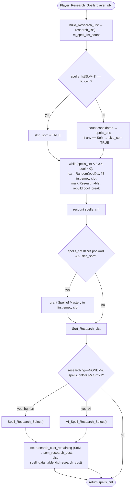

Spells128-Player_Research_Spells.md

C:\STU\devel\STU-Extras\Piethawn\Piethawn\out\WIZARDS\ovr128\Player_Research_Spells.asm
C:\STU\devel\STU-Extras\Piethawn\Piethawn\out\WIZARDS\ovr128\Player_Research_Spells.c

~ 'New Game' / 'Load Game'  -> PreInit_Overland() |-> Player_Research_Spells()  (per player)

Loaded_Game_Update()
    |-> Init_Overland()
        |-> PreInit_Overland()
            |-> Player_Research_Spells()
                |-> Build_Research_List()

---

# `Player_Research_Spells` — Walkthrough

| Function | Location | Role |
|---|---|---|
| `Player_Research_Spells` | [Spells128.c:78-235](../../MoM/src/Spells128.c#L78-L235) (WZD `o128p01`; drake178 `WIZ_RefreshResearch`) | Fills any empty slots in a wizard's research-candidate list (`research_spells[8]`) from the pool of researchable spells, makes sure a wizard with candidates is researching *something* (prompting the human or the AI picker), and returns the candidate count. |

> **Disassembly fidelity:** verified against `ovr128` [Player_Research_Spells.asm](../../../STU-Extras/Piethawn/Piethawn/out/WIZARDS/ovr128/Player_Research_Spells.asm) — control flow matches 1:1.

## Purpose

A wizard tracks up to `NUM_RESEARCH_SPELLS` (= 8) **research candidates** in `research_spells[]`. This routine:

1. Rebuilds the eligible pool via `Build_Research_List` (lowest-rarity spell from each realm; count returned in the global `m_spell_list_count`, the OG's `GUI_Multipurpose_Int`).
2. Counts existing candidates and notes whether Spell of Mastery is already known/queued (`skip_som`).
3. Fills empty candidate slots by drawing random pool entries until full or the pool is exhausted.
4. If the list still isn't full, the pool is empty, and SoM isn't excluded, grants **Spell of Mastery** as a candidate.
5. Sorts the list, and — from turn 2 on — prompts research selection (human dialog or AI picker) if nothing is being researched yet, then sets `research_cost_remaining` for the chosen spell.

Returns `spells_cnt` (final candidate count).

## How it's reached

| Caller | Site | Notes |
|---|---|---|
| `PreInit_Overland` (New/Load Game) | [LoadScr.c:1030](../../MoM/src/LoadScr.c#L1030) | Per-player loop during overland init — first population of `research_spells[]`. |
| `Next_Turn` (per-turn) | [NEXTTURN.c:3751](../../MoM/src/NEXTTURN.c#L3751) | Refreshes candidates each turn; return value used. |
| `Next_Turn` (post-learn) | [NEXTTURN.c:3773](../../MoM/src/NEXTTURN.c#L3773) | After a spell is learned and `research_spells[]` is cleared. |
| `WIZ_AddSpellRank__WIP` | [Spells128.c:1098](../../MoM/src/Spells128.c#L1098) | After granting a spell rank. |

On turn 1 the auto-select branch is skipped (`_turn > 1` guard), so the New-Game pass only populates and sorts the list.

## Structure



## Code walk

### Phase 1 — Setup + pool build ([92-99](../../MoM/src/Spells128.c#L92-L99))

`spells_max = NUM_RESEARCH_SPELLS` (8); `m_spell_list_count = 0`; allocate the 200-byte `research_list` scratch (`Near_Allocate_First`); `Build_Research_List` fills it and sets `m_spell_list_count`. (A `/* CLAUDE */` `RESEARCH_SETUP` diagnostic block follows at [101-114](../../MoM/src/Spells128.c#L101-L114) — debug-only.)

### Phase 2 — SoM-known check + candidate count ([117-134](../../MoM/src/Spells128.c#L117-L134))

```c
if(spells_list[spl_Spell_Of_Mastery - 1] == sls_Known) { skip_som = ST_TRUE; }   // SoM already learned
else {
    for(itr = 0; itr < spells_max; itr++)
        if(research_spells[itr] > spl_NONE) { spells_cnt++; if(== spl_Spell_Of_Mastery) skip_som = ST_TRUE; }
}
```

If SoM is already known, the count loop is skipped entirely (matches asm `jmp loc_ABACE`), leaving `spells_cnt == 0`. Otherwise existing candidates are counted and a queued SoM sets `skip_som`.

### Phase 3 — Fill loop ([137-163](../../MoM/src/Spells128.c#L137-L163))

```c
while((spells_cnt < spells_max) && (m_spell_list_count > 0)) {
    research_list_idx = (Random(m_spell_list_count) - 1);
    spells_cnt++;
    for(itr = 0; itr < spells_max; itr++) {
        if(research_spells[itr] == spl_NONE) {
            research_spells[itr] = research_list[research_list_idx];
            spell_realm_idx = ((research_list[research_list_idx] - 1) % NUM_SPELLS_PER_MAGIC_REALM);
            spell_realm     = ((research_list[research_list_idx] - 1) / NUM_SPELLS_PER_MAGIC_REALM);
            spells_list[(spell_realm * NUM_SPELLS_PER_MAGIC_REALM) + spell_realm_idx] = sls_Researchable;
            Build_Research_List(player_idx, &research_list[0]);   // rebuild pool (chosen spell now Researchable)
            break;
        }
    }
}
```

Draws a random pool entry, drops it into the **first** empty candidate slot, marks that spell `sls_Researchable`, and rebuilds the pool. The `break` ([160](../../MoM/src/Spells128.c#L160)) is OG-faithful (asm `jmp loc_ABB79`) — one fill per draw; without it every empty slot would take the *same* `research_list_idx` (duplicates).

### Phase 4 — Recount + Spell-of-Mastery grant ([169-197](../../MoM/src/Spells128.c#L169-L197))

```c
spells_cnt = 0;
for(itr = 0; itr < spells_max; itr++)
    if(research_spells[itr] > spl_NONE) spells_cnt++;

if((spells_cnt < spells_max) && (m_spell_list_count == 0) && (skip_som == ST_FALSE)) {
    for(itr = 0; itr < spells_max; itr++) {
        if(research_spells[itr] == spl_NONE) { research_spells[itr] = spl_Spell_Of_Mastery; break; }
    }
}
```

Recount the live candidates. When the list can't be filled from the (now empty) pool and SoM isn't excluded, grant **Spell of Mastery** into the first empty slot. The grant loops from index 0 and `break`s after one assignment — matching the OG's `xor si,si` + loop + `jmp loc_ABBFF` ([asm:196-224](../../../STU-Extras/Piethawn/Piethawn/out/WIZARDS/ovr128/Player_Research_Spells.asm#L196-L224)).

### Phase 5 — Sort + auto-select + cost ([200-229](../../MoM/src/Spells128.c#L200-L229))

```c
Sort_Research_List(player_idx, spells_cnt);

if((researching_spell_idx == spl_NONE) && (spells_cnt > 0) && (_turn > 1)) {
    if(player_idx == HUMAN_PLAYER_IDX) Spell_Research_Select();
    else                              AI_Spell_Research_Select(player_idx);

    if(researching_spell_idx == spl_Spell_Of_Mastery)
        research_cost_remaining = som_research_cost;
    else
        research_cost_remaining = spell_data_table[researching_spell_idx].research_cost;
}
return spells_cnt;   // [233]
```

If nothing is being researched and there are candidates (turn ≥ 2), prompt the human dialog or run the AI picker, then initialize `research_cost_remaining` ([MOM_DAT.h:1503](../../MoX/src/MOM_DAT.h#L1503)) for the just-selected spell — SoM uses the wizard's `som_research_cost`, everything else the spell's `research_cost`. Matches the OG ([asm:252-284](../../../STU-Extras/Piethawn/Piethawn/out/WIZARDS/ovr128/Player_Research_Spells.asm#L252-L284)).

---

## `Build_Research_List` — research pool builder (`o128p02`)

[Spells128.c:246-292](../../MoM/src/Spells128.c#L246-L292) (WZD `o128p02`; drake178 `WIZ_GetResearchList`). Compiles the **lowest-rarity researchable (`sls_Knowable`) spells available to a player** into `research_list[]` and sets the global `m_spell_list_count`. Called by `Player_Research_Spells` (Phases 1 and 3) to (re)build the eligible pool. Disassembly: [Build_Research_List.asm](../../../STU-Extras/Piethawn/Piethawn/out/WIZARDS/ovr128/Build_Research_List.asm).

### Pass 1 — the five realms ([253-275](../../MoM/src/Spells128.c#L253-L275))

For each of the 5 realms, scan its 40 spells. `rarity = itr_spells / 10` is the rarity tier (0 = common … 3 = very rare). While no `Knowable` has been found (`flag == FALSE`), `rarity` follows the scan; on the first `Knowable`, `flag` latches and `rarity` freezes at that tier. Once the tier exceeds the frozen `rarity` (`(itr_spells / 10) > rarity`), the inner loop **breaks to the next realm** ([264-267](../../MoM/src/Spells128.c#L264-L267)) — the OG's `jmp loc_ABD05` ([asm:39-40](../../../STU-Extras/Piethawn/Piethawn/out/WIZARDS/ovr128/Build_Research_List.asm#L39-L40)). Net: **every `Knowable` in the lowest non-empty rarity tier of each realm** is appended (as the 1-based `realm*40 + idx + 1` spell index).

### Pass 2 — the Arcane realm ([277-290](../../MoM/src/Spells128.c#L277-L290))

Scans the Arcane realm (`sbr_Arcane` = 5, spell offset 200) indices 0..11, appending each `Knowable` as spell `idx + 201`. Once a `Knowable` is found (`flag = TRUE`), reaching index **3** (`spl_Disenchant_Area` = 204) or **8** (`spl_Awareness` = 209) **terminates** the scan ([280-283](../../MoM/src/Spells128.c#L280-L283)) — matching the OG's `jmp @@Done` ([asm:82-89](../../../STU-Extras/Piethawn/Piethawn/out/WIZARDS/ovr128/Build_Research_List.asm#L82-L89)).

## Sub-functions / external calls

- **`Build_Research_List`** ([Spells128.c:246](../../MoM/src/Spells128.c#L246)) — see the dedicated section above.
- **`Sort_Research_List`** — orders the candidate list.
- **`Spell_Research_Select`** / **`AI_Spell_Research_Select`** — human dialog / AI picker that sets `researching_spell_idx`.
- **`Random(m_spell_list_count)`** — draws a pool index (1..n; the `- 1` makes it 0-based).
- **`Near_Allocate_First(200)`** — near-heap scratch arena for `research_list[]` (not freed; reset elsewhere — standard pattern).
- **`m_spell_list_count`** — the OG global `GUI_Multipurpose_Int`; eligible-pool size.

## Related references

- `C:\STU\devel\STU-Extras\Piethawn\Piethawn\out\WIZARDS\ovr128\Player_Research_Spells.asm` / `.c`, `Build_Research_List.asm` — IDA Pro 5.5 disassembly.
- [LoadScr.c:960 — `PreInit_Overland`](../../MoM/src/LoadScr.c#L960) — New/Load-Game caller.
- [Spells128.c:246 — `Build_Research_List`](../../MoM/src/Spells128.c#L246) — the pool builder.
