NEXTTURN-Create_Unit.md

C:\STU\devel\STU-Extras\Piethawn\Piethawn\out\WIZARDS\ovr121\Create_Unit__WIP.asm
C:\STU\devel\STU-Extras\Piethawn\Piethawn\out\WIZARDS\ovr121\Create_Unit__WIP.c

Multiple call sites — see [How it's reached](#how-its-reached).

---

# `Create_Unit` — Walkthrough

| Function | Location | Role |
|---|---|---|
| `Create_Unit` | [NEXTTURN.c:952-1111](../../MoM/src/NEXTTURN.c#L952-L1111) | Universal unit-spawn helper. Checks unit-count caps (`_units <= 950` for AI, `<= 980` unless override, hard cap `< MAX_UNIT_COUNT = 1000`), initializes ~20 `s_UNIT` fields at slot `_units`, then dispatches on the `R_Param` overload: `[0, 2000)` → treat as `city_idx` (apply Fighter's Guild / War College / Altar of Battle XP tiers, city's best weapon, settler-triggered `Destroy_City` with fortress-safety abort, alchemy quality, Chaos-Channel); `-1` → default (Level 0); `< -1` → treat as `-(TBL_Experience index + 1)` for level-neg spawn; `2000` → override caps and skip both XP branches (used by lair guards and Demon Lord). On success, `_units++` and returns `ST_TRUE`; on failure returns `ST_FALSE`. |

Verified faithful to the disassembly `Create_Unit__WIP.asm` throughout (structure 1:1, 507-line asm). Note the OG asm/c files on disk retain the `__WIP` suffix — IDA output naming is decoupled from the production function name.

## Purpose

The single entry point for creating a new unit at `_UNITS[_units]`. Handles four distinct call-shapes via a magic-value `R_Param`:

| `R_Param` | Semantic | Callers |
|---|---|---|
| `[0, 2000)` | city_idx — the new unit is built in this city; apply XP tiers (Fighter's Guild → Regular, War College → Veteran, Altar of Battle → Elite), city's best weapon (from `City_Best_Weapon`), and — for `UA_CREATEOUTPOST` units (settlers) — decrement city population + destroy city if it hits 0. | `City_Apply_Production` at [NEXTTURN.c:2170](../../MoM/src/NEXTTURN.c#L2170) |
| `-1` / `ST_UNDEFINED` | Default. Init fields, no XP bump, no city interaction. | `WIZ_HireHero`, `Cast_Spell_Overland` (summon), `Floating_Island`, spell effects. |
| `< -1` | Level-neg: `-(TBL_Experience_index + 1)`. Values `-2..-9` map to XP entries `1..8` (Recruit → Champion). Sets XP + `Calc_Unit_Level`. | `Make_Raiders` (turn-scaled `-4/-3/-2/-1`), `Make_Monsters` (hard-coded `-1`, so no XP bump). |
| `2000` | Override caps. Bypasses the `_units <= 950 / 980` cap gates entirely (still respects the hard `_units < MAX_UNIT_COUNT` limit) and skips both XP branches — units come out with default XP=0 Level=0. | `Lair_Make_Guardians`, Demon Lord summon (`Combat.c:15724`), guard-reveal calls in Combat.c. |

The function returns `ST_TRUE` on success (unit created, `_units` incremented) and `ST_FALSE` on failure (cap hit, or settler tried to destroy a fortress).

## How it's reached

| Caller | Site | R_Param | Notes |
|---|---|---|---|
| `Make_Raiders` NPC event | [AIDATA.c:561](../../MoM/src/AIDATA.c#L561) | `raiders_level_neg` (`-4/-3/-2/-1`) | Level-neg by turn. |
| `Make_Monsters` NPC event | [AIDATA.c:325](../../MoM/src/AIDATA.c#L325) | `-1` | Monsters always default-level. |
| `City_Apply_Production` | [NEXTTURN.c:2170](../../MoM/src/NEXTTURN.c#L2170) | `city_idx` | The city built the unit. |
| `WIZ_HireHero` | [HIRE.c:815](../../MoM/src/HIRE.c#L815) | `ST_UNDEFINED` | Merc/hero spawn at fortress. |
| Lair reveals (Combat) | [Combat.c:4291](../../MoM/src/Combat.c#L4291), [4305](../../MoM/src/Combat.c#L4305) | `2000` | Guard1/Guard2 spawn (override caps). |
| Summon spells in combat | [Combat.c:11793](../../MoM/src/Combat.c#L11793), [15724](../../MoM/src/Combat.c#L15724) | `2000` | wp=9 combat plane. |
| `Cast_Spell_Overland` (summon) | [OverSpel.c:842](../../MoM/src/OverSpel.c#L842) | `ST_UNDEFINED` | Summoned at fortress. |
| Overland spell effects | [Spells132.c:415](../../MoM/src/Spells132.c#L415), [1274](../../MoM/src/Spells132.c#L1274), [NEXTTURN.c:3506](../../MoM/src/NEXTTURN.c#L3506) | `ST_UNDEFINED` | Various summons/Floating Island. |

## Globals / external state

| Symbol | Effect |
|---|---|
| `_units` (`int16_t`) | Read + mutated. Cap-checked; incremented on success. |
| `_UNITS[]` (`s_UNIT[MAX_UNIT_COUNT]`) | Slot `_UNITS[_units]` populated with ~20 fields, then `_units++`. |
| `_CITIES[R_Param]` (city block only) | Read (`bldg_status[]`, `enchantments[ALTAR_OF_BATTLE]`, `wx/wy/wp`, `owner_idx`). Mutated for settlers (`population`, `Pop_10s`), or destroyed via `Destroy_City`. |
| `_FORTRESSES[0.._num_players)` | Read (position) inside the settler safety loop — if the doomed city's position matches any fortress, restore population and return FALSE. |
| `_players[owner_idx]` | Read (`alchemy`, `Globals[CHAOS_SURGE]`). |
| `_unit_type_table[unit_type]` | Read (`Move_Halves`, `Sight`, `Abilities`). |
| `TBL_Experience[9]` | Read for level-neg XP lookup. Layout: `{0, 20, 60, 120, 200, 300, 450, 600, 1000}` per IDA label naming (`Hero_or_Recruit`, `Myrmidon_or_Regular`, `Captain_or_Veteran`, `Cmdr_or_Elite`, ...). |
| `MAX_UNIT_COUNT = 1000` | Hard unit count cap ([MOX_DEF.h:713](../../MoX/src/MOX_DEF.h#L713)). |
| `HUMAN_PLAYER_IDX = 0`, `NEUTRAL_PLAYER_IDX = 5` | Player index constants. |

## Signature and locals

```c
int16_t Create_Unit(int16_t unit_type, int16_t owner_idx, int16_t wx, int16_t wy, int16_t wp, int16_t R_Param);
```

OG stack params (asm:4-9): `unit_type` and `owner_idx` are word-sized; `wx`, `wy`, `wp` are byte-sized (word-slotted but accessed as bytes); `_R_Param` is word-sized (spilled — the live copy is in the SI register aliased as `R_Param`).

Production locals:
- `did_create_unit` — DNE in Dasm; production's return-value shadow. Init `ST_FALSE`.
- `itr` — DI register in OG (`_DI_itr_players`), used for the fortress loop only.

OG stores `R_Param` in SI and `itr` in DI. Both are pushed/popped in the prologue/epilogue.

## Structure

```mermaid
flowchart TD
    Entry(["Create_Unit(type, owner, wx, wy, wp, R_Param)"])
    Cap1{"owner == HUMAN<br/>OR _units &lt;= 950<br/>OR R_Param == 2000?"}
    FailRet(["return ST_FALSE"])
    Cap2{"R_Param == 2000<br/>OR _units &lt;= 980?"}
    Cap3{"_units != MAX_UNIT_COUNT?"}
    Init["init ~20 fields at _UNITS[_units]"]
    Dispatch{"R_Param &lt; 0<br/>OR R_Param &gt;= 2000?"}
    LevelNegOuter{"R_Param &lt; -1?"}
    LevelNeg["R_Param = abs(R_Param) - 1<br/>XP = TBL_Experience[R_Param]<br/>Level = Calc_Unit_Level"]
    CityFG{"Fighter's Guild<br/>Built/Replaced?"}
    XPRegular["XP = UL_REGULAR"]
    CityWC{"War College<br/>Built/Replaced?"}
    XPVeteran["XP = UL_VETERAN"]
    CityAoB{"enchantments[<br/>ALTAR_OF_BATTLE] &gt; 0?"}
    XPElite["XP = UL_ELITE"]
    Weapon["mutations = City_Best_Weapon(R_Param)"]
    Settler{"unit has UA_CREATEOUTPOST?"}
    PopDec["city.population -= 1"]
    PopCheck{"city.population == 0?"}
    SetPop10s["city.Pop_10s = 3"]
    OwnerCheck{"city.owner_idx &gt;= _num_players?"}
    FortLoop["for itr in 0.._num_players:<br/>if city.pos == fortress[itr].pos"]
    FortRestore["city.population += 1<br/>if HUMAN: show msg"]
    Destroy["Destroy_City(R_Param)"]
    Alch{"players[owner].alchemy &gt; 0<br/>AND mutations == 0?"}
    Magic["mutations = wq_Magic"]
    CS{"Globals[CHAOS_SURGE] &gt; 0<br/>AND NOT UA_FANTASTIC?"}
    ChaosChan["Apply_Chaos_Channels(_units)"]
    Level["Level = Calc_Unit_Level(_units)"]
    Succ["_units++<br/>return ST_TRUE"]

    Entry --> Cap1
    Cap1 -->|no| FailRet
    Cap1 -->|yes| Cap2
    Cap2 -->|no| FailRet
    Cap2 -->|yes| Cap3
    Cap3 -->|no| FailRet
    Cap3 -->|yes| Init --> Dispatch
    Dispatch -->|yes: level-neg path| LevelNegOuter
    LevelNegOuter -->|yes| LevelNeg --> Succ
    LevelNegOuter -->|no| Succ
    Dispatch -->|no: city block| CityFG
    CityFG -->|yes| XPRegular --> CityWC
    CityFG -->|no| CityWC
    CityWC -->|yes| XPVeteran --> CityAoB
    CityWC -->|no| CityAoB
    CityAoB -->|yes| XPElite --> Weapon
    CityAoB -->|no| Weapon
    Weapon --> Settler
    Settler -->|no| Alch
    Settler -->|yes| PopDec --> PopCheck
    PopCheck -->|no| Alch
    PopCheck -->|yes| SetPop10s --> OwnerCheck
    OwnerCheck -->|no| Destroy
    OwnerCheck -->|yes| FortLoop
    FortLoop -->|match| FortRestore --> FailRet
    FortLoop -->|no match| Destroy
    Destroy --> Alch
    Alch -->|yes| Magic --> CS
    Alch -->|no| CS
    CS -->|yes| ChaosChan --> Level
    CS -->|no| Level
    Level --> Succ
```



## Code walk

Line refs are production [NEXTTURN.c](../../MoM/src/NEXTTURN.c); cross-checked against `Create_Unit__WIP.asm` (507 lines, on-disk OG filename).

### Phase 1 — Cap gates ([960-975](../../MoM/src/NEXTTURN.c#L960-L975))

```c
if(
    (owner_idx == HUMAN_PLAYER_IDX)
    ||
    (_units <= 950)
    ||
    (R_Param == 2000)
)
{
    if(
        (R_Param == 2000)
        ||
        (_units <= 980)
    )
    {
        if(_units != MAX_UNIT_COUNT)
        {
            // proceed
```

Three nested cap gates map onto asm:16-45:

- **Gate 1** (asm:19-27): human always allowed, else `_units <= 950` (soft AI cap, leaves 50 slots for player), else `R_Param == 2000` override. Otherwise return FALSE. Production `||` chain matches OG's `jz proceed` sequential tests.
- **Gate 2** (asm:32-45): `R_Param == 2000` override, else `_units <= 980` (leaves 20 slots for player + override cases). Otherwise return FALSE.
- **Gate 3** (asm:41-45): `_units != MAX_UNIT_COUNT` (== 1000). Absolute hard cap. Even `R_Param == 2000` cannot bypass this.

Return-FALSE path: `xor ax, ax; jmp @@Done` (asm:26-30, chained via `@@JmpJmpDone_Return_FALSE`). Production `goto Done_Failure` at line 1099.

### Phase 2 — Field init ([977-998](../../MoM/src/NEXTTURN.c#L977-L998))

Stores 20 fields at `_UNITS[_units]`. Maps 1:1 onto asm:47-195. Each OG store re-computes `_UNITS[_units]` base + `_units * 32` (`s_UNIT` is 32 bytes = `shl ax, 5`) — verbose but consistent. Production hoists via C's implicit indexing.

Fields stored: `wx`, `wy`, `wp`, `owner_idx`, `moves2_max` (from `_unit_type_table[unit_type].Move_Halves`), `type`, `Hero_Slot = ST_UNDEFINED`, `in_tower = ST_FALSE`, `Finished = ST_TRUE`, `moves2 = 0`, `Sight_Range` (from `_unit_type_table[unit_type].Sight`), `dst_wx = 0`, `dst_wy = 0`, `Status = us_Ready` (== 0), `Level = 0`, `XP = 0`, `Damage = 0`, `Draw_Priority = 0`, `enchantments = 0`, `mutations = 0`, `Move_Failed = ST_FALSE`, `Rd_Constr_Left = ST_UNDEFINED`.

**Enchantments dword store** (asm:171-177) — OG does two word stores: `[bx+enchantments+2] = 0`, then `[bx+enchantments] = 0`. Production single `= 0` assignment. Same result if `enchantments` is declared as a 32-bit type.

### Phase 3 — R_Param dispatch ([1000-1092](../../MoM/src/NEXTTURN.c#L1000-L1092))

```c
if((R_Param < 0) || R_Param >= 2000)
{
    if(R_Param < -1)
    {
        R_Param = (abs(R_Param) - 1);
        _UNITS[_units].XP = TBL_Experience[R_Param];
        _UNITS[_units].Level = (int8_t)Calc_Unit_Level(_units);
    }
}
else  /* ((R_Param >= 0) && R_Param < 2000) */
{
    // city block
}
```

Maps onto asm:196-198 (initial dispatch) + asm:200-203 (city / level-neg split):

```asm
or R_Param, R_Param
jge short loc_A10BC              ; R_Param >= 0 → city / cap-2000 check
jmp loc_A1357                     ; R_Param < 0 → level-neg
loc_A10BC:
cmp R_Param, 2000
jl short loc_A10C5                ; R_Param < 2000 → city block
jmp loc_A1357                     ; R_Param >= 2000 → level-neg
```

At `loc_A1357` (asm:471-473):

```asm
cmp R_Param, -1
jge short @@JmpJmpDone_Return_TRUE  ; R_Param >= -1 → skip level-neg, return TRUE
```

Combined: level-neg body reaches only for `R_Param < -1`. `R_Param == -1` or `R_Param >= 2000` fall to the `_units++; return TRUE` epilogue with default XP=0 Level=0.

Preserved OG comment at [line 1002](../../MoM/src/NEXTTURN.c#L1002): `¿ OGBUG this means level 0 Raiders never get created ?` — questions whether `R_Param == -1` (used by `Make_Raiders` on turn ≤ 40 and `Make_Monsters` unconditionally) intentionally skips the XP/Level branch. Skipping is functionally equivalent to running with `R_Param = -1 → TBL_Experience[0] = 0`, so the "OGBUG" is moot. Preserved as-written.

### Phase 4a — City-block XP tiers ([1012-1031](../../MoM/src/NEXTTURN.c#L1012-L1031))

```c
if(bldg_status[bt_FightersGuild] == bs_Built || bldg_status[bt_FightersGuild] == bs_Replaced)
{
    _UNITS[_units].XP = TBL_Experience[UL_REGULAR];
}
if(bldg_status[bt_WarCollege] == bs_Built || bldg_status[bt_WarCollege] == bs_Replaced)
{
    _UNITS[_units].XP = TBL_Experience[UL_VETERAN];
}
if(_CITIES[R_Param].enchantments[ALTAR_OF_BATTLE] > 0)
{
    _UNITS[_units].XP = TBL_Experience[UL_ELITE];
}
```

Maps onto asm:205-265. Three cascading writes to `XP` — later writes shadow earlier ones. Semantics: highest available tier wins (War College > Fighter's Guild; Altar of Battle > both).

- **Fighter's Guild** (asm:205-227): `bldg_status[+5]` — offset 5 in `bldg_status[]` == `bt_FightersGuild`. On Built OR Replaced → `TBL_Experience.Myrmidon_or_Regular` == `TBL_Experience[UL_REGULAR = 1]`.
- **War College** (asm:228-250): `bldg_status[+7]` == `bt_WarCollege`. → `TBL_Experience.Captain_or_Veteran` == `TBL_Experience[UL_VETERAN = 2]`.
- **Altar of Battle** (asm:251-265): `enchantments[ALTAR_OF_BATTLE (=0x18)] > 0`. → `TBL_Experience.Cmdr_or_Elite` == `TBL_Experience[UL_ELITE = 3]`.

### Phase 4b — City's best weapon ([1034](../../MoM/src/NEXTTURN.c#L1034))

```c
_UNITS[_units].mutations = (int8_t)City_Best_Weapon(R_Param);
```

Maps onto asm:266-275. Passes `R_Param` as `city_idx`; stores return AL into `mutations`. Preserved production TODO comment at [line 1033](../../MoM/src/NEXTTURN.c#L1033): `// TODO  double check this is a direct assignment to the bitfield` — the `mutations` byte was zero-initialized in Phase 2, so this direct assignment is equivalent to a full-byte set.

### Phase 4c — Settler CREATEOUTPOST branch ([1043-1073](../../MoM/src/NEXTTURN.c#L1043-L1073))

The most subtle block. If the unit being created has `UA_CREATEOUTPOST` (settlers), decrement the source city's population. If population hits 0, the city is destroyed — UNLESS the city sits on a fortress tile, in which case restore population and abort.

```c
if((_unit_type_table[unit_type].Abilities & UA_CREATEOUTPOST) != 0)
{
    _CITIES[R_Param].population -= 1;
    if(_CITIES[R_Param].population == 0)
    {
        _CITIES[R_Param].Pop_10s = 3;
        if(_CITIES[R_Param].owner_idx >= _num_players)
        {
            for(itr = 0; itr < _num_players; itr++)
            {
                if(
                    (_CITIES[R_Param].wx == _FORTRESSES[itr].wx)
                    &&
                    (_CITIES[R_Param].wy == _FORTRESSES[itr].wy)
                    &&
                    (_CITIES[R_Param].wp == _FORTRESSES[itr].wp)
                )
                {
                    _CITIES[R_Param].population += 1;
                    if(itr == HUMAN_PLAYER_IDX)
                    {
                        LBX_Load_Data_Static(message_lbx_file, 0, (SAMB_ptr)GUI_NearMsgString, 11, 1, 150);
                        Warn0(GUI_NearMsgString);
                    }
                    goto Done_Failure;
                }
            }
        }
        Destroy_City(R_Param);
    }
}
```

Maps onto asm:276-422. Semantic layers:

1. **Settler filter** (asm:276-282): `UA_CREATEOUTPOST` test. If not settler, jump to `loc_A12D5` (skip the whole block).
2. **Population decrement** (asm:284-299): read, `dec al`, store back.
3. **Population check** (asm:305-307): if `> 0`, skip to `loc_A12D5`.
4. **Pop_10s reset** (asm:309-315): set to 3.
5. **Owner check** (asm:316-325): if `owner_idx < _num_players` (real owner, not neutral), skip fortress loop and jump straight to `Destroy_City`.
6. **Fortress loop** (asm:331-417): iterate 0.._num_players. On position-triple match:
   - Increment population back (asm:374-388).
   - `or _DI_itr_players; jnz @@JmpJmpJmpDone_Return_FALSE_3` (asm:389-390) — **the `jnz` only skips the message load** (HUMAN gets the message, non-HUMAN doesn't).
   - `LBX_Load_Data_Static` + `Warn0` for HUMAN (asm:391-408).
   - `@@JmpJmpJmpDone_Return_FALSE_3: jmp @@JmpJmpDone_Return_FALSE` — return FALSE **unconditionally for any fortress match** (asm:409-410).
7. **Destroy_City** (asm:419-422): only reached if the fortress loop found no match.

Production line 1067's `goto Done_Failure;` fires at the outer nesting (outside the `if(itr == HUMAN_PLAYER_IDX)` block) so it triggers for any `itr` — matching OG's unconditional FALSE-return on any fortress match. Only the message load and `Warn0` remain nested inside the HUMAN gate.

### Phase 4d — Alchemy quality ([1073-1080](../../MoM/src/NEXTTURN.c#L1073-L1080))

```c
if(
    (_players[owner_idx].alchemy > 0)
    &&
    (_UNITS[_units].mutations == 0)
)
{
    _UNITS[_units].mutations = wq_Magic;                        
}
```

Maps 1:1 onto asm:423-442. Only applies if the owner has Alchemy and the unit didn't already get a weapon quality from `City_Best_Weapon`.

### Phase 4e — Chaos Channels ([1082-1089](../../MoM/src/NEXTTURN.c#L1082-L1089))

```c
if(
    (_players[owner_idx].Globals[CHAOS_SURGE] > 0)
    &&
    ((_unit_type_table[unit_type].Abilities & UA_FANTASTIC) == 0)
)
{
    Apply_Chaos_Channels(_units);
}
```

Maps 1:1 onto asm:443-458. When the owner has `CHAOS_SURGE` active AND the unit isn't Fantastic (Fantastic units can't be Chaos-Channeled — they're already summoned realm-creatures), auto-apply Chaos Channels mutations via `Apply_Chaos_Channels(_units)`. IDA labels the Globals offset as `.Doom_Mastery` (same numeric offset — `Globals[0x0A]` — but a stale label from an earlier build); production correctly uses `CHAOS_SURGE`.

### Phase 4f — Final level compute ([1091](../../MoM/src/NEXTTURN.c#L1091))

```c
_UNITS[_units].Level = (int8_t)Calc_Unit_Level(_units);
```

Maps onto asm:459-468. `Calc_Unit_Level` reads the just-set XP + any Warlord/mutations bonuses and returns the resulting Level byte. Called on the city-block path only; the level-neg path calls its own `Calc_Unit_Level` at asm:488-496.

### Phase 5 — Success epilogue ([1094, 1103-1106](../../MoM/src/NEXTTURN.c#L1094))

Both city and level-neg paths merge at OG's `@@JmpJmpDone_Return_TRUE` (asm:497-500):

```asm
@@JmpJmpDone_Return_TRUE:
inc [_units]
mov ax, e_ST_TRUE
jmp @@Done
```

Production `Done_Success` at lines 1103-1106:

```c
Done_Success:
    _units += 1;
    did_create_unit = ST_TRUE;
    goto Done;
```

Match ✓.

## OG quirks preserved (faithful — do not "fix")

- **Cap tiers** ([960-975](../../MoM/src/NEXTTURN.c#L960-L975)) — 950/980/1000 tiers reserve slots progressively. HUMAN bypasses the 950 cap; `R_Param == 2000` bypasses both 950 and 980 (but not the 1000 hard cap). Preserved.
- **`Random - 1` false-BUG semantics don't apply here** — this function doesn't roll indices.
- **Re-computed `_UNITS[_units]` base per field store** (asm:47-195) — 20+ redundant `mov ax, [_units]; shl 5; les bx, [_UNITS]; add bx, ax` sequences. Compiler artifact from Borland C not hoisting the address across sequential stores. Not a bug.
- **Enchantments stored as two word writes** (asm:171-177) — matches a 32-bit field stored by a 16-bit compiler. Production single-assignment gives the same result.
- **`R_Param == -1` skips XP/Level branch** ([1002](../../MoM/src/NEXTTURN.c#L1002)) — preserved OG behavior. `TBL_Experience[0] == 0`, so this is functionally identical to running the level-neg branch with R_Param=-1. Inline `¿ OGBUG this means level 0 Raiders never get created ?` comment preserved (rhetorical — the effect is default XP=0 Level=0, so the units DO get created, just at Level 0).
- **XP tier cascade** (asm:205-265) — each of Fighter's Guild / War College / Altar of Battle can shadow the previous. Preserved OG semantic: highest available tier wins.
- **Direct byte-store to `mutations` bitfield** ([1034](../../MoM/src/NEXTTURN.c#L1034)) — `mutations` was zero-initialized so direct byte assignment is equivalent to setting the field. Production TODO comment preserved (harmless).
- **Neutral-city + fortress-position collision returns FALSE** ([1067](../../MoM/src/NEXTTURN.c#L1067)) — settler abort when destroying a neutral city that shares a tile with any fortress (HUMAN or AI). Only the HUMAN gets a UI message; the FALSE-return fires for any fortress match. Preserved.
- **`Alchemy > 0 AND mutations == 0` gate** ([1073-1080](../../MoM/src/NEXTTURN.c#L1073-L1080)) — Alchemy only paints `wq_Magic` on units that didn't already inherit a weapon quality from `City_Best_Weapon`. Preserved.
- **`_players.Globals.Doom_Mastery` IDA-alias for `CHAOS_SURGE`** — IDA's label for `Globals[10]` picks `.Doom_Mastery`, but the numeric offset equals `CHAOS_SURGE` (== `0x0A`). Production correctly uses `CHAOS_SURGE`. IDA label noise, not a rename bug.
- **wp = 9 sentinel for combat-plane callers** — Combat.c and Demon-Lord summons pass `wp = 9` (see [line 934](../../MoM/src/NEXTTURN.c#L934) OG comment). The function doesn't special-case wp — it just stores it. Preserved.

## Sub-functions / external calls

- **`City_Best_Weapon(city_idx)`** — returns the best weapon quality available at the given city (`s_UNIT.mutations` bitfield value). Called only on the city block path.
- **`Destroy_City(city_idx)`** — city-destruction routine. Called when a settler drops its source city to population 0 AND no fortress-position collision aborted the process.
- **`Apply_Chaos_Channels(unit_idx)`** — the missing R2 call. Applies Chaos Channels mutations to the newly-created unit.
- **`Calc_Unit_Level(unit_idx)`** — computes the level byte from XP + warlord + mutations. Called twice (city path and level-neg path).
- **`LBX_Load_Data_Static(...)` + `Warn0(...)`** — HUMAN-only message load ("The last few people are required to maintain your fortress...") via LBX resource file. Only fires when a HUMAN fortress tile is the collision point.
- **`abs(R_Param)`** — Borland C runtime `abs`. Level-neg path only.
- **`TBL_Experience[9]`** — XP-by-Level lookup table. Layout per IDA labels: index 0 = `Hero_or_Recruit` (0 XP), 1 = `Myrmidon_or_Regular` (20), 2 = `Captain_or_Veteran` (60), 3 = `Cmdr_or_Elite` (120), 4 = `Champion_or_Ultra_Elite` (200), 5-8 for higher hero tiers.

No `EMM_Map_CONTXXX__WIP` in this function.

## Related references

- `C:\STU\devel\STU-Extras\Piethawn\Piethawn\out\WIZARDS\ovr121\Create_Unit__WIP.asm` — IDA Pro 5.5 disassembly (the authority, 507 lines). On-disk filename retains `__WIP` — IDA output naming is independent of the production symbol name.
- [`AIDATA-Make_Raiders.md`](../ComputerPlayer/AIDATA-Make_Raiders.md), [`AIDATA-Make_Monsters.md`](../ComputerPlayer/AIDATA-Make_Monsters.md) — the two AI callers with distinct R_Param semantics (level-neg and hard `-1`).
- `s_UNIT` fields written: `wx`, `wy`, `wp`, `owner_idx`, `moves2_max`, `type`, `Hero_Slot`, `in_tower`, `Finished`, `moves2`, `Sight_Range`, `dst_wx`, `dst_wy`, `Status`, `Level`, `XP`, `Damage`, `Draw_Priority`, `enchantments`, `mutations`, `Move_Failed`, `Rd_Constr_Left`.
- `s_CITY` fields read/written: `bldg_status[bt_FightersGuild / bt_WarCollege]`, `enchantments[ALTAR_OF_BATTLE]`, `wx`, `wy`, `wp`, `owner_idx`, `population`, `Pop_10s`.
- `s_FORTRESS` fields: `wx`, `wy`, `wp`.
- `s_WIZARD` fields: `alchemy`, `Globals[CHAOS_SURGE]`.
- Constants: `MAX_UNIT_COUNT = 1000`, `HUMAN_PLAYER_IDX = 0`, `NEUTRAL_PLAYER_IDX = 5`, `CHAOS_SURGE = 0x0A`, `ALTAR_OF_BATTLE = 0x18`, `UA_CREATEOUTPOST = 0x0020`, `UA_FANTASTIC = 0x0001`, `UL_REGULAR = 1`, `UL_VETERAN = 2`, `UL_ELITE = 3`, `wq_Magic`, `us_Ready`, `ST_TRUE`, `ST_FALSE`, `ST_UNDEFINED`.
