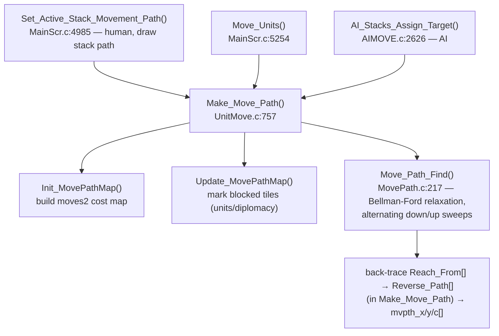
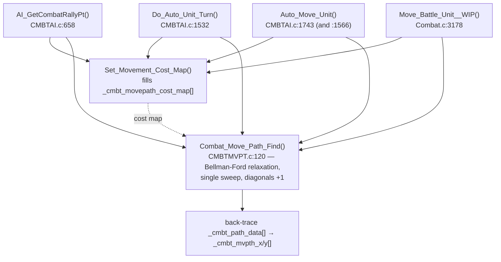
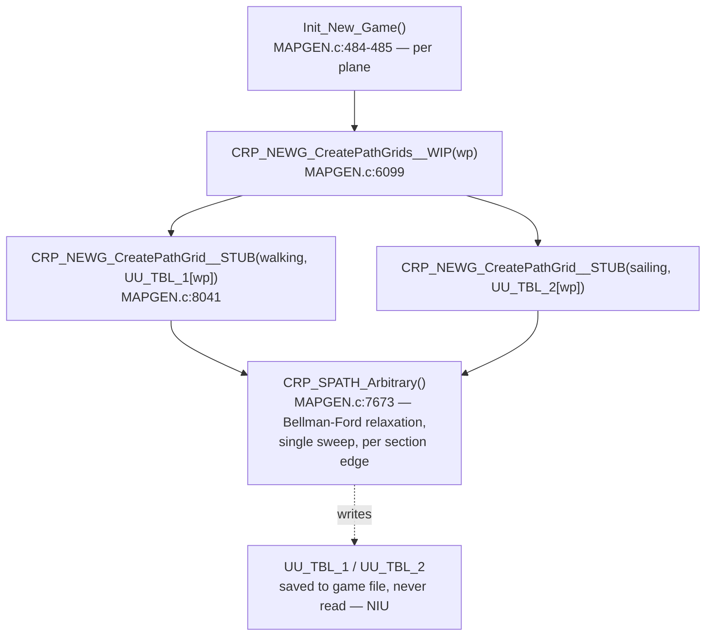

MoM-MovePath-Compare.md

SEEALSO: C:\STU\devel\ReMoM\doc\PathFinding\MoM-MovePath.md
SEEALSO: C:\STU\devel\ReMoM\doc\PathFinding\MoX-Combat-PathFindAlgo.md

# MoM Path-Finding — the three shortest-path solvers compared

MoM ships the **same shortest-path algorithm written three times**: once for the overland map (live), once for the combat grid (live), and once as a generic helper that is computed at new-game time but never read (NIU). All three are **iterative label-correcting / Bellman-Ford relaxation** over a tile cost grid with a predecessor back-trace — **not Dijkstra** (no priority queue, no settled-set; each pass re-relaxes the whole grid until a full sweep changes nothing).

| Function | Location | Status | OG / drake178 name |
|---|---|---|---|
| `Move_Path_Find` | [MovePath.c:217](../../MoM/src/MovePath.c#L217) | **Live** — overland unit movement | `OVL_GetRoadPath` region; "overland djikstra patch" |
| `Combat_Move_Path_Find` | [CMBTMVPT.c:120](../../MoM/src/CMBTMVPT.c#L120) | **Live** — combat-grid movement | `WZD ovr155p01` |
| `CRP_SPATH_Arbitrary` | [MAPGEN.c:7686](../../MoM/src/MAPGEN.c#L7686) | **NIU** — fills `UU_TBL_1/2`, never read | `MAGIC ovr054`; drake178 "brute force shortest path" |

## The shared skeleton

Every one of the three does the same five things:

1. **Two parallel arrays** sized to the grid: a *cost-so-far* array (init to a max sentinel, source = 0) and a *predecessor / "reached-from"* array (init **to self** — the self-link is both "no parent yet" and the back-trace terminator).
2. **Bail** if the destination tile is impassable.
3. **Relaxation sweep**: `while(changed)` { for every tile, for every in-bounds neighbor, `new = neighbor_cost + cost_to_enter_this_tile`; if it beats the stored cost, overwrite cost + predecessor and set `changed`. }
4. **Back-trace** from the destination through the predecessor array until it reaches a self-link; success iff that self-link is the source.
5. **Reverse** the collected indices and convert the 1-D indices back to (x, y).

8-connectivity throughout, with reduced adjacency lists on edges/corners so the search never wraps off the grid.

## `Move_Path_Find` — overland (live)

[MovePath.c:217-321](../../MoM/src/MovePath.c#L217-L321). Operates on the full 60×40 world (`WORLD_SIZE` = 2400) using the EMS `s_MOVE_PATH` struct members `moves2` / `Reach_Costs` / `Reach_From` / `Reverse_Path`.

- `Reach_Costs[]` (`uint8_t`) init `INF`, `Reach_From[]` init to self, source = 0 ([225-229](../../MoM/src/MovePath.c#L225-L229)); the unreached/infinity test uses `!IS_INF(...)`.
- Relaxation via the `Do_Costs_Fst / Do_Costs_Mid / Do_Costs_Lst` row helpers ([89-201](../../MoM/src/MovePath.c#L89-L201)), each calling `Check_Cost` ([72](../../MoM/src/MovePath.c#L72)) over the 8 neighbor offsets `±1 / ±59 / ±60 / ±61` (the `WORLD_WIDTH` = 60 strides), hard-coded. (The earlier `Move_Path_Find__MEH` variant — which inlined this as `CHECK_COST` / `DO_COSTS_*` macros — has been removed from the source and preserved in [MOX-Move_Path_Find_c.md](MOX-Move_Path_Find_c.md).)
- Impassable = `(int8_t)INF` (== `-1`; `moves2` is a signed `int8_t` map, so the shared `INF`/`0xFF` byte is spelled `(int8_t)INF`); the `Do_Costs_*` helpers skip a tile whose own entry cost is `(int8_t)INF`, and `Check_Cost` skips any adjacent that fails `!IS_INF(...)` ([76](../../MoM/src/MovePath.c#L76)). (The removed `__MEH` macro guarded differently — with an `(adjacent_reach_cost + tmp_move_cost) >= 0` overflow test; see [MOX-Move_Path_Find_c.md](MOX-Move_Path_Find_c.md).)
- **Optimization:** it does not sweep in one direction. Each major iteration runs a **downward** row pass (`Iter_Rows_Down`, [250](../../MoM/src/MovePath.c#L250)) and then an **upward** row pass (`Iter_Rows_Up`, [284](../../MoM/src/MovePath.c#L284)), repeating the down+up macro-pass while `reach_costs_changed`. Alternating raster direction is the classic Gauss-Seidel acceleration for label-correcting shortest path — it propagates costs both with and against the scan within far fewer outer iterations. The outer loop is also seeded at the source's row (`origin_row`).
- **Skeleton split across two functions.** Unlike `CRP_SPATH_Arbitrary`, which runs all five skeleton steps in one body, the overland solver implements only **steps 1 and 3** (init + relaxation) in `Move_Path_Find`; the driver `Make_Move_Path` ([UnitMove.c:757](../../MoM/src/UnitMove.c#L757)) supplies the other three around its `Move_Path_Find` call ([UnitMove.c:882](../../MoM/src/UnitMove.c#L882)):
    - **Step 2** — bail if the destination tile is impassable ([UnitMove.c:828-832](../../MoM/src/UnitMove.c#L828-L832)).
    - **Step 4** — back-trace the destination through `Reach_From[]` to a self-link, collecting `Reverse_Path[]` ([UnitMove.c:884-894](../../MoM/src/UnitMove.c#L884-L894)).
    - **Step 5** — reverse and convert each 1-D index to (x, y), filling `mvpth_x/y/c[]` ([UnitMove.c:896-904](../../MoM/src/UnitMove.c#L896-L904)).
  Matching `[Skeleton step N]` labels mark all five sites in the source (steps 1/3 in `Move_Path_Find`, steps 2/4/5 here). This is the same five-step skeleton as `CRP_SPATH_Arbitrary` — just spread across caller + callee instead of inlined.

## `Combat_Move_Path_Find` — combat grid (live)

[CMBTMVPT.c:120-241](../../MoM/src/CMBTMVPT.c#L120-L241). Operates on the ~21×22 combat grid (`COMBAT_GRID_WIDTH` = 21). Like `CRP_SPATH_Arbitrary` (and unlike the overland `Move_Path_Find`/`Make_Move_Path` split), it runs all five shared-skeleton steps in one body — `[Skeleton step N]` labels mark them. (Note its local `1..5` section numbers are not the skeleton numbers: local-1 bail = skeleton step 2, local-2 init = skeleton step 1.)

- Three arrays (init in the `PREP` macro, [CMBTMVPT.c:73-77](../../MoM/src/CMBTMVPT.c#L73-L77)): distance/cost-so-far `_cmbt_mvpth_c[]` (init `INF`, source = 0); predecessor `_cmbt_path_data[]` (init to self); and the per-tile **input** entry-weight map `_cmbt_movepath_cost_map[]` (`INF` = impassable), read as `move_cost = _cmbt_movepath_cost_map[ctr]`. (Don't confuse the two cost arrays: `_cmbt_mvpth_c[]` is the running distance; `_cmbt_movepath_cost_map[]` is the edge weight.)
- `while(tense)` relaxation to fixed point ([161-201](../../MoM/src/CMBTMVPT.c#L161-L201)) — **single-direction** raster (per row: left-edge phase → middle phase → right-edge phase), like `CRP_SPATH_Arbitrary` and unlike the overland version's alternating sweep.
- **Refinement unique to combat:** diagonal vs orthogonal moves cost differently. `RELAX_ADJACENT_CELLS(..., 0, 4, 1)` relaxes the 4 diagonals at **+1** extra cost; `RELAX_ADJACENT_CELLS(..., 4, 8, 0)` relaxes the 4 orthogonals at **+0** ([177-178](../../MoM/src/CMBTMVPT.c#L177-L178)). The overland and arbitrary solvers treat all 8 neighbors with the same per-tile entry cost.
- Edge handling uses distinct offset tables `CMB_AdjctOfs_NoWest` / `CMB_AdjacentOffsets` / `CMB_AdjctOfs_NoEast` for the left / middle / right columns.
- Back-trace ([216-220](../../MoM/src/CMBTMVPT.c#L216-L220)) "hijacks" the cost-map buffer as scratch for the reversed index list ([208](../../MoM/src/CMBTMVPT.c#L208)).
- Project-added safety: a `/* CLAUDE */` convergence-guard `assert(DBG_convergence_itr < 462 …)` ([163-164](../../MoM/src/CMBTMVPT.c#L163-L164)) catches a non-converging sweep (e.g. a uint8 cost overflow). Not in the OG.

## `CRP_SPATH_Arbitrary` — generic helper (NIU)

[MAPGEN.c:7686-8031](../../MoM/src/MAPGEN.c#L7686-L8031). The un-optimized, fully parameterized variant. Used only by `CRP_NEWG_CreatePathGrid__STUB` to test section-edge connectivity; its output tables `UU_TBL_1/2` are saved but never read — see [MAPGEN-NIU_Path_Tables.md](../NewGame/MAPGEN-NIU_Path_Tables.md).

- Standalone globals `CRP_SPATH_Costs[]` (`uint8_t`, init `INF`, source = 0), `CRP_SPATH_SourceTiles[]` / `CRP_SPATH_Reverse[]` (predecessor + back-trace, `int16_t` word arrays — they hold tile indices up to 224) ([7779-7792](../../MoM/src/MAPGEN.c#L7779-L7792)).
- `while(Map_Changed)` **single fixed-direction** full raster sweep, repeated to fixed point ([7794-8006](../../MoM/src/MAPGEN.c#L7794-L8006)). No alternating direction → slower convergence, identical result. This is the "brute force" drake178 named.
- Arbitrary map size `Wdt × Hgt` ≤ 225; because the width is variable it **recomputes** all 9 edge/corner adjacency-offset tables on every call ([7713-7762](../../MoM/src/MAPGEN.c#L7713-L7762)), where the two live solvers hard-code their offsets.
- `uint8_t` costs (`INF` = 255 impassable, cost wraps at 255), no map wrapping. The asm zero-extends cost reads (`mov ah,0`) and compares unsigned (`jbe`), so the cost array is genuinely unsigned.
- Back-trace + reverse + (x,y) conversion ([8008-8030](../../MoM/src/MAPGEN.c#L8008-L8030)); returns hop count, 0 if no path.

## Call paths

### Overland — `Move_Path_Find`

### Combat — `Combat_Move_Path_Find`

Each combat caller runs `Set_Movement_Cost_Map()` first to build the cost map, then `Combat_Move_Path_Find()` reads it — they are sequential siblings, not a call chain.

### New-game (NIU) — `CRP_SPATH_Arbitrary`

## Side-by-side

| | `Move_Path_Find` (overland) | `Combat_Move_Path_Find` (combat) | `CRP_SPATH_Arbitrary` (NIU) |
|---|---|---|---|
| Algorithm | Bellman-Ford relaxation | Bellman-Ford relaxation | Bellman-Ford relaxation |
| Grid | 60×40 world (fixed) | ~21×22 combat grid (fixed) | arbitrary `Wdt×Hgt` ≤ 225 |
| Sweep order | **alternating** down + up pass | single-direction raster | single-direction raster |
| Convergence | optimized (fewer passes) | naive | naive |
| Connectivity | 8-neighbor, uniform tile cost | 8-neighbor, **diagonal +1** | 8-neighbor, uniform tile cost |
| Adjacency offsets | hard-coded `±1/59/60/61` | table per column position | **recomputed each call** (variable width) |
| Distance array (cost-so-far) | `Reach_Costs[]`, `INF` | `_cmbt_mvpth_c[]`, `INF` | `CRP_SPATH_Costs[]`, `INF` |
| Input weight map | `moves2[]` (signed `int8_t`), `(int8_t)INF` (== -1) impassable | `_cmbt_movepath_cost_map[]`, `INF` impassable | `Map[]`, `INF` impassable |
| Predecessor | `Reach_From[]` (self-init) | `_cmbt_path_data[]` (self-init) | `CRP_SPATH_SourceTiles[]` (self-init) |
| Storage | EMS `s_MOVE_PATH` struct | combat globals | standalone globals |
| Used? | yes | yes | **no (NIU)** |

**Bottom line:** one algorithm, three instantiations. The overland mover is the tuned, world-specific version (bidirectional sweep); the combat mover is single-sweep with a diagonal-cost refinement; `CRP_SPATH_Arbitrary` is the generic, parameterized, dead variant that just hammers an arbitrary grid until stable. The "djikstra" label in the source is historical and inaccurate — there is no priority queue anywhere.

## References

- [MovePath.c:217](../../MoM/src/MovePath.c#L217) — `Move_Path_Find`; row helpers `Check_Cost` / `Do_Costs_*` at [72-201](../../MoM/src/MovePath.c#L72-L201).
- [UnitMove.c:757](../../MoM/src/UnitMove.c#L757) — `Make_Move_Path` (caller; skeleton steps 2/4/5 + the "djikstra patch" comments).
- [CMBTMVPT.c:120](../../MoM/src/CMBTMVPT.c#L120) — `Combat_Move_Path_Find`.
- [MAPGEN.c:7686](../../MoM/src/MAPGEN.c#L7686) — `CRP_SPATH_Arbitrary`.
- [MAPGEN-NIU_Path_Tables.md](../NewGame/MAPGEN-NIU_Path_Tables.md) — why `CRP_SPATH_Arbitrary`'s output is dead.
- Sibling docs in this folder: `MoM-MovePath.md`, `MoM-MovePathFind.md`, `MoX-Combat-Path.md`, `MoX-Combat-PathFindAlgo.md`, `CodeCompare-CmbtMvPt.odt`.
