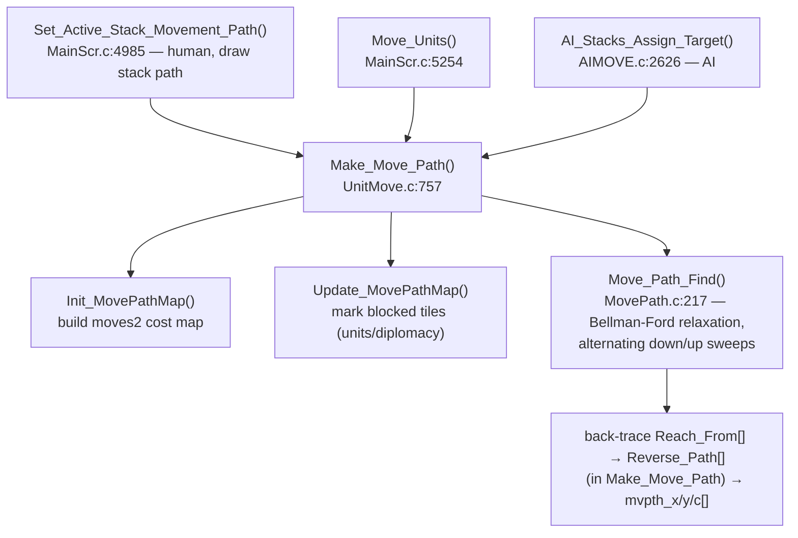
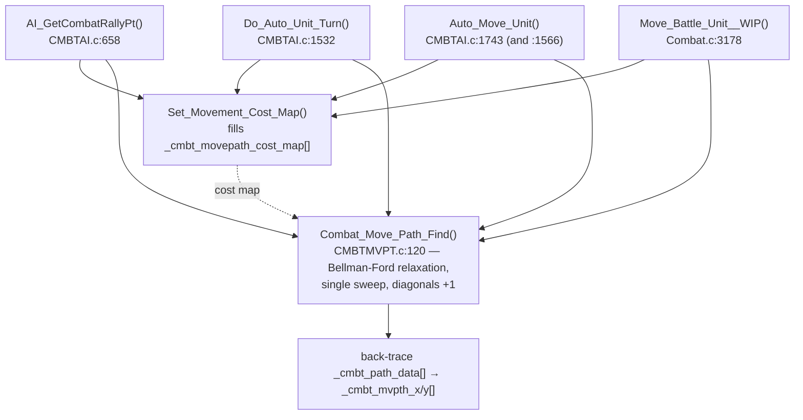
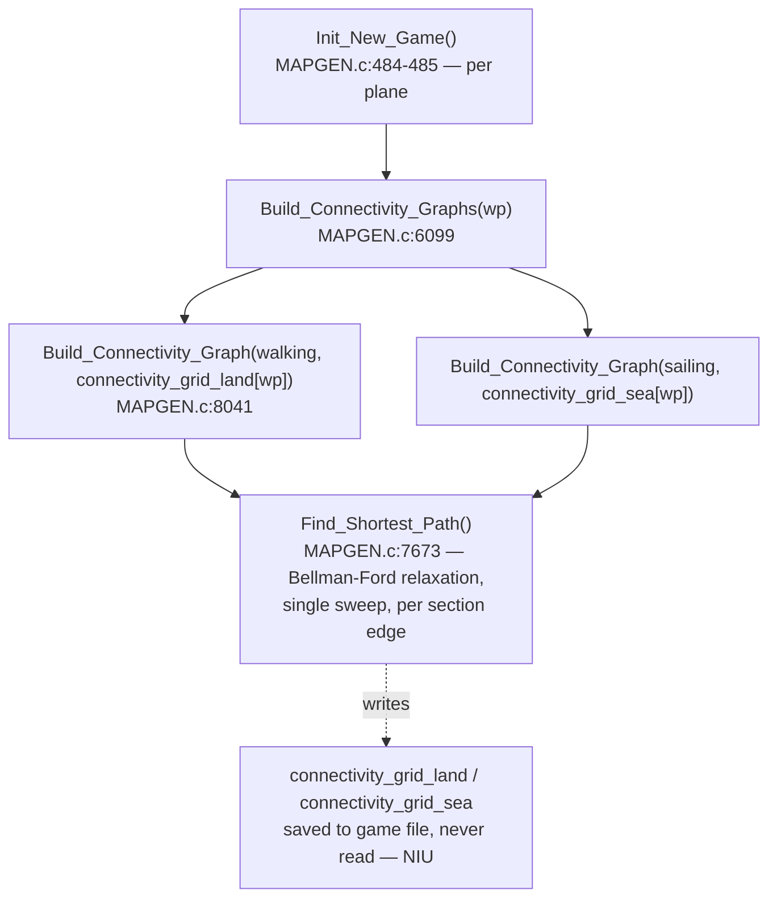

MoM-MovePath-Compare.md

SEEALSO: C:\STU\devel\ReMoM\doc\PathFinding\MoM-MovePath.md
SEEALSO: C:\STU\devel\ReMoM\doc\PathFinding\MoX-Combat-PathFindAlgo.md

# MoM Path-Finding — the three shortest-path solvers compared

MoM ships the **same shortest-path algorithm written three times**: once for the overland map (live), once for the combat grid (live), and once as a generic helper that is computed at new-game time but never read (NIU). All three are **iterative label-correcting / Bellman-Ford relaxation** over a tile cost grid with a predecessor back-trace — **not Dijkstra** (no priority queue, no settled-set; each pass re-relaxes the whole grid until a full sweep changes nothing).

| Function | Location | Status | OG / drake178 name |
|---|---|---|---|
| `Move_Path_Find` | [MovePath.c:217](../../MoM/src/MovePath.c#L217) | **Live** — overland unit movement | `OVL_GetRoadPath` region; "overland djikstra patch" |
| `Combat_Move_Path_Find` | [CMBTMVPT.c:120](../../MoM/src/CMBTMVPT.c#L120) | **Live** — combat-grid movement | `WZD ovr155p01` |
| `Find_Shortest_Path` | [MAPGEN.c:7686](../../MoM/src/MAPGEN.c#L7686) | **NIU** — fills `connectivity_grid_land`/`connectivity_grid_sea`, never read | `MAGIC ovr054`; drake178 "brute force shortest path" |

## The shared skeleton

Every one of the three does the same five things:

1. **Two parallel arrays** sized to the grid: a *cost-so-far* array (init to a max sentinel, source = 0) and a *predecessor / "reached-from"* array (init **to self** — the self-link is both "no parent yet" and the back-trace terminator).
2. **Bail** if the destination tile is impassable.
3. **Relaxation sweep**: `while(changed)` { for every tile, for every in-bounds neighbor, `new = neighbor_cost + cost_to_enter_this_tile`; if it beats the stored cost, overwrite cost + predecessor and set `changed`. }
4. **Back-trace** from the destination through the predecessor array until it reaches a self-link; success iff that self-link is the source.
5. **Reverse** the collected indices and convert the 1-D indices back to (x, y).

8-connectivity throughout, with reduced adjacency lists on edges/corners so the search never wraps off the grid.

## `Move_Path_Find` — overland (live)

[MovePath.c:217-321](../../MoM/src/MovePath.c#L217-L321). Operates on the full 60×40 world (`WORLD_SIZE` = 2400) using the EMS `s_MOVE_PATH` struct members `moves2` / `Reach_Costs` / `Reach_From` / `Reverse_Path`.

- `Reach_Costs[]` (`uint8_t`) init `INF`, `Reach_From[]` init to self, source = 0 ([225-229](../../MoM/src/MovePath.c#L225-L229)); the unreached/infinity test uses `!IS_INF(...)`.
- Relaxation via the `Do_Costs_Fst / Do_Costs_Mid / Do_Costs_Lst` row helpers ([89-201](../../MoM/src/MovePath.c#L89-L201)), each calling `Check_Cost` ([72](../../MoM/src/MovePath.c#L72)) over the 8 neighbor offsets `±1 / ±59 / ±60 / ±61` (the `WORLD_WIDTH` = 60 strides), hard-coded. (The earlier `Move_Path_Find__MEH` variant — which inlined this as `CHECK_COST` / `DO_COSTS_*` macros — has been removed from the source and preserved in [MOX-Move_Path_Find_c.md](MOX-Move_Path_Find_c.md).)
- Impassable = `(int8_t)INF` (== `-1`; `moves2` is a signed `int8_t` map, so the shared `INF`/`0xFF` byte is spelled `(int8_t)INF`); the `Do_Costs_*` helpers skip a tile whose own entry cost is `(int8_t)INF`, and `Check_Cost` skips any adjacent that fails `!IS_INF(...)` ([76](../../MoM/src/MovePath.c#L76)). (The removed `__MEH` macro guarded differently — with an `(adjacent_reach_cost + tmp_move_cost) >= 0` overflow test; see [MOX-Move_Path_Find_c.md](MOX-Move_Path_Find_c.md).)
- **Optimization:** it does not sweep in one direction. Each major iteration runs a **downward** row pass (`Iter_Rows_Down`, [250](../../MoM/src/MovePath.c#L250)) and then an **upward** row pass (`Iter_Rows_Up`, [284](../../MoM/src/MovePath.c#L284)), repeating the down+up macro-pass while `a_cost_was_updated`. Alternating raster direction is the classic Gauss-Seidel acceleration for label-correcting shortest path — it propagates costs both with and against the scan within far fewer outer iterations. The outer loop is also seeded at the source's row (`origin_row`).
- **Skeleton split across two functions.** Unlike `Find_Shortest_Path`, which runs all five skeleton steps in one body, the overland solver implements only **steps 1 and 3** (init + relaxation) in `Move_Path_Find`; the driver `Make_Move_Path` ([UnitMove.c:757](../../MoM/src/UnitMove.c#L757)) supplies the other three around its `Move_Path_Find` call ([UnitMove.c:882](../../MoM/src/UnitMove.c#L882)):
    - **Step 2** — bail if the destination tile is impassable ([UnitMove.c:828-832](../../MoM/src/UnitMove.c#L828-L832)).
    - **Step 4** — back-trace the destination through `Reach_From[]` to a self-link, collecting `Reverse_Path[]` ([UnitMove.c:884-894](../../MoM/src/UnitMove.c#L884-L894)).
    - **Step 5** — reverse and convert each 1-D index to (x, y), filling `mvpth_x/y/c[]` ([UnitMove.c:896-904](../../MoM/src/UnitMove.c#L896-L904)).
  Matching `[Skeleton step N]` labels mark all five sites in the source (steps 1/3 in `Move_Path_Find`, steps 2/4/5 here). This is the same five-step skeleton as `Find_Shortest_Path` — just spread across caller + callee instead of inlined.

## `Combat_Move_Path_Find` — combat grid (live)

[CMBTMVPT.c:120-241](../../MoM/src/CMBTMVPT.c#L120-L241). Operates on the ~21×22 combat grid (`COMBAT_GRID_WIDTH` = 21). Like `Find_Shortest_Path` (and unlike the overland `Move_Path_Find`/`Make_Move_Path` split), it runs all five shared-skeleton steps in one body — `[Skeleton step N]` labels mark them. (Note its local `1..5` section numbers are not the skeleton numbers: local-1 bail = skeleton step 2, local-2 init = skeleton step 1.)

- Three arrays (init in the `PREP` macro, [CMBTMVPT.c:73-77](../../MoM/src/CMBTMVPT.c#L73-L77)): distance/cost-so-far `_cmbt_mvpth_c[]` (init `INF`, source = 0); predecessor `_cmbt_path_data[]` (init to self); and the per-tile **input** entry-weight map `_cmbt_movepath_cost_map[]` (`INF` = impassable), read as `move_cost = _cmbt_movepath_cost_map[ctr]`. (Don't confuse the two cost arrays: `_cmbt_mvpth_c[]` is the running distance; `_cmbt_movepath_cost_map[]` is the edge weight.)
- `while(a_cost_was_updated)` relaxation to fixed point ([161-201](../../MoM/src/CMBTMVPT.c#L161-L201)) — **single-direction** raster (per row: left-edge phase → middle phase → right-edge phase), like `Find_Shortest_Path` and unlike the overland version's alternating sweep.
- **Refinement unique to combat:** diagonal vs orthogonal moves cost differently. `RELAX_ADJACENT_CELLS(..., 0, 4, 1)` relaxes the 4 diagonals at **+1** extra cost; `RELAX_ADJACENT_CELLS(..., 4, 8, 0)` relaxes the 4 orthogonals at **+0** ([177-178](../../MoM/src/CMBTMVPT.c#L177-L178)). The overland and arbitrary solvers treat all 8 neighbors with the same per-tile entry cost.
- Edge handling uses distinct offset tables `CMB_AdjctOfs_NoWest` / `CMB_AdjacentOffsets` / `CMB_AdjctOfs_NoEast` for the left / middle / right columns.
- Back-trace ([216-220](../../MoM/src/CMBTMVPT.c#L216-L220)) "hijacks" the cost-map buffer as scratch for the reversed index list ([208](../../MoM/src/CMBTMVPT.c#L208)).
- Project-added safety: a `/* CLAUDE */` convergence-guard `assert(DBG_convergence_itr < 462 …)` ([163-164](../../MoM/src/CMBTMVPT.c#L163-L164)) catches a non-converging sweep (e.g. a uint8 cost overflow). Not in the OG.

## `Find_Shortest_Path` — generic helper (NIU)

[MAPGEN.c:7686-8031](../../MoM/src/MAPGEN.c#L7686-L8031). The un-optimized, fully parameterized variant. Used only by `Build_Connectivity_Graph` to test section-edge connectivity; its output tables `connectivity_grid_land/2` are saved but never read — see [MAPGEN-NIU_Path_Tables.md](../NewGame/MAPGEN-NIU_Path_Tables.md).

- Standalone globals `shortest_path_cost_to_reach[]` (`uint8_t`, init `INF`, source = 0), `shortest_path_came_from[]` / `shortest_path_backtrace[]` (predecessor + back-trace, `int16_t` word arrays — they hold tile indices up to 224) ([MAPGEN.c:217-222](../../MoM/src/MAPGEN.c#L217-L222)).
- `while(a_cost_was_updated)` **single fixed-direction** full raster sweep, repeated to fixed point ([7794-8006](../../MoM/src/MAPGEN.c#L7794-L8006)). No alternating direction → slower convergence, identical result. This is the "brute force" drake178 named.
- Arbitrary map size `Wdt × Hgt` ≤ 225; because the width is variable it **recomputes** all 9 edge/corner adjacency-offset tables on every call ([7713-7762](../../MoM/src/MAPGEN.c#L7713-L7762)), where the two live solvers hard-code their offsets.
- `uint8_t` costs (`INF` = 255 impassable, cost wraps at 255), no map wrapping. The asm zero-extends cost reads (`mov ah,0`) and compares unsigned (`jbe`), so the cost array is genuinely unsigned.
- Back-trace + reverse + (x,y) conversion ([8008-8030](../../MoM/src/MAPGEN.c#L8008-L8030)); returns hop count, 0 if no path.

## Call paths

### Overland — `Move_Path_Find`

### Combat — `Combat_Move_Path_Find`

Each combat caller runs `Set_Movement_Cost_Map()` first to build the cost map, then `Combat_Move_Path_Find()` reads it — they are sequential siblings, not a call chain.

### New-game (NIU) — `Find_Shortest_Path`

## Side-by-side

| | `Move_Path_Find` (overland) | `Combat_Move_Path_Find` (combat) | `Find_Shortest_Path` (NIU) |
|---|---|---|---|
| Algorithm | Bellman-Ford relaxation | Bellman-Ford relaxation | Bellman-Ford relaxation |
| Grid | 60×40 world (fixed) | ~21×22 combat grid (fixed) | arbitrary `Wdt×Hgt` ≤ 225 |
| Sweep order | **alternating** down + up pass | single-direction raster | single-direction raster |
| Convergence | optimized (fewer passes) | naive | naive |
| Connectivity | 8-neighbor, uniform tile cost | 8-neighbor, **diagonal +1** | 8-neighbor, uniform tile cost |
| Adjacency offsets | hard-coded `±1/59/60/61` | table per column position | **recomputed each call** (variable width) |
| Distance array (cost-so-far) | `Reach_Costs[]`, `INF` | `_cmbt_mvpth_c[]`, `INF` | `shortest_path_cost_to_reach[]`, `INF` |
| Input weight map | `moves2[]` (signed `int8_t`), `(int8_t)INF` (== -1) impassable | `_cmbt_movepath_cost_map[]`, `INF` impassable | `movepath_cost_map[]`, `INF` impassable |
| Predecessor | `Reach_From[]` (self-init) | `_cmbt_path_data[]` (self-init) | `shortest_path_came_from[]` (self-init) |
| Storage | EMS `s_MOVE_PATH` struct | combat globals | standalone globals |
| Used? | yes | yes | **no (NIU)** |

**Bottom line:** one algorithm, three instantiations. The overland mover is the tuned, world-specific version (bidirectional sweep); the combat mover is single-sweep with a diagonal-cost refinement; `Find_Shortest_Path` is the generic, parameterized, dead variant that just hammers an arbitrary grid until stable. The "djikstra" label in the source is historical and inaccurate — there is no priority queue anywhere.

## Variable cross-reference — parameters & locals

The five-step skeleton is owned differently in each pipeline, so a fair comparison has to include the **driver** that wraps each solver. The overland solver is *split*: `Move_Path_Find` runs only steps 1+3, and its driver `Make_Move_Path` ([UnitMove.c:763](../../MoM/src/UnitMove.c#L763)) owns steps 2/4/5 plus the input-map build. Combat and `Find_Shortest_Path` run all five steps in one body; their drivers only build the input and consume the result — `Set_Movement_Cost_Map` for combat, `Build_Connectivity_Graph` for the NIU helper. Storage also differs: overland keeps its working state in `MovePath.c` file-globals (shared across `Check_Cost`/`Do_Costs_*`), combat in function locals, `Find_Shortest_Path` in locals + three standalone globals.

### Where each skeleton step lives

| Step | Overland | Combat | NIU |
|---|---|---|---|
| build input cost map | `Init`/`Update_MovePathMap` *(in `Make_Move_Path`)* | `Set_Movement_Cost_Map` *(caller)* | `Build_Connectivity_Graph` *(section maps from `move_map`)* |
| 1 — init parallel arrays | `Move_Path_Find` | `Combat_Move_Path_Find` (`PREP`) | `Find_Shortest_Path` |
| 2 — bail if dst impassable | **`Make_Move_Path`** | `Combat_Move_Path_Find` | `Find_Shortest_Path` |
| 3 — relaxation sweep | `Move_Path_Find` (`Check_Cost`/`Do_Costs_*`) | `Combat_Move_Path_Find` (`RELAX_ADJACENT_CELLS`) | `Find_Shortest_Path` |
| 4 — back-trace | **`Make_Move_Path`** | `Combat_Move_Path_Find` | `Find_Shortest_Path` |
| 5 — reverse + (x,y) | **`Make_Move_Path`** | `Combat_Move_Path_Find` | `Find_Shortest_Path` |
| consume result | `Make_Move_Path` → `mvpth_x/y/c[]` | caller reads `_cmbt_mvpth_x/y[]` | `Build_Connectivity_Graph` → `result_map` (12×8 section bitflags) — **existence only**, path discarded |

Lined up by role (overland cells in *(MMP)* live in `Make_Move_Path`; NIU *(BCG …)* notes show what `Build_Connectivity_Graph` feeds in):

### Parameters / inputs

| Role | `Move_Path_Find` + `Make_Move_Path` | `Combat_Move_Path_Find` | `Find_Shortest_Path` + `Build_Connectivity_Graph` |
|---|---|---|---|
| source X / Y | `arg_wx` / `arg_wy` (→ globals `wx`/`wy`) | `source_cgx` / `source_cgy` | `SrcX` / `SrcY` *(BCG: `src_x`, lit. `4`/`2`)* |
| target X / Y | `dst_wx` / `dst_wy` *(MMP)* | `destination_cgx` / `destination_cgy` | `TgtX` / `TgtY` *(BCG: `dst_x`, lit. `0`/`6`)* |
| grid width / height | `WORLD_WIDTH` / `WORLD_HEIGHT` *(consts)* | `COMBAT_GRID_WIDTH` / `COMBAT_GRID_CELL_HEIGHT` *(consts)* | `Wdt` / `Hgt` *(BCG passes `5`/`7` or `7`/`5`)* |
| input cost/weight map | `movepath_cost_map->moves2[]` *(built by `Init`/`Update_MovePathMap`)* | `_cmbt_movepath_cost_map[]` *(built by `Set_Movement_Cost_Map`)* | `movepath_cost_map` *(param — BCG: `TopBottom`/`LeftRight_Section_Map`)* |
| output X / Y coords | `mvpth_x[]` / `mvpth_y[]` (+ `mvpth_c[]`) *(MMP params)* | `_cmbt_mvpth_x[]` / `_cmbt_mvpth_y[]` *(globals)* | `mvpth_x` / `mvpth_y` *(BCG: same-named locals, discarded)* |
| source / target tile index | `origin_row` (=`wy*W`) / `dst_world_map_idx` *(MMP)* | `src_idx` / `dst_idx` | `SrcY*Wdt+SrcX` / `TgtY*Wdt+TgtX` *(inline)* |
| driver full-map input *(windowed?)* | — *(none; `moves2[]` pathed whole)* | — *(none; `_cmbt_movepath_cost_map[]` pathed whole)* | **`move_map`** *(60×40; windowed into each `movepath_cost_map`)* |
| driver product output | — *(driver emits the path: `mvpth_x/y/c[]`)* | — *(emits path: `_cmbt_mvpth_x/y[]`)* | **`result_map`** *(12×8 connectivity grid — no path counterpart)* |

### Working state / locals

| Role | `Move_Path_Find` (+ `Make_Move_Path`) | `Combat_Move_Path_Find` | `Find_Shortest_Path` |
|---|---|---|---|
| distance / cost-so-far array | `Reach_Costs[]` | `_cmbt_mvpth_c[]` | `shortest_path_cost_to_reach[]` |
| predecessor (came-from) array | `Reach_From[]` | `_cmbt_path_data[]` | `shortest_path_came_from[]` |
| reverse / back-trace buffer | `Reverse_Path[]` *(MMP)* | `m_movement_path_grid_cell_index` *(aliases the cost map)* | `shortest_path_backtrace[]` |
| path length (hop count) | `path_length` *(MMP)* | `movement_path_grid_cell_count` | `path_length` |
| relaxation "changed" flag | `a_cost_was_updated` | `a_cost_was_updated` | `a_cost_was_updated` |
| current tile 1-D index | `ofst_movepath_cost` | `ctr` | `ctr` |
| current tile entry cost | `move_cost` / `tmp_move_cost` | `move_cost` | `move_cost` |
| neighbour's accumulated cost | `adjacent_reach_cost` | `adjacent_path_cost` | `Adjacent_Tile_Cost` |
| candidate new cost | `new_cost_to_reach` | `new_cost_to_reach` | `new_cost_to_reach` |
| current tile's stored cost (compare) | `current_reach_cost` | `_cmbt_mvpth_c[ctr]` *(inline)* | `cost_to_reach[ctr]` *(inline)* |
| predecessor snapshot (Δ-detect) | — *(triggers on cost-improved, no snapshot)* | `current_origin` | `Current_Source` |
| neighbour offset / index | `adj_pos` *(relative)* | `adjacent_idx` *(absolute)* | `Adjacent_Tile_Offset` *(absolute)* |
| neighbour-list loop counter | *(unrolled — fixed `adj_pos = …`)* | `itr_adjacent` | `cx` |
| adjacency offsets | hard-coded `±1 / ±59 / ±60 / ±61` | `adjacent_offsets[3][8]`, `CMB_AdjctOfs_NoEast/NoWest` | nine `*_Adjacents[]` tables *(rebuilt from `Wdt` each call)* |
| row / column iterator | `itr_row` *(rows)* | `itr_y` / `itr_x` | `Col_LoopVar` / `Row_LoopVar` |
| inner-extent bounds | *(fixed `29` rows, `2320` cap)* | `max_y` / `max_x` | `Inner_Col_Height` / `Inner_Row_Length` |
| total tile count | `WORLD_SIZE` *(const)* | `COMBAT_GRID_CELL_COUNT` *(const)* | `grid_cell_count` |
| array-init / generic loop var | `itr` | `itr` | `itr` |

### Driver-level locals (the sweep machinery the solvers don't have)

Combat has no dedicated driver — its input is built by the sibling `Set_Movement_Cost_Map`, and steps 2–5 run inside `Combat_Move_Path_Find` itself — so this is mostly overland `Make_Move_Path` vs NIU `Build_Connectivity_Graph`. The `—` cells are the point: each driver's loop machinery has no analog in the other pipelines.

| Role | overland `Make_Move_Path` | combat | NIU `Build_Connectivity_Graph` |
|---|---|---|---|
| section-grid iterators (12×8) | — | — | `Y_GridIndex` / `X_GridIndex` |
| section pixel-base (× 5) | — | — | `itr1` (row) / `X_GridBase` (col) |
| reciprocal-pass iterators | — | — | `Y_GridIndex_2` / `X_GridIndex_2` |
| per-section result byte | — | — | `Passable_Direction_Flags` → `result_map` |
| windowed solver `movepath_cost_map` | — | — | `TopBottom_Section_Map` / `LeftRight_Section_Map` |
| discarded solver `mvpth_x` / `mvpth_y` | — | — | `mvpth_x` / `mvpth_y` |
| per-edge solver `Src`/`Tgt` args | — | — | `src_x`/`dst_x`, `src_y`/`dst_y` |
| section-build offsets | — | — | `Y_Modifier`, `itr2` |
| edge-scan iterators | — | — | `X_LoopVar` / `Y_LoopVar` |
| wrapped neighbour column | — | — | `Adjacent_Section_X` |
| path-exists accumulator | `path_length` | *(`movement_path_grid_cell_count`, in-solver)* | `path_length` |
| back-trace cursor / pred read | `dst_world_map_idx`, `ptr_reached_from` / `reached_from` | *(in-solver)* | *(inside `Find_Shortest_Path`)* |
| 1-D → (x,y) convert temp | `itr_wx` / `itr_wy` | *(in-solver)* | *(inside `Find_Shortest_Path`; result discarded)* |
| reverse / convert loop var | `itr` | *(in-solver)* | *(inside `Find_Shortest_Path`)* |
| extend-range box (AI prune) | `ext_x1`/`ext_y1`/`ext_x2`/`ext_y2` *(declared; `TILE_ExtendRange` path is TODO-stubbed)* | — | — |

Notes on the asymmetries:
- **No target in `Move_Path_Find`.** It floods cost from the source to *every* tile; `Make_Move_Path` supplies `dst_wx`/`dst_wy` and does the back-trace, so the target coords, `dst_world_map_idx`, `path_length`, and the `Reverse_Path[]` collection live in the driver ([UnitMove.c:888-906](../../MoM/src/UnitMove.c#L888-L906)), not in `Move_Path_Find`.
- **NIU result is existence-only.** `Build_Connectivity_Graph` calls `Find_Shortest_Path` for each section-edge `(src,dst)` pair and keeps only whether the return is `0` (no path) or `>0` — it writes the actual path into `mvpth_x`/`mvpth_y` but never reads it ([MAPGEN.c:8183-8189](../../MoM/src/MAPGEN.c#L8183-L8189)). So the solver's whole step-5 output is computed and thrown away.
- **`Build_Connectivity_Graph`'s own params wrap the solver's.** `Build_Connectivity_Graph(move_map, result_map)` ([MAPGEN.c:8104](../../MoM/src/MAPGEN.c#L8104)) sits one level above `Find_Shortest_Path`: `move_map` is the full per-plane 60×40 cost map (same level as overland `moves2[]` / combat `_cmbt_movepath_cost_map[]`), **windowed** into the 5×5 / 7×5 `*_Section_Map` arrays that become the solver's `movepath_cost_map`; `result_map` is the 12×8 section-connectivity grid (one plane's record of `connectivity_grid_land`/`connectivity_grid_sea`) it fills from the existence verdicts — a driver-level product with no counterpart in the live solvers' I/O.
- **"Changed" trigger differs.** Combat and `Find_Shortest_Path` snapshot the predecessor (`current_origin` / `Current_Source`) and set the flag only when it *changes*; overland has no snapshot — `Check_Cost` sets `a_cost_was_updated` whenever the cost strictly improves.
- **Reverse buffer reuse.** Combat has no separate reverse array — `m_movement_path_grid_cell_index` aliases the now-finished `_cmbt_movepath_cost_map` allocation ([CMBTMVPT.c:57-60](../../MoM/src/CMBTMVPT.c#L57-L60)).

## References

- [MovePath.c:217](../../MoM/src/MovePath.c#L217) — `Move_Path_Find`; row helpers `Check_Cost` / `Do_Costs_*` at [72-201](../../MoM/src/MovePath.c#L72-L201).
- [UnitMove.c:757](../../MoM/src/UnitMove.c#L757) — `Make_Move_Path` (caller; skeleton steps 2/4/5 + the "djikstra patch" comments).
- [CMBTMVPT.c:120](../../MoM/src/CMBTMVPT.c#L120) — `Combat_Move_Path_Find`.
- [MAPGEN.c:7686](../../MoM/src/MAPGEN.c#L7686) — `Find_Shortest_Path`; its driver `Build_Connectivity_Graph` at [MAPGEN.c:8104](../../MoM/src/MAPGEN.c#L8104). Unit-tested in [test_Find_Shortest_Path.cpp](../../MoM/tests/test_Find_Shortest_Path.cpp) (the shared solver) + [test_Build_Connectivity_Graph.cpp](../../MoM/tests/test_Build_Connectivity_Graph.cpp) / [test_Build_Connectivity_Graphs.cpp](../../MoM/tests/test_Build_Connectivity_Graphs.cpp); see [MAPGEN-Build_Connectivity_Graphs.md](../NewGame/MAPGEN-Build_Connectivity_Graphs.md) "Tests".
- [MAPGEN-NIU_Path_Tables.md](../NewGame/MAPGEN-NIU_Path_Tables.md) / [MAPGEN-Build_Connectivity_Graphs.md](../NewGame/MAPGEN-Build_Connectivity_Graphs.md) — why `Find_Shortest_Path`'s output is dead.
- Sibling docs in this folder: `MoM-MovePath.md`, `MoM-MovePathFind.md`, `MoX-Combat-Path.md`, `MoX-Combat-PathFindAlgo.md`, `CodeCompare-CmbtMvPt.odt`.
