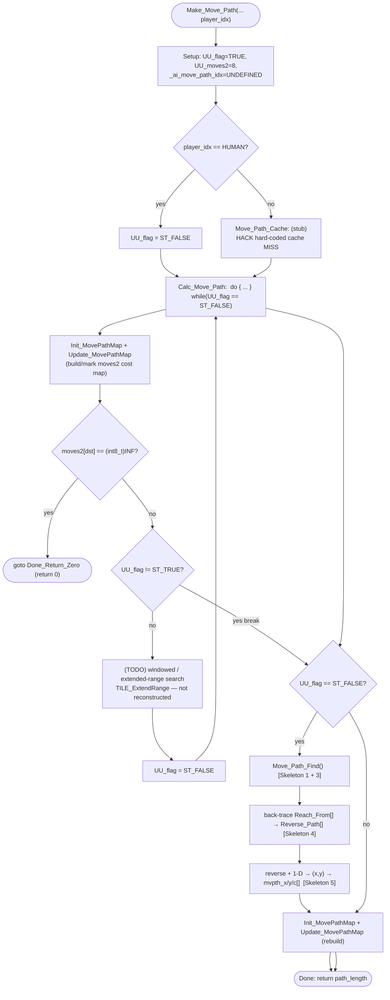

UnitMove-Make_Move_Path.md

C:\STU\devel\STU-Extras\Piethawn\Piethawn\out\WIZARDS\ovr148\Make_Move_Path.asm
C:\STU\devel\STU-Extras\Piethawn\Piethawn\out\WIZARDS\ovr148\Make_Move_Path.c

SEEALSO: MoM-MovePath-Compare.md   (the three solvers compared; the shared 5-step skeleton)
SEEALSO: MoX-Combat-PathFindAlgo.md

Make_Move_Path() returns path length

MainScr.c
    Set_Active_Stack_Movement_Path() / Move_Units()
        |-> Make_Move_Path()
AIMOVE.c
    AI_Stacks_Assign_Target()
        |-> Make_Move_Path()

Make_Move_Path()
    |-> Init_MovePathMap()
    |-> Update_MovePathMap()
    |-> TILE_ExtendRange()   (windowed search — NOT reconstructed; see Phase 3)
    |-> Move_Path_Find()

---

# `Make_Move_Path` — Walkthrough

| Function | Location | Role |
|---|---|---|
| `Make_Move_Path` | [UnitMove.c:757-931](../../MoM/src/UnitMove.c#L757-L931) (WZD `o148p03`; drake178 `STK_GetPath`) | The overland-movement **driver**: builds the per-tile cost map (`Init_MovePathMap` + `Update_MovePathMap`), bails if the destination is impassable, calls `Move_Path_Find` to run the Bellman-Ford relaxation, then back-traces and converts the result into the caller's `mvpth_x/y/c[]` arrays. Returns the path length in tiles (0 if no path). |

## Purpose

The overland solver is **split across two functions** (see [MoM-MovePath-Compare.md](MoM-MovePath-Compare.md), "The shared skeleton"). `Make_Move_Path` is the driver that owns four of the five skeleton concerns plus the cost-map construction; the relaxation itself is delegated to `Move_Path_Find`:

| Shared-skeleton step | Where | Site |
|---|---|---|
| build the cost map (`moves2[]`) | here | `Init_MovePathMap` + `Update_MovePathMap` |
| **Step 2** — bail if destination impassable | here | [829-832](../../MoM/src/UnitMove.c#L829-L832) |
| **Steps 1 + 3** — init parallel arrays + relaxation sweep | `Move_Path_Find` | [882](../../MoM/src/UnitMove.c#L882) → [MovePath.c:217](../../MoM/src/MovePath.c#L217) |
| **Step 4** — back-trace `dst` → `Reach_From[]` self-link | here | [884-894](../../MoM/src/UnitMove.c#L884-L894) |
| **Step 5** — reverse + 1-D index → (x, y) | here | [896-904](../../MoM/src/UnitMove.c#L896-L904) |

This is the same five-step skeleton as `Find_Shortest_Path` and `Combat_Move_Path_Find` — just spread across caller + callee rather than inlined in one body.

"Army", not "Stack": it takes a `troop_count` and does not touch `_unit_stack` / `_unit_stack_count`.

## How it's reached

| Caller | Site | Notes |
|---|---|---|
| `Set_Active_Stack_Movement_Path` (human) | [MainScr.c:4985](../../MoM/src/MainScr.c#L4985) | Draws the selected stack's movement path; stores the result in `_active_stack_path_length`. |
| `Move_Units` (human) | [MainScr.c:5254](../../MoM/src/MainScr.c#L5254) | Path for an actual move order. |
| `AI_Stacks_Assign_Target` (AI) | [AIMOVE.c:2626](../../MoM/src/AIMOVE.c#L2626) | AI stack pathing toward an assigned target ([AIMOVE.c:2542](../../MoM/src/AIMOVE.c#L2542) notes the dependency). |

The human / AI distinction matters: the human path skips the (stubbed) cache, and `UU_flag` drives a one-vs-two-pass loop (below).

## Structure



## Code walk

### Phase 1 — Setup + human/AI branch ([771-786](../../MoM/src/UnitMove.c#L771-L786))

```c
EMMDATAH_Map();
UU_flag = ST_TRUE;
UU_moves2 = 8;
_ai_move_path_idx = ST_UNDEFINED;

if(player_idx == HUMAN_PLAYER_IDX) { UU_flag = ST_FALSE; goto Calc_Move_Path; }
else                              { goto Move_Path_Cache; }
```

- `UU_moves2` is **hard-coded to 8**, which dead-codes the two human "clamp move cost to a minimum of 2" blocks ([808](../../MoM/src/UnitMove.c#L808), [911](../../MoM/src/UnitMove.c#L911)) — both gate on `UU_moves2 == 1` and never run.
- `UU_flag` is the one-vs-two-pass selector for the `Calc_Move_Path` loop (Phase 3): the human sets it `ST_FALSE` up front (single pass); the AI leaves it `ST_TRUE`.

### Phase 2 — Move-path cache (stub) ([789-796](../../MoM/src/UnitMove.c#L789-L796))

```c
Move_Path_Cache:
{
    // HACK:  hard-coded MovePath Cache Miss
    goto Calc_Move_Path;
    goto Done;
}
```

The AI move-path cache (the OG's `UU_PathingVar1/2` hit/miss counters) is **not reconstructed** — this stub always falls through to a full recompute. Unreached `goto Done` preserved from the OG shape.

### Phase 3 — `Calc_Move_Path` build + bail loop ([799-875](../../MoM/src/UnitMove.c#L799-L875))

Each iteration rebuilds the cost map and checks the destination:

```c
do {
    Init_MovePathMap(...);                 // base moves2 from movement modes + terrain
    /* human UU_moves2==1 clamp block — dead (UU_moves2 hard-coded 8) */
    Update_MovePathMap(...);               // mark blocked tiles (units / diplomacy)

    /* [Skeleton step 2] */
    if(moves2[dst] == (int8_t)INF) { goto Done_Return_Zero; }

    if(UU_flag != ST_TRUE) { break; }      // human (UU_flag==FALSE) breaks after one pass

    /* (TODO) windowed / extended-range search — TILE_ExtendRange + a local
       Move_Path_Find + back-trace; not reconstructed (commented out, 840-871) */

    UU_flag = ST_FALSE;
} while(UU_flag == ST_FALSE);
```

- **Step 2 bail**: `moves2[dst] == (int8_t)INF` (`== -1`; `moves2` is a signed `int8_t` map, so the shared `0xFF` impassable byte is spelled `(int8_t)INF`) → `Done_Return_Zero`.
- **The `UU_flag` two-pass dance**: the OG structure was "try a cheaper windowed search first, fall back to a full-grid solve." The windowed branch is the commented-out `// TODO` block ([840-871](../../MoM/src/UnitMove.c#L840-L871), calling `TILE_ExtendRange`). With it unimplemented, the AI's first pass just sets `UU_flag = ST_FALSE` and re-enters; the second pass breaks at `if(UU_flag != ST_TRUE)`. Net effect either way: fall through to the full `Move_Path_Find` in Phase 4.

### Phase 4 — Full solve + back-trace ([878-906](../../MoM/src/UnitMove.c#L878-L906))

```c
if(UU_flag == ST_FALSE)
{
    /* [Skeleton steps 1 + 3] */
    Move_Path_Find(src_wx, src_wy, movepath_cost_map);   // relaxation; fills Reach_Costs[]/Reach_From[]

    /* [Skeleton step 4]  back-trace dst -> Reach_From[] self-link */
    path_length = 0;
    dst_world_map_idx = ((dst_wy * WORLD_WIDTH) + dst_wx);
    while(movepath_cost_map->Reach_From[dst_world_map_idx] != dst_world_map_idx)
    {
        movepath_cost_map->Reverse_Path[path_length] = dst_world_map_idx;
        dst_world_map_idx = movepath_cost_map->Reach_From[dst_world_map_idx];
        path_length++;
    }

    /* [Skeleton step 5]  reverse + 1-D index -> (x, y) -> mvpth_x/y/c[] */
    for(itr = 0; itr < path_length; itr++)
    {
        itr_wx = (Reverse_Path[(path_length - 1) - itr] % WORLD_WIDTH);
        itr_wy = (Reverse_Path[(path_length - 1) - itr] / WORLD_WIDTH);
        mvpth_x[itr] = (int8_t)itr_wx;
        mvpth_y[itr] = (int8_t)itr_wy;
        mvpth_c[itr] = movepath_cost_map->moves2[((itr_wy * WORLD_WIDTH) + itr_wx)];
    }
}
```

- `Move_Path_Find` writes the per-tile cost (`Reach_Costs[]`) and predecessor (`Reach_From[]`) into the shared `movepath_cost_map` ([MOM_DAT.h:4061](../../MoX/src/MOM_DAT.h#L4061)).
- **Step 4** walks predecessors from `dst` back to a self-link, pushing each onto `Reverse_Path[]`. If `dst` was never reached, `Reach_From[dst] == dst` already, so the loop body never runs and `path_length` stays 0.
- **Step 5** reverses the collected indices (so the path reads source→destination) and splits each 1-D index into `(x, y)`, filling the caller's output arrays. `mvpth_c[]` carries the per-tile entry cost read back out of `moves2`.
- `ptr_reached_from` / `reached_from` ([887-888](../../MoM/src/UnitMove.c#L887-L888)) are `DNE in Dasm` scratch reads — not used downstream.

### Phase 5 — Post-solve rebuild + return ([908-930](../../MoM/src/UnitMove.c#L908-L930))

```c
Init_MovePathMap(...);
/* human UU_moves2==1 clamp — dead */
Update_MovePathMap(...);
}
    goto Done;

Done_Return_Zero:
    path_length = 0;
    goto Done;

Done:
    return path_length;
```

After the output arrays are filled, the cost map is rebuilt once more. **DEDU:** purpose unconfirmed — likely restores `moves2` to an un-clamped display state for the overland map, since `mvpth_c[]` was already snapshotted in Phase 4. `Done_Return_Zero` is the single impassable/no-path exit (`path_length = 0`).

## Notable details / WIP flags

- **Move-path cache is a stub** (Phase 2) — always misses. The OG cached AI paths via `UU_PathingVar1/2` counters; not reconstructed.
- **Windowed search is unimplemented** — the `// TODO` block ([840-871](../../MoM/src/UnitMove.c#L840-L871)) is the cheaper extended-range pass (`TILE_ExtendRange` + a bounded `Move_Path_Find`). Its absence is why the `UU_flag` loop currently just falls through to the full solve.
- **`UU_moves2` hard-coded to 8** dead-codes both human min-2-cost clamp blocks.
- **`GEMINI` variant** preserved in `#if 0` ([UnitMove.c:933+](../../MoM/src/UnitMove.c#L933)) — second opinion only.

## Sub-functions / external calls

- **`Init_MovePathMap`** ([UnitMove.c:1135](../../MoM/src/UnitMove.c#L1135); WZD `o148p06`, drake178 `STK_SetOvlMoveMap`) — builds the base `moves2[]` half-MP cost map for the plane from the movement-mode matrix (walking / forester / mountaineer / swimming / sailing / flying).
- **`Update_MovePathMap`** — overlays blocked tiles (other units, diplomacy) onto `moves2[]` before the solve.
- **`Move_Path_Find`** ([MovePath.c:217](../../MoM/src/MovePath.c#L217)) — the Bellman-Ford relaxation (skeleton steps 1 + 3); see [MoM-MovePath-Compare.md](MoM-MovePath-Compare.md).
- **`movepath_cost_map`** ([MOM_DAT.h:4061](../../MoX/src/MOM_DAT.h#L4061)) — the shared EMS `s_MOVE_PATH *` holding `moves2` / `Reach_Costs` / `Reach_From` / `Reverse_Path`.
- **`EMMDATAH_Map`** — maps the EMS data window before touching `movepath_cost_map`.

## Related references

- `C:\STU\devel\STU-Extras\Piethawn\Piethawn\out\WIZARDS\ovr148\Make_Move_Path.asm` / `.c` — IDA Pro 5.5 disassembly.
- [MoM-MovePath-Compare.md](MoM-MovePath-Compare.md) — the three solvers compared; this function is the overland driver half of the `Move_Path_Find` split.
- [MovePath.c:217 — `Move_Path_Find`](../../MoM/src/MovePath.c#L217) — the relaxation callee.
- [MOX-Move_Path_Find_c.md](MOX-Move_Path_Find_c.md) — the removed `Move_Path_Find__MEH` variant + `CHECK_COST` / `DO_COSTS_*` macros.
